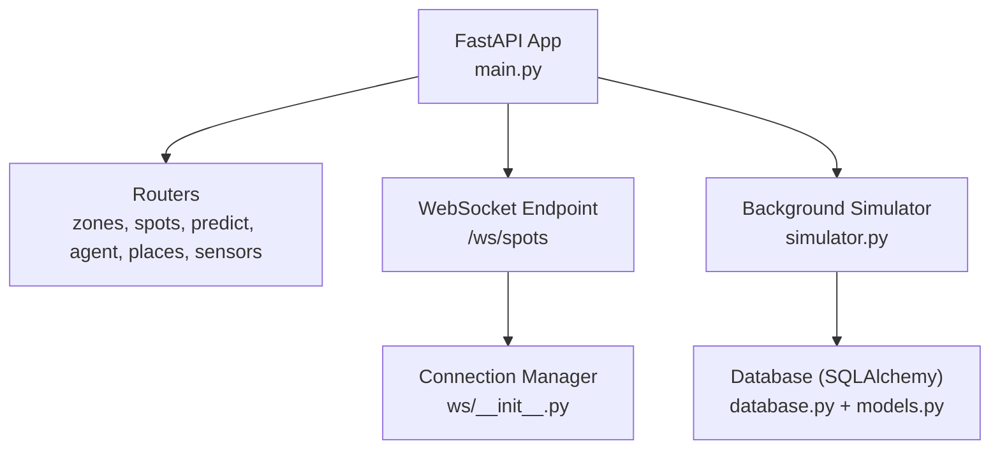
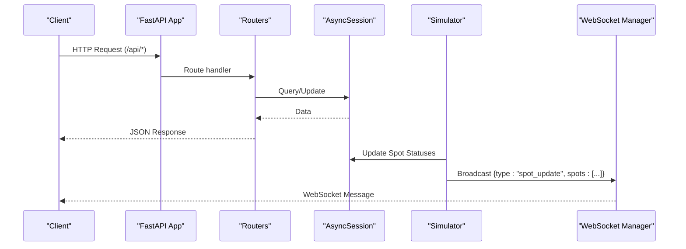

# API Reference

<cite>
**Referenced Files in This Document**
- [main.py](file://backend/main.py)
- [models.py](file://backend/models.py)
- [schemas.py](file://backend/schemas.py)
- [database.py](file://backend/database.py)
- [routers/zones.py](file://backend/routers/zones.py)
- [routers/spots.py](file://backend/routers/spots.py)
- [routers/predict.py](file://backend/routers/predict.py)
- [routers/agent_router.py](file://backend/routers/agent_router.py)
- [routers/places.py](file://backend/routers/places.py)
- [routers/sensors.py](file://backend/routers/sensors.py)
- [ws/__init__.py](file://backend/ws/__init__.py)
- [ws/spots.py](file://backend/ws/spots.py)
- [agent.py](file://backend/agent.py)
- [simulator.py](file://backend/simulator.py)
- [frontend/src/lib/api.ts](file://frontend/src/lib/api.ts)
</cite>

## Table of Contents
1. Introduction
2. Project Structure
3. Core Components
4. Architecture Overview
5. Detailed Component Analysis
6. Dependency Analysis
7. Performance Considerations
8. Troubleshooting Guide
9. Conclusion
10. Appendices

## Introduction
This document provides comprehensive API documentation for SmartPark AI, covering REST endpoints and WebSocket streams for zones management, spots tracking, predictions, agent interactions, places management, and sensors. It specifies HTTP methods, URL patterns, request/response schemas, authentication requirements, error codes, pagination/filtering/bulk capabilities, and practical client examples using curl and JavaScript fetch.

## Project Structure
The backend is a FastAPI application that:
- Initializes the database and seeds data at startup
- Mounts REST routers under /api/*
- Exposes a WebSocket endpoint at /ws/spots for real-time spot updates
- Runs a background simulator that periodically changes spot statuses and broadcasts updates to connected clients

**Diagram sources**
- [main.py:13-58](file://backend/main.py#L13-L58)
- [simulator.py:91-105](file://backend/simulator.py#L91-L105)
- [ws/__init__.py:7-49](file://backend/ws/__init__.py#L7-L49)
- [database.py:15-23](file://backend/database.py#L15-L23)
- [models.py:7-89](file://backend/models.py#L7-L89)

**Section sources**
- [main.py:13-58](file://backend/main.py#L13-L58)
- [database.py:1-23](file://backend/database.py#L1-L23)

## Core Components
- Zones: List, nearby search by coordinates, and detail with spot counts
- Spots: Retrieve spot details including sensor information
- Predictions: Get occupancy forecasts for a zone over the next 12 hours
- Agent: Natural language interface for parking queries and recommendations
- Places: CRUD for saved locations (demo user)
- Sensors: Fleet health summary
- WebSocket: Real-time spot status updates broadcast from the simulator

Key data models and schemas are defined in models.py and schemas.py. The database layer uses async SQLAlchemy with an in-memory SQLite default for development.

**Section sources**
- [models.py:7-89](file://backend/models.py#L7-L89)
- [schemas.py:1-127](file://backend/schemas.py#L1-L127)
- [database.py:1-23](file://backend/database.py#L1-L23)

## Architecture Overview
High-level architecture showing how requests flow through routers to the database and how the simulator drives real-time updates via WebSocket.

**Diagram sources**
- [main.py:49-58](file://backend/main.py#L49-L58)
- [routers/zones.py:1-124](file://backend/routers/zones.py#L1-L124)
- [routers/spots.py:1-42](file://backend/routers/spots.py#L1-L42)
- [routers/predict.py:1-39](file://backend/routers/predict.py#L1-L39)
- [routers/agent_router.py:1-12](file://backend/routers/agent_router.py#L1-L12)
- [routers/places.py:1-49](file://backend/routers/places.py#L1-L49)
- [routers/sensors.py:1-28](file://backend/routers/sensors.py#L1-L28)
- [simulator.py:36-105](file://backend/simulator.py#L36-L105)
- [ws/__init__.py:7-49](file://backend/ws/__init__.py#L7-L49)

## Detailed Component Analysis

### Zones Management
Endpoints:
- GET /api/zones/nearby
  - Purpose: Find zones within a radius of given coordinates
  - Query parameters:
    - lat: float (required)
    - lng: float (required)
    - radius_m: float (default 500)
  - Response: Array of ZoneOut objects
  - Notes: Computes free/occupied/reserved counts per zone; uses haversine distance
- GET /api/zones
  - Purpose: List all zones with computed spot counts
  - Response: Array of ZoneOut objects
- GET /api/zones/{zone_id}
  - Purpose: Get a single zone with its spots
  - Path parameter: zone_id: int
  - Response: ZoneDetailOut object (includes list of SpotOut)
  - Error: 404 if not found

Request/Response Schemas:
- ZoneOut fields: id, name, geojson_polygon, pricing_type, price_per_hour, total_spots, created_at, free_count, occupied_count, reserved_count
- ZoneDetailOut extends ZoneOut with spots: [SpotOut]
- SpotOut fields: id, zone_id, lat, lng, status, last_changed_at, sensor_id, occupied_since

Authentication: None required (CORS allows all origins for demo)
Rate Limiting: Not implemented
Pagination/Filtering: Not implemented
Bulk Operations: Not implemented

Example Requests:
- curl:
  - GET /api/zones?lat=25.2048&lng=55.2708&radius_m=500
  - GET /api/zones
  - GET /api/zones/1
- JavaScript fetch:
  - const res = await fetch('/api/zones');
  - const res = await fetch(`/api/zones/${zoneId}`);
  - const res = await fetch(`/api/zones/nearby?lat=${lat}&lng=${lng}&radius_m=${radius}`);

Error Codes:
- 404: Zone not found

**Section sources**
- [routers/zones.py:22-86](file://backend/routers/zones.py#L22-L86)
- [routers/zones.py:89-124](file://backend/routers/zones.py#L89-L124)
- [schemas.py:21-42](file://backend/schemas.py#L21-L42)
- [schemas.py:7-18](file://backend/schemas.py#L7-L18)

### Spots Tracking
Endpoints:
- GET /api/spots/{spot_id}
  - Purpose: Get a single spot with sensor data
  - Path parameter: spot_id: string
  - Response: SpotDetailOut (includes optional SensorOut)
  - Error: 404 if not found

Request/Response Schemas:
- SpotDetailOut extends SpotOut with sensor: SensorOut
- SensorOut fields: id, spot_id, firmware_version, battery_mv, signal_rssi, last_heartbeat, status

Authentication: None required
Rate Limiting: Not implemented
Pagination/Filtering: Not implemented
Bulk Operations: Not implemented

Example Requests:
- curl:
  - GET /api/spots/SP001
- JavaScript fetch:
  - const res = await fetch('/api/spots/SP001');

Error Codes:
- 404: Spot not found

**Section sources**
- [routers/spots.py:11-42](file://backend/routers/spots.py#L11-L42)
- [schemas.py:65-69](file://backend/schemas.py#L65-L69)
- [schemas.py:44-56](file://backend/schemas.py#L44-L56)

### Predictions
Endpoints:
- GET /api/predict/{zone_id}
  - Purpose: Return predicted occupancy for the next 12 hours at 15-minute intervals
  - Path parameter: zone_id: int
  - Response: Array of PredictionOut objects
  - Error: 404 if zone not found

Request/Response Schemas:
- PredictionOut fields: timestamp, predicted_occupancy, confidence

Authentication: None required
Rate Limiting: Not implemented
Pagination/Filtering: Not implemented
Bulk Operations: Not implemented

Example Requests:
- curl:
  - GET /api/predict/1
- JavaScript fetch:
  - const res = await fetch('/api/predict/1');

Error Codes:
- 404: Zone not found

**Section sources**
- [routers/predict.py:12-39](file://backend/routers/predict.py#L12-L39)
- [schemas.py:73-81](file://backend/schemas.py#L73-L81)

### Agent Interactions
Endpoints:
- POST /api/agent/text
  - Purpose: Process natural language text input and return reasoning steps and optional map card
  - Request body: AgentTextRequest
  - Response: AgentTextResponse

Request/Response Schemas:
- AgentTextRequest fields: text (string), lat (float, optional), lng (float, optional)
- AgentTextResponse fields: text (string), reasoning_steps (array of strings), map_card (MapCard or null)
- MapCard fields: zone_id, zone_name, lat, lng, free_spots, total_spots, price_per_hour, walking_minutes

Supported intents (pattern-matched):
- find_parking: Returns best nearby zone with availability and walking time
- predict: Summarizes upcoming occupancy prediction for a selected zone
- compare: Compares zones by availability and price
- navigate: Placeholder for navigation integration
- pay: Placeholder for payment integration
- general: Help message

Authentication: None required
Rate Limiting: Not implemented
Pagination/Filtering: Not applicable
Bulk Operations: Not applicable

Example Requests:
- curl:
  - POST /api/agent/text
    - Body: {"text": "Find parking near my work", "lat": 25.2048, "lng": 55.2708}
- JavaScript fetch:
  - const res = await fetch('/api/agent/text', {
      method: 'POST',
      headers: {'Content-Type': 'application/json'},
      body: JSON.stringify({text: 'Find parking near my work', lat: 25.2048, lng: 55.2708})
    });

Error Codes:
- No explicit errors; returns structured responses with reasoning steps

**Section sources**
- [routers/agent_router.py:8-12](file://backend/routers/agent_router.py#L8-L12)
- [agent.py:246-261](file://backend/agent.py#L246-L261)
- [schemas.py:83-105](file://backend/schemas.py#L83-L105)

### Places Management
Endpoints:
- GET /api/places
  - Purpose: List saved places for demo_user
  - Response: Array of SavedPlaceOut
- POST /api/places
  - Purpose: Create a new saved place
  - Request body: SavedPlaceCreate
  - Response: SavedPlaceOut
  - Status: 201 on success
- DELETE /api/places/{place_id}
  - Purpose: Delete a saved place
  - Path parameter: place_id: int
  - Status: 204 on success
  - Error: 404 if not found

Request/Response Schemas:
- SavedPlaceCreate fields: label (string), custom_name (string, optional), lat (float), lng (float), address (string, optional)
- SavedPlaceOut fields: id (int), user_id (string), label (string), custom_name (string, optional), lat (float), lng (float), address (string, optional)

Authentication: None required (hardcoded demo_user)
Rate Limiting: Not implemented
Pagination/Filtering: Not implemented
Bulk Operations: Not implemented

Example Requests:
- curl:
  - GET /api/places
  - POST /api/places
    - Body: {"label": "Work", "custom_name": "Office", "lat": 25.2048, "lng": 55.2708, "address": "Dubai Internet City"}
  - DELETE /api/places/1
- JavaScript fetch:
  - const res = await fetch('/api/places');
  - const res = await fetch('/api/places', {
      method: 'POST',
      headers: {'Content-Type': 'application/json'},
      body: JSON.stringify({label: 'Gym', lat: 25.2048, lng: 55.2708})
    });
  - await fetch('/api/places/1', {method: 'DELETE'});

Error Codes:
- 404: Place not found

**Section sources**
- [routers/places.py:11-49](file://backend/routers/places.py#L11-L49)
- [schemas.py:107-127](file://backend/schemas.py#L107-L127)

### Sensors
Endpoints:
- GET /api/sensors
  - Purpose: Get fleet health summary
  - Response: SensorFleetSummary

Request/Response Schemas:
- SensorFleetSummary fields: total (int), online (int), offline (int), low_battery (int)

Authentication: None required
Rate Limiting: Not implemented
Pagination/Filtering: Not applicable
Bulk Operations: Not applicable

Example Requests:
- curl:
  - GET /api/sensors
- JavaScript fetch:
  - const res = await fetch('/api/sensors');

**Section sources**
- [routers/sensors.py:11-28](file://backend/routers/sensors.py#L11-L28)
- [schemas.py:58-63](file://backend/schemas.py#L58-L63)

### WebSocket API for Real-Time Spot Updates
Endpoint:
- ws://host/ws/spots

Connection Establishment:
- Connect using WebSocket to the above URL
- Optional keepalive: send "ping" to receive "pong"

Message Formats:
- Server-to-client messages:
  - type: "spot_update"
  - spots: array of objects with fields:
    - id: string
    - status: string ("free" | "occupied")
    - last_changed_at: ISO datetime string

Event Types:
- spot_update: Indicates one or more spot statuses changed

Client-Side Handling Patterns:
- On open: register event listeners for messages
- On message: handle type "spot_update" and update UI accordingly
- Keepalive: periodically send "ping" and expect "pong"
- Reconnect: implement exponential backoff on disconnect

Example WebSocket Usage (JavaScript):
- const ws = new WebSocket('ws://localhost:8000/ws/spots');
- ws.onopen = () => console.log('Connected');
- ws.onmessage = (event) => {
    const msg = JSON.parse(event.data);
    if (msg.type === 'spot_update') {
      // Update UI with changed spots
    }
  };
- setInterval(() => ws.send('ping'), 30000);

**Section sources**
- [main.py:57-58](file://backend/main.py#L57-L58)
- [ws/__init__.py:36-49](file://backend/ws/__init__.py#L36-L49)
- [simulator.py:91-105](file://backend/simulator.py#L91-L105)

## Dependency Analysis
Component relationships and imports across routers, models, schemas, and services.

```mermaid
graph LR
Main["main.py"] --> Zones["routers/zones.py"]
Main --> Spots["routers/spots.py"]
Main --> Predict["routers/predict.py"]
Main --> AgentRouter["routers/agent_router.py"]
Main --> Places["routers/places.py"]
Main --> Sensors["routers/sensors.py"]
Main --> WSInit["ws/__init__.py"]
WSInit --> WSSpots["ws/spots.py"]
AgentRouter --> Agent["agent.py"]
Zones --> Models["models.py"]
Spots --> Models
Predict --> Models
Places --> Models
Sensors --> Models
Zones --> Schemas["schemas.py"]
Spots --> Schemas
Predict --> Schemas
AgentRouter --> Schemas
Places --> Schemas
Sensors --> Schemas
Main --> Database["database.py"]
```

**Diagram sources**
- [main.py:49-58](file://backend/main.py#L49-L58)
- [routers/zones.py:1-10](file://backend/routers/zones.py#L1-L10)
- [routers/spots.py:1-8](file://backend/routers/spots.py#L1-L8)
- [routers/predict.py:1-9](file://backend/routers/predict.py#L1-L9)
- [routers/agent_router.py:1-5](file://backend/routers/agent_router.py#L1-L5)
- [routers/places.py:1-8](file://backend/routers/places.py#L1-L8)
- [routers/sensors.py:1-8](file://backend/routers/sensors.py#L1-L8)
- [ws/__init__.py:1-10](file://backend/ws/__init__.py#L1-L10)
- [ws/spots.py:1-4](file://backend/ws/spots.py#L1-L4)
- [agent.py:1-10](file://backend/agent.py#L1-L10)
- [models.py:1-10](file://backend/models.py#L1-L10)
- [schemas.py:1-10](file://backend/schemas.py#L1-L10)
- [database.py:1-10](file://backend/database.py#L1-L10)

**Section sources**
- [main.py:49-58](file://backend/main.py#L49-L58)
- [models.py:7-89](file://backend/models.py#L7-L89)
- [schemas.py:1-127](file://backend/schemas.py#L1-L127)

## Performance Considerations
- All database operations use async SQLAlchemy sessions; ensure connection pool sizing matches expected concurrency
- Haversine calculations are performed in Python; consider indexing or spatial extensions if scaling to large datasets
- WebSocket broadcasting iterates active connections; monitor memory usage and connection churn
- Simulator runs every 2 seconds; tune frequency based on load and desired update cadence
- Avoid heavy computations in hot paths; precompute aggregates where possible

[No sources needed since this section provides general guidance]

## Troubleshooting Guide
Common issues and resolutions:
- 404 Not Found: Occurs when requesting non-existent zones, spots, or places. Verify IDs and existence before calling endpoints.
- WebSocket Disconnections: Clients should handle reconnection logic; the server removes disconnected clients automatically.
- CORS Errors: Demo configuration allows all origins; ensure your frontend uses the correct base URL and protocol (http vs https).
- Simulator Errors: Check logs for exceptions during simulation ticks; these do not crash the server but may halt broadcasts temporarily.

Operational notes:
- Database initialization and seeding occur at app startup; ensure DATABASE_URL is configured correctly for production environments.
- The agent router delegates processing to agent.py; inspect intent detection and handler functions for unexpected behavior.

**Section sources**
- [routers/zones.py:89-96](file://backend/routers/zones.py#L89-L96)
- [routers/spots.py:14-18](file://backend/routers/spots.py#L14-L18)
- [routers/places.py:38-49](file://backend/routers/places.py#L38-L49)
- [ws/__init__.py:36-49](file://backend/ws/__init__.py#L36-L49)
- [simulator.py:102-105](file://backend/simulator.py#L102-L105)
- [database.py:15-18](file://backend/database.py#L15-L18)

## Conclusion
SmartPark AI exposes a concise set of REST APIs for managing zones, spots, predictions, agents, places, and sensors, complemented by a WebSocket stream for real-time spot updates. While authentication and rate limiting are not implemented in this demo, the structure supports future enhancements such as JWT-based auth, throttling middleware, pagination, filtering, and bulk operations.

[No sources needed since this section summarizes without analyzing specific files]

## Appendices

### Authentication Requirements
- Current implementation: No authentication required
- Recommendation: Introduce JWT or API key validation via FastAPI dependencies

### Rate Limiting
- Current implementation: Not implemented
- Recommendation: Use middleware (e.g., slowapi) to enforce per-IP or per-user limits

### Pagination and Filtering
- Current implementation: Not implemented
- Recommendation: Add query parameters like page, limit, offset, and filters (status, zone_id)

### Bulk Operations
- Current implementation: Not implemented
- Recommendation: Provide batch endpoints for creating/updating multiple resources

### Frontend Integration Examples
- Base URL configuration and example calls are provided in the frontend API client.

**Section sources**
- [frontend/src/lib/api.ts:1-27](file://frontend/src/lib/api.ts#L1-L27)