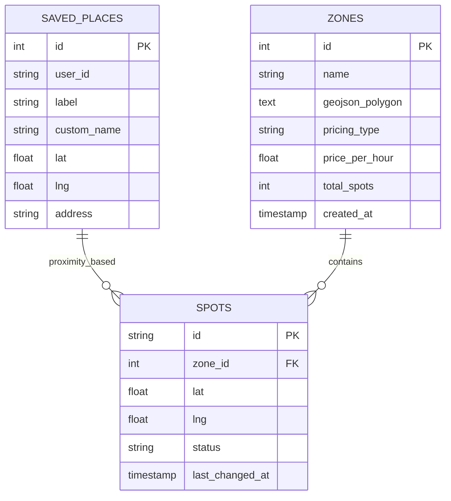

# Places API

<cite>
**Referenced Files in This Document**
- [places.py](file://backend/routers/places.py)
- [models.py](file://backend/models.py)
- [schemas.py](file://backend/schemas.py)
- [database.py](file://backend/database.py)
- [main.py](file://backend/main.py)
- [PlacesContext.tsx](file://frontend/src/components/places/PlacesContext.tsx)
- [api.ts](file://frontend/src/lib/api.ts)
- [types/index.ts](file://frontend/src/types/index.ts)
</cite>

## Table of Contents
1. [Introduction](#introduction)
2. [API Overview](#api-overview)
3. [Authentication and User Management](#authentication-and-user-management)
4. [Place Data Model](#place-data-model)
5. [Endpoints Documentation](#endpoints-documentation)
6. [Data Relationships](#data-relationships)
7. [Integration Examples](#integration-examples)
8. [Error Handling](#error-handling)
9. [Frontend Integration](#frontend-integration)
10. [Best Practices](#best-practices)

## Introduction

The Places API provides comprehensive management capabilities for saved locations and favorites within the SmartPark UAE system. This API enables users to create, update, delete, and retrieve their frequently visited locations, supporting features like home, work, gym, and custom place categorization with full coordinate and address metadata.

The Places API is designed as part of the broader SmartPark ecosystem, integrating seamlessly with parking zones, spots, and prediction systems to provide intelligent parking recommendations based on user preferences and location history.

## API Overview

The Places API follows RESTful conventions and provides CRUD operations for managing saved places. All endpoints are prefixed with `/api/places` and support JSON request/response formats.

### Base URL
```
http://localhost:8000/api/places
```

### Content Type
All requests and responses use `application/json` format.

### Response Format
All successful responses return data wrapped in appropriate HTTP status codes, with error responses following standard FastAPI error handling patterns.

**Section sources**
- [places.py:8](file://backend/routers/places.py#L8)
- [main.py:54](file://backend/main.py#L54)

## Authentication and User Management

### Current Implementation
The current implementation uses a hardcoded demo user approach for development purposes:

- **User ID**: `"demo_user"` (hardcoded)
- **Authentication**: Not implemented (development mode)
- **Authorization**: Basic user_id filtering in database queries

### Security Considerations
For production deployment, the following authentication mechanisms should be implemented:

1. **JWT Token Authentication**: Implement token-based authentication for secure API access
2. **User Context**: Extract user information from authenticated sessions
3. **Access Control**: Ensure users can only access their own places
4. **Rate Limiting**: Implement request throttling to prevent abuse

### User Association Pattern
The current implementation demonstrates the pattern for user-scoped data:

```python
# Example of user-scoped query pattern
SavedPlace.user_id == "demo_user"  # Replace with actual user context
```

**Section sources**
- [places.py:15](file://backend/routers/places.py#L15)
- [places.py:25](file://backend/routers/places.py#L25)
- [places.py:42](file://backend/routers/places.py#L42)

## Place Data Model

### Database Schema
The `SavedPlace` model represents individual saved locations with the following structure:

| Field | Type | Required | Description |
|-------|------|----------|-------------|
| id | Integer | Auto-generated | Unique identifier for the place |
| user_id | String | Yes | Associated user identifier |
| label | String | Yes | Place category (home, work, gym, custom) |
| custom_name | String | No | Custom name for 'custom' label type |
| lat | Float | Yes | Latitude coordinate |
| lng | Float | Yes | Longitude coordinate |
| address | String | No | Human-readable address string |

### Pydantic Schemas

#### SavedPlaceCreate (Request Schema)
Used for creating new places:

| Field | Type | Required | Description |
|-------|------|----------|-------------|
| label | String | Yes | Place category |
| custom_name | String | Optional | Custom name when label is 'custom' |
| lat | Float | Yes | Latitude coordinate |
| lng | Float | Yes | Longitude coordinate |
| address | String | Optional | Address description |

#### SavedPlaceOut (Response Schema)
Used for all response data:

| Field | Type | Description |
|-------|------|-------------|
| id | Integer | Place unique identifier |
| user_id | String | Associated user identifier |
| label | String | Place category |
| custom_name | String | Custom name (if applicable) |
| lat | Float | Latitude coordinate |
| lng | Float | Longitude coordinate |
| address | String | Address description |

**Section sources**
- [models.py:53-63](file://backend/models.py#L53-L63)
- [schemas.py:108-127](file://backend/schemas.py#L108-L127)

## Endpoints Documentation

### List Saved Places

Retrieve all saved places for the authenticated user.

**Endpoint**: `GET /api/places`

**Authentication**: Required (user context)

**Response**: Array of `SavedPlaceOut` objects

**Status Codes**:
- `200 OK`: Successful retrieval
- `401 Unauthorized`: Authentication required
- `500 Internal Server Error`: Database or server error

**Example Request**:
```http
GET /api/places HTTP/1.1
Host: localhost:8000
Authorization: Bearer <token>
```

**Example Response**:
```json
[
  {
    "id": 1,
    "user_id": "demo_user",
    "label": "home",
    "custom_name": null,
    "lat": 25.08,
    "lng": 55.14,
    "address": "Dubai Marina, Tower 12, Apt 3401"
  },
  {
    "id": 2,
    "user_id": "demo_user",
    "label": "work",
    "custom_name": null,
    "lat": 25.092,
    "lng": 55.16,
    "address": "DIC Building 3, Ground Floor"
  }
]
```

**Implementation Details**:
- Returns all places associated with the authenticated user
- Results are ordered by creation time (default SQLAlchemy behavior)
- Supports pagination for large datasets (recommended enhancement)

**Section sources**
- [places.py:11-18](file://backend/routers/places.py#L11-L18)

### Create New Place

Add a new saved place to the user's collection.

**Endpoint**: `POST /api/places`

**Authentication**: Required (user context)

**Request Body**: `SavedPlaceCreate` schema

**Response**: Created `SavedPlaceOut` object

**Status Codes**:
- `201 Created`: Place successfully created
- `400 Bad Request`: Invalid input data
- `401 Unauthorized`: Authentication required
- `409 Conflict`: Duplicate place detected (optional validation)
- `500 Internal Server Error`: Database or server error

**Example Request**:
```http
POST /api/places HTTP/1.1
Host: localhost:8000
Content-Type: application/json
Authorization: Bearer <token>

{
  "label": "gym",
  "custom_name": null,
  "lat": 25.095,
  "lng": 55.155,
  "address": "Fitness First, Dubai Media City"
}
```

**Example Response**:
```json
{
  "id": 3,
  "user_id": "demo_user",
  "label": "gym",
  "custom_name": null,
  "lat": 25.095,
  "lng": 55.155,
  "address": "Fitness First, Dubai Media City"
}
```

**Validation Rules**:
- `label` must be one of: "home", "work", "gym", "custom"
- `lat` must be between -90 and 90
- `lng` must be between -180 and 180
- `custom_name` is required when `label` is "custom"
- `address` should be provided for better user experience

**Section sources**
- [places.py:21-35](file://backend/routers/places.py#L21-L35)

### Delete Saved Place

Remove a saved place from the user's collection.

**Endpoint**: `DELETE /api/places/{place_id}`

**Authentication**: Required (user context)

**Path Parameters**:
- `place_id`: Integer ID of the place to delete

**Response**: Empty body (204 No Content)

**Status Codes**:
- `204 No Content`: Place successfully deleted
- `401 Unauthorized`: Authentication required
- `404 Not Found`: Place not found or not owned by user
- `500 Internal Server Error`: Database or server error

**Example Request**:
```http
DELETE /api/places/1 HTTP/1.1
Host: localhost:8000
Authorization: Bearer <token>
```

**Example Response**:
```
HTTP/1.1 204 No Content
```

**Security Considerations**:
- Ensures the place belongs to the authenticated user
- Prevents unauthorized deletion of other users' places
- Handles cascading deletes if related data exists

**Section sources**
- [places.py:38-49](file://backend/routers/places.py#L38-L49)

### Update Saved Place

*Note: This endpoint is currently missing from the implementation but is requested in the documentation objective.*

**Proposed Endpoint**: `PUT /api/places/{place_id}`

**Authentication**: Required (user context)

**Request Body**: Partial `SavedPlaceCreate` schema (only fields to update)

**Response**: Updated `SavedPlaceOut` object

**Status Codes**:
- `200 OK`: Place successfully updated
- `400 Bad Request`: Invalid input data
- `401 Unauthorized`: Authentication required
- `404 Not Found`: Place not found or not owned by user
- `500 Internal Server Error`: Database or server error

**Example Request**:
```http
PUT /api/places/1 HTTP/1.1
Host: localhost:8000
Content-Type: application/json
Authorization: Bearer <token>

{
  "address": "Updated Address, Dubai Marina",
  "custom_name": "New Home Name"
}
```

**Example Response**:
```json
{
  "id": 1,
  "user_id": "demo_user",
  "label": "home",
  "custom_name": "New Home Name",
  "lat": 25.08,
  "lng": 55.14,
  "address": "Updated Address, Dubai Marina"
}
```

## Data Relationships

### Place-Zone Relationship

While places and zones are separate entities in the system, they can be logically connected through proximity calculations:



**Diagram sources**
- [models.py:53-63](file://backend/models.py#L53-L63)
- [models.py:7-19](file://backend/models.py#L7-L19)
- [models.py:22-37](file://backend/models.py#L22-L37)

### Coordinate Storage and Proximity Calculations

The system stores geographic coordinates using standard WGS84 latitude/longitude pairs:

- **Latitude Range**: -90 to 90 degrees
- **Longitude Range**: -180 to 180 degrees
- **Precision**: Float precision (typically 6 decimal places for ~1 meter accuracy)

Proximity calculations enable features like:
- Finding nearby parking spots to saved places
- Distance-based recommendations
- Route planning integration

### Metadata Management

Each place supports rich metadata through the flexible schema design:

- **Categorization**: Label-based organization (home, work, gym, custom)
- **Personalization**: Custom names for enhanced user experience
- **Geographic Context**: Precise coordinates and human-readable addresses
- **Temporal Data**: Creation timestamps for analytics and sorting

**Section sources**
- [models.py:53-63](file://backend/models.py#L53-L63)
- [models.py:7-19](file://backend/models.py#L7-L19)

## Integration Examples

### Adding Frequently Visited Locations

#### Creating a Home Location
```javascript
// Frontend integration example
const homePlace = {
  label: "home",
  lat: 25.08,
  lng: 55.14,
  address: "Dubai Marina, Tower 12, Apt 3401"
};

fetch('/api/places', {
  method: 'POST',
  headers: {
    'Content-Type': 'application/json',
    'Authorization': 'Bearer YOUR_TOKEN'
  },
  body: JSON.stringify(homePlace)
});
```

#### Organizing Work Places
```javascript
// Multiple work-related locations
const workLocations = [
  {
    label: "work",
    custom_name: "Main Office",
    lat: 25.092,
    lng: 55.16,
    address: "DIC Building 3, Ground Floor"
  },
  {
    label: "work", 
    custom_name: "Branch Office",
    lat: 25.095,
    lng: 55.155,
    address: "Media City Branch"
  }
];
```

### Retrieving Place Collections

#### Loading User Places
```javascript
async function loadUserPlaces() {
  const response = await fetch('/api/places', {
    headers: {
      'Authorization': 'Bearer YOUR_TOKEN'
    }
  });
  
  const places = await response.json();
  return places;
}
```

#### Filtering by Category
```javascript
function filterPlacesByLabel(places, label) {
  return places.filter(place => place.label === label);
}

// Get all work places
const workPlaces = filterPlacesByLabel(allPlaces, "work");
```

### Advanced Use Cases

#### Proximity-Based Recommendations
```javascript
function findNearbySpots(savedPlace, availableSpots) {
  const distance = calculateDistance(
    savedPlace.lat, savedPlace.lng,
    spot.lat, spot.lng
  );
  
  return availableSpots
    .filter(spot => distance < 500) // Within 500 meters
    .sort((a, b) => a.distance - b.distance);
}
```

#### Batch Operations
```javascript
// Bulk import places from CSV or external source
async function bulkImportPlaces(placesArray) {
  const results = await Promise.all(
    placesArray.map(place => 
      fetch('/api/places', {
        method: 'POST',
        headers: { 'Content-Type': 'application/json' },
        body: JSON.stringify(place)
      })
    )
  );
  
  return results;
}
```

## Error Handling

### Standard Error Responses

The API follows FastAPI's standard error handling patterns:

#### Validation Errors (400 Bad Request)
```json
{
  "detail": [
    {
      "loc": ["body", "lat"],
      "msg": "ensure this value is less than or equal to 90",
      "type": "value_error.number.not_le"
    }
  ]
}
```

#### Not Found Errors (404 Not Found)
```json
{
  "detail": "Place not found"
}
```

#### Authentication Errors (401 Unauthorized)
```json
{
  "detail": "Not authenticated"
}
```

### Client-Side Error Handling

```javascript
async function handleApiError(error) {
  switch (error.status) {
    case 400:
      console.error('Invalid place data:', error.detail);
      break;
    case 401:
      console.error('Authentication required');
      // Redirect to login
      break;
    case 404:
      console.error('Place not found');
      // Refresh list
      break;
    default:
      console.error('API error:', error.message);
  }
}
```

**Section sources**
- [places.py:45-46](file://backend/routers/places.py#L45-L46)

## Frontend Integration

### React Context Implementation

The frontend uses React Context for state management:

```typescript
interface PlacesContextValue {
  places: SavedPlace[];
  addPlace: (place: Omit<SavedPlace, 'id'>) => void;
  removePlace: (id: string) => void;
  updatePlace: (id: string, updates: Partial<Omit<SavedPlace, 'id'>>) => void;
}
```

### Local Storage Persistence

The current implementation persists places to localStorage for offline functionality:

```javascript
const STORAGE_KEY = 'smartpark-saved-places';

// Hydrate from localStorage on mount
useEffect(() => {
  const stored = localStorage.getItem(STORAGE_KEY);
  if (stored) {
    setPlaces(JSON.parse(stored));
  }
}, []);
```

### API Service Layer

A dedicated service layer handles API communication:

```typescript
export async function fetchZones() {
  const res = await fetch(`${API_BASE}/api/zones`);
  return res.json();
}

export async function sendAgentQuery(text: string, lat: number, lng: number) {
  const res = await fetch(`${API_BASE}/api/agent/text`, {
    method: 'POST',
    headers: { 'Content-Type': 'application/json' },
    body: JSON.stringify({ text, lat, lng }),
  });
  return res.json();
}
```

**Section sources**
- [PlacesContext.tsx:7-12](file://frontend/src/components/places/PlacesContext.tsx#L7-L12)
- [PlacesContext.tsx:16-43](file://frontend/src/components/places/PlacesContext.tsx#L16-L43)
- [api.ts:3-20](file://frontend/src/lib/api.ts#L3-L20)

## Best Practices

### API Design Patterns

1. **Consistent Naming**: Use plural nouns for resource endpoints (`/api/places`)
2. **Proper Status Codes**: Return appropriate HTTP status codes for different scenarios
3. **Input Validation**: Validate all incoming data before processing
4. **Error Messages**: Provide clear, actionable error messages
5. **Pagination**: Implement pagination for large result sets

### Security Considerations

1. **Authentication**: Always verify user identity before processing requests
2. **Authorization**: Ensure users can only access their own data
3. **Input Sanitization**: Clean and validate all user inputs
4. **Rate Limiting**: Protect against API abuse and DDoS attacks
5. **HTTPS**: Always use HTTPS in production environments

### Performance Optimization

1. **Database Indexing**: Add indexes on frequently queried columns (user_id, label)
2. **Connection Pooling**: Use efficient database connection management
3. **Caching**: Implement caching for frequently accessed data
4. **Lazy Loading**: Load only necessary data for each request
5. **Batch Operations**: Support bulk operations for multiple records

### Data Integrity

1. **Constraints**: Enforce data constraints at the database level
2. **Transactions**: Use transactions for complex operations
3. **Audit Logging**: Track changes to important data
4. **Backup Strategies**: Implement regular data backup procedures
5. **Migration Scripts**: Plan for database schema evolution

### Monitoring and Debugging

1. **Logging**: Implement comprehensive logging for API calls
2. **Metrics**: Track key performance indicators and usage patterns
3. **Error Tracking**: Monitor and alert on API errors
4. **Health Checks**: Implement health check endpoints
5. **Documentation**: Keep API documentation up to date

---

## Conclusion

The Places API provides a solid foundation for managing saved locations within the SmartPark UAE system. While the current implementation focuses on core CRUD operations with a demo user setup, it establishes the architectural patterns and data models needed for a production-ready solution.

Key strengths include:
- Clean RESTful API design
- Flexible data model supporting various place types
- Integration-ready architecture
- Comprehensive error handling patterns

Recommended next steps for production deployment:
1. Implement robust authentication and authorization
2. Add comprehensive input validation and sanitization
3. Implement rate limiting and security measures
4. Add comprehensive testing suite
5. Deploy monitoring and logging infrastructure
6. Scale database connections and implement caching strategies

The API serves as an excellent starting point for building sophisticated location-based features while maintaining code clarity and extensibility.