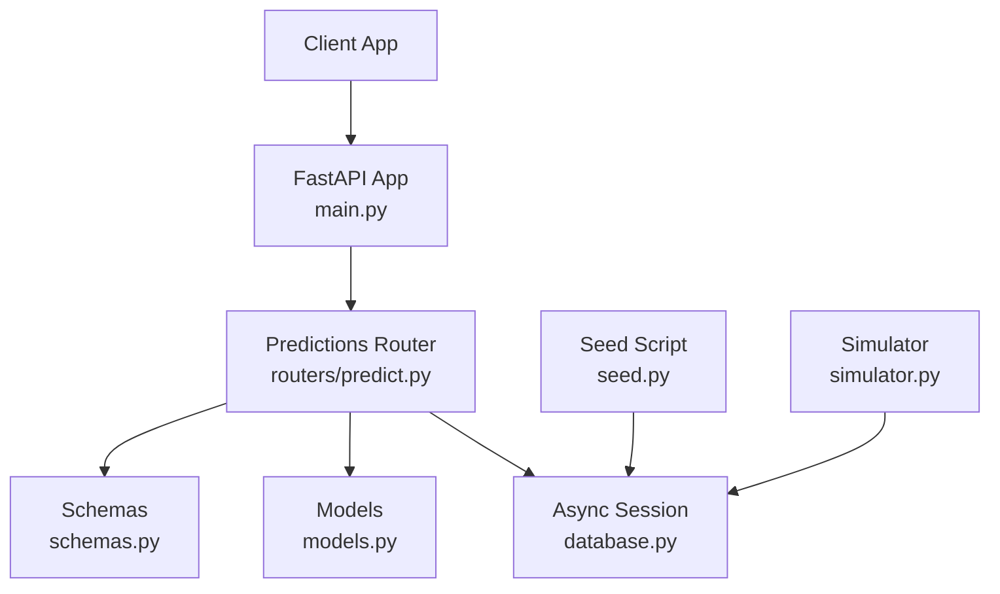
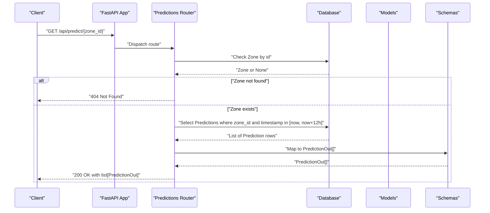
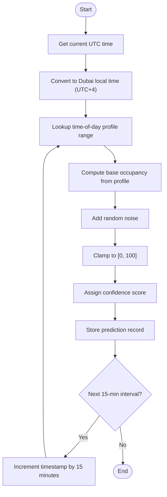
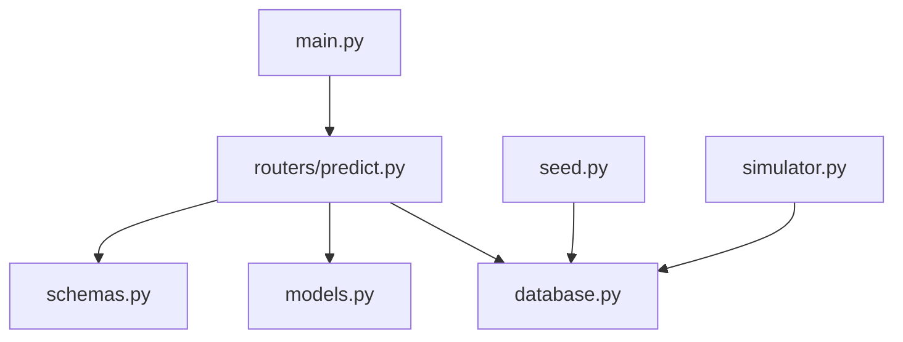

# Predictions API

<cite>
**Referenced Files in This Document**
- [main.py](file://backend/main.py)
- [predict.py](file://backend/routers/predict.py)
- [models.py](file://backend/models.py)
- [schemas.py](file://backend/schemas.py)
- [database.py](file://backend/database.py)
- [seed.py](file://backend/seed.py)
- [simulator.py](file://backend/simulator.py)
- [api.ts](file://frontend/src/lib/api.ts)
</cite>

## Table of Contents
1. [Introduction](#introduction)
2. [Project Structure](#project-structure)
3. [Core Components](#core-components)
4. [Architecture Overview](#architecture-overview)
5. [Detailed Component Analysis](#detailed-component-analysis)
6. [Dependency Analysis](#dependency-analysis)
7. [Performance Considerations](#performance-considerations)
8. [Troubleshooting Guide](#troubleshooting-guide)
9. [Conclusion](#conclusion)
10. [Appendices](#appendices)

## Introduction
This document provides comprehensive API documentation for the Predictions endpoints that return 12-hour occupancy forecasts with confidence scores. It specifies HTTP methods, URL patterns, request/response schemas using the PredictionOut model, and guidance on interpreting confidence scores and handling prediction data structures. It also explains how predictions are generated and stored, including the underlying algorithmic approach and historical data usage.

## Project Structure
The Predictions feature is implemented as a FastAPI router integrated into the main application. The core files involved are:
- Application entrypoint and router registration
- Predictions endpoint implementation
- Data models and Pydantic schemas
- Database configuration and seeding logic
- Simulator that drives spot state changes (indirectly influencing prediction generation)
- Frontend client helper to call the Predictions endpoint

**Diagram sources**
- [main.py:33-55](file://backend/main.py#L33-L55)
- [predict.py:1-39](file://backend/routers/predict.py#L1-L39)
- [database.py:1-23](file://backend/database.py#L1-L23)
- [models.py:65-76](file://backend/models.py#L65-L76)
- [schemas.py:74-81](file://backend/schemas.py#L74-L81)
- [seed.py:85-123](file://backend/seed.py#L85-L123)
- [simulator.py:36-104](file://backend/simulator.py#L36-L104)

**Section sources**
- [main.py:33-55](file://backend/main.py#L33-L55)
- [predict.py:1-39](file://backend/routers/predict.py#L1-L39)
- [database.py:1-23](file://backend/database.py#L1-L23)
- [models.py:65-76](file://backend/models.py#L65-L76)
- [schemas.py:74-81](file://backend/schemas.py#L74-L81)
- [seed.py:85-123](file://backend/seed.py#L85-L123)
- [simulator.py:36-104](file://backend/simulator.py#L36-L104)

## Core Components
- Predictions Endpoint: GET /api/predict/{zone_id} returns a list of PredictionOut objects representing predicted occupancy at 15-minute intervals over the next 12 hours.
- PredictionOut Schema: Defines timestamp, predicted_occupancy, and confidence fields.
- Prediction Model: Stores zone_id, timestamp, predicted_occupancy, confidence, and generated_at.
- Seeding Logic: Generates 48 prediction points per zone (12 hours × 4 intervals/hour) based on time-of-day profiles and random noise.
- Simulator: Adjusts spot statuses toward target occupancy ranges; while it does not directly write predictions, it influences real-time conditions that inform future prediction generation.

Key responsibilities:
- Validate zone existence and return 404 if not found.
- Query predictions within the current time window up to 12 hours ahead.
- Return ordered results by timestamp.

**Section sources**
- [predict.py:12-38](file://backend/routers/predict.py#L12-L38)
- [schemas.py:74-81](file://backend/schemas.py#L74-L81)
- [models.py:65-76](file://backend/models.py#L65-L76)
- [seed.py:85-123](file://backend/seed.py#L85-L123)
- [simulator.py:36-104](file://backend/simulator.py#L36-L104)

## Architecture Overview
The Predictions API follows a straightforward request-response flow:
- Client calls GET /api/predict/{zone_id}.
- Server validates the zone exists.
- Server queries the database for predictions between now and now + 12 hours.
- Server returns a list of PredictionOut items sorted by timestamp.

**Diagram sources**
- [main.py:50-52](file://backend/main.py#L50-L52)
- [predict.py:12-38](file://backend/routers/predict.py#L12-L38)
- [models.py:65-76](file://backend/models.py#L65-L76)
- [schemas.py:74-81](file://backend/schemas.py#L74-L81)

## Detailed Component Analysis

### Predictions Endpoint: GET /api/predict/{zone_id}
- Method: GET
- Path: /api/predict/{zone_id}
- Path Parameter:
  - zone_id: integer, required
- Response:
  - Status Code: 200 OK
  - Body: Array of PredictionOut
- Error Responses:
  - 404 Not Found when zone_id does not exist

Response schema (PredictionOut):
- timestamp: datetime (ISO 8601)
- predicted_occupancy: float (percentage value)
- confidence: float (between 0 and 1)

Example requests:
- Request predictions for zone 1:
  - GET http://localhost:8000/api/predict/1
- Example response body (array of PredictionOut):
  - [
      {"timestamp": "2025-01-01T12:00:00Z", "predicted_occupancy": 62.3, "confidence": 0.87},
      {"timestamp": "2025-01-01T12:15:00Z", "predicted_occupancy": 64.1, "confidence": 0.86},
      ...
    ]

Filtering options:
- The endpoint currently filters by zone_id and time range (now to now + 12 hours). No additional query parameters are supported.

Frontend integration example:
- fetchPredictions(zoneId) calls GET /api/predict/{zoneId} and parses JSON.

**Section sources**
- [predict.py:12-38](file://backend/routers/predict.py#L12-L38)
- [schemas.py:74-81](file://backend/schemas.py#L74-L81)
- [api.ts:8-11](file://frontend/src/lib/api.ts#L8-L11)

### Data Models and Schemas
- Prediction model fields:
  - id: integer primary key
  - zone_id: integer foreign key to zones
  - timestamp: datetime
  - predicted_occupancy: float
  - confidence: float (default 0.85)
  - generated_at: datetime
- PredictionOut schema fields:
  - timestamp: datetime
  - predicted_occupancy: float
  - confidence: float

Relationships:
- Prediction belongs to Zone via zone_id.

**Section sources**
- [models.py:65-76](file://backend/models.py#L65-L76)
- [schemas.py:74-81](file://backend/schemas.py#L74-L81)

### Prediction Generation Algorithm and Historical Data Usage
- Time-of-day profiles:
  - Occupancy targets vary by hour ranges (e.g., night low, morning ramp, mid-morning stable, lunch dip, afternoon high, evening rush, evening wind-down).
- Noise and smoothing:
  - Random noise is added to base occupancy values to simulate variability.
- Confidence scoring:
  - Confidence values are assigned per prediction point, typically within a reasonable range.
- Forecast horizon:
  - 48 points covering 12 hours at 15-minute intervals.

Algorithm overview:

**Diagram sources**
- [seed.py:85-123](file://backend/seed.py#L85-L123)
- [simulator.py:24-33](file://backend/simulator.py#L24-L33)

**Section sources**
- [seed.py:85-123](file://backend/seed.py#L85-L123)
- [simulator.py:24-33](file://backend/simulator.py#L24-L33)

### Confidence Score Interpretation
- Range: 0 to 1
- Higher values indicate greater certainty in the predicted occupancy for that time slot.
- Typical values in seeded data fall within a moderate-to-high range.
- Use confidence to weigh decision-making (e.g., recommending arrival times when confidence is higher).

Guidance:
- Treat predictions with lower confidence as less reliable; consider broader planning windows or alternative strategies.
- Combine confidence with predicted_occupancy thresholds to derive actionable recommendations.

[No sources needed since this section provides general interpretation guidance]

### Handling Prediction Data Structures
- Each item includes:
  - timestamp: use for ordering and visualization along the time axis.
  - predicted_occupancy: percentage value suitable for charts and thresholds.
  - confidence: scalar indicating reliability.
- Ordering:
  - Results are returned ordered by timestamp ascending.
- Visualization:
  - Plot predicted_occupancy vs timestamp; optionally overlay confidence bands or color-code by confidence.

**Section sources**
- [predict.py:25-38](file://backend/routers/predict.py#L25-L38)
- [schemas.py:74-81](file://backend/schemas.py#L74-L81)

## Dependency Analysis
The Predictions endpoint depends on:
- FastAPI routing and dependency injection
- Async SQLAlchemy session for database access
- Pydantic schema for response serialization
- Seeded data for initial predictions
- Simulator for dynamic spot states (indirect influence)

**Diagram sources**
- [main.py:50-52](file://backend/main.py#L50-L52)
- [predict.py:1-39](file://backend/routers/predict.py#L1-L39)
- [database.py:1-23](file://backend/database.py#L1-L23)
- [models.py:65-76](file://backend/models.py#L65-L76)
- [schemas.py:74-81](file://backend/schemas.py#L74-L81)
- [seed.py:85-123](file://backend/seed.py#L85-L123)
- [simulator.py:36-104](file://backend/simulator.py#L36-L104)

**Section sources**
- [main.py:50-52](file://backend/main.py#L50-L52)
- [predict.py:1-39](file://backend/routers/predict.py#L1-L39)
- [database.py:1-23](file://backend/database.py#L1-L23)
- [models.py:65-76](file://backend/models.py#L65-L76)
- [schemas.py:74-81](file://backend/schemas.py#L74-L81)
- [seed.py:85-123](file://backend/seed.py#L85-L123)
- [simulator.py:36-104](file://backend/simulator.py#L36-L104)

## Performance Considerations
- Query efficiency:
  - Filtering by zone_id and timestamp range ensures minimal result sets.
  - Ordering by timestamp is lightweight for small forecast windows.
- Indexing:
  - Consider adding indexes on zone_id and timestamp columns to optimize query performance as data grows.
- Caching:
  - Short-term caching of recent predictions can reduce database load for frequent clients.
- Concurrency:
  - Async session usage supports concurrent requests without blocking.

[No sources needed since this section provides general guidance]

## Troubleshooting Guide
Common issues and resolutions:
- 404 Not Found:
  - Cause: Invalid or non-existent zone_id.
  - Resolution: Verify zone_id exists before calling the endpoint.
- Empty response array:
  - Cause: No predictions available for the requested time window.
  - Resolution: Ensure predictions have been generated and stored for the zone; check seeding process.
- Incorrect timestamps:
  - Cause: Timezone mismatches between client and server.
  - Resolution: Use UTC timestamps consistently; ensure client interprets ISO 8601 correctly.

Operational checks:
- Confirm database initialization and seeding during application startup.
- Validate CORS settings if calling from a browser-based frontend.

**Section sources**
- [predict.py:15-20](file://backend/routers/predict.py#L15-L20)
- [main.py:13-31](file://backend/main.py#L13-L31)
- [main.py:40-47](file://backend/main.py#L40-L47)

## Conclusion
The Predictions API provides a simple and efficient way to retrieve 12-hour occupancy forecasts with confidence scores for specific zones. The endpoint leverages time-of-day profiles and seeded prediction data to deliver actionable insights. Clients should interpret confidence scores alongside predicted occupancy to make informed decisions about parking availability and timing.

[No sources needed since this section summarizes without analyzing specific files]

## Appendices

### API Reference Summary
- Endpoint: GET /api/predict/{zone_id}
- Path Parameters:
  - zone_id: integer
- Response:
  - 200 OK: Array of PredictionOut
  - 404 Not Found: Zone not found
- PredictionOut Fields:
  - timestamp: datetime
  - predicted_occupancy: float
  - confidence: float

**Section sources**
- [predict.py:12-38](file://backend/routers/predict.py#L12-L38)
- [schemas.py:74-81](file://backend/schemas.py#L74-L81)

### Example Requests and Responses
- Request:
  - GET http://localhost:8000/api/predict/1
- Response:
  - [
      {"timestamp": "2025-01-01T12:00:00Z", "predicted_occupancy": 62.3, "confidence": 0.87},
      {"timestamp": "2025-01-01T12:15:00Z", "predicted_occupancy": 64.1, "confidence": 0.86}
    ]

**Section sources**
- [api.ts:8-11](file://frontend/src/lib/api.ts#L8-L11)
- [predict.py:25-38](file://backend/routers/predict.py#L25-L38)