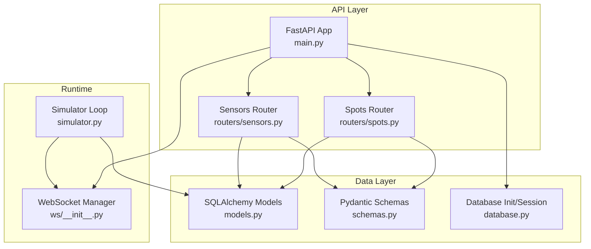
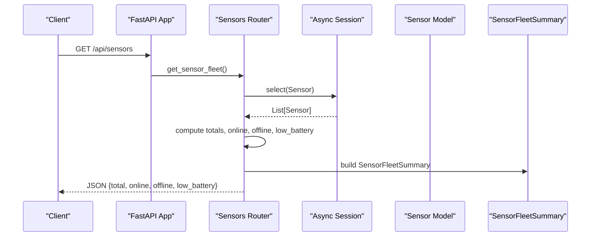
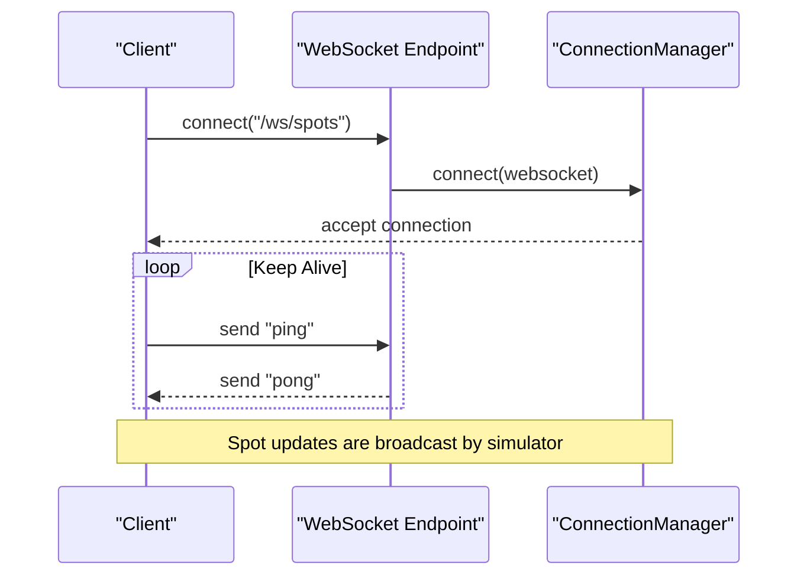
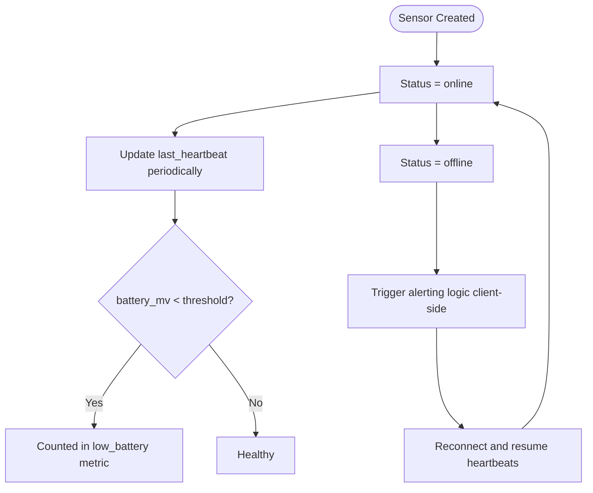
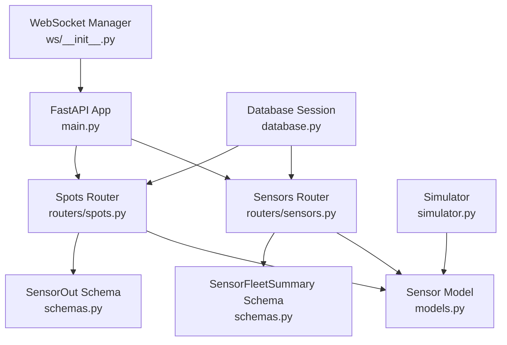

# Sensors API

<cite>
**Referenced Files in This Document**
- [main.py](file://backend/main.py)
- [sensors.py](file://backend/routers/sensors.py)
- [spots.py](file://backend/routers/spots.py)
- [models.py](file://backend/models.py)
- [schemas.py](file://backend/schemas.py)
- [database.py](file://backend/database.py)
- [simulator.py](file://backend/simulator.py)
- [ws/__init__.py](file://backend/ws/__init__.py)
</cite>

## Table of Contents
1. [Introduction](#introduction)
2. [Project Structure](#project-structure)
3. [Core Components](#core-components)
4. [Architecture Overview](#architecture-overview)
5. [Detailed Component Analysis](#detailed-component-analysis)
6. [Dependency Analysis](#dependency-analysis)
7. [Performance Considerations](#performance-considerations)
8. [Troubleshooting Guide](#troubleshooting-guide)
9. [Conclusion](#conclusion)
10. [Appendices](#appendices)

## Introduction
This document provides detailed API documentation for IoT Sensors management endpoints within the SmartPark AI backend. It covers:
- Monitoring sensor health and fleet status
- Accessing battery levels, firmware versions, signal strength, and device status
- Device connectivity monitoring via REST and WebSocket
- Sensor lifecycle considerations, health check intervals, and alerting mechanisms based on current implementation

The documentation uses the SensorOut model and related schemas to define request/response formats and telemetry data structures.

## Project Structure
The sensors-related functionality is implemented across several modules:
- FastAPI router for sensors endpoints
- Pydantic schemas for response models
- SQLAlchemy models for database entities
- Database initialization and session handling
- Simulator that updates spot statuses (and indirectly influences sensor status)
- WebSocket manager for real-time updates

**Diagram sources**
- [main.py:33-58](file://backend/main.py#L33-L58)
- [sensors.py:1-28](file://backend/routers/sensors.py#L1-L28)
- [spots.py:1-42](file://backend/routers/spots.py#L1-L42)
- [models.py:39-51](file://backend/models.py#L39-L51)
- [schemas.py:44-63](file://backend/schemas.py#L44-L63)
- [database.py:1-23](file://backend/database.py#L1-L23)
- [simulator.py:91-105](file://backend/simulator.py#L91-L105)
- [ws/__init__.py:7-49](file://backend/ws/__init__.py#L7-L49)

**Section sources**
- [main.py:33-58](file://backend/main.py#L33-L58)
- [sensors.py:1-28](file://backend/routers/sensors.py#L1-L28)
- [spots.py:1-42](file://backend/routers/spots.py#L1-L42)
- [models.py:39-51](file://backend/models.py#L39-L51)
- [schemas.py:44-63](file://backend/schemas.py#L44-L63)
- [database.py:1-23](file://backend/database.py#L1-L23)
- [simulator.py:91-105](file://backend/simulator.py#L91-L105)
- [ws/__init__.py:7-49](file://backend/ws/__init__.py#L7-L49)

## Core Components
- Sensors Router: Provides a GET endpoint to retrieve a fleet-level summary of sensor health including total count, online/offline counts, and low-battery count.
- Spots Router: Returns spot details with an optional embedded SensorOut object when a sensor is associated with the spot.
- Sensor Model: Defines sensor attributes such as id, spot_id, firmware_version, battery_mv, signal_rssi, last_heartbeat, and status.
- SensorOut Schema: Defines the response structure for sensor information used by the API.
- SensorFleetSummary Schema: Aggregates fleet-level metrics for sensors.
- Database Layer: Initializes DB tables and provides async sessions for queries.
- Simulator: Periodically updates spot statuses; while it does not directly update sensors, it can influence sensor status indirectly through spot state changes.
- WebSocket Manager: Manages real-time connections and broadcasts spot updates.

Key responsibilities:
- Health monitoring: Fleet summary endpoint aggregates sensor status and battery thresholds.
- Telemetry exposure: SensorOut exposes firmware version, battery level, signal strength, heartbeat timestamp, and status.
- Connectivity: WebSocket endpoint supports real-time spot updates; sensor connectivity can be inferred from last_heartbeat and status fields.

**Section sources**
- [sensors.py:10-27](file://backend/routers/sensors.py#L10-L27)
- [spots.py:11-41](file://backend/routers/spots.py#L11-L41)
- [models.py:39-51](file://backend/models.py#L39-L51)
- [schemas.py:44-63](file://backend/schemas.py#L44-L63)
- [database.py:15-23](file://backend/database.py#L15-L23)
- [simulator.py:36-105](file://backend/simulator.py#L36-L105)
- [ws/__init__.py:7-49](file://backend/ws/__init__.py#L7-L49)

## Architecture Overview
The Sensors API integrates with the broader parking system:
- REST endpoints expose sensor fleet summaries and per-spot sensor details.
- Data is persisted using SQLAlchemy models and accessed via async sessions.
- Real-time updates are broadcast over WebSocket for spot changes; sensor connectivity can be monitored by clients polling or subscribing to updates.

**Diagram sources**
- [main.py:50-55](file://backend/main.py#L50-L55)
- [sensors.py:10-27](file://backend/routers/sensors.py#L10-L27)
- [models.py:39-51](file://backend/models.py#L39-L51)
- [schemas.py:58-63](file://backend/schemas.py#L58-L63)

## Detailed Component Analysis

### Endpoint: Get Sensor Fleet Summary
- Method: GET
- URL Pattern: /api/sensors
- Description: Returns aggregated sensor health metrics for the entire fleet.
- Response Model: SensorFleetSummary
  - Fields:
    - total: integer — total number of sensors
    - online: integer — number of sensors with status "online"
    - offline: integer — number of sensors with status "offline"
    - low_battery: integer — number of sensors with battery_mv below threshold
- Behavior:
  - Queries all sensors from the database
  - Computes counts based on status and battery threshold
  - Returns aggregated summary

Example Request:
- GET /api/sensors

Example Response:
- { "total": 100, "online": 95, "offline": 3, "low_battery": 2 }

Health Check Intervals:
- The endpoint performs a direct query; there is no built-in periodic health check scheduler in this module. Clients should poll at appropriate intervals depending on operational needs.

Alerting Mechanisms:
- Low-battery detection is computed server-side using a threshold on battery_mv. Clients may trigger alerts when low_battery > 0.

**Section sources**
- [sensors.py:10-27](file://backend/routers/sensors.py#L10-L27)
- [schemas.py:58-63](file://backend/schemas.py#L58-L63)
- [models.py:39-51](file://backend/models.py#L39-L51)

### Endpoint: Get Spot Detail with Sensor Information
- Method: GET
- URL Pattern: /api/spots/{spot_id}
- Description: Retrieves a specific spot’s details and includes an optional SensorOut object if a sensor is associated with the spot.
- Response Model: SpotDetailOut
  - Includes SpotOut fields plus an optional sensor field of type SensorOut
- SensorOut Fields:
  - id: string — sensor identifier
  - spot_id: string — associated spot identifier
  - firmware_version: string — firmware version installed on the sensor
  - battery_mv: integer — battery voltage in millivolts
  - signal_rssi: integer — received signal strength indicator
  - last_heartbeat: datetime — last heartbeat timestamp
  - status: string — sensor status ("online", "offline")

Example Request:
- GET /api/spots/SPOT001

Example Response:
- {
    "id": "SPOT001",
    "zone_id": 1,
    "lat": 25.2048,
    "lng": 55.2708,
    "status": "free",
    "last_changed_at": "2025-01-01T10:00:00Z",
    "sensor_id": "SENS001",
    "occupied_since": null,
    "sensor": {
      "id": "SENS001",
      "spot_id": "SPOT001",
      "firmware_version": "2.1.4",
      "battery_mv": 3400,
      "signal_rssi": -55,
      "last_heartbeat": "2025-01-01T10:00:00Z",
      "status": "online"
    }
  }

**Section sources**
- [spots.py:11-41](file://backend/routers/spots.py#L11-L41)
- [schemas.py:66-71](file://backend/schemas.py#L66-L71)
- [schemas.py:44-56](file://backend/schemas.py#L44-L56)
- [models.py:39-51](file://backend/models.py#L39-L51)

### Firmware Version Updates
- Current Implementation:
  - There is no dedicated PUT/PATCH endpoint to update firmware_version via REST in the sensors router.
  - Firmware updates would typically be performed by device management systems updating the Sensor entity directly or via internal services.
- Recommendation:
  - Implement a PATCH /api/sensors/{sensor_id} endpoint to update firmware_version and other sensor metadata securely.
  - Validate inputs and log audit trails for firmware changes.

**Section sources**
- [sensors.py:1-28](file://backend/routers/sensors.py#L1-L28)
- [models.py:39-51](file://backend/models.py#L39-L51)

### Telemetry Data Formats
- SensorTelemetry (derived from SensorOut):
  - id: string
  - spot_id: string
  - firmware_version: string
  - battery_mv: integer
  - signal_rssi: integer
  - last_heartbeat: datetime
  - status: string
- Usage:
  - Exposed via SpotDetailOut.sensor when retrieving spot details.
  - Fleet summary uses aggregated counts rather than raw telemetry.

**Section sources**
- [schemas.py:44-56](file://backend/schemas.py#L44-L56)
- [spots.py:19-29](file://backend/routers/spots.py#L19-L29)

### Device Connectivity Monitoring
- REST:
  - Use GET /api/spots/{spot_id} to inspect sensor.status and sensor.last_heartbeat.
- WebSocket:
  - Connect to /ws/spots to receive real-time spot updates.
  - While WebSocket messages focus on spot changes, clients can infer sensor connectivity by correlating spot status transitions with sensor heartbeat timestamps.

WebSocket Connection Flow:

**Diagram sources**
- [main.py:57-58](file://backend/main.py#L57-L58)
- [ws/__init__.py:36-49](file://backend/ws/__init__.py#L36-L49)
- [simulator.py:91-105](file://backend/simulator.py#L91-L105)

**Section sources**
- [main.py:57-58](file://backend/main.py#L57-L58)
- [ws/__init__.py:7-49](file://backend/ws/__init__.py#L7-L49)
- [simulator.py:91-105](file://backend/simulator.py#L91-L105)

### Sensor Lifecycle
- Creation:
  - Sensors are created alongside spots; each spot may have an associated sensor via foreign key relationships.
- Status Transitions:
  - Sensors maintain a status field ("online", "offline").
  - Spot status includes "sensor_offline" which indicates sensor unavailability affecting spot operations.
- Heartbeat:
  - last_heartbeat tracks the most recent sensor activity timestamp.
- Deletion:
  - No explicit deletion endpoint is exposed; removal would require direct database operations or additional endpoints.

Lifecycle Flowchart:

**Diagram sources**
- [models.py:39-51](file://backend/models.py#L39-L51)
- [sensors.py:16-21](file://backend/routers/sensors.py#L16-L21)

**Section sources**
- [models.py:39-51](file://backend/models.py#L39-L51)
- [sensors.py:16-21](file://backend/routers/sensors.py#L16-L21)

### Health Check Intervals
- Fleet Summary:
  - Computed on-demand; no scheduled background task for sensor health checks in the sensors router.
- Simulator:
  - Runs every 2 seconds to update spot statuses; does not directly update sensors but affects spot states.
- Recommendation:
  - Implement a periodic job to refresh sensor health metrics and publish alerts when thresholds are exceeded.

**Section sources**
- [sensors.py:10-27](file://backend/routers/sensors.py#L10-L27)
- [simulator.py:91-105](file://backend/simulator.py#L91-L105)

### Alerting Mechanisms
- Server-Side:
  - Low-battery counting is performed server-side using battery_mv threshold.
- Client-Side:
  - Clients should monitor low_battery count and sensor.status to trigger alerts for offline or low-battery devices.
- Integration:
  - Alerts can be surfaced via UI dashboards or notification services based on fleet summary responses.

**Section sources**
- [sensors.py:16-21](file://backend/routers/sensors.py#L16-L21)
- [schemas.py:58-63](file://backend/schemas.py#L58-L63)

## Dependency Analysis
The sensors subsystem depends on:
- FastAPI routing and dependency injection for database sessions
- SQLAlchemy models for persistence
- Pydantic schemas for validation and serialization
- WebSocket manager for real-time communication
- Simulator for dynamic spot updates

**Diagram sources**
- [sensors.py:1-28](file://backend/routers/sensors.py#L1-L28)
- [spots.py:1-42](file://backend/routers/spots.py#L1-L42)
- [models.py:39-51](file://backend/models.py#L39-L51)
- [schemas.py:44-63](file://backend/schemas.py#L44-L63)
- [database.py:15-23](file://backend/database.py#L15-L23)
- [simulator.py:91-105](file://backend/simulator.py#L91-L105)
- [ws/__init__.py:7-49](file://backend/ws/__init__.py#L7-L49)
- [main.py:50-58](file://backend/main.py#L50-L58)

**Section sources**
- [sensors.py:1-28](file://backend/routers/sensors.py#L1-L28)
- [spots.py:1-42](file://backend/routers/spots.py#L1-L42)
- [models.py:39-51](file://backend/models.py#L39-L51)
- [schemas.py:44-63](file://backend/schemas.py#L44-L63)
- [database.py:15-23](file://backend/database.py#L15-L23)
- [simulator.py:91-105](file://backend/simulator.py#L91-L105)
- [ws/__init__.py:7-49](file://backend/ws/__init__.py#L7-L49)
- [main.py:50-58](file://backend/main.py#L50-L58)

## Performance Considerations
- Fleet Summary Query:
  - Fetches all sensors; consider pagination or filtering for large fleets.
- Threshold Calculations:
  - Low-battery computation is O(n) over sensors; caching or incremental updates could improve performance.
- WebSocket Broadcast:
  - Simulator broadcasts spot updates; ensure clients handle high-frequency messages efficiently.
- Database Sessions:
  - Async sessions reduce blocking; ensure proper resource cleanup and avoid long-running transactions.

[No sources needed since this section provides general guidance]

## Troubleshooting Guide
Common issues and resolutions:
- Sensor Not Found:
  - When querying spot details, ensure the spot exists; otherwise, a 404 error is returned.
- Low Battery Alerts:
  - Monitor low_battery count; investigate sensors with battery_mv below threshold.
- Offline Sensors:
  - Check sensor.status and last_heartbeat; implement reconnection logic on the device side.
- WebSocket Disconnections:
  - Handle disconnect events and reconnect with exponential backoff.

**Section sources**
- [spots.py:16-17](file://backend/routers/spots.py#L16-L17)
- [sensors.py:16-21](file://backend/routers/sensors.py#L16-L21)
- [ws/__init__.py:45-49](file://backend/ws/__init__.py#L45-L49)

## Conclusion
The Sensors API provides essential endpoints for monitoring sensor health, battery levels, firmware versions, and device status. While the current implementation focuses on reading sensor data and aggregating fleet metrics, future enhancements should include:
- Firmware update endpoints
- Scheduled health checks and alerting
- Pagination and filtering for large fleets
- Enhanced telemetry streaming via WebSocket

These improvements will strengthen observability and operational control over IoT sensors in the SmartPark ecosystem.

[No sources needed since this section summarizes without analyzing specific files]

## Appendices

### API Endpoints Summary
- GET /api/sensors
  - Response: SensorFleetSummary
- GET /api/spots/{spot_id}
  - Response: SpotDetailOut (includes optional SensorOut)

### SensorOut Model Fields
- id: string
- spot_id: string
- firmware_version: string
- battery_mv: integer
- signal_rssi: integer
- last_heartbeat: datetime
- status: string

### SensorFleetSummary Model Fields
- total: integer
- online: integer
- offline: integer
- low_battery: integer

**Section sources**
- [schemas.py:44-63](file://backend/schemas.py#L44-L63)
- [sensors.py:10-27](file://backend/routers/sensors.py#L10-L27)
- [spots.py:11-41](file://backend/routers/spots.py#L11-L41)