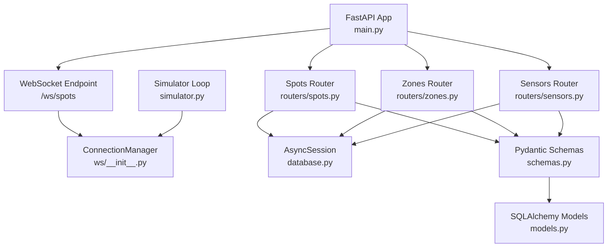
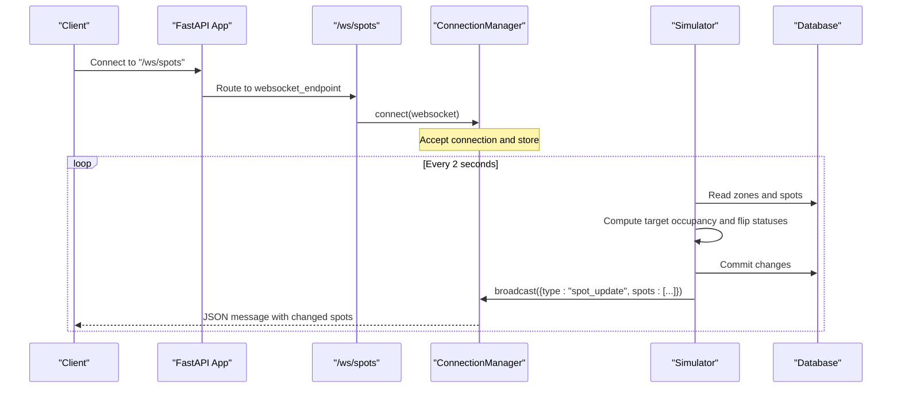
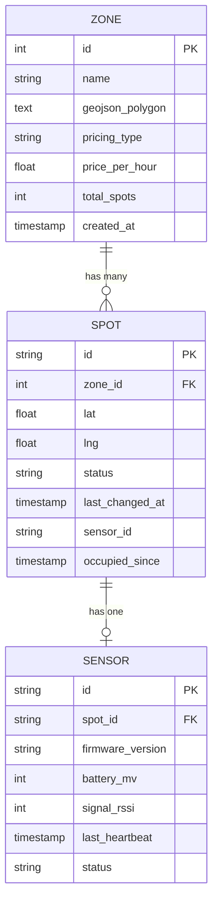
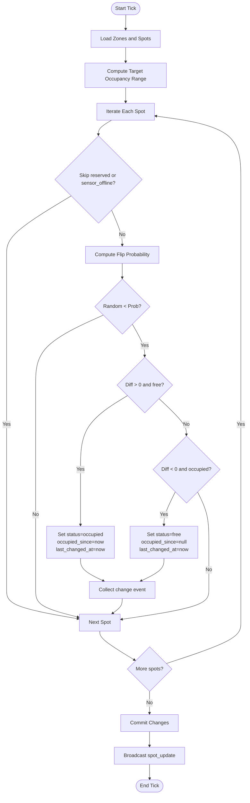
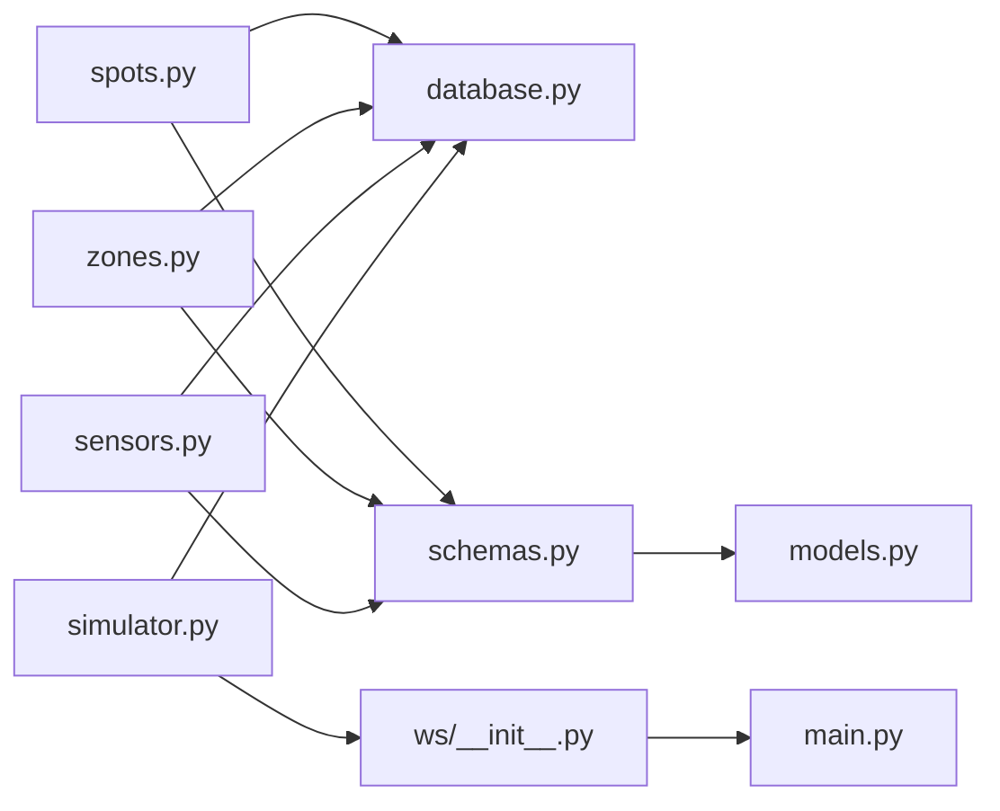

# Spots API

<cite>
**Referenced Files in This Document**
- [main.py](file://backend/main.py)
- [spots.py](file://backend/routers/spots.py)
- [zones.py](file://backend/routers/zones.py)
- [sensors.py](file://backend/routers/sensors.py)
- [schemas.py](file://backend/schemas.py)
- [models.py](file://backend/models.py)
- [database.py](file://backend/database.py)
- [simulator.py](file://backend/simulator.py)
- [ws/__init__.py](file://backend/ws/__init__.py)
- [ws/spots.py](file://backend/ws/spots.py)
</cite>

## Table of Contents
1. [Introduction](#introduction)
2. [Project Structure](#project-structure)
3. [Core Components](#core-components)
4. [Architecture Overview](#architecture-overview)
5. [Detailed Component Analysis](#detailed-component-analysis)
6. [Dependency Analysis](#dependency-analysis)
7. [Performance Considerations](#performance-considerations)
8. [Troubleshooting Guide](#troubleshooting-guide)
9. [Conclusion](#conclusion)

## Introduction
This document provides detailed API documentation for the Spots tracking endpoints and related real-time capabilities. It covers:
- REST endpoints for retrieving spot details and zone-related spot listings
- Real-time monitoring via WebSocket for live spot status updates
- Data models used in responses (SpotOut, SpotDetailOut, SensorOut)
- Relationships between spots, zones, and sensors
- Timestamp fields that track occupancy changes

Authentication is not implemented in the current codebase; all endpoints are publicly accessible.

## Project Structure
The backend exposes FastAPI routers for spots, zones, and sensors, a WebSocket endpoint for real-time updates, and Pydantic schemas for request/response modeling. The application initializes the database, seeds data, and runs a background simulator that periodically updates spot statuses and broadcasts changes over WebSocket.

**Diagram sources**
- [main.py:33-64](file://backend/main.py#L33-L64)
- [spots.py:1-42](file://backend/routers/spots.py#L1-L42)
- [zones.py:1-124](file://backend/routers/zones.py#L1-L124)
- [sensors.py:1-28](file://backend/routers/sensors.py#L1-L28)
- [ws/__init__.py:7-49](file://backend/ws/__init__.py#L7-L49)
- [simulator.py:91-105](file://backend/simulator.py#L91-L105)
- [database.py:1-23](file://backend/database.py#L1-L23)
- [schemas.py:1-127](file://backend/schemas.py#L1-L127)
- [models.py:1-89](file://backend/models.py#L1-L89)

**Section sources**
- [main.py:33-64](file://backend/main.py#L33-L64)
- [database.py:1-23](file://backend/database.py#L1-L23)

## Core Components
- Spots Router: Provides GET /api/spots/{spot_id} to retrieve a single spot with optional sensor details.
- Zones Router: Provides GET /api/zones and GET /api/zones/{zone_id} which include lists of SpotOut objects per zone.
- Sensors Router: Provides GET /api/sensors for fleet health summary.
- WebSocket: /ws/spots for real-time spot updates broadcast by the simulator.
- Schemas: SpotOut, SpotDetailOut, SensorOut define response structures.
- Models: Spot, Zone, Sensor define database relationships and fields.

Key response models:
- SpotOut: id, zone_id, lat, lng, status, last_changed_at, sensor_id, occupied_since
- SpotDetailOut: extends SpotOut with optional sensor (SensorOut)
- SensorOut: id, spot_id, firmware_version, battery_mv, signal_rssi, last_heartbeat, status

Status values: free, occupied, reserved, sensor_offline

Timestamps:
- last_changed_at: updated whenever spot status changes
- occupied_since: set when status becomes occupied; cleared when it becomes free

**Section sources**
- [spots.py:11-41](file://backend/routers/spots.py#L11-L41)
- [zones.py:62-124](file://backend/routers/zones.py#L62-L124)
- [sensors.py:11-27](file://backend/routers/sensors.py#L11-L27)
- [schemas.py:7-71](file://backend/schemas.py#L7-L71)
- [models.py:22-51](file://backend/models.py#L22-L51)

## Architecture Overview
The system architecture integrates REST APIs for on-demand queries and a WebSocket channel for live updates. The simulator periodically adjusts spot statuses based on time-of-day profiles and broadcasts changes to connected clients.

**Diagram sources**
- [main.py:57-58](file://backend/main.py#L57-L58)
- [ws/__init__.py:36-49](file://backend/ws/__init__.py#L36-L49)
- [simulator.py:91-105](file://backend/simulator.py#L91-L105)
- [simulator.py:36-88](file://backend/simulator.py#L36-L88)
- [database.py:15-23](file://backend/database.py#L15-L23)

## Detailed Component Analysis

### REST Endpoints

#### Get Spot Details
- Method: GET
- URL: /api/spots/{spot_id}
- Path Parameters:
  - spot_id: string
- Response Model: SpotDetailOut
  - Fields: id, zone_id, lat, lng, status, last_changed_at, sensor_id, occupied_since, sensor (optional SensorOut)
- Error Codes:
  - 404: Spot not found
- Authentication: None

Example Request:
- GET /api/spots/SPOT-001

Example Response (SpotDetailOut):
- {
  "id": "SPOT-001",
  "zone_id": 1,
  "lat": 25.1972,
  "lng": 55.2744,
  "status": "occupied",
  "last_changed_at": "2025-01-01T10:00:00Z",
  "sensor_id": "SEN-001",
  "occupied_since": "2025-01-01T09:45:00Z",
  "sensor": {
    "id": "SEN-001",
    "spot_id": "SPOT-001",
    "firmware_version": "2.1.4",
    "battery_mv": 3400,
    "signal_rssi": -55,
    "last_heartbeat": "2025-01-01T10:00:00Z",
    "status": "online"
  }
}

**Section sources**
- [spots.py:11-41](file://backend/routers/spots.py#L11-L41)
- [schemas.py:66-71](file://backend/schemas.py#L66-L71)
- [schemas.py:45-56](file://backend/schemas.py#L45-L56)
- [models.py:22-36](file://backend/models.py#L22-L36)

#### List Zones With Spot Counts
- Method: GET
- URL: /api/zones
- Query Parameters: none
- Response Model: list[ZoneOut]
  - Includes computed counts: free_count, occupied_count, reserved_count
- Authentication: None

Example Request:
- GET /api/zones

Example Response (list[ZoneOut]):
- [
  {
    "id": 1,
    "name": "Zone A",
    "geojson_polygon": null,
    "pricing_type": "hourly",
    "price_per_hour": 4.0,
    "total_spots": 20,
    "created_at": "2025-01-01T00:00:00Z",
    "free_count": 8,
    "occupied_count": 10,
    "reserved_count": 2
  }
]

**Section sources**
- [zones.py:62-86](file://backend/routers/zones.py#L62-L86)
- [schemas.py:21-42](file://backend/schemas.py#L21-L42)

#### Get Zone Detail With Spots
- Method: GET
- URL: /api/zones/{zone_id}
- Path Parameters:
  - zone_id: integer
- Response Model: ZoneDetailOut
  - Includes spots: list[SpotOut]
- Error Codes:
  - 404: Zone not found
- Authentication: None

Example Request:
- GET /api/zones/1

Example Response (ZoneDetailOut):
- {
  "id": 1,
  "name": "Zone A",
  "geojson_polygon": null,
  "pricing_type": "hourly",
  "price_per_hour": 4.0,
  "total_spots": 20,
  "created_at": "2025-01-01T00:00:00Z",
  "free_count": 8,
  "occupied_count": 10,
  "reserved_count": 2,
  "spots": [
    {
      "id": "SPOT-001",
      "zone_id": 1,
      "lat": 25.1972,
      "lng": 55.2744,
      "status": "occupied",
      "last_changed_at": "2025-01-01T10:00:00Z",
      "sensor_id": "SEN-001",
      "occupied_since": "2025-01-01T09:45:00Z"
    }
  ]
}

**Section sources**
- [zones.py:89-124](file://backend/routers/zones.py#L89-L124)
- [schemas.py:37-42](file://backend/schemas.py#L37-L42)
- [schemas.py:7-19](file://backend/schemas.py#L7-L19)

#### Sensor Fleet Summary
- Method: GET
- URL: /api/sensors
- Response Model: SensorFleetSummary
  - Fields: total, online, offline, low_battery
- Authentication: None

Example Request:
- GET /api/sensors

Example Response:
- {
  "total": 48,
  "online": 48,
  "offline": 0,
  "low_battery": 0
}

**Section sources**
- [sensors.py:11-27](file://backend/routers/sensors.py#L11-L27)
- [schemas.py:58-64](file://backend/schemas.py#L58-L64)

### Real-Time Monitoring (WebSocket)

#### Connect to Spot Updates
- Protocol: WebSocket
- URL: /ws/spots
- Behavior:
  - Accepts connections
  - Supports ping/pong keepalive
  - Broadcasts messages of type "spot_update" containing an array of changed spots
- Message Format:
  - {
    "type": "spot_update",
    "spots": [
      {
        "id": "SPOT-001",
        "status": "occupied",
        "last_changed_at": "2025-01-01T10:00:00Z"
      }
    ]
  }

Example Connection Flow:
- Client connects to ws://host/ws/spots
- Server accepts and stores connection
- Simulator periodically broadcasts updates

**Section sources**
- [main.py:57-58](file://backend/main.py#L57-L58)
- [ws/__init__.py:36-49](file://backend/ws/__init__.py#L36-L49)
- [simulator.py:91-105](file://backend/simulator.py#L91-L105)

### Data Models and Relationships

**Diagram sources**
- [models.py:7-51](file://backend/models.py#L7-L51)

### Status Update Logic and Timestamp Tracking
The simulator adjusts spot statuses toward a target occupancy profile based on Dubai local time. When a spot transitions:
- To occupied: set occupied_since to current UTC time
- To free: clear occupied_since
- Always update last_changed_at to current UTC time

**Diagram sources**
- [simulator.py:36-88](file://backend/simulator.py#L36-L88)
- [simulator.py:91-105](file://backend/simulator.py#L91-L105)

## Dependency Analysis
- Routers depend on SQLAlchemy AsyncSession for database access.
- Schemas depend on Pydantic BaseModel and datetime types.
- Models define relationships: Zone has many Spots; Spot has one Sensor.
- WebSocket manager maintains active connections and broadcasts messages.
- Simulator depends on database session and calls manager.broadcast to push updates.

**Diagram sources**
- [spots.py:1-42](file://backend/routers/spots.py#L1-L42)
- [zones.py:1-124](file://backend/routers/zones.py#L1-L124)
- [sensors.py:1-28](file://backend/routers/sensors.py#L1-L28)
- [schemas.py:1-127](file://backend/schemas.py#L1-L127)
- [models.py:1-89](file://backend/models.py#L1-L89)
- [ws/__init__.py:7-49](file://backend/ws/__init__.py#L7-L49)
- [simulator.py:91-105](file://backend/simulator.py#L91-L105)
- [database.py:1-23](file://backend/database.py#L1-L23)

**Section sources**
- [spots.py:1-42](file://backend/routers/spots.py#L1-L42)
- [zones.py:1-124](file://backend/routers/zones.py#L1-L124)
- [sensors.py:1-28](file://backend/routers/sensors.py#L1-L28)
- [schemas.py:1-127](file://backend/schemas.py#L1-L127)
- [models.py:1-89](file://backend/models.py#L1-L89)
- [ws/__init__.py:7-49](file://backend/ws/__init__.py#L7-L49)
- [simulator.py:91-105](file://backend/simulator.py#L91-L105)
- [database.py:1-23](file://backend/database.py#L1-L23)

## Performance Considerations
- Database queries use selectin loading for relationships to reduce N+1 issues.
- WebSocket broadcasting iterates active connections; consider batching or filtering if the number of clients grows.
- Simulator runs every 2 seconds; adjust frequency based on load and required responsiveness.
- Haversine distance calculation is performed client-side in some flows; server-side computations are minimal.

## Troubleshooting Guide
Common issues and resolutions:
- Spot not found (404): Ensure the spot_id exists in the database.
- Zone not found (404): Verify zone_id is valid.
- WebSocket disconnects: The manager removes disconnected clients automatically; reconnect as needed.
- No updates received: Confirm the client is connected to /ws/spots and the simulator is running.

Operational notes:
- CORS is configured to allow all origins for demo purposes.
- Database initialization and seeding occur at startup.

**Section sources**
- [spots.py:16-17](file://backend/routers/spots.py#L16-L17)
- [zones.py:94-95](file://backend/routers/zones.py#L94-L95)
- [ws/__init__.py:17-30](file://backend/ws/__init__.py#L17-L30)
- [main.py:40-47](file://backend/main.py#L40-L47)
- [main.py:13-31](file://backend/main.py#L13-L31)

## Conclusion
The Spots API provides read-only access to spot details and zone-based spot listings, complemented by real-time updates through WebSocket. The data model clearly links spots to zones and sensors, with timestamps capturing occupancy transitions. While bulk write operations are not exposed via REST, the simulator demonstrates how spot statuses can be updated programmatically and broadcast in real time.