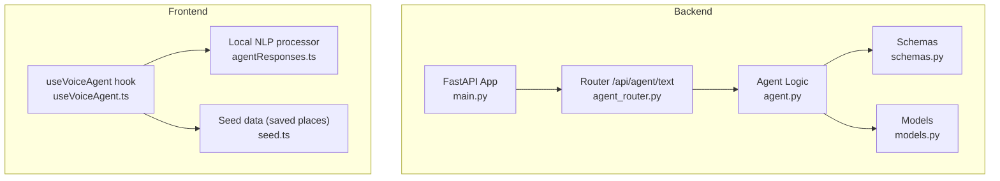
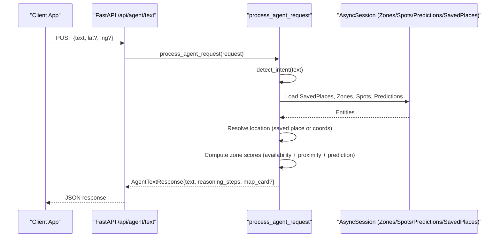
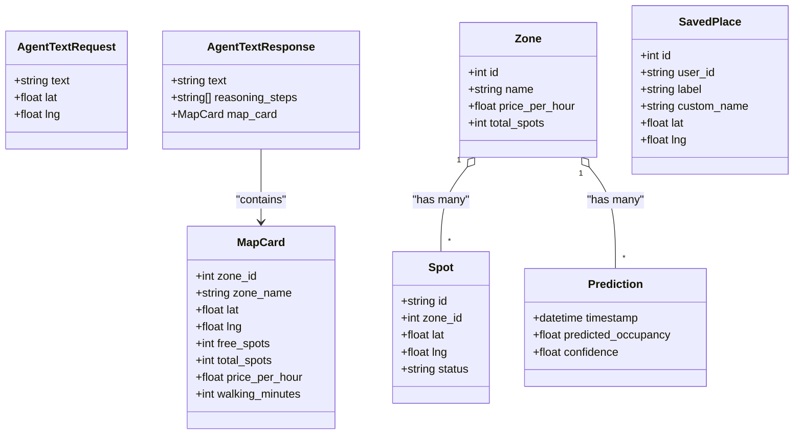

# Voice Agent API

<cite>
**Referenced Files in This Document**
- [main.py](file://backend/main.py)
- [agent_router.py](file://backend/routers/agent_router.py)
- [agent.py](file://backend/agent.py)
- [schemas.py](file://backend/schemas.py)
- [models.py](file://backend/models.py)
- [useVoiceAgent.ts](file://frontend/src/hooks/useVoiceAgent.ts)
- [agentResponses.ts](file://frontend/src/lib/agentResponses.ts)
- [seed.ts](file://frontend/src/data/seed.ts)
</cite>

## Table of Contents
1. [Introduction](#introduction)
2. [Project Structure](#project-structure)
3. [Core Components](#core-components)
4. [Architecture Overview](#architecture-overview)
5. [Detailed Component Analysis](#detailed-component-analysis)
6. [Dependency Analysis](#dependency-analysis)
7. [Performance Considerations](#performance-considerations)
8. [Troubleshooting Guide](#troubleshooting-guide)
9. [Conclusion](#conclusion)
10. [Appendices](#appendices)

## Introduction
This document provides detailed API documentation for the Voice Agent interaction endpoints that power natural language parking queries. The agent accepts text input, detects intent, and returns contextual parking recommendations with reasoning steps and optional map cards. It integrates with zones, spots, saved places, and predictions to provide proximity-aware, availability-driven responses.

The backend exposes a single HTTP endpoint for processing voice/text queries. The frontend includes both a client-side NLP demo (for UI interactions) and an integration path to call the backend agent via HTTP.

## Project Structure
The Voice Agent spans backend and frontend:
- Backend: FastAPI application with router, agent logic, schemas, and database models.
- Frontend: React components and hooks for voice input, chat UI, and local query processing.

**Diagram sources**
- [main.py:33-64](file://backend/main.py#L33-L64)
- [agent_router.py:1-12](file://backend/routers/agent_router.py#L1-L12)
- [agent.py:1-261](file://backend/agent.py#L1-L261)
- [schemas.py:83-105](file://backend/schemas.py#L83-L105)
- [models.py:7-89](file://backend/models.py#L7-L89)
- [useVoiceAgent.ts:1-227](file://frontend/src/hooks/useVoiceAgent.ts#L1-L227)
- [agentResponses.ts:1-131](file://frontend/src/lib/agentResponses.ts#L1-L131)
- [seed.ts:114-138](file://frontend/src/data/seed.ts#L114-L138)

**Section sources**
- [main.py:33-64](file://backend/main.py#L33-L64)
- [agent_router.py:1-12](file://backend/routers/agent_router.py#L1-L12)
- [agent.py:1-261](file://backend/agent.py#L1-L261)
- [schemas.py:83-105](file://backend/schemas.py#L83-L105)
- [models.py:7-89](file://backend/models.py#L7-L89)
- [useVoiceAgent.ts:1-227](file://frontend/src/hooks/useVoiceAgent.ts#L1-L227)
- [agentResponses.ts:1-131](file://frontend/src/lib/agentResponses.ts#L1-L131)
- [seed.ts:114-138](file://frontend/src/data/seed.ts#L114-L138)

## Core Components
- HTTP Endpoint: POST /api/agent/text processes natural language queries.
- Intent Detection: Pattern-based classification into intents like find_parking, predict, compare, navigate, pay, general.
- Context Resolution: Resolves location references from saved places or provided coordinates.
- Ranking Algorithm: Computes composite scores using availability, proximity, and predicted future occupancy.
- Response Generation: Produces human-readable text, reasoning steps, and optional map card.

Key responsibilities:
- Router: Exposes the endpoint and delegates to agent logic.
- Agent: Implements intent detection, context resolution, scoring, and response generation.
- Schemas: Define request/response structures and map card payload.
- Models: Represent Zones, Spots, Predictions, Saved Places used by the agent.

**Section sources**
- [agent_router.py:1-12](file://backend/routers/agent_router.py#L1-L12)
- [agent.py:24-261](file://backend/agent.py#L24-L261)
- [schemas.py:83-105](file://backend/schemas.py#L83-L105)
- [models.py:7-89](file://backend/models.py#L7-L89)

## Architecture Overview
The Voice Agent architecture connects user input to real-time parking data and prediction models.

**Diagram sources**
- [agent_router.py:8-12](file://backend/routers/agent_router.py#L8-L12)
- [agent.py:246-261](file://backend/agent.py#L246-L261)
- [agent.py:53-143](file://backend/agent.py#L53-L143)
- [schemas.py:83-105](file://backend/schemas.py#L83-L105)
- [models.py:7-89](file://backend/models.py#L7-L89)

## Detailed Component Analysis

### HTTP API Definition
- Method: POST
- URL: /api/agent/text
- Tags: agent
- Request Body: AgentTextRequest
- Response Body: AgentTextResponse

Request Schema: AgentTextRequest
- Fields:
  - text: string (required) — Natural language query.
  - lat: number (optional) — User latitude for proximity calculations.
  - lng: number (optional) — User longitude for proximity calculations.

Response Schema: AgentTextResponse
- Fields:
  - text: string — Human-readable recommendation or guidance.
  - reasoning_steps: array of strings — Step-by-step explanation of agent decisions.
  - map_card: MapCard (optional) — Structured data for UI rendering.

MapCard Schema
- Fields:
  - zone_id: integer (optional)
  - zone_name: string (optional)
  - lat: number (optional)
  - lng: number (optional)
  - free_spots: integer (optional)
  - total_spots: integer (optional)
  - price_per_hour: number (optional)
  - walking_minutes: integer (optional)

Example Requests
- Find parking near work:
  - Body: {"text": "Find free parking near my work"}
- Compare zones:
  - Body: {"text": "Which zone has the most availability?"}
- Predict next hour:
  - Body: {"text": "Predict occupancy for the next hour"}
- Navigate:
  - Body: {"text": "Navigate to nearest available parking"}
- Pay:
  - Body: {"text": "Pay for parking"}

Example Responses
- With map card:
  - {
      "text": "...",
      "reasoning_steps": ["..."],
      "map_card": {
        "zone_id": 314,
        "zone_name": "Street 2C — DIC",
        "lat": 25.0935,
        "lng": 55.161,
        "free_spots": 11,
        "total_spots": 24,
        "price_per_hour": 6.0,
        "walking_minutes": 2
      }
    }
- Without map card:
  - {
      "text": "...",
      "reasoning_steps": ["..."]
    }

Notes
- If no location is provided and none can be resolved from saved places, the agent returns a prompt asking for a location reference or coordinates.

**Section sources**
- [agent_router.py:8-12](file://backend/routers/agent_router.py#L8-L12)
- [schemas.py:83-105](file://backend/schemas.py#L83-L105)
- [agent.py:53-143](file://backend/agent.py#L53-L143)

### Intent Detection and Routing
Intent categories:
- find_parking: Queries about finding nearby parking spaces.
- predict: Queries about future occupancy or forecasts.
- compare: Queries comparing zones by availability or cost.
- navigate: Requests for directions or navigation.
- pay: Payment-related requests.
- general: Fallback for unrecognized inputs.

Routing behavior:
- The agent maps detected intent to a handler function.
- Handlers use AsyncSession to read Zones, Spots, Predictions, and SavedPlaces.

**Section sources**
- [agent.py:24-39](file://backend/agent.py#L24-L39)
- [agent.py:246-261](file://backend/agent.py#L246-L261)

### Location Resolution and Context Awareness
- Saved Places: The agent checks if the query mentions a saved place label or custom name and resolves coordinates accordingly.
- Provided Coordinates: If lat/lng are included in the request, they are used directly.
- Fallback: If neither is available, the agent prompts for a location reference.

Saved Place matching:
- Matches against label and optional custom_name fields.
- Returns coordinates and resolved label for reasoning.

**Section sources**
- [agent.py:42-50](file://backend/agent.py#L42-L50)
- [agent.py:53-74](file://backend/agent.py#L53-L74)
- [models.py:53-63](file://backend/models.py#L53-L63)

### Zone Scoring and Recommendation Logic
Scoring factors:
- Availability: Ratio of free spots to total spots in a zone.
- Proximity: Inverse distance normalized within a 500m radius.
- Predicted Future: Uses next upcoming prediction’s occupancy to estimate future availability.

Composite score formula:
- score = 0.4 * availability + 0.3 * proximity + 0.3 * predicted_future

Distance calculation:
- Haversine formula computes meters between two lat/lng points.

Recommendation selection:
- Zones within 500m are considered; the highest-scoring zone is selected.
- Walking minutes estimated based on distance and average walking speed.

**Section sources**
- [agent.py:14-21](file://backend/agent.py#L14-L21)
- [agent.py:76-143](file://backend/agent.py#L76-L143)

### Prediction Handling
- Predictions are filtered to timestamps after current time.
- Next prediction determines recommended advice (e.g., good/moderate/high demand).
- If no future predictions exist, the agent reports current availability counts.

**Section sources**
- [agent.py:146-193](file://backend/agent.py#L146-L193)
- [models.py:65-76](file://backend/models.py#L65-L76)

### Comparison and Navigation Handlers
- Compare: Aggregates all zones’ availability and pricing, sorts by free spots, and highlights the best option.
- Navigate: Returns a message indicating navigation initiation (integration placeholder for maps API).

**Section sources**
- [agent.py:196-227](file://backend/agent.py#L196-L227)

### General Handler
- Provides a help message describing capabilities and example queries.

**Section sources**
- [agent.py:238-243](file://backend/agent.py#L238-L243)

### Frontend Integration and Local Processing
- useVoiceAgent hook: Manages speech recognition state, transcript handling, and calls either local processing or backend (demo uses local).
- agentResponses.ts: Implements pattern-based NLP for common queries and returns structured results including reasoning steps and optional map card data.
- seed.ts: Provides saved places used by both frontend and backend logic.

Note: The frontend currently demonstrates local processing for UX; production should route through the backend endpoint.

**Section sources**
- [useVoiceAgent.ts:78-94](file://frontend/src/hooks/useVoiceAgent.ts#L78-L94)
- [agentResponses.ts:17-131](file://frontend/src/lib/agentResponses.ts#L17-L131)
- [seed.ts:114-138](file://frontend/src/data/seed.ts#L114-L138)

## Dependency Analysis
The agent depends on database entities and schema definitions. The router mounts the agent endpoint in the main app.

**Diagram sources**
- [schemas.py:83-105](file://backend/schemas.py#L83-L105)
- [models.py:7-89](file://backend/models.py#L7-L89)

**Section sources**
- [schemas.py:83-105](file://backend/schemas.py#L83-L105)
- [models.py:7-89](file://backend/models.py#L7-L89)

## Performance Considerations
- Database Access: The agent loads all zones and related entities per request. For high concurrency, consider caching frequently accessed zone summaries and predictions.
- Distance Calculations: Haversine computations are lightweight but repeated across zones; precompute zone centroids to reduce overhead.
- Prediction Filtering: Sorting and filtering predictions per request can be optimized with indexed queries or materialized views.
- Response Size: Keep reasoning_steps concise to minimize payload size.

[No sources needed since this section provides general guidance]

## Troubleshooting Guide
Common issues and resolutions:
- No location found: Ensure saved places include labels referenced in queries or provide lat/lng in the request body.
- Empty results: Verify zones have spots and predictions; expand search radius or adjust thresholds.
- Speech recognition errors: Check browser support and permissions; handle error states gracefully in the frontend.

**Section sources**
- [agent.py:71-74](file://backend/agent.py#L71-L74)
- [agent.py:113-118](file://backend/agent.py#L113-L118)
- [useVoiceAgent.ts:147-165](file://frontend/src/hooks/useVoiceAgent.ts#L147-L165)

## Conclusion
The Voice Agent API offers a robust foundation for natural language parking assistance. It combines intent detection, context awareness, and multi-factor ranking to deliver actionable recommendations. Integrating with real-time sensors and predictions enhances responsiveness and accuracy. Extending the system with authentication, user-specific saved places, and richer map integrations will further improve usability.

[No sources needed since this section summarizes without analyzing specific files]

## Appendices

### Query Examples and Expected Behaviors
- "Find free parking near me"
  - Behavior: Uses provided coordinates or saved places; ranks zones within 500m; returns top recommendation with map card.
- "Which zone has the most availability"
  - Behavior: Compares all zones by free spot count; returns ranked list and best option.
- "Predict occupancy for the next hour"
  - Behavior: Retrieves next prediction; advises based on predicted occupancy level.
- "Navigate to nearest available parking"
  - Behavior: Initiates navigation flow; returns confirmation message.
- "Pay for parking"
  - Behavior: Returns payment integration message.

**Section sources**
- [agent.py:53-143](file://backend/agent.py#L53-L143)
- [agent.py:196-227](file://backend/agent.py#L196-L227)
- [agent.py:230-243](file://backend/agent.py#L230-L243)