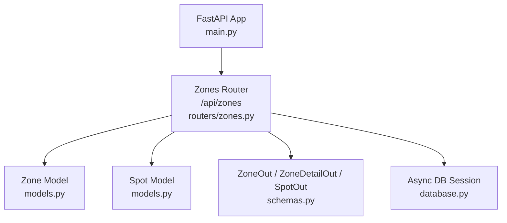
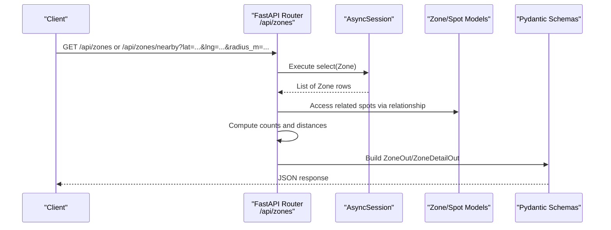
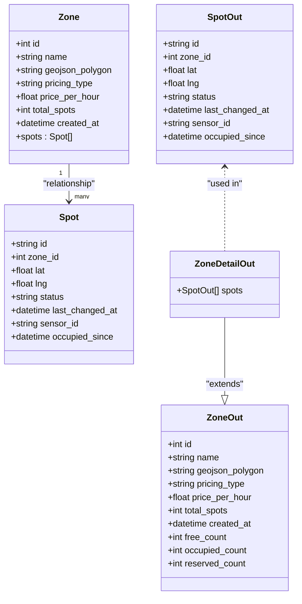

# Zones API

<cite>
**Referenced Files in This Document**
- [zones.py](file://backend/routers/zones.py)
- [schemas.py](file://backend/schemas.py)
- [models.py](file://backend/models.py)
- [main.py](file://backend/main.py)
- [database.py](file://backend/database.py)
</cite>

## Table of Contents
1. [Introduction](#introduction)
2. [Project Structure](#project-structure)
3. [Core Components](#core-components)
4. [Architecture Overview](#architecture-overview)
5. [Detailed Component Analysis](#detailed-component-analysis)
6. [Dependency Analysis](#dependency-analysis)
7. [Performance Considerations](#performance-considerations)
8. [Troubleshooting Guide](#troubleshooting-guide)
9. [Conclusion](#conclusion)
10. [Appendices](#appendices)

## Introduction
This document provides comprehensive API documentation for the Zones management endpoints. It covers:
- Listing all zones with computed spot counts
- Retrieving a single zone with detailed spot information
- Finding nearby zones within a radius using Haversine distance calculation

It also documents request/response schemas, error handling, geographic calculations, pricing structure fields, and spot count aggregations. Practical curl examples are included to demonstrate usage.

## Project Structure
The Zones API is implemented as a FastAPI router mounted under the application root. The relevant files include:
- Router definition and endpoint logic
- Pydantic response models (schemas)
- SQLAlchemy ORM models
- Application bootstrap that mounts routers
- Database session configuration

**Diagram sources**
- [main.py:49-55](file://backend/main.py#L49-L55)
- [zones.py:9](file://backend/routers/zones.py#L9)
- [models.py:7-36](file://backend/models.py#L7-L36)
- [schemas.py:21-41](file://backend/schemas.py#L21-L41)
- [database.py:20-22](file://backend/database.py#L20-L22)

**Section sources**
- [main.py:49-55](file://backend/main.py#L49-L55)
- [zones.py:9](file://backend/routers/zones.py#L9)
- [models.py:7-36](file://backend/models.py#L7-L36)
- [schemas.py:21-41](file://backend/schemas.py#L21-L41)
- [database.py:20-22](file://backend/database.py#L20-L22)

## Core Components
- Zones Router: Defines REST endpoints under /api/zones and implements proximity filtering and aggregation.
- Schemas: Pydantic models define the shape of responses for listing and detail views.
- Models: SQLAlchemy ORM entities represent zones and spots, including relationships.
- Database: Async database session provider used by endpoints.

Key responsibilities:
- Compute free, occupied, and reserved spot counts per zone.
- Calculate zone center from spot coordinates and apply Haversine distance for proximity queries.
- Return structured JSON responses conforming to defined schemas.

**Section sources**
- [zones.py:22-86](file://backend/routers/zones.py#L22-L86)
- [zones.py:89-123](file://backend/routers/zones.py#L89-L123)
- [schemas.py:21-41](file://backend/schemas.py#L21-L41)
- [models.py:7-36](file://backend/models.py#L7-L36)
- [database.py:20-22](file://backend/database.py#L20-L22)

## Architecture Overview
The Zones API follows a layered architecture:
- HTTP layer: FastAPI routes handle requests and return Pydantic models.
- Business logic: Aggregation and geographic calculations occur in route handlers.
- Data access: SQLAlchemy async sessions query ORM models.

**Diagram sources**
- [zones.py:22-86](file://backend/routers/zones.py#L22-L86)
- [zones.py:89-123](file://backend/routers/zones.py#L89-L123)
- [models.py:7-36](file://backend/models.py#L7-L36)
- [schemas.py:21-41](file://backend/schemas.py#L21-L41)
- [database.py:20-22](file://backend/database.py#L20-L22)

## Detailed Component Analysis

### Endpoint: GET /api/zones
- Purpose: List all zones with computed spot counts.
- Method: GET
- URL pattern: /api/zones
- Query parameters: None
- Response model: list[ZoneOut]
- Behavior:
  - Retrieves all zones.
  - For each zone, aggregates spot statuses into free_count, occupied_count, reserved_count.
  - Returns summary fields including pricing_type and price_per_hour.

Response schema (ZoneOut):
- id: integer
- name: string
- geojson_polygon: optional string
- pricing_type: string
- price_per_hour: number
- total_spots: integer
- created_at: optional datetime
- free_count: integer (default 0)
- occupied_count: integer (default 0)
- reserved_count: integer (default 0)

Example curl:
- curl "http://localhost:8000/api/zones"

Notes:
- Pricing fields reflect zone-level pricing configuration.
- Spot counts are computed server-side based on current spot statuses.

**Section sources**
- [zones.py:62-86](file://backend/routers/zones.py#L62-L86)
- [schemas.py:21-35](file://backend/schemas.py#L21-L35)
- [models.py:7-18](file://backend/models.py#L7-L18)

### Endpoint: GET /api/zones/{zone_id}
- Purpose: Get a single zone with detailed spot information.
- Method: GET
- URL pattern: /api/zones/{zone_id}
- Path parameter:
  - zone_id: integer
- Response model: ZoneDetailOut
- Behavior:
  - Fetches zone by ID.
  - If not found, returns 404 with an error detail.
  - Aggregates spot statuses and includes full spot list.

Response schema (ZoneDetailOut extends ZoneOut):
- Inherits all ZoneOut fields.
- spots: array of SpotOut objects, each containing:
  - id: string
  - zone_id: integer
  - lat: number
  - lng: number
  - status: string (free, occupied, reserved, sensor_offline)
  - last_changed_at: optional datetime
  - sensor_id: optional string
  - occupied_since: optional datetime

Example curl:
- curl "http://localhost:8000/api/zones/1"

Error handling:
- 404 Not Found when zone_id does not exist.

**Section sources**
- [zones.py:89-123](file://backend/routers/zones.py#L89-L123)
- [schemas.py:37-41](file://backend/schemas.py#L37-L41)
- [schemas.py:7-18](file://backend/schemas.py#L7-L18)
- [models.py:22-36](file://backend/models.py#L22-L36)

### Endpoint: GET /api/zones/nearby
- Purpose: Find zones within a specified radius using Haversine distance calculation.
- Method: GET
- URL pattern: /api/zones/nearby
- Query parameters:
  - lat: required float (latitude)
  - lng: required float (longitude)
  - radius_m: optional float (meters), default 500
- Response model: list[ZoneOut]
- Behavior:
  - Loads all zones and their spots.
  - Computes zone center as the average latitude and longitude of its spots.
  - Calculates distance between client location and zone center using Haversine formula.
  - Filters zones where distance <= radius_m.
  - Aggregates spot statuses into free_count, occupied_count, reserved_count.

Geographic calculation details:
- Haversine function computes great-circle distance in meters between two points given lat/lng in degrees.
- Zone center is derived from spot coordinates; zones without spots are skipped.

Example curl:
- curl "http://localhost:8000/api/zones/nearby?lat=25.092&lng=55.158&radius_m=1000"

Notes:
- Only zones with at least one spot are considered for proximity.
- Results include aggregated spot counts and pricing fields.

**Section sources**
- [zones.py:12-19](file://backend/routers/zones.py#L12-L19)
- [zones.py:22-59](file://backend/routers/zones.py#L22-L59)
- [schemas.py:21-35](file://backend/schemas.py#L21-L35)
- [models.py:7-36](file://backend/models.py#L7-L36)

## Dependency Analysis
The Zones router depends on:
- FastAPI components for routing and dependency injection
- SQLAlchemy async session for database access
- ORM models for data retrieval and relationships
- Pydantic schemas for response serialization

**Diagram sources**
- [models.py:7-36](file://backend/models.py#L7-L36)
- [schemas.py:21-41](file://backend/schemas.py#L21-L41)

**Section sources**
- [models.py:7-36](file://backend/models.py#L7-L36)
- [schemas.py:21-41](file://backend/schemas.py#L21-L41)

## Performance Considerations
- Proximity filtering currently loads all zones and performs in-memory calculations. For large datasets, consider:
  - Spatial indexing or geospatial queries to pre-filter candidates.
  - Caching frequently accessed zone summaries.
- Relationship loading uses eager loading patterns in models; ensure this aligns with expected performance characteristics.
- Avoid unnecessary repeated computations by caching zone centers if needed.

[No sources needed since this section provides general guidance]

## Troubleshooting Guide
Common issues and resolutions:
- Missing required query parameters for /api/zones/nearby:
  - Ensure lat and lng are provided.
  - Validate numeric formats and reasonable ranges.
- 404 Not Found for /api/zones/{zone_id}:
  - Verify zone_id exists in the database.
- Empty results for nearby zones:
  - Check radius_m value and coordinate accuracy.
  - Confirm zones have associated spots; zones without spots are excluded from proximity results.

**Section sources**
- [zones.py:22-28](file://backend/routers/zones.py#L22-L28)
- [zones.py:89-95](file://backend/routers/zones.py#L89-L95)
- [zones.py:34-37](file://backend/routers/zones.py#L34-L37)

## Conclusion
The Zones API provides robust endpoints for listing zones, retrieving detailed zone information, and finding nearby zones using precise geographic calculations. Responses are well-structured with clear schemas, and error handling ensures predictable behavior for invalid inputs and missing resources.

[No sources needed since this section summarizes without analyzing specific files]

## Appendices

### Request/Response Examples

- List all zones:
  - curl "http://localhost:8000/api/zones"
  - Response: Array of ZoneOut objects with aggregated spot counts and pricing fields.

- Get zone details:
  - curl "http://localhost:8000/api/zones/1"
  - Response: ZoneDetailOut object including spots array with individual spot statuses and timestamps.

- Find nearby zones:
  - curl "http://localhost:8000/api/zones/nearby?lat=25.092&lng=55.158&radius_m=1000"
  - Response: Array of ZoneOut objects filtered by proximity.

### Geographic Calculations
- Haversine distance in meters between two lat/lng points.
- Zone center computed as average of spot coordinates.

**Section sources**
- [zones.py:12-19](file://backend/routers/zones.py#L12-L19)
- [zones.py:34-41](file://backend/routers/zones.py#L34-L41)

### Pricing Structure Fields
- pricing_type: string indicating pricing category.
- price_per_hour: number representing hourly rate.

**Section sources**
- [models.py:13-14](file://backend/models.py#L13-L14)
- [schemas.py:25-26](file://backend/schemas.py#L25-L26)

### Spot Count Aggregations
- free_count: number of spots with status "free".
- occupied_count: number of spots with status "occupied".
- reserved_count: number of spots with status "reserved".

**Section sources**
- [zones.py:44-47](file://backend/routers/zones.py#L44-L47)
- [zones.py:71-73](file://backend/routers/zones.py#L71-L73)
- [zones.py:98-100](file://backend/routers/zones.py#L98-L100)