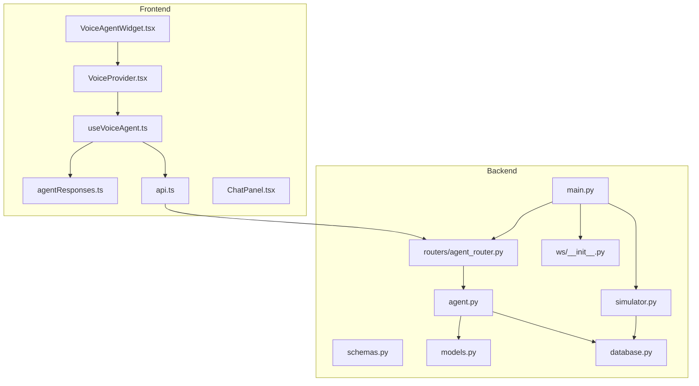
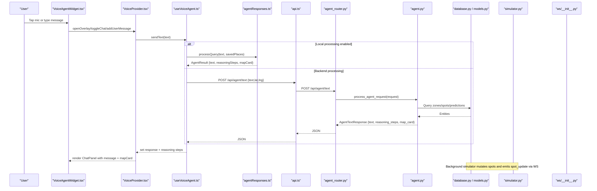
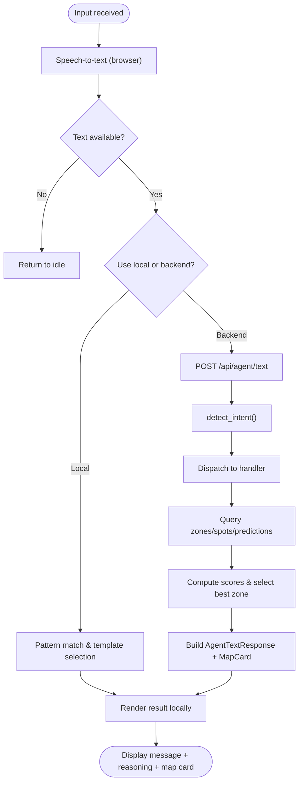
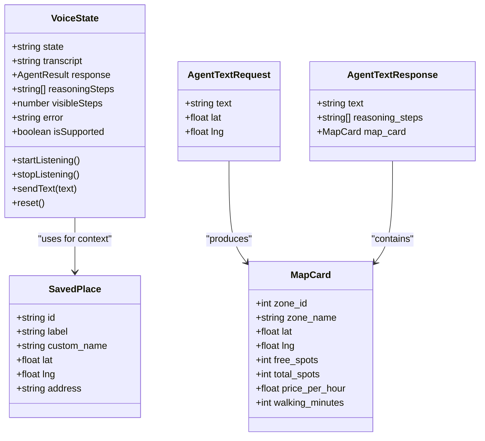
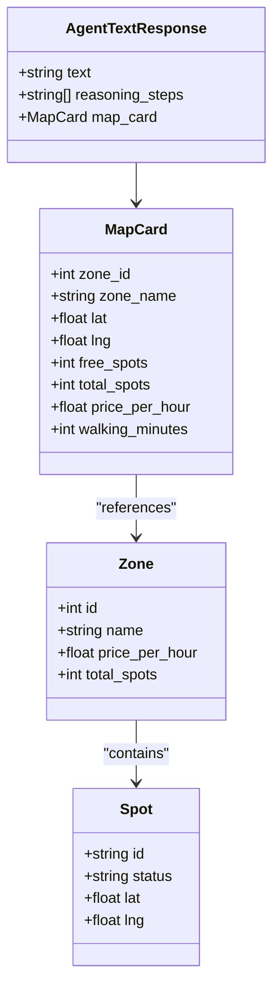
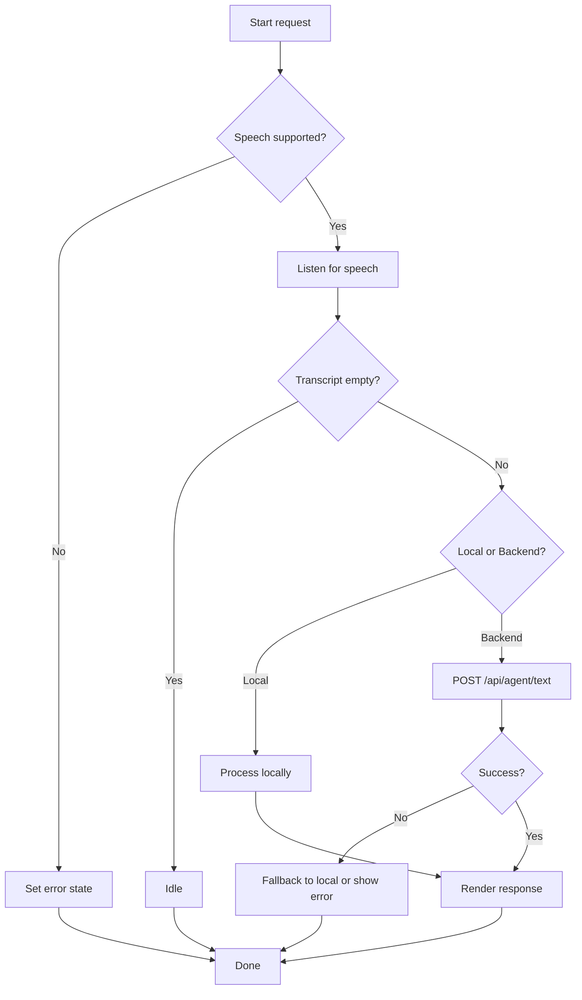
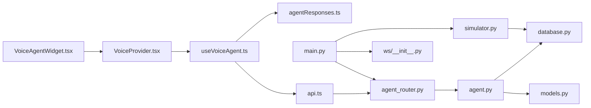

# Agent System

<cite>
**Referenced Files in This Document**
- [main.py](file://backend/main.py)
- [agent_router.py](file://backend/routers/agent_router.py)
- [agent.py](file://backend/agent.py)
- [schemas.py](file://backend/schemas.py)
- [models.py](file://backend/models.py)
- [database.py](file://backend/database.py)
- [simulator.py](file://backend/simulator.py)
- [spots.py](file://backend/ws/__init__.py)
- [api.ts](file://frontend/src/lib/api.ts)
- [useVoiceAgent.ts](file://frontend/src/hooks/useVoiceAgent.ts)
- [agentResponses.ts](file://frontend/src/lib/agentResponses.ts)
- [VoiceProvider.tsx](file://frontend/src/components/voice/VoiceProvider.tsx)
- [ChatPanel.tsx](file://frontend/src/components/voice/ChatPanel.tsx)
- [VoiceAgentWidget.tsx](file://frontend/src/components/voice/VoiceAgentWidget.tsx)
- [seed.ts](file://frontend/src/data/seed.ts)
</cite>

## Table of Contents
1. Introduction
2. Project Structure
3. Core Components
4. Architecture Overview
5. Detailed Component Analysis
6. Dependency Analysis
7. Performance Considerations
8. Troubleshooting Guide
9. Conclusion
10. Appendices

## Introduction
This document describes the AI voice agent system for SmartPark UAE, focusing on the natural language processing pipeline (speech-to-text, intent recognition, response generation), context management for conversation state and user preferences, integration with external services and local processing, structured response formatting (parking recommendations, zone info, navigation suggestions), error handling and fallbacks, performance optimization techniques, and guidance for extending capabilities and customizing templates.

The system comprises:
- A FastAPI backend exposing an agent text endpoint that performs pattern-based intent detection and returns structured responses with optional map cards.
- A frontend voice widget using browser speech recognition, a local NLP processor, and optional API calls to the backend.
- Real-time spot updates via WebSocket driven by a simulator.

## Project Structure
High-level organization:
- Backend: FastAPI application with routers, agent logic, schemas, models, database setup, and a background simulator broadcasting spot changes over WebSocket.
- Frontend: Next.js app with a drop-in VoiceAgentWidget composed of provider, overlay, chat panel, and hooks for speech recognition and query processing.

**Diagram sources**
- [main.py:1-64](file://backend/main.py#L1-L64)
- [agent_router.py:1-12](file://backend/routers/agent_router.py#L1-L12)
- [agent.py:1-261](file://backend/agent.py#L1-L261)
- [schemas.py:1-127](file://backend/schemas.py#L1-L127)
- [models.py:1-89](file://backend/models.py#L1-L89)
- [database.py:1-23](file://backend/database.py#L1-L23)
- [simulator.py:1-105](file://backend/simulator.py#L1-L105)
- [spots.py:1-4](file://backend/ws/__init__.py#L1-L4)
- [api.ts:1-27](file://frontend/src/lib/api.ts#L1-L27)
- [useVoiceAgent.ts:1-227](file://frontend/src/hooks/useVoiceAgent.ts#L1-L227)
- [agentResponses.ts:1-131](file://frontend/src/lib/agentResponses.ts#L1-L131)
- [VoiceProvider.tsx:1-110](file://frontend/src/components/voice/VoiceProvider.tsx#L1-L110)
- [ChatPanel.tsx:1-164](file://frontend/src/components/voice/ChatPanel.tsx#L1-L164)
- [VoiceAgentWidget.tsx:1-22](file://frontend/src/components/voice/VoiceAgentWidget.tsx#L1-L22)

**Section sources**
- [main.py:1-64](file://backend/main.py#L1-L64)
- [VoiceAgentWidget.tsx:1-22](file://frontend/src/components/voice/VoiceAgentWidget.tsx#L1-L22)

## Core Components
- Intent-driven agent backend: Pattern-based intent classification and handler dispatch returning structured responses with reasoning steps and optional map card data.
- Frontend voice pipeline: Browser Speech Recognition, local query processing, optional backend call, and UI composition.
- Real-time simulation: Background task adjusts spot statuses based on time-of-day profiles and broadcasts updates via WebSocket.
- Data layer: Async SQLAlchemy models and schemas for zones, spots, sensors, predictions, saved places, and agent request/response contracts.

Key responsibilities:
- Backend agent: detect_intent, resolve_place_reference, handlers for find_parking/predict/compare/navigate/pay/general, composite scoring, and MapCard construction.
- Frontend hook: manage listening states, transcript accumulation, local processing or API call, and reasoning step animation.
- Simulator: compute target occupancy per Dubai time profile and mutate spot statuses; broadcast changed spots.

**Section sources**
- [agent.py:24-261](file://backend/agent.py#L24-L261)
- [schemas.py:83-127](file://backend/schemas.py#L83-L127)
- [useVoiceAgent.ts:32-227](file://frontend/src/hooks/useVoiceAgent.ts#L32-L227)
- [agentResponses.ts:17-131](file://frontend/src/lib/agentResponses.ts#L17-L131)
- [simulator.py:24-105](file://backend/simulator.py#L24-L105)
- [models.py:7-89](file://backend/models.py#L7-L89)

## Architecture Overview
End-to-end flow from voice input to response:

**Diagram sources**
- [VoiceAgentWidget.tsx:1-22](file://frontend/src/components/voice/VoiceAgentWidget.tsx#L1-L22)
- [VoiceProvider.tsx:39-110](file://frontend/src/components/voice/VoiceProvider.tsx#L39-L110)
- [useVoiceAgent.ts:78-186](file://frontend/src/hooks/useVoiceAgent.ts#L78-L186)
- [agentResponses.ts:17-131](file://frontend/src/lib/agentResponses.ts#L17-L131)
- [api.ts:13-20](file://frontend/src/lib/api.ts#L13-L20)
- [agent_router.py:8-12](file://backend/routers/agent_router.py#L8-L12)
- [agent.py:246-261](file://backend/agent.py#L246-L261)
- [database.py:15-23](file://backend/database.py#L15-L23)
- [models.py:7-89](file://backend/models.py#L7-L89)
- [simulator.py:91-105](file://backend/simulator.py#L91-L105)
- [spots.py:1-4](file://backend/ws/__init__.py#L1-L4)

## Detailed Component Analysis

### Natural Language Processing Pipeline
- Speech-to-text: Browser Web Speech API used in the frontend hook to capture interim and final transcripts.
- Intent recognition: Two paths:
  - Local path: keyword-based matching in the frontend processor.
  - Backend path: pattern-based classifier mapping to intents like find_parking, predict, compare, navigate, pay, general.
- Response generation:
  - Backend constructs human-readable text, reasoning steps, and optional MapCard with zone details and walking minutes.
  - Frontend renders messages, reasoning steps with staggered reveal, and map cards.

**Diagram sources**
- [useVoiceAgent.ts:96-166](file://frontend/src/hooks/useVoiceAgent.ts#L96-L166)
- [agentResponses.ts:17-131](file://frontend/src/lib/agentResponses.ts#L17-L131)
- [agent_router.py:8-12](file://backend/routers/agent_router.py#L8-L12)
- [agent.py:24-261](file://backend/agent.py#L24-L261)
- [schemas.py:83-127](file://backend/schemas.py#L83-L127)

**Section sources**
- [useVoiceAgent.ts:44-166](file://frontend/src/hooks/useVoiceAgent.ts#L44-L166)
- [agentResponses.ts:17-131](file://frontend/src/lib/agentResponses.ts#L17-L131)
- [agent.py:24-261](file://backend/agent.py#L24-L261)
- [schemas.py:83-127](file://backend/schemas.py#L83-L127)

### Context Management System
- Conversation state: The frontend maintains chat history, current voice state, visible reasoning steps, and errors within the provider and hook.
- User preferences: Saved places are used to resolve references like “work” or “home”. In the backend, saved places are queried by user_id; in the frontend demo, they are seeded locally.
- Reasoning transparency: Both backend and frontend return reasoning steps to guide users through decisions.

**Diagram sources**
- [useVoiceAgent.ts:18-31](file://frontend/src/hooks/useVoiceAgent.ts#L18-L31)
- [agentResponses.ts:11-15](file://frontend/src/lib/agentResponses.ts#L11-L15)
- [schemas.py:83-127](file://backend/schemas.py#L83-L127)
- [models.py:53-63](file://backend/models.py#L53-L63)

**Section sources**
- [VoiceProvider.tsx:39-110](file://frontend/src/components/voice/VoiceProvider.tsx#L39-L110)
- [useVoiceAgent.ts:32-227](file://frontend/src/hooks/useVoiceAgent.ts#L32-L227)
- [agent.py:42-74](file://backend/agent.py#L42-L74)
- [seed.ts:114-138](file://frontend/src/data/seed.ts#L114-L138)

### Integration Points
- External AI services: Not currently integrated; the system uses local pattern matching and deterministic scoring. The architecture allows plugging in external NLP or LLM endpoints at the router or hook level.
- Local processing: Frontend local processor provides fast responses and offline capability; backend supports richer queries with live DB access.
- Real-time updates: Simulator periodically mutates spot statuses and broadcasts via WebSocket; frontend can subscribe to spot updates.

**Section sources**
- [api.ts:13-20](file://frontend/src/lib/api.ts#L13-L20)
- [agent_router.py:8-12](file://backend/routers/agent_router.py#L8-L12)
- [simulator.py:91-105](file://backend/simulator.py#L91-L105)
- [main.py:57-58](file://backend/main.py#L57-L58)

### Response Formatting System
Structured outputs include:
- Parking recommendations: Best zone selected by composite score (availability, proximity, predicted future availability).
- Zone information: Name, free/total spots, price per hour, walking minutes.
- Navigation suggestions: Placeholder response indicating navigation initiation.
- Predictions: Next prediction timestamp, occupancy percentage, confidence, and advice.

**Diagram sources**
- [schemas.py:83-127](file://backend/schemas.py#L83-L127)
- [models.py:7-37](file://backend/models.py#L7-L37)

**Section sources**
- [agent.py:53-143](file://backend/agent.py#L53-L143)
- [agent.py:146-193](file://backend/agent.py#L146-L193)
- [agent.py:196-219](file://backend/agent.py#L196-L219)
- [agent.py:222-235](file://backend/agent.py#L222-L235)

### Error Handling and Fallback Mechanisms
- Speech recognition errors: Handled in the frontend hook; sets error state and falls back to idle or manual input.
- Missing location context: Backend returns a clarifying message when no location reference or coordinates are provided.
- No results: When no zones are found within radius, backend responds with a helpful message and reasoning steps.
- Network/API failures: Frontend fetch calls should be wrapped with try/catch and fallback to local processing if configured.

**Diagram sources**
- [useVoiceAgent.ts:96-166](file://frontend/src/hooks/useVoiceAgent.ts#L96-L166)
- [agent.py:71-74](file://backend/agent.py#L71-L74)
- [agent.py:113-118](file://backend/agent.py#L113-L118)

**Section sources**
- [useVoiceAgent.ts:147-165](file://frontend/src/hooks/useVoiceAgent.ts#L147-L165)
- [agent.py:71-74](file://backend/agent.py#L71-L74)
- [agent.py:113-118](file://backend/agent.py#L113-L118)

### Performance Optimization Techniques
- Local-first processing: Reduces latency and server load by handling common queries client-side.
- Composite scoring efficiency: Precomputes zone centers and filters by distance threshold before ranking.
- Asynchronous DB access: Uses async SQLAlchemy sessions to avoid blocking.
- Background simulation: Runs independently and batches updates to minimize DB churn.
- Staggered reasoning display: Improves perceived responsiveness by animating steps.

[No sources needed since this section provides general guidance]

## Dependency Analysis
Component relationships and coupling:
- Frontend components depend on the hook and local processor; optionally on the backend API.
- Backend router depends on agent logic and schemas; agent depends on database session and models.
- Simulator depends on database and broadcasts via WebSocket manager.

**Diagram sources**
- [VoiceAgentWidget.tsx:1-22](file://frontend/src/components/voice/VoiceAgentWidget.tsx#L1-L22)
- [VoiceProvider.tsx:39-110](file://frontend/src/components/voice/VoiceProvider.tsx#L39-L110)
- [useVoiceAgent.ts:78-186](file://frontend/src/hooks/useVoiceAgent.ts#L78-L186)
- [agentResponses.ts:17-131](file://frontend/src/lib/agentResponses.ts#L17-L131)
- [api.ts:13-20](file://frontend/src/lib/api.ts#L13-L20)
- [agent_router.py:8-12](file://backend/routers/agent_router.py#L8-L12)
- [agent.py:246-261](file://backend/agent.py#L246-L261)
- [database.py:15-23](file://backend/database.py#L15-L23)
- [models.py:7-89](file://backend/models.py#L7-L89)
- [simulator.py:91-105](file://backend/simulator.py#L91-L105)
- [spots.py:1-4](file://backend/ws/__init__.py#L1-L4)
- [main.py:49-58](file://backend/main.py#L49-L58)

**Section sources**
- [main.py:49-58](file://backend/main.py#L49-L58)
- [agent_router.py:8-12](file://backend/routers/agent_router.py#L8-L12)
- [agent.py:246-261](file://backend/agent.py#L246-L261)

## Performance Considerations
- Prefer local processing for frequent, simple queries to reduce network overhead.
- Cache frequently accessed data (e.g., saved places) on the client side.
- Use pagination or filtering on the backend for large datasets.
- Debounce or throttle WebSocket messages if many updates occur simultaneously.
- Optimize DB queries by selecting only necessary fields and leveraging indexes where appropriate.

[No sources needed since this section provides general guidance]

## Troubleshooting Guide
Common issues and resolutions:
- Speech recognition not supported: Ensure HTTPS and modern browser; handle unsupported case gracefully.
- No transcript captured: Check microphone permissions and environment noise; fall back to text input.
- Backend returns no parking zones: Verify location context and search radius; prompt user to provide coordinates or refine query.
- WebSocket connection fails: Confirm URL scheme conversion (http→ws) and CORS settings.

**Section sources**
- [useVoiceAgent.ts:147-165](file://frontend/src/hooks/useVoiceAgent.ts#L147-L165)
- [agent.py:71-74](file://backend/agent.py#L71-L74)
- [api.ts:22-26](file://frontend/src/lib/api.ts#L22-L26)

## Conclusion
The SmartPark AI voice agent combines a robust backend intent engine with a responsive frontend voice interface. It delivers transparent reasoning, structured recommendations, and real-time updates. The modular design enables easy extension with external AI services, new intents, and customized response templates while maintaining performance and reliability.

[No sources needed since this section summarizes without analyzing specific files]

## Appendices

### Extending the Agent with New Capabilities
- Add a new intent:
  - Extend detect_intent with additional patterns.
  - Implement a new handler function and register it in the dispatcher.
  - Optionally add corresponding frontend patterns in the local processor for faster responses.
- Integrate external AI:
  - Replace or augment detect_intent/handlers with calls to external NLP/LLM APIs.
  - Maintain backward compatibility by keeping the same request/response schema.
- Customize response templates:
  - Adjust text generation in handlers to reflect branding or regional specifics.
  - Enhance MapCard fields to support richer UI elements.

**Section sources**
- [agent.py:24-40](file://backend/agent.py#L24-L40)
- [agent.py:246-261](file://backend/agent.py#L246-L261)
- [agentResponses.ts:17-131](file://frontend/src/lib/agentResponses.ts#L17-L131)
- [schemas.py:83-127](file://backend/schemas.py#L83-L127)