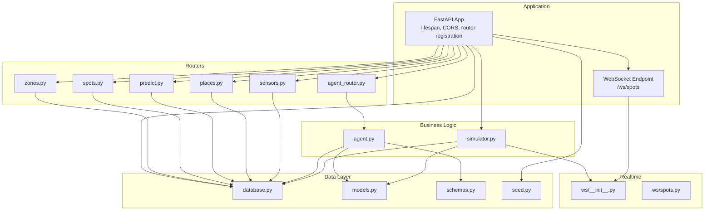
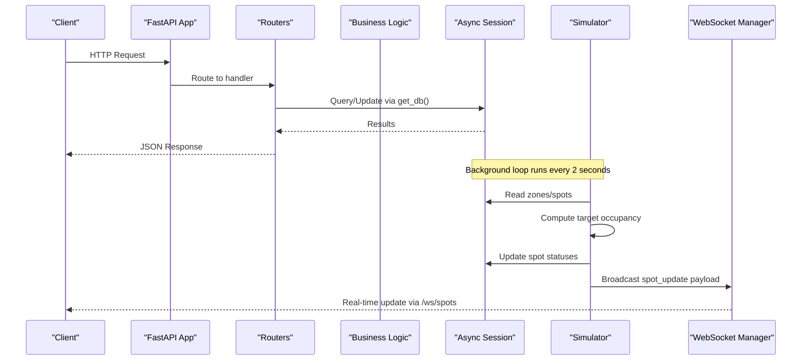
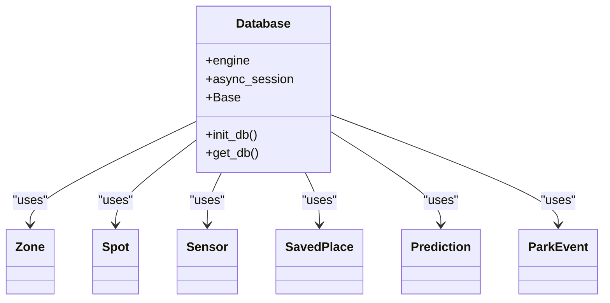
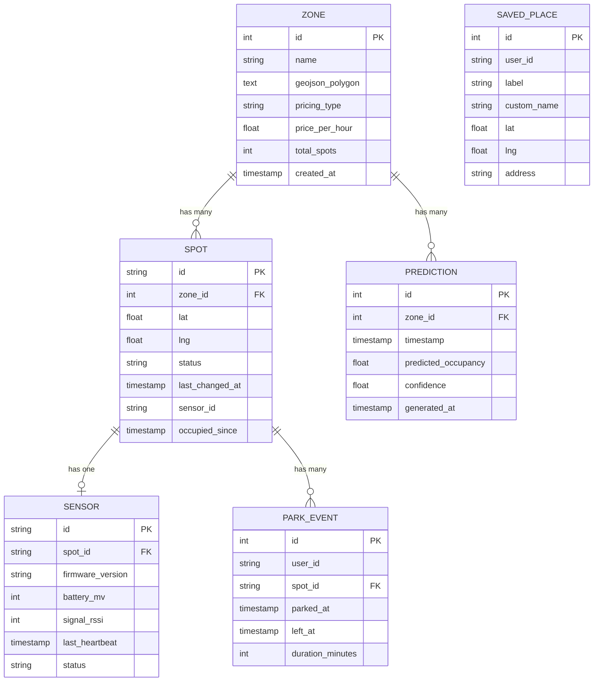
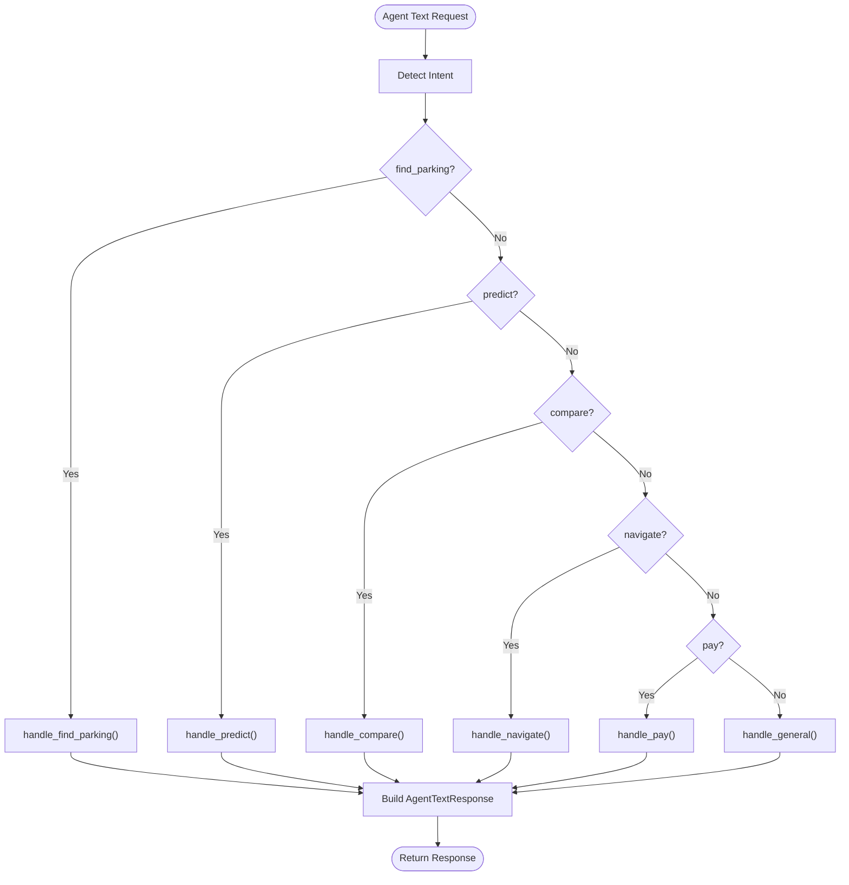
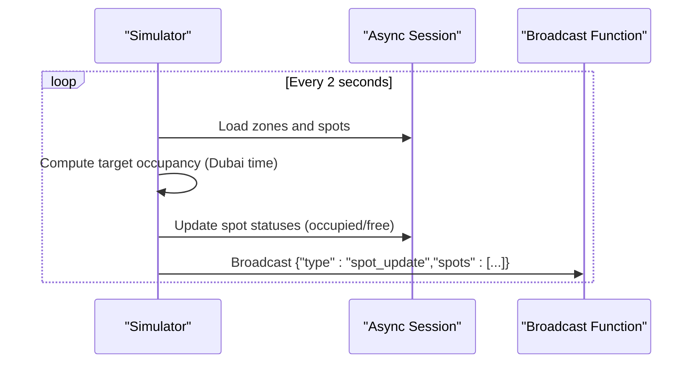
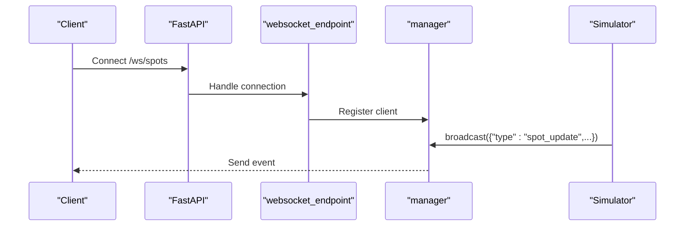
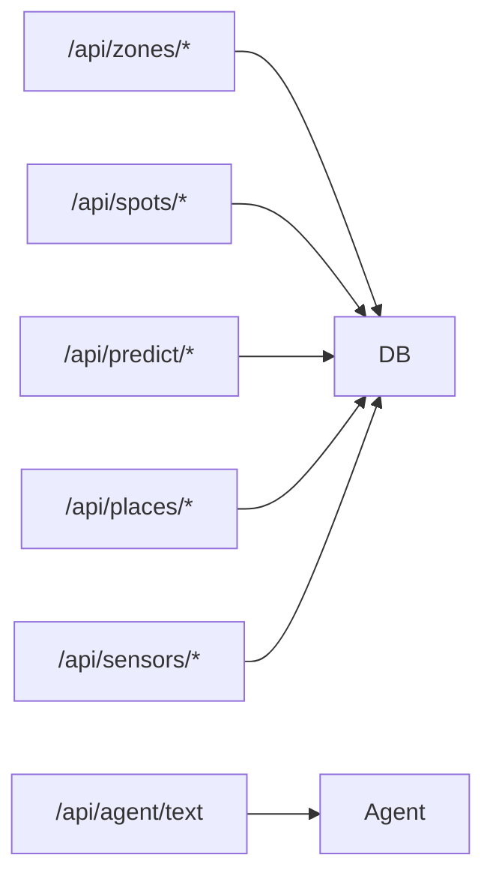
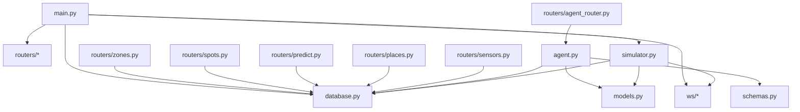

# Backend Architecture

<cite>
**Referenced Files in This Document**
- [main.py](file://backend/main.py)
- [database.py](file://backend/database.py)
- [models.py](file://backend/models.py)
- [schemas.py](file://backend/schemas.py)
- [agent.py](file://backend/agent.py)
- [simulator.py](file://backend/simulator.py)
- [seed.py](file://backend/seed.py)
- [ws/__init__.py](file://backend/ws/__init__.py)
- [ws/spots.py](file://backend/ws/spots.py)
- [routers/zones.py](file://backend/routers/zones.py)
- [routers/spots.py](file://backend/routers/spots.py)
- [routers/predict.py](file://backend/routers/predict.py)
- [routers/agent_router.py](file://backend/routers/agent_router.py)
- [routers/places.py](file://backend/routers/places.py)
- [routers/sensors.py](file://backend/routers/sensors.py)
</cite>

## Table of Contents
1. Introduction
2. Project Structure
3. Core Components
4. Architecture Overview
5. Detailed Component Analysis
6. Dependency Analysis
7. Performance Considerations
8. Troubleshooting Guide
9. Conclusion

## Introduction
This document describes the SmartPark AI backend architecture, a FastAPI-based system that provides REST APIs for parking zones, spots, sensors, predictions, saved places, and an AI agent interface. It also covers real-time spot updates via WebSocket, an async SQLAlchemy database layer, and a simulation engine that drives realistic parking scenarios. The design emphasizes clear separation of concerns across routers (HTTP endpoints), models (ORM entities), schemas (Pydantic I/O), and business logic (agent processing and simulation).

## Project Structure
The backend is organized by feature with dedicated routers, shared data definitions, and cross-cutting concerns:
- Application bootstrap and middleware configuration
- Database initialization and session management
- ORM models and Pydantic schemas
- Feature routers for HTTP endpoints
- Agent processing module for natural language intents
- Simulation engine for time-driven scenario generation
- WebSocket endpoint and connection manager

**Diagram sources**
- [main.py:13-58](file://backend/main.py#L13-L58)
- [database.py:1-23](file://backend/database.py#L1-L23)
- [models.py:1-89](file://backend/models.py#L1-L89)
- [schemas.py:1-127](file://backend/schemas.py#L1-L127)
- [agent.py:1-261](file://backend/agent.py#L1-L261)
- [simulator.py:1-105](file://backend/simulator.py#L1-L105)
- [seed.py:1-198](file://backend/seed.py#L1-L198)
- [ws/__init__.py](file://backend/ws/__init__.py)
- [ws/spots.py:1-4](file://backend/ws/spots.py#L1-L4)
- [routers/zones.py:1-124](file://backend/routers/zones.py#L1-L124)
- [routers/spots.py:1-42](file://backend/routers/spots.py#L1-L42)
- [routers/predict.py:1-39](file://backend/routers/predict.py#L1-L39)
- [routers/agent_router.py:1-12](file://backend/routers/agent_router.py#L1-L12)
- [routers/places.py:1-49](file://backend/routers/places.py#L1-L49)
- [routers/sensors.py:1-28](file://backend/routers/sensors.py#L1-L28)

**Section sources**
- [main.py:13-58](file://backend/main.py#L13-L58)
- [database.py:1-23](file://backend/database.py#L1-L23)
- [models.py:1-89](file://backend/models.py#L1-L89)
- [schemas.py:1-127](file://backend/schemas.py#L1-L127)
- [agent.py:1-261](file://backend/agent.py#L1-L261)
- [simulator.py:1-105](file://backend/simulator.py#L1-L105)
- [seed.py:1-198](file://backend/seed.py#L1-L198)
- [ws/__init__.py](file://backend/ws/__init__.py)
- [ws/spots.py:1-4](file://backend/ws/spots.py#L1-L4)
- [routers/zones.py:1-124](file://backend/routers/zones.py#L1-L124)
- [routers/spots.py:1-42](file://backend/routers/spots.py#L1-L42)
- [routers/predict.py:1-39](file://backend/routers/predict.py#L1-L39)
- [routers/agent_router.py:1-12](file://backend/routers/agent_router.py#L1-L12)
- [routers/places.py:1-49](file://backend/routers/places.py#L1-L49)
- [routers/sensors.py:1-28](file://backend/routers/sensors.py#L1-L28)

## Core Components
- Application bootstrap and lifecycle:
  - Initializes the database, seeds demo data, starts the simulator background task, and registers CORS and routers.
  - Exposes a root health endpoint and a WebSocket endpoint for spot updates.
- Database layer:
  - Async SQLAlchemy engine and session factory configured with environment-based URL.
  - Base declarative model class and dependency injection helper for per-request sessions.
- Data models and schemas:
  - ORM entities for zones, spots, sensors, saved places, predictions, and park events.
  - Pydantic response/request models for API contracts.
- Business logic:
  - Agent processing with intent detection and handlers for parking search, prediction, comparison, navigation, and payment flows.
  - Simulation engine that adjusts spot statuses toward time-of-day occupancy targets and broadcasts changes via WebSocket.
- Routers:
  - REST endpoints for zones, spots, predictions, agents, places, and sensors.

**Section sources**
- [main.py:13-58](file://backend/main.py#L13-L58)
- [database.py:1-23](file://backend/database.py#L1-L23)
- [models.py:1-89](file://backend/models.py#L1-L89)
- [schemas.py:1-127](file://backend/schemas.py#L1-L127)
- [agent.py:1-261](file://backend/agent.py#L1-L261)
- [simulator.py:1-105](file://backend/simulator.py#L1-L105)
- [routers/zones.py:1-124](file://backend/routers/zones.py#L1-L124)
- [routers/spots.py:1-42](file://backend/routers/spots.py#L1-L42)
- [routers/predict.py:1-39](file://backend/routers/predict.py#L1-L39)
- [routers/agent_router.py:1-12](file://backend/routers/agent_router.py#L1-L12)
- [routers/places.py:1-49](file://backend/routers/places.py#L1-L49)
- [routers/sensors.py:1-28](file://backend/routers/sensors.py#L1-L28)

## Architecture Overview
The system follows a layered microservice-style structure within a single FastAPI process:
- HTTP layer: Routers define REST endpoints and depend on injected database sessions.
- Business layer: Agent and simulation modules implement domain logic and orchestrate data access.
- Data layer: Async SQLAlchemy manages connections and sessions; models represent persistent entities.
- Realtime layer: A WebSocket endpoint pushes spot updates generated by the simulator.

**Diagram sources**
- [main.py:13-58](file://backend/main.py#L13-L58)
- [database.py:1-23](file://backend/database.py#L1-L23)
- [simulator.py:91-105](file://backend/simulator.py#L91-L105)
- [ws/__init__.py](file://backend/ws/__init__.py)

## Detailed Component Analysis

### Application Initialization and Middleware
- Lifespan context:
  - On startup: initializes DB schema, seeds demo data, and launches the simulator background task.
  - On shutdown: cancels the simulator task gracefully.
- Middleware:
  - CORS enabled for all origins, methods, and headers (suitable for development/demo).
- Router registration:
  - Zones, spots, predict, agent, places, and sensors routers are included under their respective prefixes.
- WebSocket:
  - Endpoint mounted at /ws/spots using the application’s lifespan-managed broadcast function.

**Section sources**
- [main.py:13-58](file://backend/main.py#L13-L58)

### Database Layer Design (Async SQLAlchemy)
- Engine and session:
  - Asynchronous engine created from DATABASE_URL (defaults to SQLite with aiosqlite).
  - Session factory configured with expire_on_commit=False to avoid refresh overhead.
- Base model:
  - Declarative base used by all ORM entities.
- Initialization:
  - Creates tables on startup using metadata.create_all.
- Dependency injection:
  - get_db yields a scoped AsyncSession per request, ensuring proper resource cleanup.

**Diagram sources**
- [database.py:1-23](file://backend/database.py#L1-L23)
- [models.py:1-89](file://backend/models.py#L1-L89)

**Section sources**
- [database.py:1-23](file://backend/database.py#L1-L23)

### Data Models and Relationships
- Entities:
  - Zone: parking zone with pricing and geometry fields; relationships to spots and predictions.
  - Spot: individual parking space linked to a zone and optional sensor; tracks status and timestamps.
  - Sensor: device attached to a spot with telemetry fields.
  - SavedPlace: user-saved locations for agent reference resolution.
  - Prediction: time-series occupancy forecasts per zone.
  - ParkEvent: audit trail of parking sessions.
- Relationships:
  - Zone has many Spots and Predictions.
  - Spot belongs to a Zone and optionally a Sensor; has many ParkEvents.

**Diagram sources**
- [models.py:1-89](file://backend/models.py#L1-L89)

**Section sources**
- [models.py:1-89](file://backend/models.py#L1-L89)

### API Schemas (Pydantic)
- Input/output contracts for zones, spots, sensors, predictions, agent requests/responses, and saved places.
- Consistent use of from_attributes to map ORM instances to response models.

**Section sources**
- [schemas.py:1-127](file://backend/schemas.py#L1-L127)

### Agent System Architecture
- Intent detection:
  - Pattern-based classifier maps free-form text to intents such as find_parking, predict, compare, navigate, pay, or general.
- Handlers:
  - Each intent has a dedicated async handler that queries zones, spots, saved places, and predictions to produce a natural-language response and optional structured guidance (e.g., MapCard).
- Entry point:
  - process_agent_request orchestrates intent routing and session usage.

**Diagram sources**
- [agent.py:24-261](file://backend/agent.py#L24-L261)

**Section sources**
- [agent.py:1-261](file://backend/agent.py#L1-L261)
- [routers/agent_router.py:1-12](file://backend/routers/agent_router.py#L1-L12)

### Simulation Engine Design
- Time-of-day profiles:
  - Occupancy targets vary by Dubai local time windows.
- Tick loop:
  - Every 2 seconds, computes current vs target occupancy and probabilistically flips spot statuses to converge toward the target.
- Persistence and broadcasting:
  - Updates are committed to the database and emitted as WebSocket messages containing changed spots.

**Diagram sources**
- [simulator.py:24-105](file://backend/simulator.py#L24-L105)

**Section sources**
- [simulator.py:1-105](file://backend/simulator.py#L1-L105)

### WebSocket Implementation
- Endpoint:
  - Mounted at /ws/spots and managed by the app’s lifespan.
- Connection management:
  - The ws package exposes a manager and endpoint; the simulator uses the manager’s broadcast function to push updates.
- Typical flow:
  - Clients connect to /ws/spots and receive spot_update events whenever the simulation modifies spot states.

**Diagram sources**
- [main.py:57-58](file://backend/main.py#L57-L58)
- [ws/spots.py:1-4](file://backend/ws/spots.py#L1-L4)
- [simulator.py:91-105](file://backend/simulator.py#L91-L105)

**Section sources**
- [main.py:57-58](file://backend/main.py#L57-L58)
- [ws/__init__.py](file://backend/ws/__init__.py)
- [ws/spots.py:1-4](file://backend/ws/spots.py#L1-L4)

### Routers and Endpoints
- Zones:
  - List all zones with computed counts; list nearby zones by distance; retrieve zone detail including spots.
- Spots:
  - Retrieve a spot with associated sensor details.
- Predictions:
  - Return next 12 hours of predictions for a zone at 15-minute intervals.
- Agent:
  - POST /api/agent/text processes natural language input through the agent pipeline.
- Places:
  - CRUD for saved places for the demo user.
- Sensors:
  - Fleet health summary aggregating online/offline and low-battery counts.

**Diagram sources**
- [routers/zones.py:1-124](file://backend/routers/zones.py#L1-L124)
- [routers/spots.py:1-42](file://backend/routers/spots.py#L1-L42)
- [routers/predict.py:1-39](file://backend/routers/predict.py#L1-L39)
- [routers/agent_router.py:1-12](file://backend/routers/agent_router.py#L1-L12)
- [routers/places.py:1-49](file://backend/routers/places.py#L1-L49)
- [routers/sensors.py:1-28](file://backend/routers/sensors.py#L1-L28)

**Section sources**
- [routers/zones.py:1-124](file://backend/routers/zones.py#L1-L124)
- [routers/spots.py:1-42](file://backend/routers/spots.py#L1-L42)
- [routers/predict.py:1-39](file://backend/routers/predict.py#L1-L39)
- [routers/agent_router.py:1-12](file://backend/routers/agent_router.py#L1-L12)
- [routers/places.py:1-49](file://backend/routers/places.py#L1-L49)
- [routers/sensors.py:1-28](file://backend/routers/sensors.py#L1-L28)

### Database Seeding
- Purpose:
  - Populate demo data (zones, spots, sensors, saved places, predictions) if the database is empty.
- Behavior:
  - Generates coordinates and initial statuses deterministically with randomness for realism.
  - Produces 12 hours of predictions at 15-minute intervals aligned with Dubai time.

**Section sources**
- [seed.py:1-198](file://backend/seed.py#L1-L198)

## Dependency Analysis
- Coupling:
  - Routers depend on database sessions and models; they do not import each other, maintaining cohesion.
  - Agent depends on models and schemas but remains decoupled from HTTP concerns.
  - Simulator depends on models and database sessions and communicates with clients via the WebSocket manager.
- External integrations:
  - Database driver determined by DATABASE_URL (default SQLite+aiosqlite).
  - No external services are invoked directly in the analyzed code.

**Diagram sources**
- [main.py:13-58](file://backend/main.py#L13-L58)
- [database.py:1-23](file://backend/database.py#L1-L23)
- [models.py:1-89](file://backend/models.py#L1-L89)
- [schemas.py:1-127](file://backend/schemas.py#L1-L127)
- [agent.py:1-261](file://backend/agent.py#L1-L261)
- [simulator.py:1-105](file://backend/simulator.py#L1-L105)
- [ws/__init__.py](file://backend/ws/__init__.py)
- [routers/zones.py:1-124](file://backend/routers/zones.py#L1-L124)
- [routers/spots.py:1-42](file://backend/routers/spots.py#L1-L42)
- [routers/predict.py:1-39](file://backend/routers/predict.py#L1-L39)
- [routers/agent_router.py:1-12](file://backend/routers/agent_router.py#L1-L12)
- [routers/places.py:1-49](file://backend/routers/places.py#L1-L49)
- [routers/sensors.py:1-28](file://backend/routers/sensors.py#L1-L28)

**Section sources**
- [main.py:13-58](file://backend/main.py#L13-L58)
- [database.py:1-23](file://backend/database.py#L1-L23)
- [models.py:1-89](file://backend/models.py#L1-L89)
- [schemas.py:1-127](file://backend/schemas.py#L1-L127)
- [agent.py:1-261](file://backend/agent.py#L1-L261)
- [simulator.py:1-105](file://backend/simulator.py#L1-L105)
- [ws/__init__.py](file://backend/ws/__init__.py)
- [routers/zones.py:1-124](file://backend/routers/zones.py#L1-L124)
- [routers/spots.py:1-42](file://backend/routers/spots.py#L1-L42)
- [routers/predict.py:1-39](file://backend/routers/predict.py#L1-L39)
- [routers/agent_router.py:1-12](file://backend/routers/agent_router.py#L1-L12)
- [routers/places.py:1-49](file://backend/routers/places.py#L1-L49)
- [routers/sensors.py:1-28](file://backend/routers/sensors.py#L1-L28)

## Performance Considerations
- Database:
  - Use an appropriate async driver for production (e.g., PostgreSQL with asyncpg) by setting DATABASE_URL.
  - Keep expire_on_commit=False to reduce unnecessary refreshes.
  - Consider indexing frequently filtered columns (e.g., zone_id, timestamp) when scaling.
- Queries:
  - Avoid N+1 patterns by leveraging eager loading where needed (relationships already specify selectin in some cases).
  - For large datasets, paginate results and limit returned fields.
- Simulation:
  - The 2-second tick interval balances responsiveness and load; tune based on workload.
  - Batch updates and minimize round-trips by committing once per tick.
- WebSocket:
  - Ensure the broadcast function scales with many clients; consider fan-out strategies if needed.
- CORS:
  - Restrict allow_origins in production to known domains.

[No sources needed since this section provides general guidance]

## Troubleshooting Guide
- Common issues:
  - Database connectivity: verify DATABASE_URL and ensure the async driver matches the dialect.
  - Missing tables: confirm init_db runs during startup and creates all models.
  - Seeder skipped: if data exists, seed_database exits early; reinitialize the database to re-seed.
  - WebSocket not receiving updates: check that the simulator is running and the broadcast function is wired correctly.
- Error handling:
  - Routers raise HTTPException for not-found resources.
  - Simulator catches exceptions and continues its loop.

**Section sources**
- [database.py:15-18](file://backend/database.py#L15-L18)
- [seed.py:126-133](file://backend/seed.py#L126-L133)
- [simulator.py:102-104](file://backend/simulator.py#L102-L104)
- [routers/zones.py:94-95](file://backend/routers/zones.py#L94-L95)
- [routers/spots.py:16-17](file://backend/routers/spots.py#L16-L17)
- [routers/predict.py:18-19](file://backend/routers/predict.py#L18-L19)
- [routers/places.py:45-46](file://backend/routers/places.py#L45-L46)

## Conclusion
The SmartPark AI backend implements a clean, modular FastAPI architecture with clear separation between HTTP routes, business logic, data models, and real-time communication. The async SQLAlchemy layer supports efficient concurrent operations, while the simulation engine drives realistic, time-aware scenarios. The agent subsystem provides a flexible, pattern-based NLU pipeline that can be extended with more sophisticated models. With careful attention to database configuration, query optimization, and scalable WebSocket broadcasting, the system can evolve into a robust production service.