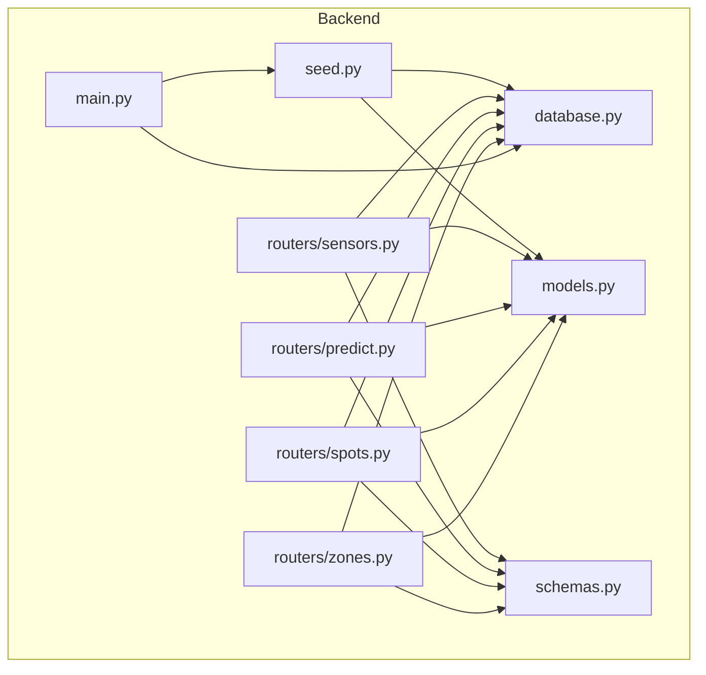
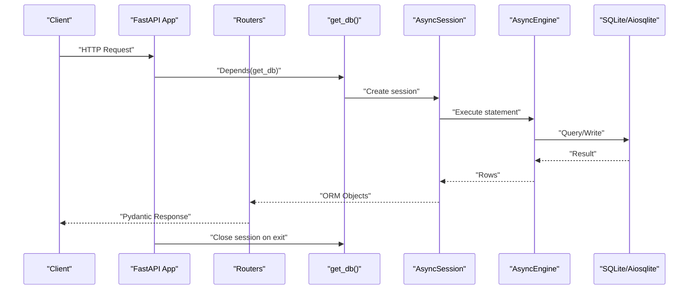
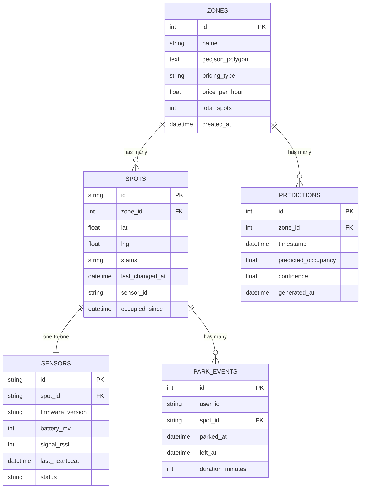
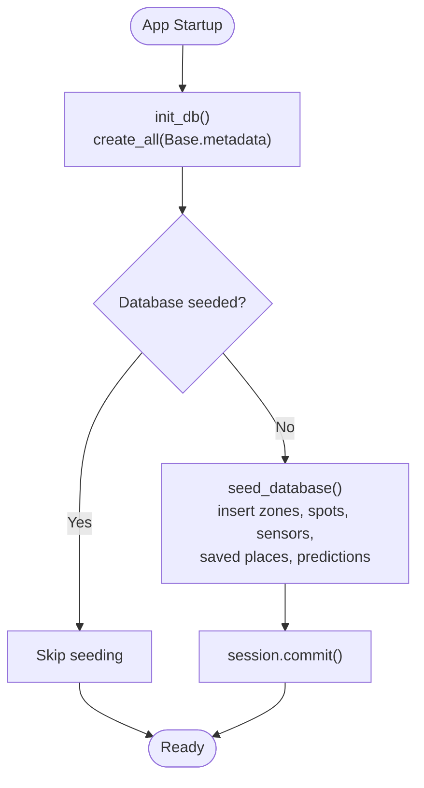
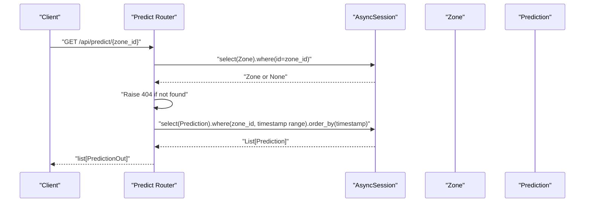
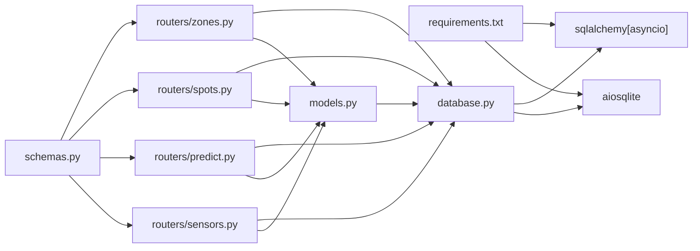

# Database Layer

<cite>
**Referenced Files in This Document**
- [database.py](file://backend/database.py)
- [models.py](file://backend/models.py)
- [schemas.py](file://backend/schemas.py)
- [main.py](file://backend/main.py)
- [zones.py](file://backend/routers/zones.py)
- [spots.py](file://backend/routers/spots.py)
- [predict.py](file://backend/routers/predict.py)
- [sensors.py](file://backend/routers/sensors.py)
- [seed.py](file://backend/seed.py)
- [requirements.txt](file://backend/requirements.txt)
</cite>

## Table of Contents
1. [Introduction](#introduction)
2. [Project Structure](#project-structure)
3. [Core Components](#core-components)
4. [Architecture Overview](#architecture-overview)
5. [Detailed Component Analysis](#detailed-component-analysis)
6. [Dependency Analysis](#dependency-analysis)
7. [Performance Considerations](#performance-considerations)
8. [Troubleshooting Guide](#troubleshooting-guide)
9. [Conclusion](#conclusion)
10. [Appendices](#appendices)

## Introduction
This document describes the SQLAlchemy-based database layer for the SmartPark AI backend. It covers async engine configuration, connection pooling settings, session management via dependency injection, ORM model relationships and base inheritance, Pydantic schemas for request/response validation and serialization, migration strategy, indexing approach, query optimization techniques, and examples of complex queries, relationship navigation, and transaction patterns used across the application.

## Project Structure
The database layer is implemented under the backend package with clear separation between infrastructure (engine/session), domain models, API schemas, and usage within FastAPI routers. The application initializes the database at startup and seeds demo data.

**Diagram sources**
- [main.py:13-31](file://backend/main.py#L13-L31)
- [database.py:1-23](file://backend/database.py#L1-L23)
- [models.py:1-89](file://backend/models.py#L1-L89)
- [schemas.py:1-127](file://backend/schemas.py#L1-L127)
- [zones.py:1-124](file://backend/routers/zones.py#L1-L124)
- [spots.py:1-42](file://backend/routers/spots.py#L1-L42)
- [predict.py:1-39](file://backend/routers/predict.py#L1-L39)
- [sensors.py:1-28](file://backend/routers/sensors.py#L1-L28)
- [seed.py:1-198](file://backend/seed.py#L1-L198)

**Section sources**
- [main.py:13-31](file://backend/main.py#L13-L31)
- [database.py:1-23](file://backend/database.py#L1-L23)
- [models.py:1-89](file://backend/models.py#L1-L89)
- [schemas.py:1-127](file://backend/schemas.py#L1-L127)
- [zones.py:1-124](file://backend/routers/zones.py#L1-L124)
- [spots.py:1-42](file://backend/routers/spots.py#L1-L42)
- [predict.py:1-39](file://backend/routers/predict.py#L1-L39)
- [sensors.py:1-28](file://backend/routers/sensors.py#L1-L28)
- [seed.py:1-198](file://backend/seed.py#L1-L198)

## Core Components
- Async engine and session factory are defined centrally and reused by all routers.
- Declarative base class provides a common foundation for all ORM entities.
- Dependency injection supplies an AsyncSession per request using a FastAPI Depends generator.
- Pydantic schemas define input/output contracts and enable automatic serialization from ORM objects.

Key responsibilities:
- Engine lifecycle and initialization
- Session scoping and disposal
- Model definitions and relationships
- Schema validation and response shaping

**Section sources**
- [database.py:1-23](file://backend/database.py#L1-L23)
- [models.py:1-89](file://backend/models.py#L1-L89)
- [schemas.py:1-127](file://backend/schemas.py#L1-L127)
- [zones.py:1-124](file://backend/routers/zones.py#L1-L124)
- [spots.py:1-42](file://backend/routers/spots.py#L1-L42)
- [predict.py:1-39](file://backend/routers/predict.py#L1-L39)
- [sensors.py:1-28](file://backend/routers/sensors.py#L1-L28)

## Architecture Overview
The application uses FastAPI’s lifespan to initialize the database and seed data once at startup. Each HTTP request receives an AsyncSession via dependency injection. Routers execute SQLAlchemy Core/ORM statements against the session and return Pydantic models.

**Diagram sources**
- [main.py:13-31](file://backend/main.py#L13-L31)
- [database.py:15-23](file://backend/database.py#L15-L23)
- [zones.py:22-60](file://backend/routers/zones.py#L22-L60)
- [spots.py:11-42](file://backend/routers/spots.py#L11-L42)
- [predict.py:12-39](file://backend/routers/predict.py#L12-L39)
- [sensors.py:11-28](file://backend/routers/sensors.py#L11-L28)

## Detailed Component Analysis

### Async Engine Configuration and Connection Pooling
- Engine creation uses an async driver configured via environment variable DATABASE_URL; defaults to SQLite with aiosqlite.
- No explicit pool size or timeout parameters are set; default values apply based on the selected dialect/driver.
- echo is disabled for production-like behavior.
- expire_on_commit=False is configured on the sessionmaker to avoid unnecessary refreshes after commit.

Recommendations for production:
- Set explicit pool_size, max_overflow, and pool_recycle when using PostgreSQL/MySQL async drivers.
- Configure connect_args for SSL/TLS and timeouts where applicable.
- Use a dedicated DATABASE_URL per environment.

**Section sources**
- [database.py:5-8](file://backend/database.py#L5-L8)
- [requirements.txt:3-4](file://backend/requirements.txt#L3-L4)

### Session Management and Dependency Injection
- get_db is an async generator that yields an AsyncSession scoped to the request lifecycle.
- FastAPI automatically closes the session after each request.
- expire_on_commit=False reduces redundant SELECTs for attributes accessed post-commit.

Usage pattern:
- Routers declare db: AsyncSession = Depends(get_db).
- All reads/writes use await db.execute(select(...)) and result.scalars().all() or scalar_one_or_none().

**Section sources**
- [database.py:20-23](file://backend/database.py#L20-L23)
- [zones.py:27-31](file://backend/routers/zones.py#L27-L31)
- [spots.py:12-17](file://backend/routers/spots.py#L12-L17)
- [predict.py:13-19](file://backend/routers/predict.py#L13-L19)
- [sensors.py:12-15](file://backend/routers/sensors.py#L12-L15)

### Base Model Inheritance and Common Fields
- All entities inherit from a single DeclarativeBase subclass named Base.
- Common timestamp fields use UTC-aware defaults via datetime.now(timezone.utc).
- Primary keys vary by entity: integer autoincrement for some, string identifiers for others.

Common field patterns:
- id: primary key (integer or string)
- created_at / last_changed_at / last_heartbeat: timestamps with UTC defaults
- status: small enum-like strings
- zone_id / spot_id: foreign keys linking related entities

**Section sources**
- [database.py:11-12](file://backend/database.py#L11-L12)
- [models.py:10-17](file://backend/models.py#L10-L17)
- [models.py:25-36](file://backend/models.py#L25-L36)
- [models.py:42-50](file://backend/models.py#L42-L50)
- [models.py:65-76](file://backend/models.py#L65-L76)

### ORM Relationships, Foreign Keys, Backreferences, and Cascades
Relationships are defined using back_populates for bidirectional access. Lazy loading is explicitly set to selectin for frequently traversed relationships.

- Zone ↔ Spot: one-to-many
  - Zone.spots references Spot.zone_id
  - Spot.zone back_populates to Zone
- Spot ↔ Sensor: one-to-one
  - Spot.sensor references Sensor.spot_id
  - Sensor.spot back_populates to Spot
  - uselist=False enforces one-to-one semantics
- Spot ↔ ParkEvent: one-to-many
  - Spot.park_events references ParkEvent.spot_id
  - ParkEvent.spot back_populates to Spot
- Zone ↔ Prediction: one-to-many
  - Zone.predictions references Prediction.zone_id
  - Prediction.zone back_populates to Zone

Cascade operations:
- No explicit cascade options are configured on relationships. Deletes will be constrained by foreign keys unless ON DELETE rules are defined at the database level.

**Diagram sources**
- [models.py:7-20](file://backend/models.py#L7-L20)
- [models.py:22-37](file://backend/models.py#L22-L37)
- [models.py:39-51](file://backend/models.py#L39-L51)
- [models.py:65-76](file://backend/models.py#L65-L76)
- [models.py:78-89](file://backend/models.py#L78-L89)

**Section sources**
- [models.py:7-20](file://backend/models.py#L7-L20)
- [models.py:22-37](file://backend/models.py#L22-L37)
- [models.py:39-51](file://backend/models.py#L39-L51)
- [models.py:65-76](file://backend/models.py#L65-L76)
- [models.py:78-89](file://backend/models.py#L78-L89)

### Pydantic Schemas for Validation and Serialization
Schemas define strict contracts for requests and responses and map ORM objects to JSON-friendly structures.

- Output schemas include from_attributes=True to serialize ORM instances directly.
- Nested output models compose relationships into flat payloads:
  - ZoneDetailOut includes a list of SpotOut
  - SpotDetailOut optionally includes SensorOut
- Request schemas validate inputs such as AgentTextRequest and SavedPlaceCreate.

Examples of schema usage:
- GET /api/zones returns list[ZoneOut]
- GET /api/zones/{id} returns ZoneDetailOut
- GET /api/spots/{spot_id} returns SpotDetailOut
- GET /api/predict/{zone_id} returns list[PredictionOut]
- GET /api/sensors returns SensorFleetSummary

**Section sources**
- [schemas.py:7-42](file://backend/schemas.py#L7-L42)
- [schemas.py:44-71](file://backend/schemas.py#L44-L71)
- [schemas.py:73-81](file://backend/schemas.py#L73-L81)
- [schemas.py:83-105](file://backend/schemas.py#L83-L105)
- [schemas.py:107-127](file://backend/schemas.py#L107-L127)
- [zones.py:22-60](file://backend/routers/zones.py#L22-L60)
- [spots.py:11-42](file://backend/routers/spots.py#L11-L42)
- [predict.py:12-39](file://backend/routers/predict.py#L12-L39)
- [sensors.py:11-28](file://backend/routers/sensors.py#L11-L28)

### Database Initialization and Seeding Strategy
- Application lifespan calls init_db() to create tables if missing.
- seed_database() populates demo zones, spots, sensors, saved places, and predictions if the database is empty.
- Seeding uses async_session context manager and commits once after bulk inserts.

**Diagram sources**
- [main.py:13-31](file://backend/main.py#L13-L31)
- [database.py:15-18](file://backend/database.py#L15-L18)
- [seed.py:126-198](file://backend/seed.py#L126-L198)

**Section sources**
- [main.py:13-31](file://backend/main.py#L13-L31)
- [database.py:15-18](file://backend/database.py#L15-L18)
- [seed.py:126-198](file://backend/seed.py#L126-L198)

### Query Patterns and Examples
- Simple reads: select(Zone), select(Spot), select(Prediction), select(Sensor)
- Filtering and ordering: time-bounded prediction queries with order_by(timestamp)
- Relationship traversal: accessing zone.spots, spot.sensor, zone.predictions
- Aggregation in Python: counting free/occupied/reserved statuses after fetching rows

Complex query example (prediction retrieval):
- Validates zone existence
- Computes time window
- Executes filtered and ordered query
- Maps results to PredictionOut

**Diagram sources**
- [predict.py:12-39](file://backend/routers/predict.py#L12-L39)

**Section sources**
- [zones.py:22-60](file://backend/routers/zones.py#L22-L60)
- [spots.py:11-42](file://backend/routers/spots.py#L11-L42)
- [predict.py:12-39](file://backend/routers/predict.py#L12-L39)
- [sensors.py:11-28](file://backend/routers/sensors.py#L11-L28)

### Transaction Management Patterns
- Read-only endpoints rely on implicit transactions opened by the session and closed after the request.
- Write operations should wrap multiple changes in a single session scope and call commit explicitly.
- The seeding script demonstrates a write transaction pattern: add multiple objects, flush to obtain IDs, then commit once.

Best practices:
- Keep sessions short-lived (per-request).
- Avoid long-running transactions.
- Use flush only when you need generated IDs before committing.

**Section sources**
- [seed.py:126-198](file://backend/seed.py#L126-L198)
- [database.py:20-23](file://backend/database.py#L20-L23)

## Dependency Analysis
The database layer depends on SQLAlchemy async components and aiosqlite by default. Routers depend on the shared database module and models. Schemas are independent but consumed by routers for I/O.

**Diagram sources**
- [requirements.txt:1-8](file://backend/requirements.txt#L1-L8)
- [database.py:1-8](file://backend/database.py#L1-L8)
- [models.py:1-89](file://backend/models.py#L1-L89)
- [zones.py:1-124](file://backend/routers/zones.py#L1-L124)
- [spots.py:1-42](file://backend/routers/spots.py#L1-L42)
- [predict.py:1-39](file://backend/routers/predict.py#L1-L39)
- [sensors.py:1-28](file://backend/routers/sensors.py#L1-L28)
- [schemas.py:1-127](file://backend/schemas.py#L1-L127)

**Section sources**
- [requirements.txt:1-8](file://backend/requirements.txt#L1-L8)
- [database.py:1-8](file://backend/database.py#L1-L8)
- [models.py:1-89](file://backend/models.py#L1-L89)
- [zones.py:1-124](file://backend/routers/zones.py#L1-L124)
- [spots.py:1-42](file://backend/routers/spots.py#L1-L42)
- [predict.py:1-39](file://backend/routers/predict.py#L1-L39)
- [sensors.py:1-28](file://backend/routers/sensors.py#L1-L28)
- [schemas.py:1-127](file://backend/schemas.py#L1-L127)

## Performance Considerations
- Eager loading: relationships use lazy="selectin", which can reduce N+1 queries when traversing collections.
- Minimize payload: prefer specific columns and projection where possible.
- Indexing: consider adding indexes on frequently filtered columns (e.g., zone_id, spot_id, timestamp).
- Pagination: implement LIMIT/OFFSET or keyset pagination for large lists.
- Connection pooling: tune pool_size/max_overflow/recycle for high-concurrency workloads.
- Time windows: restrict date ranges in queries to reduce row counts.

[No sources needed since this section provides general guidance]

## Troubleshooting Guide
- Missing dependencies: ensure sqlalchemy[asyncio] and aiosqlite are installed.
- Database URL misconfiguration: verify DATABASE_URL points to the correct driver and path.
- Session errors: confirm get_db is used as a dependency and sessions are not reused across requests.
- Relationship issues: check back_populates consistency and foreign key constraints.
- Seeding conflicts: if data already exists, seeding is skipped intentionally.

**Section sources**
- [requirements.txt:3-4](file://backend/requirements.txt#L3-L4)
- [database.py:5-8](file://backend/database.py#L5-L8)
- [database.py:20-23](file://backend/database.py#L20-L23)
- [models.py:7-20](file://backend/models.py#L7-L20)
- [seed.py:126-134](file://backend/seed.py#L126-L134)

## Conclusion
The database layer is concise and idiomatic: a single async engine and session factory, declarative models with clear relationships, and Pydantic schemas for robust I/O. Routers demonstrate practical query patterns and relationship navigation. For production readiness, focus on explicit connection pooling, migrations, indexing, and pagination strategies.

[No sources needed since this section summarizes without analyzing specific files]

## Appendices

### Migration Strategy
- Current implementation uses create_all at startup for development convenience.
- Recommended approach: adopt Alembic for versioned migrations, generate initial revision from existing models, and apply migrations during deployment.

[No sources needed since this section provides general guidance]

### Indexing Approaches
- Add indexes on foreign keys and filter-heavy columns:
  - zones.id
  - spots.zone_id
  - sensors.spot_id
  - predictions.zone_id, predictions.timestamp
- Consider composite indexes for common query filters (e.g., zone_id + timestamp).

[No sources needed since this section provides general guidance]

### Example Complex Queries
- Nearby zones: compute zone centroids from spots and filter by distance threshold.
- Predictions over time window: filter by zone_id and timestamp range, ordered by timestamp.
- Fleet summary: aggregate sensor statuses and battery levels.

**Section sources**
- [zones.py:22-60](file://backend/routers/zones.py#L22-L60)
- [predict.py:12-39](file://backend/routers/predict.py#L12-L39)
- [sensors.py:11-28](file://backend/routers/sensors.py#L11-L28)