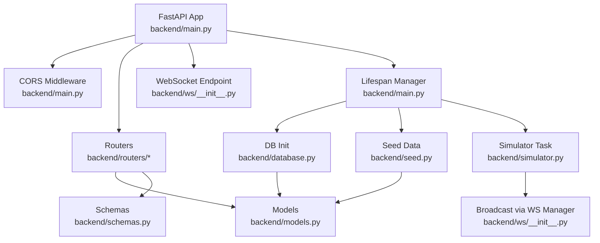
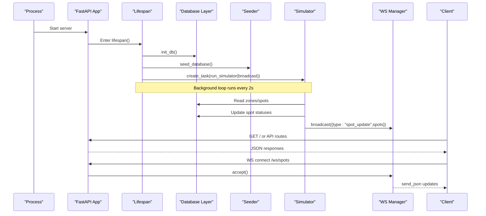
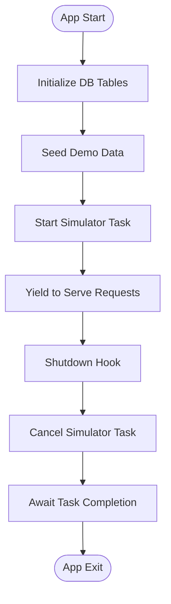
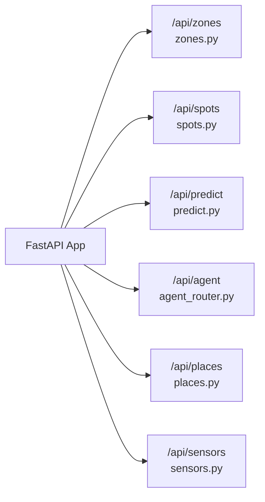
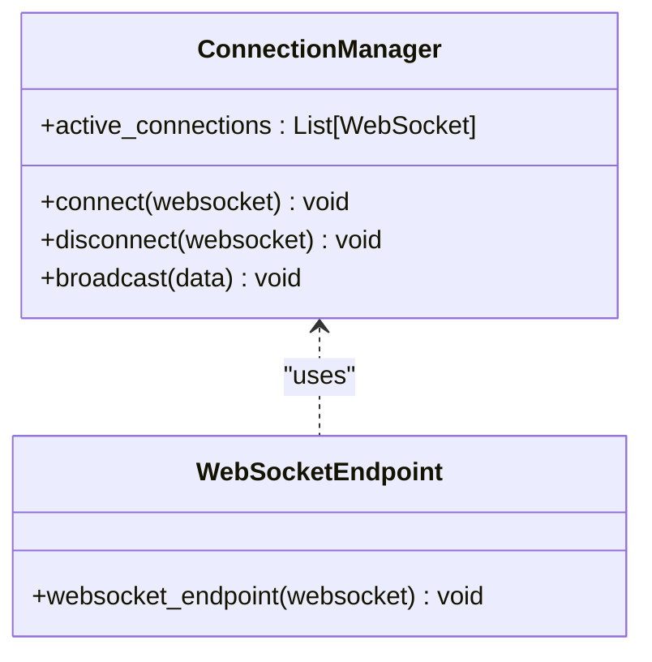
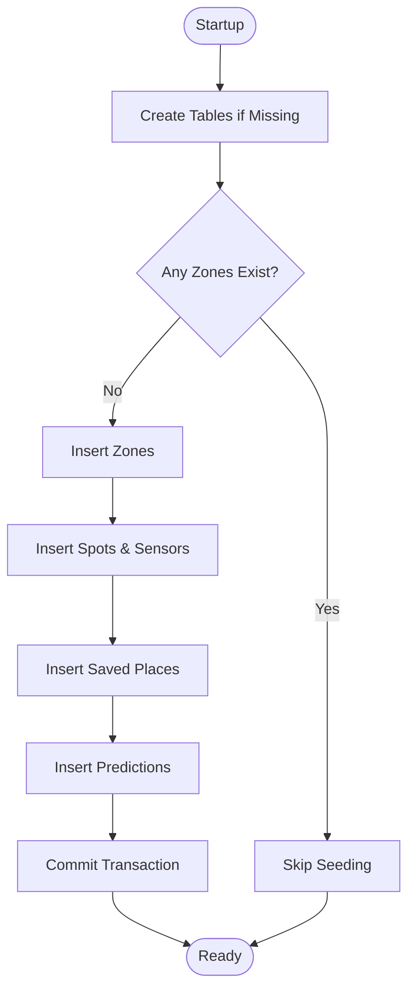
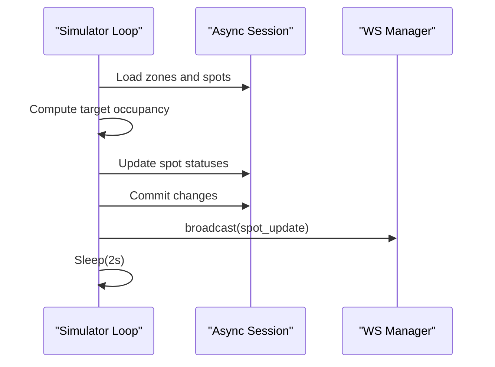
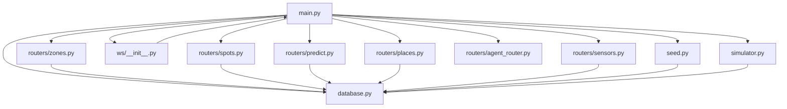

# FastAPI Application Setup

<cite>
**Referenced Files in This Document**
- [main.py](file://backend/main.py)
- [database.py](file://backend/database.py)
- [seed.py](file://backend/seed.py)
- [simulator.py](file://backend/simulator.py)
- [ws/__init__.py](file://backend/ws/__init__.py)
- [ws/spots.py](file://backend/ws/spots.py)
- [routers/zones.py](file://backend/routers/zones.py)
- [routers/spots.py](file://backend/routers/spots.py)
- [routers/predict.py](file://backend/routers/predict.py)
- [routers/agent_router.py](file://backend/routers/agent_router.py)
- [routers/places.py](file://backend/routers/places.py)
- [routers/sensors.py](file://backend/routers/sensors.py)
- [models.py](file://backend/models.py)
- [schemas.py](file://backend/schemas.py)
</cite>

## Table of Contents
1. Introduction
2. Project Structure
3. Core Components
4. Architecture Overview
5. Detailed Component Analysis
6. Dependency Analysis
7. Performance Considerations
8. Troubleshooting Guide
9. Conclusion

## Introduction
This document explains the FastAPI application setup for SmartPark AI, focusing on application initialization, lifespan management with async context managers, CORS middleware configuration, modular router registration, WebSocket endpoint mounting, metadata and root endpoint, error handling strategies, logging configuration, and performance optimization techniques. It also provides guidance for extending the application with additional routers and middleware components.

## Project Structure
The backend is organized around a single FastAPI application entry point that wires together database initialization, data seeding, background simulation, routing, and real-time updates via WebSockets. Routers are grouped by feature (zones, spots, predictions, agent, places, sensors). Models define SQLAlchemy entities, schemas define Pydantic response/request models, and the simulator drives periodic spot status changes broadcasted to connected clients.

**Diagram sources**
- [main.py:13-64](file://backend/main.py#L13-L64)
- [database.py:15-23](file://backend/database.py#L15-L23)
- [seed.py:126-198](file://backend/seed.py#L126-L198)
- [simulator.py:91-105](file://backend/simulator.py#L91-L105)
- [ws/__init__.py:7-49](file://backend/ws/__init__.py#L7-L49)
- [models.py:1-89](file://backend/models.py#L1-L89)
- [schemas.py:1-127](file://backend/schemas.py#L1-L127)

**Section sources**
- [main.py:13-64](file://backend/main.py#L13-L64)
- [database.py:15-23](file://backend/database.py#L15-L23)
- [seed.py:126-198](file://backend/seed.py#L126-L198)
- [simulator.py:91-105](file://backend/simulator.py#L91-L105)
- [ws/__init__.py:7-49](file://backend/ws/__init__.py#L7-L49)
- [models.py:1-89](file://backend/models.py#L1-L89)
- [schemas.py:1-127](file://backend/schemas.py#L1-L127)

## Core Components
- Application Initialization and Lifespan
  - The app defines an async lifespan context manager that initializes the database, seeds demo data, and starts a background simulator task. On shutdown, it cancels the task and awaits its completion.
  - Metadata includes title, description, version, and lifespan assignment.
- CORS Middleware
  - Configured to allow all origins, methods, and headers for development/demo usage. Credentials are allowed.
- Router Registration
  - Feature-based routers are included under /api prefixes: zones, spots, predict, agent, places, sensors.
- WebSocket Endpoint
  - Mounted at /ws/spots using a connection manager that accepts connections, handles ping/pong, and broadcasts spot updates from the simulator.
- Root Endpoint
  - Provides a simple health/status JSON response.

**Section sources**
- [main.py:13-64](file://backend/main.py#L13-L64)
- [ws/__init__.py:7-49](file://backend/ws/__init__.py#L7-L49)

## Architecture Overview
The application follows a layered architecture:
- Entry point configures middleware, lifespan, routes, and WebSocket endpoints.
- Database layer uses SQLAlchemy async engine and session factory.
- Seed script populates initial data if empty.
- Simulator periodically updates spot statuses and pushes changes via WebSocket.
- Routers implement REST endpoints over models and schemas.

**Diagram sources**
- [main.py:13-64](file://backend/main.py#L13-L64)
- [database.py:15-23](file://backend/database.py#L15-L23)
- [seed.py:126-198](file://backend/seed.py#L126-L198)
- [simulator.py:91-105](file://backend/simulator.py#L91-L105)
- [ws/__init__.py:7-49](file://backend/ws/__init__.py#L7-L49)

## Detailed Component Analysis

### Application Initialization and Lifespan Management
- Async lifespan orchestrates startup and shutdown tasks:
  - Startup: initialize DB tables, seed demo data, start simulator background task.
  - Shutdown: cancel simulator task and await cancellation.
- Metadata: title, description, version set on app creation.
- Root endpoint returns a minimal status payload.

**Diagram sources**
- [main.py:13-31](file://backend/main.py#L13-L31)
- [database.py:15-18](file://backend/database.py#L15-L18)
- [seed.py:126-198](file://backend/seed.py#L126-L198)
- [simulator.py:91-105](file://backend/simulator.py#L91-L105)

**Section sources**
- [main.py:13-64](file://backend/main.py#L13-L64)

### CORS Middleware Configuration
- Allows cross-origin requests for development/demo:
  - Origins: wildcard
  - Methods: wildcard
  - Headers: wildcard
  - Credentials: enabled
- For production, restrict origins and methods to known domains and endpoints.

**Section sources**
- [main.py:40-47](file://backend/main.py#L40-L47)

### Router Registration Patterns
- Modular routers are defined per feature and registered with prefixes and tags:
  - Zones: list, nearby search, detail with spot counts
  - Spots: detail including sensor info
  - Predict: time-series occupancy predictions
  - Agent: text-based AI agent request/response
  - Places: CRUD for saved places
  - Sensors: fleet summary metrics
- Each router depends on async DB sessions via dependency injection.

**Diagram sources**
- [main.py:49-55](file://backend/main.py#L49-L55)
- [routers/zones.py:1-124](file://backend/routers/zones.py#L1-L124)
- [routers/spots.py:1-42](file://backend/routers/spots.py#L1-L42)
- [routers/predict.py:1-39](file://backend/routers/predict.py#L1-L39)
- [routers/agent_router.py:1-12](file://backend/routers/agent_router.py#L1-L12)
- [routers/places.py:1-49](file://backend/routers/places.py#L1-L49)
- [routers/sensors.py:1-28](file://backend/routers/sensors.py#L1-L28)

**Section sources**
- [main.py:49-55](file://backend/main.py#L49-L55)
- [routers/zones.py:1-124](file://backend/routers/zones.py#L1-L124)
- [routers/spots.py:1-42](file://backend/routers/spots.py#L1-L42)
- [routers/predict.py:1-39](file://backend/routers/predict.py#L1-L39)
- [routers/agent_router.py:1-12](file://backend/routers/agent_router.py#L1-L12)
- [routers/places.py:1-49](file://backend/routers/places.py#L1-L49)
- [routers/sensors.py:1-28](file://backend/routers/sensors.py#L1-L28)

### WebSocket Endpoint Mounting and Real-Time Updates
- Connection manager maintains active connections, accepts new clients, handles ping/pong, and cleans up disconnected clients.
- Broadcast function sends JSON updates to all connected clients.
- Simulator updates spot statuses and triggers broadcasts.

**Diagram sources**
- [ws/__init__.py:7-49](file://backend/ws/__init__.py#L7-L49)

**Section sources**
- [ws/__init__.py:7-49](file://backend/ws/__init__.py#L7-L49)
- [ws/spots.py:1-4](file://backend/ws/spots.py#L1-L4)
- [simulator.py:91-105](file://backend/simulator.py#L91-L105)

### Database Initialization and Seeding
- Async engine and session factory configured with environment variable or default SQLite path.
- init_db creates tables based on declarative base.
- get_db yields an async session per request.
- seed_database inserts demo zones, spots, sensors, saved places, and predictions if none exist.

**Diagram sources**
- [database.py:15-23](file://backend/database.py#L15-L23)
- [seed.py:126-198](file://backend/seed.py#L126-L198)

**Section sources**
- [database.py:1-23](file://backend/database.py#L1-L23)
- [seed.py:1-198](file://backend/seed.py#L1-L198)

### Background Task Lifecycle (Simulator)
- The simulator computes target occupancy based on Dubai time-of-day profiles and adjusts spot statuses accordingly.
- Changes are persisted and broadcast via WebSocket.
- Runs in a loop with a fixed interval; errors are logged and do not crash the process.

**Diagram sources**
- [simulator.py:36-105](file://backend/simulator.py#L36-L105)
- [ws/__init__.py:21-31](file://backend/ws/__init__.py#L21-L31)

**Section sources**
- [simulator.py:1-105](file://backend/simulator.py#L1-L105)

### Error Handling Strategies
- HTTPException used in routers for 404 cases when resources are not found.
- WebSocket disconnect and exception paths remove stale connections.
- Simulator catches exceptions per tick and continues running.

Recommendations:
- Centralize error handling with a custom exception handler to standardize responses.
- Add structured logging for errors and warnings.

**Section sources**
- [routers/zones.py:89-96](file://backend/routers/zones.py#L89-L96)
- [routers/spots.py:11-18](file://backend/routers/spots.py#L11-L18)
- [routers/predict.py:12-20](file://backend/routers/predict.py#L12-L20)
- [routers/places.py:38-49](file://backend/routers/places.py#L38-L49)
- [ws/__init__.py:36-49](file://backend/ws/__init__.py#L36-L49)
- [simulator.py:102-104](file://backend/simulator.py#L102-L104)

### Logging Configuration
- No explicit logging configuration is present in the analyzed files.
- Recommended approach:
  - Configure Python logging early in lifespan startup.
  - Use structured logs (e.g., JSON) for machine readability.
  - Log key lifecycle events: DB init, seeding, simulator start/stop, WebSocket connect/disconnect, and errors.

**Section sources**
- [main.py:13-31](file://backend/main.py#L13-L31)

### Performance Optimization Techniques
- Asynchronous I/O:
  - Async DB operations via SQLAlchemy async engine and sessions.
  - Non-blocking WebSocket broadcasting.
- Efficient queries:
  - Use selectin relationships to reduce N+1 queries where appropriate.
- Simulation pacing:
  - Fixed sleep interval prevents CPU spikes.
- Response modeling:
  - Pydantic schemas enforce serialization and validation efficiently.

Additional recommendations:
- Enable response compression for large payloads.
- Cache frequently accessed data (e.g., zone summaries) with TTL.
- Tune database pool size and connection settings for expected concurrency.
- Use pagination for large lists (e.g., spots or predictions).

**Section sources**
- [database.py:1-23](file://backend/database.py#L1-L23)
- [models.py:1-89](file://backend/models.py#L1-L89)
- [schemas.py:1-127](file://backend/schemas.py#L1-L127)
- [simulator.py:91-105](file://backend/simulator.py#L91-L105)

### Extending the Application
- Adding a New Router:
  - Create a new module under routers with an APIRouter instance and prefix/tags.
  - Register it in the main app include_router calls.
- Adding Middleware:
  - Insert additional middleware before or after CORS depending on desired order.
  - Examples: rate limiting, request ID propagation, security headers.
- Adding WebSocket Features:
  - Extend ConnectionManager to support rooms or channels.
  - Add authentication checks in websocket_endpoint before accepting connections.

Example patterns:
- New router registration: add app.include_router(new_router) in main.
- Custom middleware: app.add_middleware(CustomMiddleware, ...).

**Section sources**
- [main.py:49-55](file://backend/main.py#L49-L55)
- [main.py:40-47](file://backend/main.py#L40-L47)
- [ws/__init__.py:7-49](file://backend/ws/__init__.py#L7-L49)

## Dependency Analysis
The following diagram shows core dependencies between modules:

**Diagram sources**
- [main.py:1-64](file://backend/main.py#L1-L64)
- [database.py:1-23](file://backend/database.py#L1-L23)
- [seed.py:1-198](file://backend/seed.py#L1-L198)
- [simulator.py:1-105](file://backend/simulator.py#L1-L105)
- [ws/__init__.py:1-49](file://backend/ws/__init__.py#L1-L49)
- [routers/zones.py:1-124](file://backend/routers/zones.py#L1-L124)
- [routers/spots.py:1-42](file://backend/routers/spots.py#L1-L42)
- [routers/predict.py:1-39](file://backend/routers/predict.py#L1-L39)
- [routers/agent_router.py:1-12](file://backend/routers/agent_router.py#L1-L12)
- [routers/places.py:1-49](file://backend/routers/places.py#L1-L49)
- [routers/sensors.py:1-28](file://backend/routers/sensors.py#L1-L28)

**Section sources**
- [main.py:1-64](file://backend/main.py#L1-L64)
- [database.py:1-23](file://backend/database.py#L1-L23)
- [seed.py:1-198](file://backend/seed.py#L1-L198)
- [simulator.py:1-105](file://backend/simulator.py#L1-L105)
- [ws/__init__.py:1-49](file://backend/ws/__init__.py#L1-L49)
- [routers/zones.py:1-124](file://backend/routers/zones.py#L1-L124)
- [routers/spots.py:1-42](file://backend/routers/spots.py#L1-L42)
- [routers/predict.py:1-39](file://backend/routers/predict.py#L1-L39)
- [routers/agent_router.py:1-12](file://backend/routers/agent_router.py#L1-L12)
- [routers/places.py:1-49](file://backend/routers/places.py#L1-L49)
- [routers/sensors.py:1-28](file://backend/routers/sensors.py#L1-L28)

## Performance Considerations
- Prefer async I/O throughout the stack (already implemented).
- Use efficient ORM relationships and selective loading to avoid heavy joins.
- Limit broadcast payload size; consider delta updates only.
- Implement caching for read-heavy endpoints (e.g., zone listings).
- Monitor and tune database connection pool parameters.
- Add rate limiting and request throttling for public APIs.

[No sources needed since this section provides general guidance]

## Troubleshooting Guide
Common issues and resolutions:
- Database connectivity problems:
  - Verify DATABASE_URL environment variable and file permissions for SQLite.
  - Ensure init_db completes successfully during startup.
- Seeder not running:
  - Confirm seed_database executes within lifespan and no existing zones block re-seeding.
- WebSocket clients not receiving updates:
  - Check ConnectionManager.broadcast for exceptions and cleanup of dead connections.
  - Validate client connects to /ws/spots and remains alive.
- Simulator not updating spots:
  - Inspect simulator loop logs and ensure DB writes succeed.
  - Confirm broadcast_fn is passed correctly from lifespan.

Operational tips:
- Add structured logging for DB operations, seeding, simulator ticks, and WebSocket events.
- Introduce healthcheck endpoints for DB and WS readiness.

**Section sources**
- [database.py:1-23](file://backend/database.py#L1-L23)
- [seed.py:126-198](file://backend/seed.py#L126-L198)
- [ws/__init__.py:21-49](file://backend/ws/__init__.py#L21-L49)
- [simulator.py:91-105](file://backend/simulator.py#L91-L105)

## Conclusion
SmartPark AI’s FastAPI application is structured around a clear separation of concerns: lifecycle management, modular routers, asynchronous database access, and real-time updates via WebSockets. The current setup supports rapid iteration and demo use cases. For production hardening, introduce centralized logging, robust error handling, strict CORS policies, caching, and comprehensive monitoring.

[No sources needed since this section summarizes without analyzing specific files]