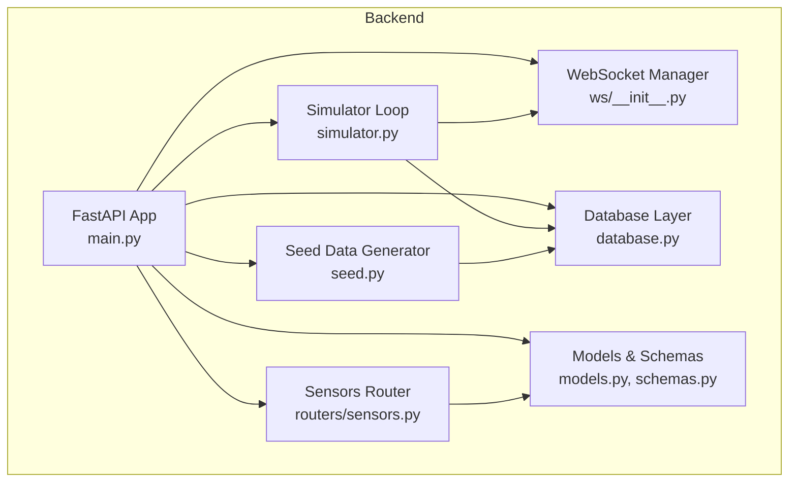
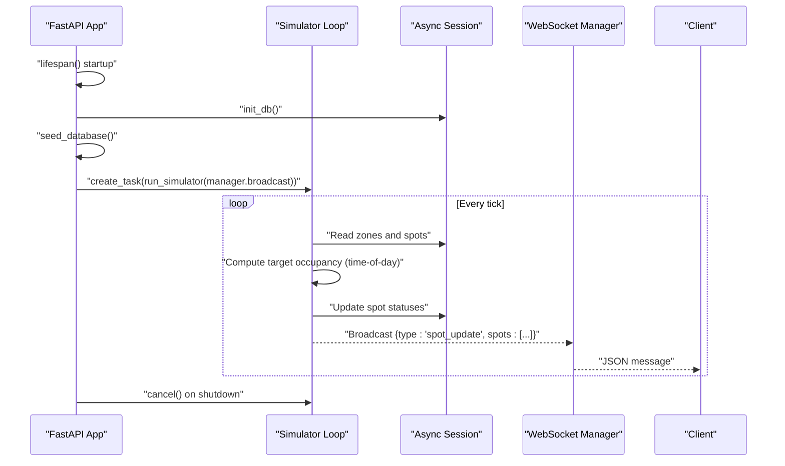
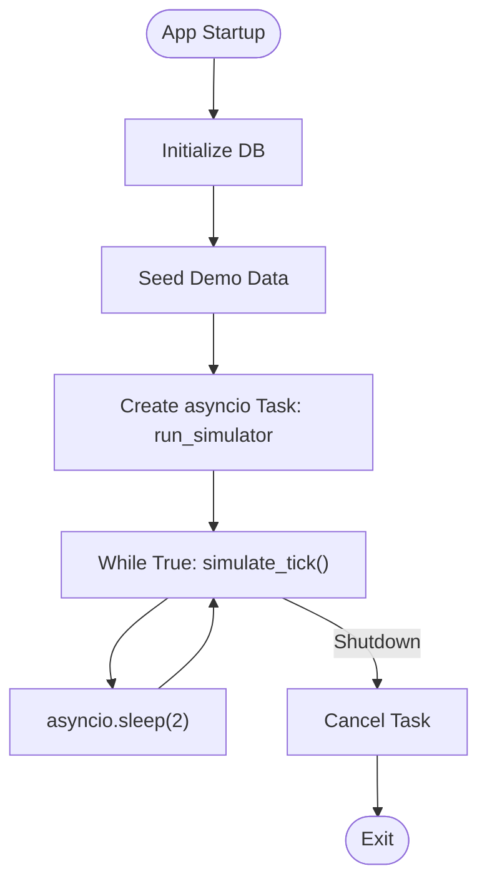
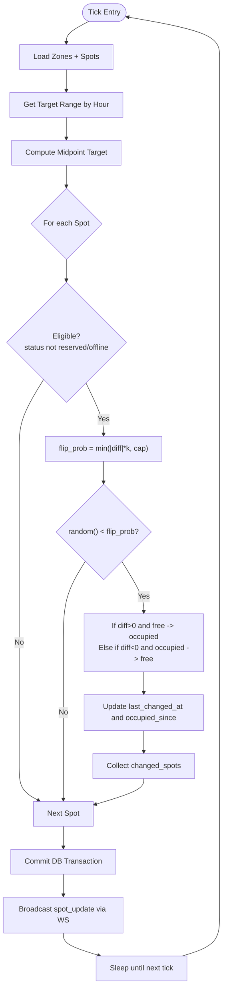
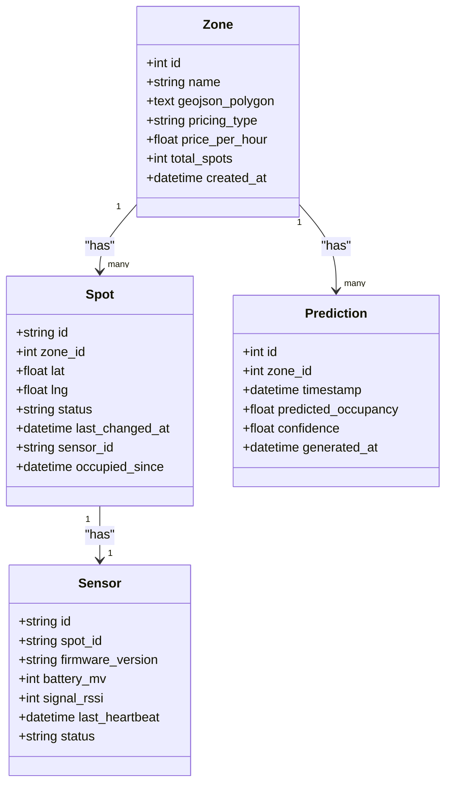
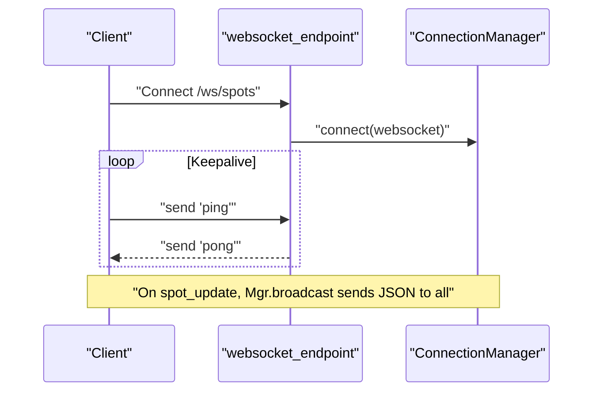
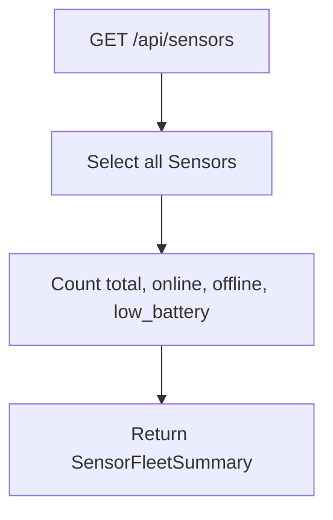
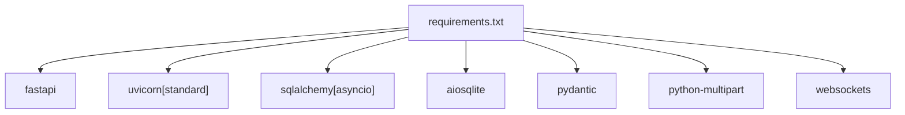

# Simulation Engine

<cite>
**Referenced Files in This Document**
- [main.py](file://backend/main.py)
- [simulator.py](file://backend/simulator.py)
- [ws/__init__.py](file://backend/ws/__init__.py)
- [ws/spots.py](file://backend/ws/spots.py)
- [seed.py](file://backend/seed.py)
- [models.py](file://backend/models.py)
- [database.py](file://backend/database.py)
- [routers/sensors.py](file://backend/routers/sensors.py)
- [schemas.py](file://backend/schemas.py)
- [requirements.txt](file://backend/requirements.txt)
</cite>

## Table of Contents
1. [Introduction](#introduction)
2. [Project Structure](#project-structure)
3. [Core Components](#core-components)
4. [Architecture Overview](#architecture-overview)
5. [Detailed Component Analysis](#detailed-component-analysis)
6. [Dependency Analysis](#dependency-analysis)
7. [Performance Considerations](#performance-considerations)
8. [Troubleshooting Guide](#troubleshooting-guide)
9. [Conclusion](#conclusion)
10. [Appendices](#appendices)

## Introduction
This document explains the simulation engine that generates realistic parking scenarios for SmartPark UAE. It covers:
- Background task architecture using asyncio to continuously change spot statuses and monitor sensor health
- Probability algorithms simulating occupancy patterns based on time-of-day profiles and location characteristics
- Seed data generation system for creating initial test datasets with zones, spots, sensors, and predictions
- Event-driven real-time updates via WebSocket connections
- Configuration options for simulation parameters, performance tuning, and testing strategies
- Examples for customizing behavior and integrating external data sources

## Project Structure
The backend implements an asynchronous FastAPI application that:
- Initializes the database and seeds demo data at startup
- Runs a background simulator loop that periodically adjusts spot statuses
- Broadcasts changes to connected WebSocket clients
- Exposes REST endpoints for zones, spots, predictions, agents, places, and sensors

**Diagram sources**
- [main.py:13-31](file://backend/main.py#L13-L31)
- [simulator.py:91-105](file://backend/simulator.py#L91-L105)
- [ws/__init__.py:7-49](file://backend/ws/__init__.py#L7-L49)
- [seed.py:126-198](file://backend/seed.py#L126-L198)
- [database.py:15-18](file://backend/database.py#L15-L18)
- [models.py:7-89](file://backend/models.py#L7-L89)
- [routers/sensors.py:11-27](file://backend/routers/sensors.py#L11-L27)

**Section sources**
- [main.py:13-31](file://backend/main.py#L13-L31)
- [main.py:33-64](file://backend/main.py#L33-L64)

## Core Components
- Application lifecycle and background tasks: The app initializes DB, seeds data, and starts the simulator as an asyncio task during lifespan startup; it cancels the task on shutdown.
- Simulator: An async loop runs every few seconds, computes target occupancy from time-of-day profiles, and probabilistically flips spot statuses toward targets. Changes are collected and broadcast via WebSocket.
- WebSocket manager: Maintains active connections, handles accept/disconnect, and broadcasts JSON messages to all clients.
- Seed generator: Creates zones, spots, sensors, saved places, and prediction records with realistic distributions and timestamps.
- Database layer: Async SQLAlchemy engine and session factory; creates tables on startup.
- Models and schemas: Define entities (Zone, Spot, Sensor, Prediction, etc.) and Pydantic response models.
- Sensors router: Provides a fleet health summary endpoint aggregating online/offline counts and low battery metrics.

**Section sources**
- [main.py:13-31](file://backend/main.py#L13-L31)
- [simulator.py:24-105](file://backend/simulator.py#L24-L105)
- [ws/__init__.py:7-49](file://backend/ws/__init__.py#L7-L49)
- [seed.py:126-198](file://backend/seed.py#L126-L198)
- [database.py:1-23](file://backend/database.py#L1-L23)
- [models.py:7-89](file://backend/models.py#L7-L89)
- [routers/sensors.py:11-27](file://backend/routers/sensors.py#L11-L27)

## Architecture Overview
The system uses an event-driven architecture:
- Background simulator ticks update spot states and emit events
- WebSocket manager fans out updates to all connected clients
- REST endpoints serve current state and analytics (e.g., sensor fleet health)

**Diagram sources**
- [main.py:13-31](file://backend/main.py#L13-L31)
- [simulator.py:91-105](file://backend/simulator.py#L91-L105)
- [ws/__init__.py:21-31](file://backend/ws/__init__.py#L21-L31)

## Detailed Component Analysis

### Background Task Architecture (asyncio)
- Startup: The app’s lifespan initializes the database, seeds data, and creates a long-running asyncio task for the simulator.
- Shutdown: The task is cancelled gracefully; exceptions are handled to avoid noisy logs.
- Tick loop: The simulator sleeps between ticks, ensuring non-blocking operation.

**Diagram sources**
- [main.py:13-31](file://backend/main.py#L13-L31)
- [simulator.py:91-105](file://backend/simulator.py#L91-L105)

**Section sources**
- [main.py:13-31](file://backend/main.py#L13-L31)
- [simulator.py:91-105](file://backend/simulator.py#L91-L105)

### Probability Algorithms for Occupancy Patterns
- Time-of-day profiles define target occupancy ranges per hour band (Dubai local time UTC+4).
- Each tick calculates current occupancy per zone and determines a midpoint target.
- For each eligible spot, a flip probability proportional to distance from target is applied; if flipped, status transitions occur and timestamps are updated.
- Reserved and offline sensors are excluded from flipping to maintain realism.

**Diagram sources**
- [simulator.py:24-88](file://backend/simulator.py#L24-L88)
- [simulator.py:91-105](file://backend/simulator.py#L91-L105)

**Section sources**
- [simulator.py:24-88](file://backend/simulator.py#L24-L88)

### Seed Data Generation System
- Zones: Predefined polygons and pricing metadata for Dubai Internet City areas.
- Spots: Generated around base coordinates in a grid pattern with randomized initial statuses (~free, ~occupied, ~reserved).
- Sensors: Created per spot with random firmware versions, battery levels, signal strength, and heartbeat times; status set to online.
- Saved Places: Sample user locations for UI features.
- Predictions: Generate 12 hours of 15-minute interval predictions using time-of-day profiles plus noise and confidence values.

**Diagram sources**
- [models.py:7-89](file://backend/models.py#L7-L89)
- [seed.py:126-198](file://backend/seed.py#L126-L198)

**Section sources**
- [seed.py:126-198](file://backend/seed.py#L126-L198)

### Event-Driven Real-Time Updates (WebSocket)
- Connection management: Accepts connections, tracks active sockets, and removes disconnected clients.
- Broadcasting: Sends JSON payloads to all clients; cleans up failed connections.
- Endpoint: Mounted at /ws/spots; supports ping/pong keepalive.

**Diagram sources**
- [ws/__init__.py:7-49](file://backend/ws/__init__.py#L7-L49)
- [ws/spots.py:1-4](file://backend/ws/spots.py#L1-L4)
- [main.py:57-58](file://backend/main.py#L57-L58)

**Section sources**
- [ws/__init__.py:7-49](file://backend/ws/__init__.py#L7-L49)
- [ws/spots.py:1-4](file://backend/ws/spots.py#L1-L4)
- [main.py:57-58](file://backend/main.py#L57-L58)

### Sensor Health Monitoring
- Fleet summary endpoint aggregates total, online, offline, and low-battery counts.
- Low battery threshold is defined within the endpoint logic.

**Diagram sources**
- [routers/sensors.py:11-27](file://backend/routers/sensors.py#L11-L27)
- [schemas.py:58-63](file://backend/schemas.py#L58-L63)

**Section sources**
- [routers/sensors.py:11-27](file://backend/routers/sensors.py#L11-L27)
- [schemas.py:58-63](file://backend/schemas.py#L58-L63)

## Dependency Analysis
Key runtime dependencies include FastAPI, Uvicorn, SQLAlchemy with asyncio support, aiosqlite, Pydantic, python-multipart, and websockets.

**Diagram sources**
- [requirements.txt:1-8](file://backend/requirements.txt#L1-L8)

**Section sources**
- [requirements.txt:1-8](file://backend/requirements.txt#L1-L8)

## Performance Considerations
- Tick frequency: Adjust the sleep interval in the simulator loop to balance responsiveness and load.
- Batch operations: The simulator commits once per tick; consider batching writes or using bulk updates for large fleets.
- Selective queries: Use targeted selects and indexes on frequently filtered fields (e.g., status, zone_id) to reduce query cost.
- WebSocket scaling: For many clients, consider fan-out optimization or sharding by zone.
- Database configuration: Tune connection pool size and use a production-grade async database driver when needed.

## Troubleshooting Guide
- Simulator errors: Exceptions inside the loop are caught and logged; check logs for stack traces and ensure DB connectivity.
- WebSocket disconnects: The manager removes broken connections automatically; verify client reconnect logic and ping/pong handling.
- Seed conflicts: If the database is already seeded, the seed routine skips creation; clear or migrate data as needed.
- Sensor health anomalies: Review thresholds and heartbeat intervals; confirm sensor IDs and associations.

**Section sources**
- [simulator.py:102-104](file://backend/simulator.py#L102-L104)
- [ws/__init__.py:21-31](file://backend/ws/__init__.py#L21-L31)
- [seed.py:126-133](file://backend/seed.py#L126-L133)
- [routers/sensors.py:11-27](file://backend/routers/sensors.py#L11-L27)

## Conclusion
The simulation engine provides a robust, event-driven framework for generating realistic parking scenarios. Its asyncio-based background tasks, probabilistic occupancy modeling, comprehensive seed data, and WebSocket broadcasting enable live visualization and interactive demos. With straightforward configuration points and extensible components, it can be adapted to integrate external data sources and scale to larger deployments.

## Appendices

### Configuration Options
- Database URL: Configurable via environment variable; defaults to SQLite file.
- Simulator tick interval: Controlled by the sleep duration in the main loop.
- Occupancy profiles: Time-of-day ranges and caps can be adjusted to reflect different locations or policies.
- Sensor thresholds: Low battery threshold and status definitions can be tuned in the sensors endpoint.

**Section sources**
- [database.py:5](file://backend/database.py#L5)
- [simulator.py:91-105](file://backend/simulator.py#L91-L105)
- [simulator.py:12-21](file://backend/simulator.py#L12-L21)
- [routers/sensors.py:19-20](file://backend/routers/sensors.py#L19-L20)

### Testing Strategies
- Unit tests for probability functions: Validate flip probabilities and boundary conditions across time bands.
- Integration tests for seeding: Ensure deterministic creation of zones, spots, sensors, and predictions.
- WebSocket tests: Verify connect/disconnect, broadcast delivery, and ping/pong behavior.
- Load tests: Simulate multiple clients and high-frequency ticks to assess throughput and latency.

### Customization and External Integrations
- Custom occupancy profiles: Extend time-of-day ranges or add location-specific modifiers.
- External telemetry: Ingest real sensor heartbeats and update Sensor.last_heartbeat and status accordingly.
- Historical trends: Incorporate past occupancy data into target calculations for adaptive simulation.
- Multi-zone routing: Route WebSocket updates per zone to reduce payload size for clients.