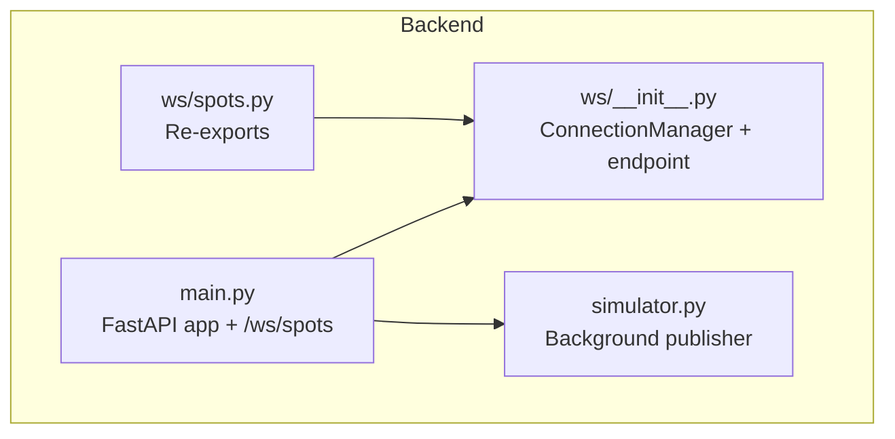
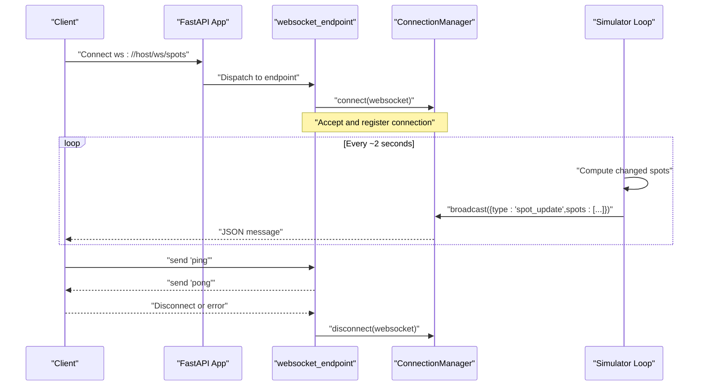
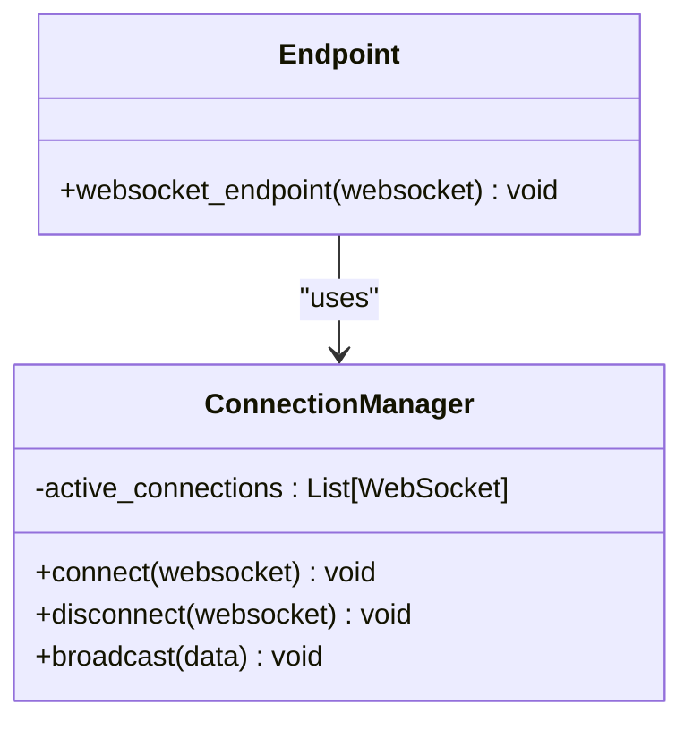
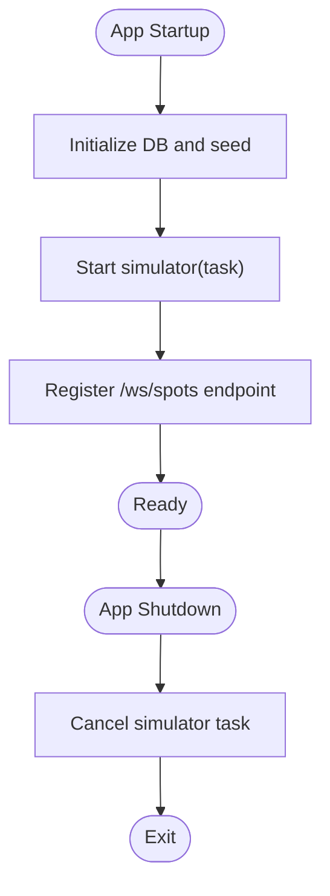
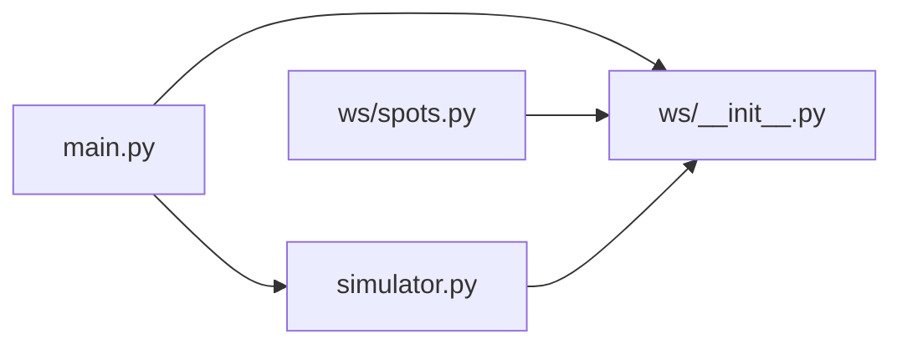

# WebSocket Implementation

<cite>
**Referenced Files in This Document**
- [backend/ws/__init__.py](file://backend/ws/__init__.py)
- [backend/ws/spots.py](file://backend/ws/spots.py)
- [backend/main.py](file://backend/main.py)
- [backend/simulator.py](file://backend/simulator.py)
</cite>

## Table of Contents
1. [Introduction](#introduction)
2. [Project Structure](#project-structure)
3. [Core Components](#core-components)
4. [Architecture Overview](#architecture-overview)
5. [Detailed Component Analysis](#detailed-component-analysis)
6. [Dependency Analysis](#dependency-analysis)
7. [Performance Considerations](#performance-considerations)
8. [Troubleshooting Guide](#troubleshooting-guide)
9. [Conclusion](#conclusion)
10. [Appendices](#appendices)

## Introduction
This document explains the real-time WebSocket system used to broadcast spot status updates to connected clients. It covers the connection manager, pub/sub broadcasting model, message protocol for spot updates, lifecycle management (connection acceptance and graceful disconnection), and integration points with the application’s background simulator. It also provides guidance on extending the system with custom endpoints and scaling considerations for high-concurrency environments.

## Project Structure
The WebSocket implementation is contained within the backend package:
- Connection manager and endpoint are defined in a single module.
- The FastAPI application registers the WebSocket route and starts the simulator that publishes updates via the connection manager.
- A small re-export module exposes the manager and endpoint for convenience.

**Diagram sources**
- [backend/ws/__init__.py:1-49](file://backend/ws/__init__.py#L1-L49)
- [backend/ws/spots.py:1-3](file://backend/ws/spots.py#L1-L3)
- [backend/main.py:1-64](file://backend/main.py#L1-L64)
- [backend/simulator.py:1-105](file://backend/simulator.py#L1-L105)

**Section sources**
- [backend/ws/__init__.py:1-49](file://backend/ws/__init__.py#L1-L49)
- [backend/ws/spots.py:1-3](file://backend/ws/spots.py#L1-L3)
- [backend/main.py:1-64](file://backend/main.py#L1-L64)
- [backend/simulator.py:1-105](file://backend/simulator.py#L1-L105)

## Core Components
- ConnectionManager: Maintains a list of active WebSocket connections and provides connect, disconnect, and broadcast operations. Broadcast sends JSON messages to all clients and removes failed connections.
- websocket_endpoint: Accepts new connections, keeps them alive by responding to ping messages, and ensures cleanup on disconnect or unexpected errors.
- Simulator: Background task that periodically computes changes to parking spots and broadcasts structured update messages through the connection manager.

Key responsibilities:
- Connection lifecycle: accept, track, remove.
- Pub/Sub broadcasting: one-to-many push from simulator to all clients.
- Minimal keepalive: text-based ping/pong.

**Section sources**
- [backend/ws/__init__.py:7-33](file://backend/ws/__init__.py#L7-L33)
- [backend/ws/__init__.py:36-49](file://backend/ws/__init__.py#L36-L49)
- [backend/simulator.py:91-105](file://backend/simulator.py#L91-L105)

## Architecture Overview
The system follows a simple pub/sub pattern:
- Clients connect to the WebSocket endpoint.
- The ConnectionManager tracks each client connection.
- The simulator runs as a background task and calls the manager’s broadcast method with spot updates.
- All connected clients receive the same update payload.

**Diagram sources**
- [backend/main.py:57-58](file://backend/main.py#L57-L58)
- [backend/ws/__init__.py:36-49](file://backend/ws/__init__.py#L36-L49)
- [backend/ws/__init__.py:13-30](file://backend/ws/__init__.py#L13-L30)
- [backend/simulator.py:91-105](file://backend/simulator.py#L91-L105)

## Detailed Component Analysis

### Connection Manager and Endpoint
Responsibilities:
- Maintain active connections.
- Accept new connections.
- Broadcast messages to all clients.
- Handle disconnects and exceptions gracefully.
- Respond to ping messages to keep connections alive.

**Diagram sources**
- [backend/ws/__init__.py:7-33](file://backend/ws/__init__.py#L7-L33)
- [backend/ws/__init__.py:36-49](file://backend/ws/__init__.py#L36-L49)

**Section sources**
- [backend/ws/__init__.py:7-33](file://backend/ws/__init__.py#L7-L33)
- [backend/ws/__init__.py:36-49](file://backend/ws/__init__.py#L36-L49)

### Message Protocol Design
The simulator publishes a single event type for spot updates:
- Event type: "spot_update"
- Payload structure:
  - type: string, always "spot_update"
  - spots: array of objects, each containing:
    - id: string identifier of the spot
    - status: string, e.g., "free" or "occupied"
    - last_changed_at: ISO timestamp when the status changed

Clients should:
- Listen for incoming JSON messages.
- Inspect the "type" field to handle different events.
- For "spot_update", iterate over the "spots" array and apply local state changes.

Example usage patterns:
- Apply optimistic UI updates per spot.
- Debounce or batch updates if many spots change simultaneously.
- Validate presence of required fields before applying.

**Section sources**
- [backend/simulator.py:97-101](file://backend/simulator.py#L97-L101)

### Application Integration and Lifecycle
- The FastAPI app registers the WebSocket route at "/ws/spots".
- During startup, the app initializes the database, seeds data, and starts the simulator background task.
- The simulator receives the manager’s broadcast function and uses it to publish updates.
- On shutdown, the simulator task is cancelled and awaited.

**Diagram sources**
- [backend/main.py:13-31](file://backend/main.py#L13-31)
- [backend/main.py:57-58](file://backend/main.py#L57-L58)

**Section sources**
- [backend/main.py:13-31](file://backend/main.py#L13-31)
- [backend/main.py:57-58](file://backend/main.py#L57-L58)

### Authentication and Authorization
Current implementation:
- No authentication or authorization checks are performed in the WebSocket endpoint.
- Any client can connect and receive updates.

Recommendations for production:
- Validate tokens or session cookies during handshake using query parameters or headers.
- Reject unauthorized connections early by raising an exception after accept or by not accepting the connection.
- Optionally maintain separate connection lists per tenant or role.

Note: These are architectural recommendations; they are not implemented in the current codebase.

### Graceful Disconnection Handling
Behavior:
- On WebSocketDisconnect or any other exception, the endpoint removes the connection from the manager.
- Broadcast cleans up dead connections encountered while sending.

Best practices:
- Ensure only one place manages removal to avoid duplicates.
- Avoid long-running work inside broadcast; offload heavy processing to background tasks.

**Section sources**
- [backend/ws/__init__.py:17-30](file://backend/ws/__init__.py#L17-L30)
- [backend/ws/__init__.py:45-49](file://backend/ws/__init__.py#L45-L49)

### Keepalive and Ping/Pong
Behavior:
- The endpoint listens for text frames and responds to "ping" with "pong".
- This allows clients to detect liveness and trigger reconnection logic.

Client-side guidance:
- Send periodic pings (e.g., every 15–30 seconds).
- If no pong is received within a timeout window, attempt reconnection.

**Section sources**
- [backend/ws/__init__.py:40-44](file://backend/ws/__init__.py#L40-L44)

### Reconnection Logic and Error Recovery
Recommended client behavior:
- Exponential backoff with jitter on reconnect attempts.
- Limit maximum retry duration and provide user feedback.
- Re-subscribe or re-sync state after reconnecting (e.g., fetch latest REST state and apply incremental updates).

These are general guidelines; the repository does not include a client implementation.

### Extending with Custom Endpoints
To add a new topic-specific channel:
- Create a new endpoint similar to the existing one.
- Maintain a separate ConnectionManager instance per topic if you need isolation.
- Register the new endpoint under a distinct path (e.g., "/ws/zones").
- Publish messages to the appropriate manager from your domain logic.

Reference files for patterns:
- Existing endpoint and manager definitions.
- Route registration example.

**Section sources**
- [backend/ws/__init__.py:36-49](file://backend/ws/__init__.py#L36-L49)
- [backend/main.py:57-58](file://backend/main.py#L57-L58)

## Dependency Analysis
High-level dependencies:
- main.py depends on ws manager and endpoint for routing and on simulator for publishing.
- ws/spots.py re-exports manager and endpoint for convenience.
- simulator.py depends on the manager’s broadcast function to push updates.

**Diagram sources**
- [backend/main.py:1-64](file://backend/main.py#L1-64)
- [backend/ws/__init__.py:1-49](file://backend/ws/__init__.py#L1-L49)
- [backend/ws/spots.py:1-3](file://backend/ws/spots.py#L1-L3)
- [backend/simulator.py:1-105](file://backend/simulator.py#L1-L105)

**Section sources**
- [backend/main.py:1-64](file://backend/main.py#L1-L64)
- [backend/ws/__init__.py:1-49](file://backend/ws/__init__.py#L1-L49)
- [backend/ws/spots.py:1-3](file://backend/ws/spots.py#L1-L3)
- [backend/simulator.py:1-105](file://backend/simulator.py#L1-L105)

## Performance Considerations
- Broadcasting cost: O(n) per broadcast where n is the number of active connections. Each send_json call may fail due to network issues; the manager removes broken connections.
- Memory growth: The active_connections list grows with each new connection. Ensure proper cleanup on disconnect and handle exceptions to prevent leaks.
- CPU usage: Keep broadcast lightweight. Offload heavy transformations to background tasks and send minimal payloads.
- Concurrency: Use async I/O consistently. Avoid blocking operations inside the endpoint or broadcast loop.
- Scaling:
  - Horizontal scaling requires a shared pub/sub layer (e.g., Redis Streams or a message broker) so multiple app instances can fan-out updates to all clients.
  - Consider sharding topics across channels to reduce per-instance load.
  - Implement rate limiting and message batching for high-frequency updates.

[No sources needed since this section provides general guidance]

## Troubleshooting Guide
Common issues and remedies:
- Clients not receiving updates:
  - Verify the WebSocket route is registered and reachable.
  - Confirm the simulator is running and calling broadcast.
  - Check for network errors during send_json; ensure disconnected clients are removed.
- Stale connections:
  - Ensure ping/pong is working and clients implement timeouts.
  - Validate that disconnect handlers remove connections from the manager.
- High memory usage:
  - Audit active_connections growth and confirm cleanup paths.
  - Reduce payload size and frequency.
- Errors in simulator:
  - Review logs around the simulator loop and database interactions.
  - Add retries or circuit breakers for external dependencies.

**Section sources**
- [backend/ws/__init__.py:21-30](file://backend/ws/__init__.py#L21-L30)
- [backend/ws/__init__.py:45-49](file://backend/ws/__init__.py#L45-L49)
- [backend/simulator.py:91-105](file://backend/simulator.py#L91-L105)

## Conclusion
The WebSocket system implements a straightforward pub/sub model for broadcasting spot status updates. The ConnectionManager centralizes connection tracking and broadcasting, while the simulator drives real-time updates. The current design is simple and effective for single-process deployments. For production-grade systems, consider adding authentication/authorization, robust reconnection strategies, and a distributed pub/sub backbone to scale horizontally.

[No sources needed since this section summarizes without analyzing specific files]

## Appendices

### API Reference: WebSocket Endpoint
- Path: /ws/spots
- Transport: WebSocket
- Messages:
  - Server -> Client: JSON object with "type": "spot_update" and "spots" array.
  - Client -> Server: Text frame "ping" elicits "pong" response.

**Section sources**
- [backend/main.py:57-58](file://backend/main.py#L57-L58)
- [backend/simulator.py:97-101](file://backend/simulator.py#L97-L101)
- [backend/ws/__init__.py:40-44](file://backend/ws/__init__.py#L40-L44)