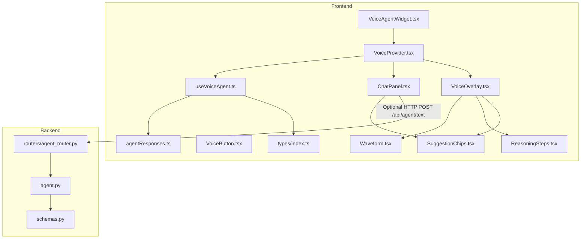
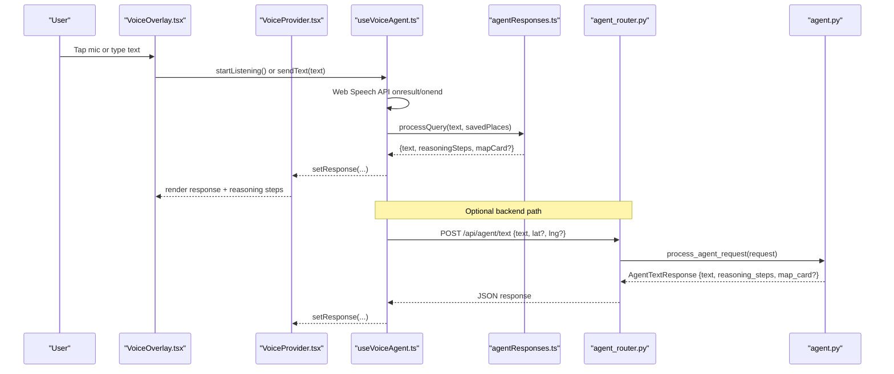
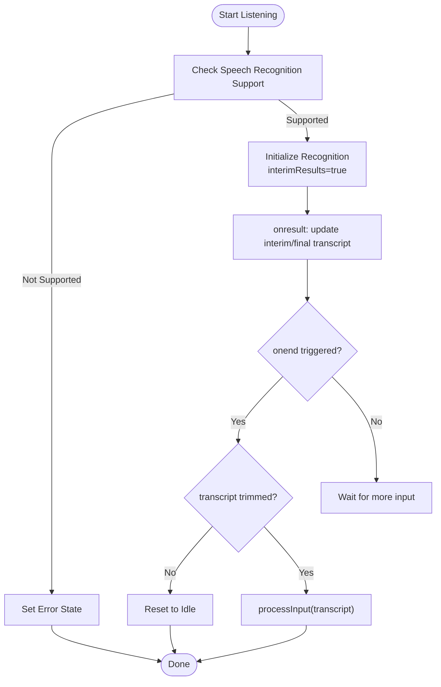
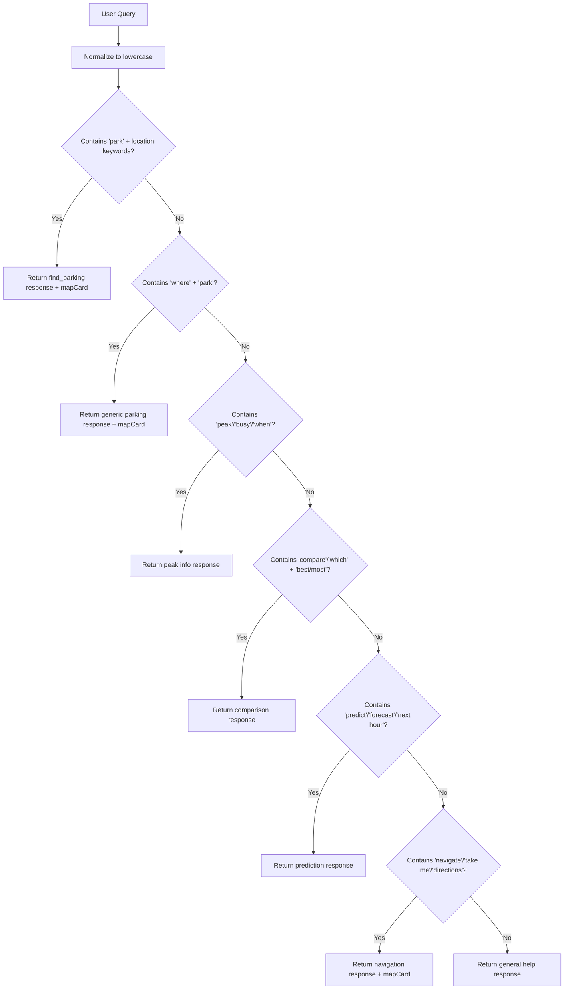
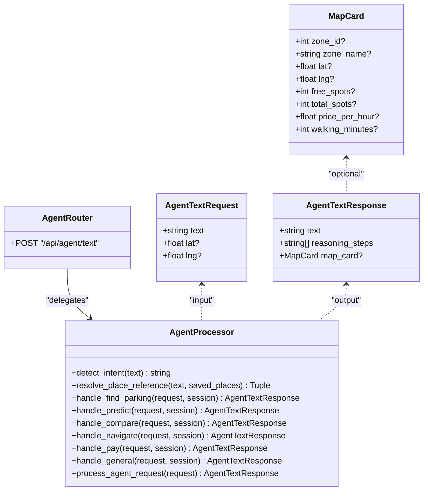
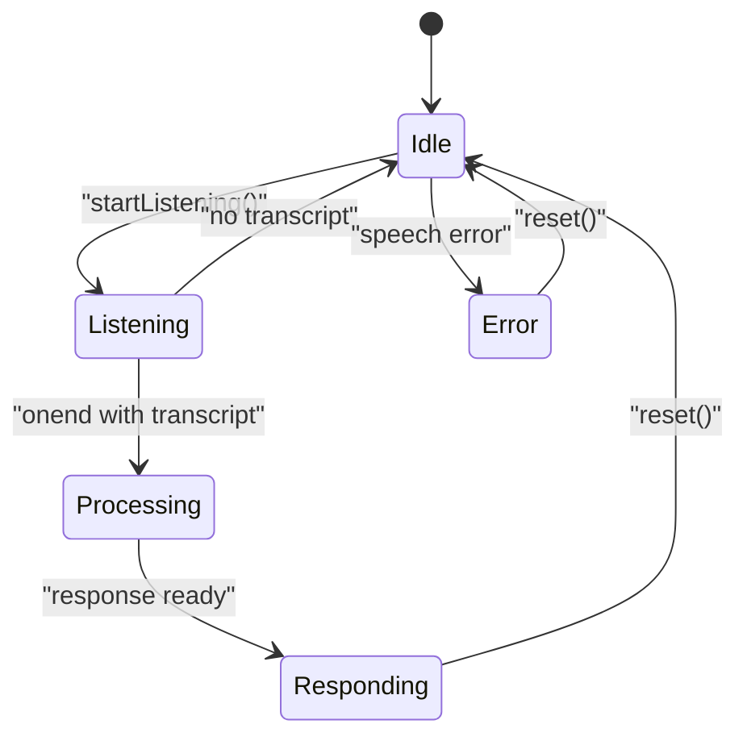
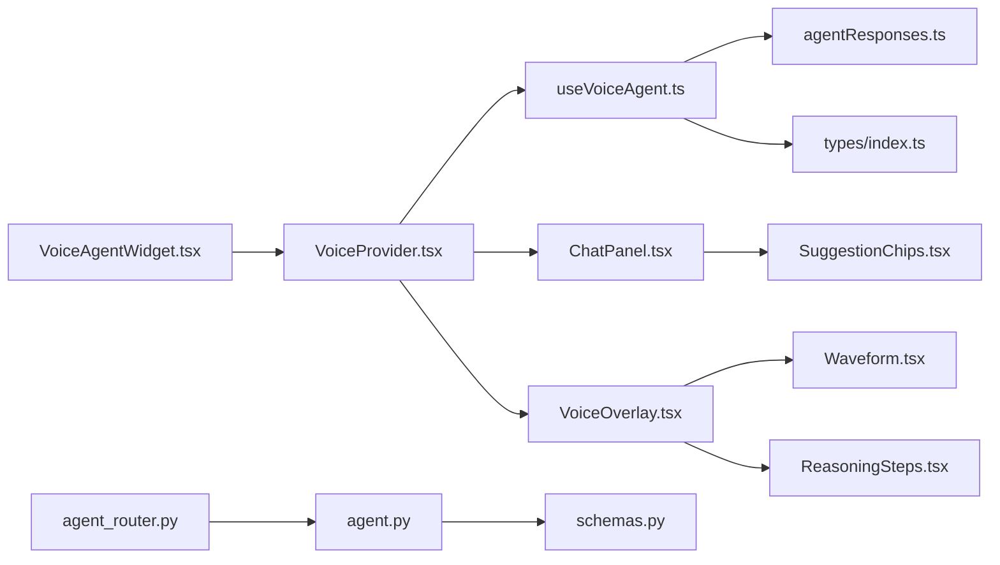

# AI Voice Assistant

<cite>
**Referenced Files in This Document**
- [VoiceAgentWidget.tsx](file://frontend/src/components/voice/VoiceAgentWidget.tsx)
- [VoiceProvider.tsx](file://frontend/src/components/voice/VoiceProvider.tsx)
- [useVoiceAgent.ts](file://frontend/src/hooks/useVoiceAgent.ts)
- [agentResponses.ts](file://frontend/src/lib/agentResponses.ts)
- [ChatPanel.tsx](file://frontend/src/components/voice/ChatPanel.tsx)
- [VoiceOverlay.tsx](file://frontend/src/components/voice/VoiceOverlay.tsx)
- [VoiceButton.tsx](file://frontend/src/components/voice/VoiceButton.tsx)
- [Waveform.tsx](file://frontend/src/components/voice/Waveform.tsx)
- [ReasoningSteps.tsx](file://frontend/src/components/voice/ReasoningSteps.tsx)
- [SuggestionChips.tsx](file://frontend/src/components/voice/SuggestionChips.tsx)
- [types/index.ts](file://frontend/src/types/index.ts)
- [agent_router.py](file://backend/routers/agent_router.py)
- [agent.py](file://backend/agent.py)
- [schemas.py](file://backend/schemas.py)
- [README.md](file://README.md)
</cite>

## Table of Contents
1. [Introduction](#introduction)
2. [Project Structure](#project-structure)
3. [Core Components](#core-components)
4. [Architecture Overview](#architecture-overview)
5. [Detailed Component Analysis](#detailed-component-analysis)
6. [Dependency Analysis](#dependency-analysis)
7. [Performance Considerations](#performance-considerations)
8. [Troubleshooting Guide](#troubleshooting-guide)
9. [Conclusion](#conclusion)
10. [Appendices](#appendices)

## Introduction
This document explains the AI Voice Assistant integrated into the SmartPark application. It covers:
- Voice input pipeline using the Web Speech API, real-time transcription, and audio waveform visualization
- Chat interface with message history, suggestion chips, and reasoning steps display
- Backend agent router that handles natural language queries, context resolution, and response generation
- Conversation flow patterns, voice command examples, and customization options for responses and personality
- Browser compatibility, microphone permissions, and fallback text input methods

The assistant is designed to help users find parking, compare zones, predict occupancy, and navigate to recommended spots within Dubai Internet City.

## Project Structure
The voice assistant spans both frontend and backend:
- Frontend components provide the floating mic button, overlay, chat panel, waveform visualization, reasoning steps, and suggestion chips
- A React hook manages speech recognition state, transcript handling, and processing logic
- A local agent processor (for demo mode) interprets user queries and returns structured results with reasoning steps and optional map cards
- The backend exposes an agent endpoint for server-side intent routing, context resolution, and data-driven responses

**Diagram sources**
- [VoiceAgentWidget.tsx:1-22](file://frontend/src/components/voice/VoiceAgentWidget.tsx#L1-L22)
- [VoiceProvider.tsx:1-110](file://frontend/src/components/voice/VoiceProvider.tsx#L1-L110)
- [useVoiceAgent.ts:1-227](file://frontend/src/hooks/useVoiceAgent.ts#L1-L227)
- [agentResponses.ts:1-131](file://frontend/src/lib/agentResponses.ts#L1-L131)
- [ChatPanel.tsx:1-164](file://frontend/src/components/voice/ChatPanel.tsx#L1-L164)
- [VoiceOverlay.tsx:1-170](file://frontend/src/components/voice/VoiceOverlay.tsx#L1-L170)
- [VoiceButton.tsx:1-43](file://frontend/src/components/voice/VoiceButton.tsx#L1-L43)
- [Waveform.tsx:1-30](file://frontend/src/components/voice/Waveform.tsx#L1-L30)
- [ReasoningSteps.tsx:1-27](file://frontend/src/components/voice/ReasoningSteps.tsx#L1-L27)
- [SuggestionChips.tsx:1-29](file://frontend/src/components/voice/SuggestionChips.tsx#L1-L29)
- [types/index.ts:1-75](file://frontend/src/types/index.ts#L1-L75)
- [agent_router.py:1-12](file://backend/routers/agent_router.py#L1-L12)
- [agent.py:1-261](file://backend/agent.py#L1-L261)
- [schemas.py:1-127](file://backend/schemas.py#L1-L127)

**Section sources**
- [README.md:1-47](file://README.md#L1-L47)

## Core Components
- VoiceAgentWidget: Composes provider, floating button, overlay, and chat panel
- VoiceProvider: Centralizes overlay/chat visibility, chat history, and delegates to the voice hook
- useVoiceAgent: Implements Web Speech API integration, interim/final transcripts, error handling, and processing pipeline
- agentResponses (demo): Pattern-based NLP returning text, reasoning steps, and optional map card
- ChatPanel: Displays messages, typing indicator, suggestion chips, and text input fallback
- VoiceOverlay: Full-screen voice UI with states (idle, listening, processing, responding, error), waveform, and reasoning steps
- Waveform: Animated bars indicating active listening
- ReasoningSteps: Staggered reveal of processing steps
- SuggestionChips: Quick prompts to drive conversation
- Types: Shared TypeScript interfaces for agents and parking entities

Key responsibilities:
- Capture voice input and convert to text
- Show real-time feedback (waveform, transcript)
- Process query via local or backend agent
- Render response with reasoning steps and optional map card
- Maintain chat history and support keyboard/text fallback

**Section sources**
- [VoiceAgentWidget.tsx:1-22](file://frontend/src/components/voice/VoiceAgentWidget.tsx#L1-L22)
- [VoiceProvider.tsx:1-110](file://frontend/src/components/voice/VoiceProvider.tsx#L1-L110)
- [useVoiceAgent.ts:1-227](file://frontend/src/hooks/useVoiceAgent.ts#L1-L227)
- [agentResponses.ts:1-131](file://frontend/src/lib/agentResponses.ts#L1-L131)
- [ChatPanel.tsx:1-164](file://frontend/src/components/voice/ChatPanel.tsx#L1-L164)
- [VoiceOverlay.tsx:1-170](file://frontend/src/components/voice/VoiceOverlay.tsx#L1-L170)
- [Waveform.tsx:1-30](file://frontend/src/components/voice/Waveform.tsx#L1-L30)
- [ReasoningSteps.tsx:1-27](file://frontend/src/components/voice/ReasoningSteps.tsx#L1-L27)
- [SuggestionChips.tsx:1-29](file://frontend/src/components/voice/SuggestionChips.tsx#L1-L29)
- [types/index.ts:1-75](file://frontend/src/types/index.ts#L1-L75)

## Architecture Overview
The system supports two modes:
- Demo mode: Local pattern-based processing in the browser
- Server mode: Optional HTTP call to backend agent router for richer, data-driven responses

**Diagram sources**
- [VoiceOverlay.tsx:1-170](file://frontend/src/components/voice/VoiceOverlay.tsx#L1-L170)
- [VoiceProvider.tsx:1-110](file://frontend/src/components/voice/VoiceProvider.tsx#L1-L110)
- [useVoiceAgent.ts:1-227](file://frontend/src/hooks/useVoiceAgent.ts#L1-L227)
- [agentResponses.ts:1-131](file://frontend/src/lib/agentResponses.ts#L1-L131)
- [agent_router.py:1-12](file://backend/routers/agent_router.py#L1-L12)
- [agent.py:1-261](file://backend/agent.py#L1-L261)

## Detailed Component Analysis

### Voice Input Pipeline
- Detection: The hook checks for window.SpeechRecognition or webkitSpeechRecognition and sets isSupported accordingly
- Listening: Starts recognition with interim results enabled; updates transcript in real time
- End handling: On end, if there is a transcript, it processes input; otherwise resets to idle
- Error handling: Distinguishes no-speech from other errors and sets error state
- Fallback: Text input is always available via ChatPanel and overlay suggestions

**Diagram sources**
- [useVoiceAgent.ts:1-227](file://frontend/src/hooks/useVoiceAgent.ts#L1-L227)

**Section sources**
- [useVoiceAgent.ts:1-227](file://frontend/src/hooks/useVoiceAgent.ts#L1-L227)

### Audio Waveform Visualization
- Animated bars respond to listening state
- Delays stagger animations for a natural waveform effect
- No live audio analysis is performed; animation reflects state only

**Section sources**
- [Waveform.tsx:1-30](file://frontend/src/components/voice/Waveform.tsx#L1-L30)

### Chat Interface
- Message list with timestamps and optional map card rendering
- Typing indicator during processing
- Suggestion chips shown when empty or after idle
- Keyboard support (Enter to send)
- Integration with provider’s chat history and response polling

**Section sources**
- [ChatPanel.tsx:1-164](file://frontend/src/components/voice/ChatPanel.tsx#L1-L164)
- [SuggestionChips.tsx:1-29](file://frontend/src/components/voice/SuggestionChips.tsx#L1-L29)

### Reasoning Steps Display
- Staggered reveal of steps based on visibleCount
- Smooth transitions for improved UX

**Section sources**
- [ReasoningSteps.tsx:1-27](file://frontend/src/components/voice/ReasoningSteps.tsx#L1-L27)

### Contextual Response Generation (Demo Mode)
- Pattern matching on lowercased query
- Returns text, reasoning steps, and optional map card
- Supports intents like find_parking, peak_info, compare_zones, prediction, navigate, and general help

**Diagram sources**
- [agentResponses.ts:1-131](file://frontend/src/lib/agentResponses.ts#L1-L131)

**Section sources**
- [agentResponses.ts:1-131](file://frontend/src/lib/agentResponses.ts#L1-L131)

### Backend Agent Router and Processing
- FastAPI router exposes POST /api/agent/text
- Agent detects intent, resolves place references, computes distances, ranks zones, and builds responses
- Uses database models and schemas for structured I/O

**Diagram sources**
- [agent_router.py:1-12](file://backend/routers/agent_router.py#L1-L12)
- [agent.py:1-261](file://backend/agent.py#L1-L261)
- [schemas.py:1-127](file://backend/schemas.py#L1-L127)

**Section sources**
- [agent_router.py:1-12](file://backend/routers/agent_router.py#L1-L12)
- [agent.py:1-261](file://backend/agent.py#L1-L261)
- [schemas.py:1-127](file://backend/schemas.py#L1-L127)

### Conversation Flow Patterns
- Idle → Listening → Processing → Responding → Idle
- Error state can occur at any point; reset clears timers and recognition
- Chat mode mirrors overlay behavior with persistent history

**Diagram sources**
- [useVoiceAgent.ts:1-227](file://frontend/src/hooks/useVoiceAgent.ts#L1-L227)
- [VoiceOverlay.tsx:1-170](file://frontend/src/components/voice/VoiceOverlay.tsx#L1-L170)

## Dependency Analysis
- Frontend dependencies:
  - VoiceAgentWidget depends on VoiceProvider, VoiceButton, VoiceOverlay, ChatPanel
  - VoiceProvider composes useVoiceAgent and manages chat history
  - useVoiceAgent depends on agentResponses for demo processing and types for structures
  - ChatPanel uses SuggestionChips and renders MapCard when present
  - VoiceOverlay orchestrates states and renders Waveform and ReasoningSteps
- Backend dependencies:
  - agent_router imports schemas and agent module
  - agent implements intent detection, distance calculations, ranking, and response building
  - schemas define request/response contracts and map card structure

**Diagram sources**
- [VoiceAgentWidget.tsx:1-22](file://frontend/src/components/voice/VoiceAgentWidget.tsx#L1-L22)
- [VoiceProvider.tsx:1-110](file://frontend/src/components/voice/VoiceProvider.tsx#L1-L110)
- [useVoiceAgent.ts:1-227](file://frontend/src/hooks/useVoiceAgent.ts#L1-L227)
- [agentResponses.ts:1-131](file://frontend/src/lib/agentResponses.ts#L1-L131)
- [ChatPanel.tsx:1-164](file://frontend/src/components/voice/ChatPanel.tsx#L1-L164)
- [VoiceOverlay.tsx:1-170](file://frontend/src/components/voice/VoiceOverlay.tsx#L1-L170)
- [Waveform.tsx:1-30](file://frontend/src/components/voice/Waveform.tsx#L1-L30)
- [ReasoningSteps.tsx:1-27](file://frontend/src/components/voice/ReasoningSteps.tsx#L1-L27)
- [SuggestionChips.tsx:1-29](file://frontend/src/components/voice/SuggestionChips.tsx#L1-L29)
- [types/index.ts:1-75](file://frontend/src/types/index.ts#L1-L75)
- [agent_router.py:1-12](file://backend/routers/agent_router.py#L1-L12)
- [agent.py:1-261](file://backend/agent.py#L1-L261)
- [schemas.py:1-127](file://backend/schemas.py#L1-L127)

**Section sources**
- [agent.py:1-261](file://backend/agent.py#L1-L261)
- [schemas.py:1-127](file://backend/schemas.py#L1-L127)

## Performance Considerations
- Avoid unnecessary re-renders by memoizing callbacks in hooks and providers
- Debounce or throttle frequent transcript updates if needed
- Prefer server-side processing for complex queries to reduce client load
- Use efficient DOM scrolling strategies for long chat histories
- Keep reasoning steps concise to minimize layout thrashing

## Troubleshooting Guide
Common issues and resolutions:
- Speech recognition not supported:
  - Check isSupported flag and guide users to compatible browsers
  - Provide text input fallback via ChatPanel and suggestion chips
- Microphone permission denied:
  - Ensure HTTPS context and prompt user to allow microphone access
- No speech detected:
  - Handle no-speech error gracefully and return to idle
- Network errors (if using backend):
  - Implement retries and user-friendly error messages
- Overlay not closing:
  - Verify ESC key listener and cleanup on unmount

**Section sources**
- [useVoiceAgent.ts:1-227](file://frontend/src/hooks/useVoiceAgent.ts#L1-L227)
- [VoiceOverlay.tsx:1-170](file://frontend/src/components/voice/VoiceOverlay.tsx#L1-L170)

## Conclusion
The AI Voice Assistant provides a seamless voice-first experience with robust fallbacks and clear reasoning. It integrates smoothly with the SmartPark ecosystem, offering both demo-mode responsiveness and extensibility through a backend agent router. With thoughtful UX patterns and clear error handling, it delivers reliable parking assistance across devices.

## Appendices

### Voice Command Examples
- Find parking near work
- Where can I park right now?
- When is peak hour?
- Show zone comparison
- Predict next 2 hours
- Navigate to the best spot

### Customization Options
- Response templates:
  - Extend agentResponses.ts patterns to add new intents and refine wording
- Personality settings:
  - Adjust tone and verbosity in response texts
  - Add greeting variants and contextual hints
- Map card fields:
  - Customize displayed metrics (e.g., walking minutes, price per hour)

### Browser Compatibility and Permissions
- Supported engines:
  - Chrome, Edge, Safari (webkit prefix may be required)
- Requirements:
  - Secure context (HTTPS) for microphone access
  - User must grant microphone permission
- Fallback:
  - Always enable text input and suggestion chips