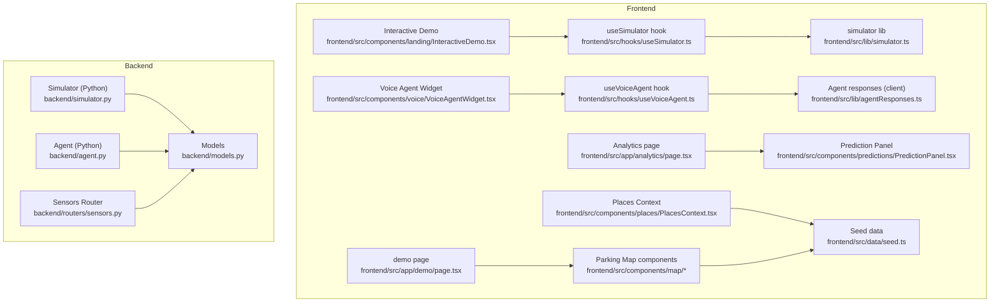
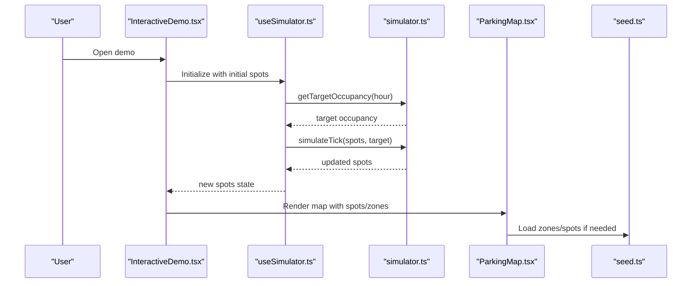
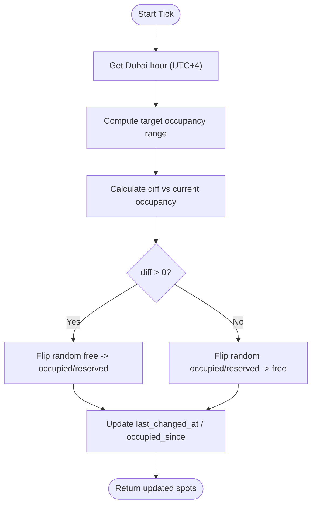
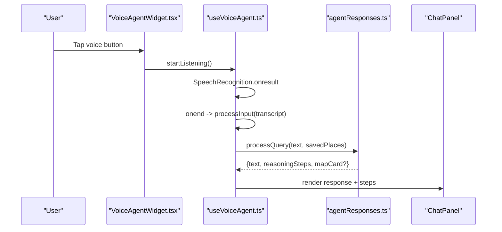
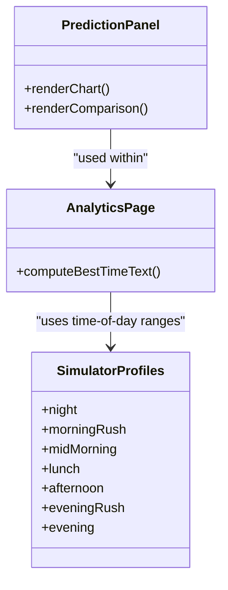
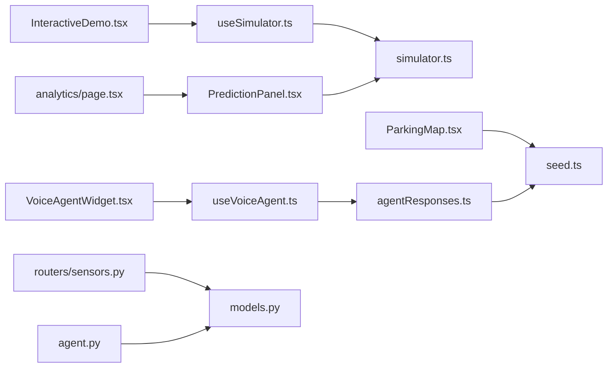

# Core Features

<cite>
**Referenced Files in This Document**
- [frontend/src/app/demo/page.tsx](file://frontend/src/app/demo/page.tsx)
- [frontend/src/components/landing/InteractiveDemo.tsx](file://frontend/src/components/landing/InteractiveDemo.tsx)
- [frontend/src/hooks/useSimulator.ts](file://frontend/src/hooks/useSimulator.ts)
- [frontend/src/lib/simulator.ts](file://frontend/src/lib/simulator.ts)
- [backend/simulator.py](file://backend/simulator.py)
- [frontend/src/components/map/ParkingMap.tsx](file://frontend/src/components/map/ParkingMap.tsx)
- [frontend/src/components/map/SpotMarker.tsx](file://frontend/src/components/map/SpotMarker.tsx)
- [frontend/src/components/map/ZonePolygon.tsx](file://frontend/src/components/map/ZonePolygon.tsx)
- [frontend/src/components/map/SavedPlaceMarker.tsx](file://frontend/src/components/map/SavedPlaceMarker.tsx)
- [frontend/src/components/map/SearchBar.tsx](file://frontend/src/components/map/SearchBar.tsx)
- [frontend/src/components/map/MapControls.tsx](file://frontend/src/components/map/MapControls.tsx)
- [frontend/src/components/map/CurrentLocation.tsx](file://frontend/src/components/map/CurrentLocation.tsx)
- [frontend/src/components/map/SpotSheet.tsx](file://frontend/src/components/map/SpotSheet.tsx)
- [frontend/src/components/map/leaflet-import.ts](file://frontend/src/components/map/leaflet-import.ts)
- [frontend/src/components/voice/VoiceAgentWidget.tsx](file://frontend/src/components/voice/VoiceAgentWidget.tsx)
- [frontend/src/hooks/useVoiceAgent.ts](file://frontend/src/hooks/useVoiceAgent.ts)
- [frontend/src/lib/agentResponses.ts](file://frontend/src/lib/agentResponses.ts)
- [backend/agent.py](file://backend/agent.py)
- [frontend/src/app/analytics/page.tsx](file://frontend/src/app/analytics/page.tsx)
- [frontend/src/components/predictions/PredictionPanel.tsx](file://frontend/src/components/predictions/PredictionPanel.tsx)
- [frontend/src/components/places/PlacesContext.tsx](file://frontend/src/components/places/PlacesContext.tsx)
- [frontend/src/data/seed.ts](file://frontend/src/data/seed.ts)
- [backend/routers/sensors.py](file://backend/routers/sensors.py)
- [backend/models.py](file://backend/models.py)
</cite>

## Table of Contents
1. Introduction
2. Project Structure
3. Core Components
4. Architecture Overview
5. Detailed Component Analysis
6. Dependency Analysis
7. Performance Considerations
8. Troubleshooting Guide
9. Conclusion

## Introduction
This document explains SmartPark AI’s core features with a focus on the interactive demo system, real-time parking map, AI voice assistant, predictive analytics, place management, and IoT sensor integration. It provides usage examples, configuration options, and customization guidelines to help you run, extend, and tailor each feature without requiring backend dependencies for the frontend demo.

## Project Structure
SmartPark AI is organized into a Next.js frontend and a Python backend:
- Frontend (Next.js): Interactive demos, map UI, voice agent, predictions, places context, and seed data.
- Backend (FastAPI + SQLAlchemy): Simulation loop, agent logic, sensors API, and data models.

**Diagram sources**
- [frontend/src/app/demo/page.tsx:1-37](file://frontend/src/app/demo/page.tsx#L1-L37)
- [frontend/src/components/landing/InteractiveDemo.tsx:1-290](file://frontend/src/components/landing/InteractiveDemo.tsx#L1-L290)
- [frontend/src/hooks/useSimulator.ts:1-62](file://frontend/src/hooks/useSimulator.ts#L1-L62)
- [frontend/src/lib/simulator.ts:1-73](file://frontend/src/lib/simulator.ts#L1-L73)
- [backend/simulator.py:1-105](file://backend/simulator.py#L1-L105)
- [frontend/src/components/voice/VoiceAgentWidget.tsx:1-22](file://frontend/src/components/voice/VoiceAgentWidget.tsx#L1-L22)
- [frontend/src/hooks/useVoiceAgent.ts:1-227](file://frontend/src/hooks/useVoiceAgent.ts#L1-L227)
- [frontend/src/lib/agentResponses.ts:1-131](file://frontend/src/lib/agentResponses.ts#L1-L131)
- [backend/agent.py:1-261](file://backend/agent.py#L1-L261)
- [frontend/src/app/analytics/page.tsx:1-87](file://frontend/src/app/analytics/page.tsx#L1-L87)
- [frontend/src/components/predictions/PredictionPanel.tsx:1-38](file://frontend/src/components/predictions/PredictionPanel.tsx#L1-L38)
- [frontend/src/components/places/PlacesContext.tsx:1-77](file://frontend/src/components/places/PlacesContext.tsx#L1-L77)
- [frontend/src/data/seed.ts:1-138](file://frontend/src/data/seed.ts#L1-L138)
- [backend/routers/sensors.py:1-28](file://backend/routers/sensors.py#L1-L28)
- [backend/models.py:1-89](file://backend/models.py#L1-L89)

**Section sources**
- [frontend/src/app/demo/page.tsx:1-37](file://frontend/src/app/demo/page.tsx#L1-L37)
- [frontend/src/components/landing/InteractiveDemo.tsx:1-290](file://frontend/src/components/landing/InteractiveDemo.tsx#L1-L290)
- [frontend/src/hooks/useSimulator.ts:1-62](file://frontend/src/hooks/useSimulator.ts#L1-L62)
- [frontend/src/lib/simulator.ts:1-73](file://frontend/src/lib/simulator.ts#L1-L73)
- [backend/simulator.py:1-105](file://backend/simulator.py#L1-L105)
- [frontend/src/components/voice/VoiceAgentWidget.tsx:1-22](file://frontend/src/components/voice/VoiceAgentWidget.tsx#L1-L22)
- [frontend/src/hooks/useVoiceAgent.ts:1-227](file://frontend/src/hooks/useVoiceAgent.ts#L1-L227)
- [frontend/src/lib/agentResponses.ts:1-131](file://frontend/src/lib/agentResponses.ts#L1-L131)
- [backend/agent.py:1-261](file://backend/agent.py#L1-L261)
- [frontend/src/app/analytics/page.tsx:1-87](file://frontend/src/app/analytics/page.tsx#L1-L87)
- [frontend/src/components/predictions/PredictionPanel.tsx:1-38](file://frontend/src/components/predictions/PredictionPanel.tsx#L1-L38)
- [frontend/src/components/places/PlacesContext.tsx:1-77](file://frontend/src/components/places/PlacesContext.tsx#L1-L77)
- [frontend/src/data/seed.ts:1-138](file://frontend/src/data/seed.ts#L1-L138)
- [backend/routers/sensors.py:1-28](file://backend/routers/sensors.py#L1-L28)
- [backend/models.py:1-89](file://backend/models.py#L1-L89)

## Core Components
- Interactive Demo System: Standalone simulation with time-of-day occupancy profiles and live spot updates.
- Real-time Parking Map: Leaflet-based map with custom spot markers, zone polygons, saved place markers, search bar, controls, current location, and spot detail sheet.
- AI Voice Assistant: Speech recognition, natural language processing, contextual responses, reasoning steps, and visual chat interface.
- Predictive Analytics: 12-hour occupancy forecasts, confidence scoring, and historical pattern analysis.
- Place Management: Saved locations, quick access, and route planning support via context and seed data.
- IoT Sensor Integration: Device health monitoring, battery levels, firmware management, and fleet summary API.

**Section sources**
- [frontend/src/components/landing/InteractiveDemo.tsx:1-290](file://frontend/src/components/landing/InteractiveDemo.tsx#L1-L290)
- [frontend/src/hooks/useSimulator.ts:1-62](file://frontend/src/hooks/useSimulator.ts#L1-L62)
- [frontend/src/lib/simulator.ts:1-73](file://frontend/src/lib/simulator.ts#L1-L73)
- [frontend/src/components/map/ParkingMap.tsx](file://frontend/src/components/map/ParkingMap.tsx)
- [frontend/src/components/map/SpotMarker.tsx](file://frontend/src/components/map/SpotMarker.tsx)
- [frontend/src/components/map/ZonePolygon.tsx](file://frontend/src/components/map/ZonePolygon.tsx)
- [frontend/src/components/map/SavedPlaceMarker.tsx](file://frontend/src/components/map/SavedPlaceMarker.tsx)
- [frontend/src/components/map/SearchBar.tsx](file://frontend/src/components/map/SearchBar.tsx)
- [frontend/src/components/map/MapControls.tsx](file://frontend/src/components/map/MapControls.tsx)
- [frontend/src/components/map/CurrentLocation.tsx](file://frontend/src/components/map/CurrentLocation.tsx)
- [frontend/src/components/map/SpotSheet.tsx](file://frontend/src/components/map/SpotSheet.tsx)
- [frontend/src/components/voice/VoiceAgentWidget.tsx:1-22](file://frontend/src/components/voice/VoiceAgentWidget.tsx#L1-L22)
- [frontend/src/hooks/useVoiceAgent.ts:1-227](file://frontend/src/hooks/useVoiceAgent.ts#L1-L227)
- [frontend/src/lib/agentResponses.ts:1-131](file://frontend/src/lib/agentResponses.ts#L1-L131)
- [backend/agent.py:1-261](file://backend/agent.py#L1-L261)
- [frontend/src/app/analytics/page.tsx:1-87](file://frontend/src/app/analytics/page.tsx#L1-L87)
- [frontend/src/components/predictions/PredictionPanel.tsx:1-38](file://frontend/src/components/predictions/PredictionPanel.tsx#L1-L38)
- [frontend/src/components/places/PlacesContext.tsx:1-77](file://frontend/src/components/places/PlacesContext.tsx#L1-L77)
- [frontend/src/data/seed.ts:1-138](file://frontend/src/data/seed.ts#L1-L138)
- [backend/routers/sensors.py:1-28](file://backend/routers/sensors.py#L1-L28)
- [backend/models.py:1-89](file://backend/models.py#L1-L89)

## Architecture Overview
The system supports two modes:
- Standalone mode: The frontend runs entirely client-side using seed data and local simulators. No backend required.
- Integrated mode: The backend simulator and agent provide authoritative state and advanced logic; the frontend can consume these services.

**Diagram sources**
- [frontend/src/components/landing/InteractiveDemo.tsx:1-290](file://frontend/src/components/landing/InteractiveDemo.tsx#L1-L290)
- [frontend/src/hooks/useSimulator.ts:1-62](file://frontend/src/hooks/useSimulator.ts#L1-L62)
- [frontend/src/lib/simulator.ts:1-73](file://frontend/src/lib/simulator.ts#L1-L73)
- [frontend/src/components/map/ParkingMap.tsx](file://frontend/src/components/map/ParkingMap.tsx)
- [frontend/src/data/seed.ts:1-138](file://frontend/src/data/seed.ts#L1-L138)

## Detailed Component Analysis

### Interactive Demo System
- Purpose: Provide a standalone simulation of parking spot states without backend dependencies.
- Behavior:
  - Initializes spots per zone with realistic distributions.
  - Ticks periodically to flip spot statuses toward a time-of-day target occupancy.
  - Allows manual toggling and speed control.
- Key implementation points:
  - Time-of-day targets are computed from Dubai local time (UTC+4).
  - Spot flipping respects constraints (e.g., skipping offline sensors).
  - Visual feedback highlights recently changed spots.

Usage examples:
- Start/stop simulation and adjust speed via toolbar controls.
- Click any free spot to reserve it; click again to cycle states.

Configuration options:
- Speed multiplier affects tick frequency.
- Initial distribution of free/occupied/reserved can be tuned in seed data or initialization logic.

Customization guidelines:
- Extend OCCUPANCY_PROFILES to add more granular time windows.
- Adjust flip probabilities and counts to match expected traffic patterns.

**Section sources**
- [frontend/src/components/landing/InteractiveDemo.tsx:1-290](file://frontend/src/components/landing/InteractiveDemo.tsx#L1-L290)
- [frontend/src/hooks/useSimulator.ts:1-62](file://frontend/src/hooks/useSimulator.ts#L1-L62)
- [frontend/src/lib/simulator.ts:1-73](file://frontend/src/lib/simulator.ts#L1-L73)
- [backend/simulator.py:1-105](file://backend/simulator.py#L1-L105)

#### Flowchart: Occupancy Targeting and Spot Flipping

**Diagram sources**
- [frontend/src/lib/simulator.ts:1-73](file://frontend/src/lib/simulator.ts#L1-L73)
- [backend/simulator.py:1-105](file://backend/simulator.py#L1-L105)

### Real-time Parking Map with Leaflet
- Purpose: Visualize parking zones, spots, and saved places with interactive controls.
- Components:
  - ParkingMap: Main map container and lifecycle.
  - SpotMarker: Custom marker per spot with status-aware visuals.
  - ZonePolygon: Polygon overlay per zone with GeoJSON.
  - SavedPlaceMarker: Marker for user-saved locations.
  - SearchBar: Text input for searching places or zones.
  - MapControls: Zoom, layers, and view toggles.
  - CurrentLocation: Displays user’s current position.
  - SpotSheet: Detail panel for selected spot.
  - leaflet-import: Dynamic import strategy for Leaflet assets.

Usage examples:
- Pan/zoom to explore zones.
- Click a spot to open its detail sheet.
- Use search to find saved places or nearby zones.

Configuration options:
- Seed data defines zones, spots, and saved places.
- Leaflet dynamic import avoids SSR issues.

Customization guidelines:
- Add new zones by extending seed data with GeoJSON polygons.
- Customize marker icons and colors based on spot status.
- Integrate geolocation APIs for accurate current location.

**Section sources**
- [frontend/src/app/demo/page.tsx:1-37](file://frontend/src/app/demo/page.tsx#L1-L37)
- [frontend/src/components/map/ParkingMap.tsx](file://frontend/src/components/map/ParkingMap.tsx)
- [frontend/src/components/map/SpotMarker.tsx](file://frontend/src/components/map/SpotMarker.tsx)
- [frontend/src/components/map/ZonePolygon.tsx](file://frontend/src/components/map/ZonePolygon.tsx)
- [frontend/src/components/map/SavedPlaceMarker.tsx](file://frontend/src/components/map/SavedPlaceMarker.tsx)
- [frontend/src/components/map/SearchBar.tsx](file://frontend/src/components/map/SearchBar.tsx)
- [frontend/src/components/map/MapControls.tsx](file://frontend/src/components/map/MapControls.tsx)
- [frontend/src/components/map/CurrentLocation.tsx](file://frontend/src/components/map/CurrentLocation.tsx)
- [frontend/src/components/map/SpotSheet.tsx](file://frontend/src/components/map/SpotSheet.tsx)
- [frontend/src/components/map/leaflet-import.ts](file://frontend/src/components/map/leaflet-import.ts)
- [frontend/src/data/seed.ts:1-138](file://frontend/src/data/seed.ts#L1-L138)

### AI Voice Assistant
- Purpose: Provide speech-enabled conversational assistance for parking queries.
- Client-side flow:
  - useVoiceAgent manages browser SpeechRecognition, transcript capture, and response rendering.
  - agentResponses processes text queries into structured results with reasoning steps and optional map cards.
  - VoiceAgentWidget composes button, overlay, and chat panel.
- Server-side agent (optional):
  - backend/agent.py detects intents, resolves saved places, computes scores, and returns responses with map card data.

Usage examples:
- Tap the voice button and say “Where can I park near work?”
- Type queries in the chat panel for text-only interaction.

Configuration options:
- Language set to en-US; enable interim results for live transcription.
- Reasoning steps animation timing can be adjusted.

Customization guidelines:
- Extend processQuery patterns to support additional intents.
- Replace client-side responses with backend calls when integrated.

**Diagram sources**
- [frontend/src/components/voice/VoiceAgentWidget.tsx:1-22](file://frontend/src/components/voice/VoiceAgentWidget.tsx#L1-L22)
- [frontend/src/hooks/useVoiceAgent.ts:1-227](file://frontend/src/hooks/useVoiceAgent.ts#L1-L227)
- [frontend/src/lib/agentResponses.ts:1-131](file://frontend/src/lib/agentResponses.ts#L1-L131)

**Section sources**
- [frontend/src/components/voice/VoiceAgentWidget.tsx:1-22](file://frontend/src/components/voice/VoiceAgentWidget.tsx#L1-L22)
- [frontend/src/hooks/useVoiceAgent.ts:1-227](file://frontend/src/hooks/useVoiceAgent.ts#L1-L227)
- [frontend/src/lib/agentResponses.ts:1-131](file://frontend/src/lib/agentResponses.ts#L1-L131)
- [backend/agent.py:1-261](file://backend/agent.py#L1-L261)

### Predictive Analytics
- Purpose: Show 12-hour occupancy forecasts, confidence scoring, and historical pattern analysis.
- Implementation:
  - PredictionPanel orchestrates chart and zone comparison views.
  - Analytics page provides best-time recommendations based on time-of-day profiles.
  - Simulator profiles define hourly ranges used for forecasting.

Usage examples:
- View forecast charts and compare zones side-by-side.
- Read best-time-to-park guidance derived from current hour.

Configuration options:
- Profiles define low/high occupancy ranges per time window.
- Confidence values can be attached to predictions for risk assessment.

Customization guidelines:
- Expand prediction horizon beyond 12 hours by adjusting UI and data structures.
- Integrate ML model outputs into Prediction model fields.

**Diagram sources**
- [frontend/src/components/predictions/PredictionPanel.tsx:1-38](file://frontend/src/components/predictions/PredictionPanel.tsx#L1-L38)
- [frontend/src/app/analytics/page.tsx:1-87](file://frontend/src/app/analytics/page.tsx#L1-L87)
- [frontend/src/lib/simulator.ts:1-73](file://frontend/src/lib/simulator.ts#L1-L73)

**Section sources**
- [frontend/src/components/predictions/PredictionPanel.tsx:1-38](file://frontend/src/components/predictions/PredictionPanel.tsx#L1-L38)
- [frontend/src/app/analytics/page.tsx:1-87](file://frontend/src/app/analytics/page.tsx#L1-L87)
- [frontend/src/lib/simulator.ts:1-73](file://frontend/src/lib/simulator.ts#L1-L73)

### Place Management System
- Purpose: Manage saved locations for quick access and route planning.
- Implementation:
  - PlacesContext provides CRUD operations and persists to localStorage.
  - Seed data includes default saved places (home, work, gym).
  - Voice assistant references saved places for intent resolution.

Usage examples:
- Add/edit/remove saved places via UI components that consume PlacesContext.
- Ask the voice assistant to find parking near a saved place label.

Configuration options:
- Storage key for persistence can be customized.
- Seed data can be extended with additional locations.

Customization guidelines:
- Integrate geocoding APIs to auto-populate addresses.
- Support multiple users by scoping storage keys or backend accounts.

**Section sources**
- [frontend/src/components/places/PlacesContext.tsx:1-77](file://frontend/src/components/places/PlacesContext.tsx#L1-L77)
- [frontend/src/data/seed.ts:1-138](file://frontend/src/data/seed.ts#L1-L138)
- [frontend/src/hooks/useVoiceAgent.ts:1-227](file://frontend/src/hooks/useVoiceAgent.ts#L1-L227)
- [backend/agent.py:1-261](file://backend/agent.py#L1-L261)

### IoT Sensor Integration
- Purpose: Monitor device health, battery levels, and firmware across the sensor fleet.
- Implementation:
  - Sensors router exposes a fleet summary endpoint aggregating online/offline counts and low-battery alerts.
  - Models define Sensor attributes including firmware_version, battery_mv, signal_rssi, last_heartbeat, and status.

Usage examples:
- Call GET /api/sensors to retrieve fleet health summary.
- Display low-battery warnings and schedule maintenance for offline devices.

Configuration options:
- Low-battery threshold defined in the router logic.
- Firmware version strings can be parsed for upgrade workflows.

Customization guidelines:
- Add endpoints for individual sensor details and firmware update commands.
- Integrate telemetry ingestion pipelines to update heartbeat and battery metrics.

**Section sources**
- [backend/routers/sensors.py:1-28](file://backend/routers/sensors.py#L1-L28)
- [backend/models.py:1-89](file://backend/models.py#L1-L89)

## Dependency Analysis
Key relationships among core modules:
- Interactive demo depends on useSimulator and simulator lib for state changes.
- Map components depend on seed data for zones, spots, and saved places.
- Voice assistant depends on useVoiceAgent and agentResponses; optionally integrates with backend agent.
- Predictive analytics rely on simulator profiles and UI panels.
- IoT sensors depend on models and routers for fleet summaries.

**Diagram sources**
- [frontend/src/components/landing/InteractiveDemo.tsx:1-290](file://frontend/src/components/landing/InteractiveDemo.tsx#L1-L290)
- [frontend/src/hooks/useSimulator.ts:1-62](file://frontend/src/hooks/useSimulator.ts#L1-L62)
- [frontend/src/lib/simulator.ts:1-73](file://frontend/src/lib/simulator.ts#L1-L73)
- [frontend/src/components/map/ParkingMap.tsx](file://frontend/src/components/map/ParkingMap.tsx)
- [frontend/src/data/seed.ts:1-138](file://frontend/src/data/seed.ts#L1-L138)
- [frontend/src/components/voice/VoiceAgentWidget.tsx:1-22](file://frontend/src/components/voice/VoiceAgentWidget.tsx#L1-L22)
- [frontend/src/hooks/useVoiceAgent.ts:1-227](file://frontend/src/hooks/useVoiceAgent.ts#L1-L227)
- [frontend/src/lib/agentResponses.ts:1-131](file://frontend/src/lib/agentResponses.ts#L1-L131)
- [frontend/src/app/analytics/page.tsx:1-87](file://frontend/src/app/analytics/page.tsx#L1-L87)
- [frontend/src/components/predictions/PredictionPanel.tsx:1-38](file://frontend/src/components/predictions/PredictionPanel.tsx#L1-L38)
- [backend/routers/sensors.py:1-28](file://backend/routers/sensors.py#L1-L28)
- [backend/models.py:1-89](file://backend/models.py#L1-L89)
- [backend/agent.py:1-261](file://backend/agent.py#L1-L261)

**Section sources**
- [frontend/src/components/landing/InteractiveDemo.tsx:1-290](file://frontend/src/components/landing/InteractiveDemo.tsx#L1-L290)
- [frontend/src/hooks/useSimulator.ts:1-62](file://frontend/src/hooks/useSimulator.ts#L1-L62)
- [frontend/src/lib/simulator.ts:1-73](file://frontend/src/lib/simulator.ts#L1-L73)
- [frontend/src/components/map/ParkingMap.tsx](file://frontend/src/components/map/ParkingMap.tsx)
- [frontend/src/data/seed.ts:1-138](file://frontend/src/data/seed.ts#L1-L138)
- [frontend/src/components/voice/VoiceAgentWidget.tsx:1-22](file://frontend/src/components/voice/VoiceAgentWidget.tsx#L1-L22)
- [frontend/src/hooks/useVoiceAgent.ts:1-227](file://frontend/src/hooks/useVoiceAgent.ts#L1-L227)
- [frontend/src/lib/agentResponses.ts:1-131](file://frontend/src/lib/agentResponses.ts#L1-L131)
- [frontend/src/app/analytics/page.tsx:1-87](file://frontend/src/app/analytics/page.tsx#L1-L87)
- [frontend/src/components/predictions/PredictionPanel.tsx:1-38](file://frontend/src/components/predictions/PredictionPanel.tsx#L1-L38)
- [backend/routers/sensors.py:1-28](file://backend/routers/sensors.py#L1-L28)
- [backend/models.py:1-89](file://backend/models.py#L1-L89)
- [backend/agent.py:1-261](file://backend/agent.py#L1-L261)

## Performance Considerations
- Avoid heavy computations on the main thread during ticks; consider Web Workers for large datasets.
- Debounce map interactions and batch updates to reduce re-renders.
- Use dynamic imports for Leaflet to minimize initial bundle size.
- Cache frequently accessed data (zones, saved places) in memory and persist only deltas.
- For backend simulation, limit DB writes per tick and broadcast only changed spots.

[No sources needed since this section provides general guidance]

## Troubleshooting Guide
Common issues and resolutions:
- Speech recognition not supported: Ensure modern browser and HTTPS context; check error state in useVoiceAgent.
- Map does not load: Verify dynamic import of Leaflet and correct environment variables for tile providers.
- Simulation not updating: Confirm timer intervals are running and speed is non-zero; check for unhandled exceptions in hooks.
- Sensor fleet shows high offline count: Validate heartbeat timestamps and network connectivity; review low-battery thresholds.

**Section sources**
- [frontend/src/hooks/useVoiceAgent.ts:1-227](file://frontend/src/hooks/useVoiceAgent.ts#L1-L227)
- [frontend/src/components/map/leaflet-import.ts](file://frontend/src/components/map/leaflet-import.ts)
- [frontend/src/hooks/useSimulator.ts:1-62](file://frontend/src/hooks/useSimulator.ts#L1-L62)
- [backend/routers/sensors.py:1-28](file://backend/routers/sensors.py#L1-L28)

## Conclusion
SmartPark AI delivers a robust, extensible platform for parking intelligence. Its standalone demo enables rapid prototyping without backend dependencies, while the modular architecture supports seamless integration with server-side simulation, agent logic, and IoT telemetry. By following the usage examples, configuration options, and customization guidelines outlined here, teams can tailor the system to diverse operational needs and scale confidently.