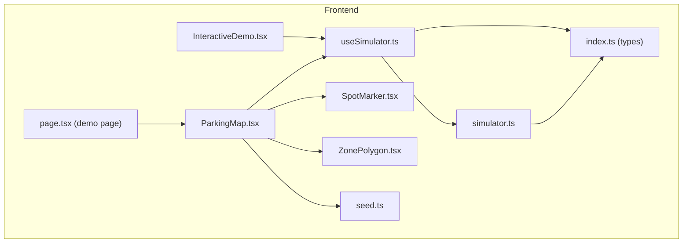
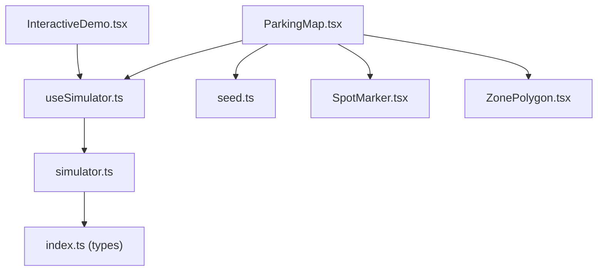
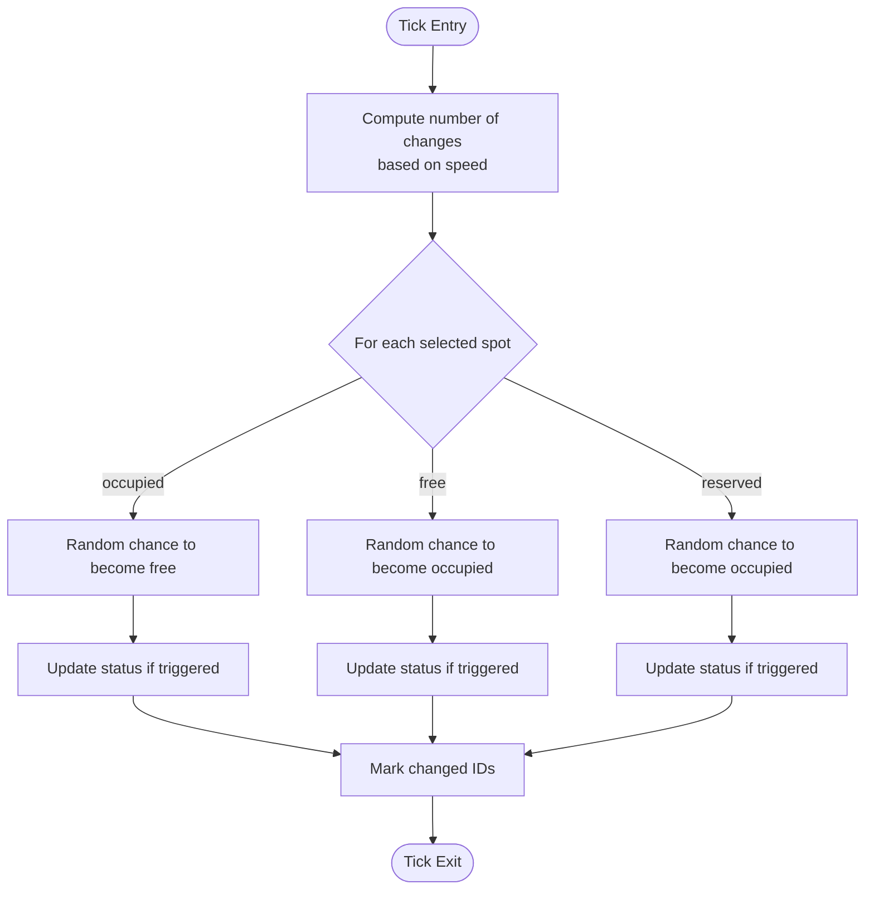
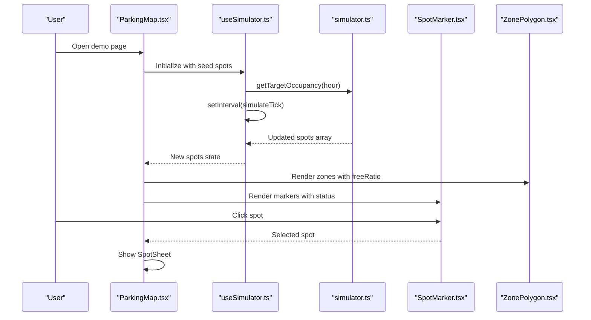
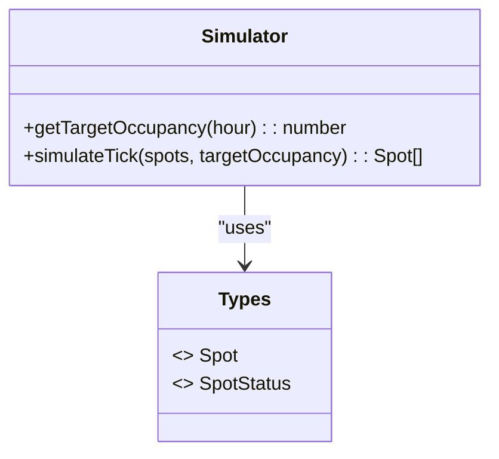
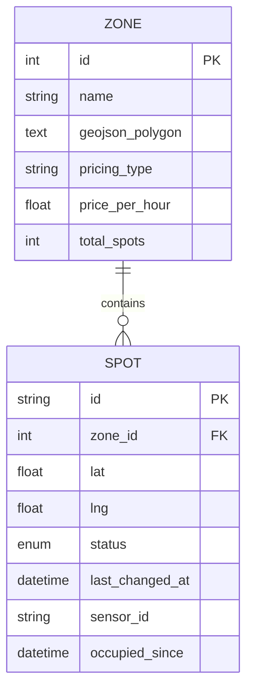
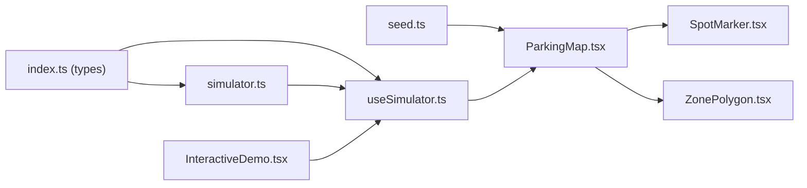
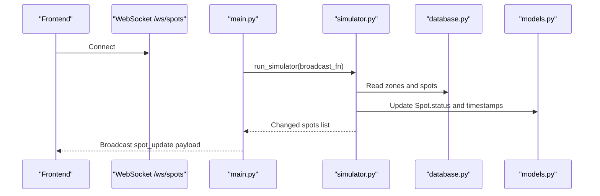

# Interactive Demo System

<cite>
**Referenced Files in This Document**
- [InteractiveDemo.tsx](file://frontend/src/components/landing/InteractiveDemo.tsx)
- [useSimulator.ts](file://frontend/src/hooks/useSimulator.ts)
- [simulator.ts](file://frontend/src/lib/simulator.ts)
- [ParkingMap.tsx](file://frontend/src/components/map/ParkingMap.tsx)
- [SpotMarker.tsx](file://frontend/src/components/map/SpotMarker.tsx)
- [ZonePolygon.tsx](file://frontend/src/components/map/ZonePolygon.tsx)
- [seed.ts](file://frontend/src/data/seed.ts)
- [index.ts (types)](file://frontend/src/types/index.ts)
- [page.tsx (demo page)](file://frontend/src/app/demo/page.tsx)
- [main.py](file://backend/main.py)
- [simulator.py](file://backend/simulator.py)
- [models.py](file://backend/models.py)
- [database.py](file://backend/database.py)
</cite>

## Table of Contents
1. [Introduction](#introduction)
2. [Project Structure](#project-structure)
3. [Core Components](#core-components)
4. [Architecture Overview](#architecture-overview)
5. [Detailed Component Analysis](#detailed-component-analysis)
6. [Dependency Analysis](#dependency-analysis)
7. [Performance Considerations](#performance-considerations)
8. [Troubleshooting Guide](#troubleshooting-guide)
9. [Conclusion](#conclusion)
10. [Appendices](#appendices)

## Introduction
This document describes the Interactive Demo System that provides a standalone, frontend-only simulation of real-time parking spot availability. It simulates 48 spots across three zones with live status transitions between free, occupied, and reserved states. Users can interact by clicking spots to change their state and control simulation speed. The system includes visual feedback with color coding, animations, and live indicators. Configuration options are provided for simulation parameters, zone layouts, and integration patterns for connecting to backend services when needed.

## Project Structure
The demo is implemented entirely on the frontend using React and Next.js. Key areas include:
- Landing interactive demo component with grid-based visualization and controls
- Map-based interactive demo with Leaflet markers and polygons
- Simulation engine and hook for time-of-day occupancy targeting
- Seed data for zones and spots
- Type definitions for shared models

**Diagram sources**
- [InteractiveDemo.tsx:1-290](file://frontend/src/components/landing/InteractiveDemo.tsx#L1-L290)
- [ParkingMap.tsx:1-108](file://frontend/src/components/map/ParkingMap.tsx#L1-L108)
- [useSimulator.ts:1-62](file://frontend/src/hooks/useSimulator.ts#L1-L62)
- [simulator.ts:1-73](file://frontend/src/lib/simulator.ts#L1-L73)
- [SpotMarker.tsx:1-45](file://frontend/src/components/map/SpotMarker.tsx#L1-L45)
- [ZonePolygon.tsx:1-38](file://frontend/src/components/map/ZonePolygon.tsx#L1-L38)
- [seed.ts:1-138](file://frontend/src/data/seed.ts#L1-L138)
- [index.ts (types):1-75](file://frontend/src/types/index.ts#L1-L75)
- [page.tsx (demo page):1-37](file://frontend/src/app/demo/page.tsx#L1-L37)

**Section sources**
- [InteractiveDemo.tsx:1-290](file://frontend/src/components/landing/InteractiveDemo.tsx#L1-L290)
- [ParkingMap.tsx:1-108](file://frontend/src/components/map/ParkingMap.tsx#L1-L108)
- [useSimulator.ts:1-62](file://frontend/src/hooks/useSimulator.ts#L1-L62)
- [simulator.ts:1-73](file://frontend/src/lib/simulator.ts#L1-L73)
- [seed.ts:1-138](file://frontend/src/data/seed.ts#L1-L138)
- [index.ts (types):1-75](file://frontend/src/types/index.ts#L1-L75)
- [page.tsx (demo page):1-37](file://frontend/src/app/demo/page.tsx#L1-L37)

## Core Components
- InteractiveDemo: Standalone grid-based demo with 48 spots across 3 zones, click-to-toggle interactions, live occupancy metrics, and speed controls.
- ParkingMap: Map-based demo using Leaflet, rendering zones as polygons and spots as markers, integrated with the simulator hook.
- useSimulator: Hook managing simulation lifecycle, speed, and interval scheduling; computes target occupancy based on local time.
- simulator: Pure functions implementing time-of-day occupancy profiles and tick logic to transition spot statuses toward targets.
- seed: Generates initial zones and spots with realistic distributions and coordinates.
- types: Shared TypeScript interfaces for Spot, Zone, Sensor, etc.

Key responsibilities:
- State management: Local React state holds spot arrays and UI flags.
- Simulation loop: Interval-driven updates compute changes per tick.
- User interaction: Click handlers toggle spot states.
- Visualization: Color-coded tiles/markers and animated indicators reflect current states.

**Section sources**
- [InteractiveDemo.tsx:1-290](file://frontend/src/components/landing/InteractiveDemo.tsx#L1-L290)
- [ParkingMap.tsx:1-108](file://frontend/src/components/map/ParkingMap.tsx#L1-L108)
- [useSimulator.ts:1-62](file://frontend/src/hooks/useSimulator.ts#L1-L62)
- [simulator.ts:1-73](file://frontend/src/lib/simulator.ts#L1-L73)
- [seed.ts:1-138](file://frontend/src/data/seed.ts#L1-L138)
- [index.ts (types):1-75](file://frontend/src/types/index.ts#L1-L75)

## Architecture Overview
The demo architecture separates concerns into UI components, simulation logic, and data seeding. The landing demo uses a simple grid layout, while the map demo renders geographic elements. Both share the same simulation model and type definitions.

**Diagram sources**
- [InteractiveDemo.tsx:1-290](file://frontend/src/components/landing/InteractiveDemo.tsx#L1-L290)
- [ParkingMap.tsx:1-108](file://frontend/src/components/map/ParkingMap.tsx#L1-L108)
- [useSimulator.ts:1-62](file://frontend/src/hooks/useSimulator.ts#L1-L62)
- [simulator.ts:1-73](file://frontend/src/lib/simulator.ts#L1-L73)
- [index.ts (types):1-75](file://frontend/src/types/index.ts#L1-L75)
- [seed.ts:1-138](file://frontend/src/data/seed.ts#L1-L138)
- [SpotMarker.tsx:1-45](file://frontend/src/components/map/SpotMarker.tsx#L1-L45)
- [ZonePolygon.tsx:1-38](file://frontend/src/components/map/ZonePolygon.tsx#L1-L38)

## Detailed Component Analysis

### InteractiveDemo (Grid-Based Demo)
- Spots initialization: Creates 48 spots across 3 zones (A, B, C), each with two rows of eight columns. Random initial distribution favors occupied over free/reserved.
- Status transitions: On each tick, a random subset of spots flips states probabilistically based on current status.
- User interaction: Clicking a spot cycles its state through free → reserved → occupied → free.
- Visual feedback: Color-coded tiles with symbols and pulsing indicators; animation class applied briefly on changes.
- Controls: Speed buttons (1x, 3x) and pause/resume toggle.
- Metrics: Overall occupancy percentage, nearest free spot suggestion, zone availability counts, sensor network status display.

**Diagram sources**
- [InteractiveDemo.tsx:43-82](file://frontend/src/components/landing/InteractiveDemo.tsx#L43-L82)

**Section sources**
- [InteractiveDemo.tsx:1-290](file://frontend/src/components/landing/InteractiveDemo.tsx#L1-L290)

### ParkingMap (Map-Based Demo)
- Rendering: Uses Leaflet with dark basemap tiles; draws zone polygons and spot markers.
- Integration: Consumes useSimulator to get live spot states; toggles simulation via MapControls.
- Interactions: Clicking a marker opens a bottom sheet with spot details.
- Zones: Polygons colored by availability ratio; tooltips show free/total counts.
- Markers: Circle markers colored by status; popups show id and status.

**Diagram sources**
- [ParkingMap.tsx:1-108](file://frontend/src/components/map/ParkingMap.tsx#L1-L108)
- [useSimulator.ts:1-62](file://frontend/src/hooks/useSimulator.ts#L1-L62)
- [simulator.ts:1-73](file://frontend/src/lib/simulator.ts#L1-L73)
- [SpotMarker.tsx:1-45](file://frontend/src/components/map/SpotMarker.tsx#L1-L45)
- [ZonePolygon.tsx:1-38](file://frontend/src/components/map/ZonePolygon.tsx#L1-L38)

**Section sources**
- [ParkingMap.tsx:1-108](file://frontend/src/components/map/ParkingMap.tsx#L1-L108)
- [SpotMarker.tsx:1-45](file://frontend/src/components/map/SpotMarker.tsx#L1-L45)
- [ZonePolygon.tsx:1-38](file://frontend/src/components/map/ZonePolygon.tsx#L1-L38)

### Simulator Engine (Time-of-Day Targeting)
- Occupancy profiles: Defines ranges for different times of day (night, morning rush, mid-morning, lunch, afternoon, evening rush, evening).
- Target calculation: Picks a random target within the range for the current hour (Dubai UTC+4).
- Tick algorithm: Computes difference between target and current occupancy; flips a bounded number of spots to move toward target. Skips offline sensors. Updates timestamps and occupancy start times.

**Diagram sources**
- [simulator.ts:1-73](file://frontend/src/lib/simulator.ts#L1-L73)
- [index.ts (types):1-75](file://frontend/src/types/index.ts#L1-L75)

**Section sources**
- [simulator.ts:1-73](file://frontend/src/lib/simulator.ts#L1-L73)
- [index.ts (types):1-75](file://frontend/src/types/index.ts#L1-L75)

### Data Seeding and Layouts
- Zones: Three zones with GeoJSON polygons and pricing metadata.
- Spots: Generated per zone with randomized positions and status distributions (~35% free, ~55% occupied, ~10% reserved).
- Saved places: Example locations for navigation context.

**Diagram sources**
- [seed.ts:1-138](file://frontend/src/data/seed.ts#L1-L138)
- [index.ts (types):1-75](file://frontend/src/types/index.ts#L1-L75)

**Section sources**
- [seed.ts:1-138](file://frontend/src/data/seed.ts#L1-L138)
- [index.ts (types):1-75](file://frontend/src/types/index.ts#L1-L75)

### Demo Page Routing
- The demo page dynamically loads the map component client-side and provides a back navigation link.

**Section sources**
- [page.tsx (demo page):1-37](file://frontend/src/app/demo/page.tsx#L1-L37)

## Dependency Analysis
- Frontend dependencies:
  - React and Next.js for UI and routing
  - Leaflet and react-leaflet for mapping
  - Chart.js for analytics (not used in demo core)
- Internal module relationships:
  - useSimulator depends on simulator functions and types
  - ParkingMap depends on useSimulator, SpotMarker, ZonePolygon, and seed data
  - InteractiveDemo is self-contained but mirrors simulator behavior locally

**Diagram sources**
- [index.ts (types):1-75](file://frontend/src/types/index.ts#L1-L75)
- [simulator.ts:1-73](file://frontend/src/lib/simulator.ts#L1-L73)
- [useSimulator.ts:1-62](file://frontend/src/hooks/useSimulator.ts#L1-L62)
- [seed.ts:1-138](file://frontend/src/data/seed.ts#L1-L138)
- [ParkingMap.tsx:1-108](file://frontend/src/components/map/ParkingMap.tsx#L1-L108)
- [SpotMarker.tsx:1-45](file://frontend/src/components/map/SpotMarker.tsx#L1-L45)
- [ZonePolygon.tsx:1-38](file://frontend/src/components/map/ZonePolygon.tsx#L1-L38)
- [InteractiveDemo.tsx:1-290](file://frontend/src/components/landing/InteractiveDemo.tsx#L1-L290)

**Section sources**
- [package.json:1-32](file://frontend/package.json#L1-L32)
- [index.ts (types):1-75](file://frontend/src/types/index.ts#L1-L75)
- [simulator.ts:1-73](file://frontend/src/lib/simulator.ts#L1-L73)
- [useSimulator.ts:1-62](file://frontend/src/hooks/useSimulator.ts#L1-L62)
- [ParkingMap.tsx:1-108](file://frontend/src/components/map/ParkingMap.tsx#L1-L108)
- [InteractiveDemo.tsx:1-290](file://frontend/src/components/landing/InteractiveDemo.tsx#L1-L290)

## Performance Considerations
- Simulation intervals: Use reasonable base intervals (e.g., 2 seconds) and scale by speed factor to avoid excessive re-renders.
- Batched updates: Limit number of spot flips per tick proportional to occupancy difference to keep UI responsive.
- Efficient rendering: Use stable keys and minimal DOM churn; apply short-lived animation classes only on changed items.
- Map performance: Prefer clustering or throttling marker updates if spot count grows significantly.

[No sources needed since this section provides general guidance]

## Troubleshooting Guide
- Simulation not updating:
  - Ensure the interval is started and not cleared prematurely.
  - Verify speed is non-zero and running flag is true.
- Incorrect time-of-day profile:
  - Confirm local timezone offset handling matches expected region (Dubai UTC+4).
- Map markers not reflecting state:
  - Check that spots array is updated and passed down to markers.
  - Validate status values match expected enums.
- Seed data mismatch:
  - Ensure generated spots align with zone totals and distributions.

**Section sources**
- [useSimulator.ts:1-62](file://frontend/src/hooks/useSimulator.ts#L1-L62)
- [simulator.ts:1-73](file://frontend/src/lib/simulator.ts#L1-L73)
- [ParkingMap.tsx:1-108](file://frontend/src/components/map/ParkingMap.tsx#L1-L108)
- [seed.ts:1-138](file://frontend/src/data/seed.ts#L1-L138)

## Conclusion
The Interactive Demo System delivers a fully functional, standalone simulation of real-time parking availability without backend dependencies. It offers intuitive user interactions, clear visual feedback, and configurable simulation parameters. The modular design allows easy extension to integrate with backend services when required.

[No sources needed since this section summarizes without analyzing specific files]

## Appendices

### Backend Integration Patterns (Optional)
If you choose to connect the demo to the backend:
- WebSocket updates: The backend runs a simulator loop and broadcasts spot updates via WebSockets.
- REST endpoints: Routers expose zones, spots, predictions, agents, places, and sensors.
- Database models: Define entities for zones, spots, sensors, saved places, predictions, and park events.

**Diagram sources**
- [main.py:1-64](file://backend/main.py#L1-L64)
- [simulator.py:1-105](file://backend/simulator.py#L1-L105)
- [database.py:1-23](file://backend/database.py#L1-L23)
- [models.py:1-89](file://backend/models.py#L1-L89)

**Section sources**
- [main.py:1-64](file://backend/main.py#L1-L64)
- [simulator.py:1-105](file://backend/simulator.py#L1-L105)
- [database.py:1-23](file://backend/database.py#L1-L23)
- [models.py:1-89](file://backend/models.py#L1-L89)