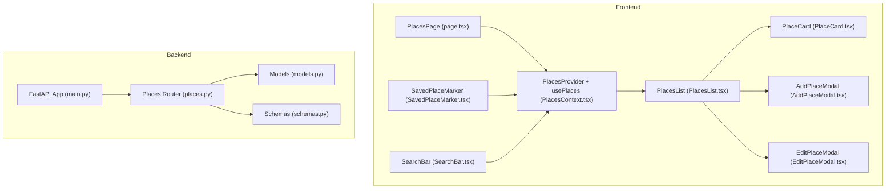
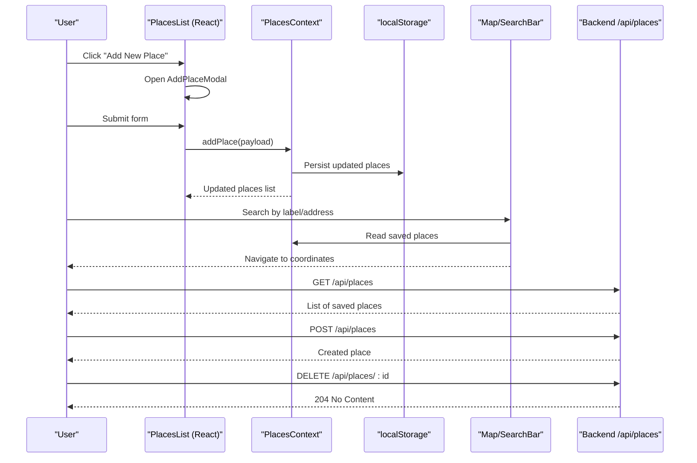
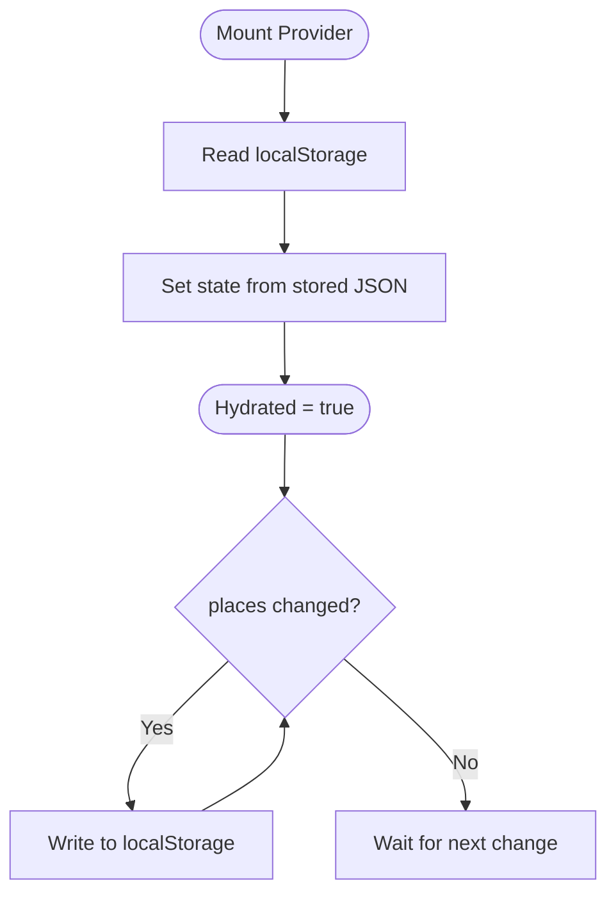
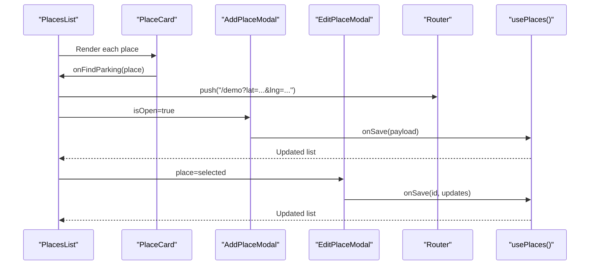
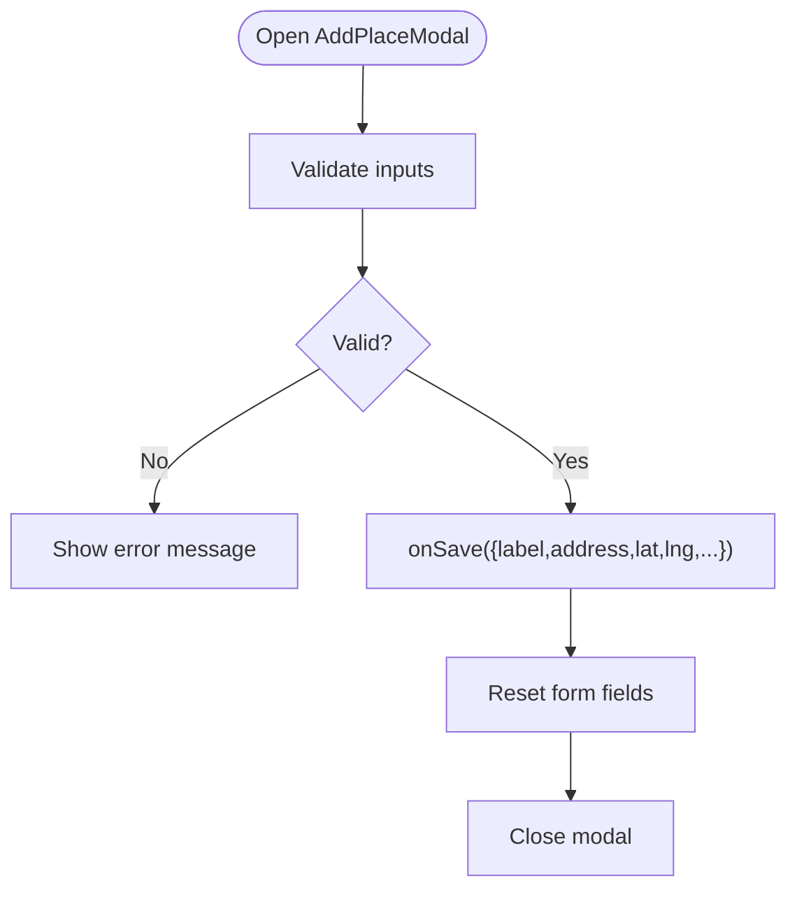
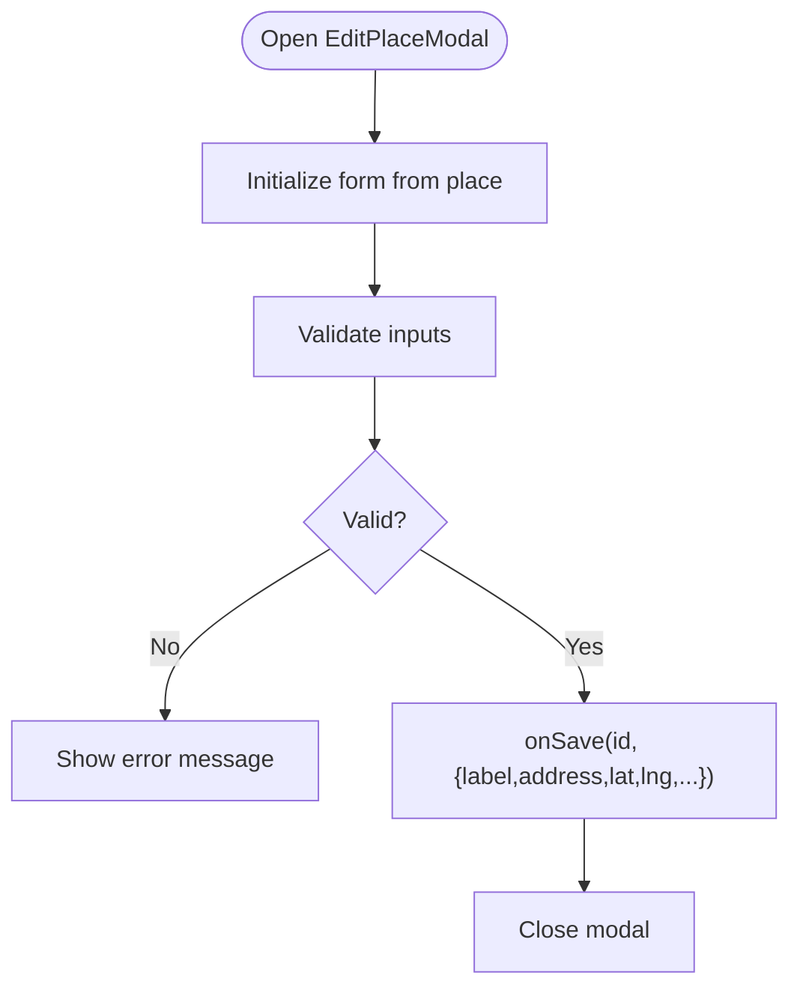
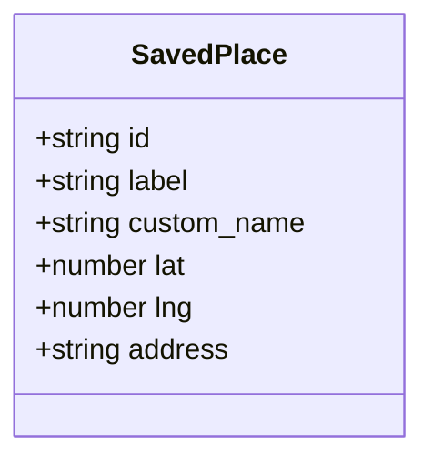
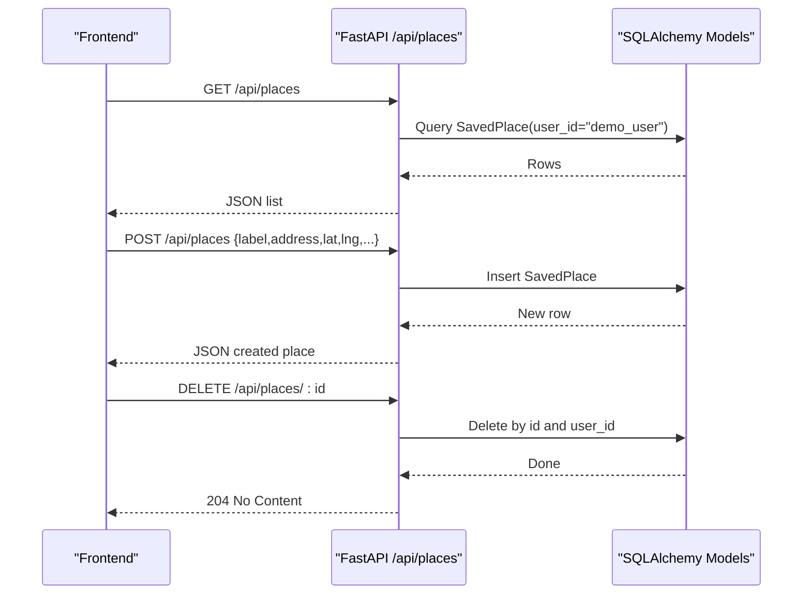
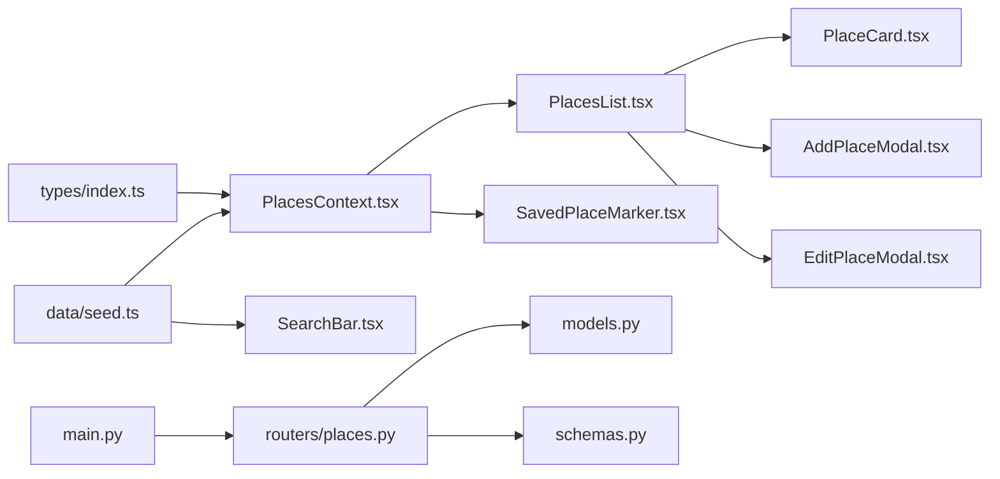

# Place Management System

<cite>
**Referenced Files in This Document**
- [PlacesContext.tsx](file://frontend/src/components/places/PlacesContext.tsx)
- [AddPlaceModal.tsx](file://frontend/src/components/places/AddPlaceModal.tsx)
- [EditPlaceModal.tsx](file://frontend/src/components/places/EditPlaceModal.tsx)
- [PlaceCard.tsx](file://frontend/src/components/places/PlaceCard.tsx)
- [PlacesList.tsx](file://frontend/src/components/places/PlacesList.tsx)
- [index.ts](file://frontend/src/components/places/index.ts)
- [page.tsx](file://frontend/src/app/places/page.tsx)
- [types/index.ts](file://frontend/src/types/index.ts)
- [seed.ts](file://frontend/src/data/seed.ts)
- [SavedPlaceMarker.tsx](file://frontend/src/components/map/SavedPlaceMarker.tsx)
- [SearchBar.tsx](file://frontend/src/components/map/SearchBar.tsx)
- [places.py](file://backend/routers/places.py)
- [models.py](file://backend/models.py)
- [schemas.py](file://backend/schemas.py)
- [main.py](file://backend/main.py)
</cite>

## Table of Contents
1. [Introduction](#introduction)
2. [Project Structure](#project-structure)
3. [Core Components](#core-components)
4. [Architecture Overview](#architecture-overview)
5. [Detailed Component Analysis](#detailed-component-analysis)
6. [Dependency Analysis](#dependency-analysis)
7. [Performance Considerations](#performance-considerations)
8. [Troubleshooting Guide](#troubleshooting-guide)
9. [Conclusion](#conclusion)
10. [Appendices](#appendices)

## Introduction
This document describes the Place Management System that enables users to save locations, quickly access them, and plan routes to parking areas. It covers:
- CRUD operations for saved places via modal interfaces
- Context-based state management with React Context for persistent storage
- Integration points with mapping services for location selection and coordinate handling
- Place categorization and display logic
- Local storage persistence and data export/import patterns
- Backend API endpoints for saving and retrieving places
- Notes on synchronization and multi-device considerations

## Project Structure
The place management feature spans both frontend and backend:
- Frontend:
  - State and persistence via a React Context provider
  - Modal UIs for adding and editing places
  - List and card components for displaying and operating on places
  - Map integration for visualizing saved places and searching by label/address
- Backend:
  - FastAPI router exposing REST endpoints for listing, creating, and deleting saved places
  - SQLAlchemy models and Pydantic schemas for validation and serialization

**Diagram sources**
- [page.tsx:1-33](file://frontend/src/app/places/page.tsx#L1-L33)
- [PlacesContext.tsx:1-77](file://frontend/src/components/places/PlacesContext.tsx#L1-L77)
- [PlacesList.tsx:1-97](file://frontend/src/components/places/PlacesList.tsx#L1-L97)
- [PlaceCard.tsx:1-86](file://frontend/src/components/places/PlaceCard.tsx#L1-L86)
- [AddPlaceModal.tsx:1-165](file://frontend/src/components/places/AddPlaceModal.tsx#L1-L165)
- [EditPlaceModal.tsx:1-170](file://frontend/src/components/places/EditPlaceModal.tsx#L1-L170)
- [SavedPlaceMarker.tsx:1-42](file://frontend/src/components/map/SavedPlaceMarker.tsx#L1-L42)
- [SearchBar.tsx:1-56](file://frontend/src/components/map/SearchBar.tsx#L1-L56)
- [main.py:1-64](file://backend/main.py#L1-L64)
- [places.py:1-49](file://backend/routers/places.py#L1-L49)
- [models.py:53-63](file://backend/models.py#L53-L63)
- [schemas.py:107-127](file://backend/schemas.py#L107-L127)

**Section sources**
- [page.tsx:1-33](file://frontend/src/app/places/page.tsx#L1-L33)
- [index.ts:1-6](file://frontend/src/components/places/index.ts#L1-L6)

## Core Components
- PlacesContext: Provides global state for saved places, including add, update, remove, and local storage persistence.
- PlacesList: Orchestrates list rendering, distance calculation, navigation to demo page, and modal triggers.
- PlaceCard: Displays individual place info and exposes actions (find parking, edit, delete).
- AddPlaceModal / EditPlaceModal: Forms for creating and updating places with validation and category selection.
- SavedPlaceMarker: Renders emoji markers for saved places on the map.
- SearchBar: Searches saved places by label or address and navigates to coordinates.
- Backend Places Router: Exposes GET, POST, DELETE endpoints for saved places.

Key responsibilities:
- State management and persistence (context + localStorage)
- User interactions (CRUD flows)
- Mapping integration (markers and search)
- API integration (list/create/delete)

**Section sources**
- [PlacesContext.tsx:1-77](file://frontend/src/components/places/PlacesContext.tsx#L1-L77)
- [PlacesList.tsx:1-97](file://frontend/src/components/places/PlacesList.tsx#L1-L97)
- [PlaceCard.tsx:1-86](file://frontend/src/components/places/PlaceCard.tsx#L1-L86)
- [AddPlaceModal.tsx:1-165](file://frontend/src/components/places/AddPlaceModal.tsx#L1-L165)
- [EditPlaceModal.tsx:1-170](file://frontend/src/components/places/EditPlaceModal.tsx#L1-L170)
- [SavedPlaceMarker.tsx:1-42](file://frontend/src/components/map/SavedPlaceMarker.tsx#L1-L42)
- [SearchBar.tsx:1-56](file://frontend/src/components/map/SearchBar.tsx#L1-L56)
- [places.py:1-49](file://backend/routers/places.py#L1-L49)

## Architecture Overview
The system uses a client-side context for immediate user feedback and persistence, with optional server-backed synchronization through REST endpoints.

**Diagram sources**
- [PlacesList.tsx:1-97](file://frontend/src/components/places/PlacesList.tsx#L1-L97)
- [PlacesContext.tsx:1-77](file://frontend/src/components/places/PlacesContext.tsx#L1-L77)
- [SearchBar.tsx:1-56](file://frontend/src/components/map/SearchBar.tsx#L1-L56)
- [places.py:1-49](file://backend/routers/places.py#L1-L49)

## Detailed Component Analysis

### PlacesContext (State and Persistence)
- Provides a React Context with methods to add, update, and remove places.
- Hydrates initial state from localStorage; persists changes back to localStorage after hydration.
- Throws an error if used outside the provider.

**Diagram sources**
- [PlacesContext.tsx:18-43](file://frontend/src/components/places/PlacesContext.tsx#L18-L43)

**Section sources**
- [PlacesContext.tsx:1-77](file://frontend/src/components/places/PlacesContext.tsx#L1-L77)

### PlacesList (Orchestration and Navigation)
- Renders the list of places using PlaceCard.
- Computes distances relative to a fixed reference point and formats them.
- Navigates to the demo page with destination coordinates when “Find Parking” is clicked.
- Triggers modals for add/edit and calls context methods for mutations.

**Diagram sources**
- [PlacesList.tsx:34-96](file://frontend/src/components/places/PlacesList.tsx#L34-L96)
- [PlaceCard.tsx:27-85](file://frontend/src/components/places/PlaceCard.tsx#L27-L85)
- [AddPlaceModal.tsx:21-57](file://frontend/src/components/places/AddPlaceModal.tsx#L21-L57)
- [EditPlaceModal.tsx:22-62](file://frontend/src/components/places/EditPlaceModal.tsx#L22-L62)

**Section sources**
- [PlacesList.tsx:1-97](file://frontend/src/components/places/PlacesList.tsx#L1-L97)

### PlaceCard (Display and Actions)
- Shows icon based on label, displays name and address, and optional distance.
- Exposes actions: find parking, edit, delete.

**Section sources**
- [PlaceCard.tsx:1-86](file://frontend/src/components/places/PlaceCard.tsx#L1-L86)

### AddPlaceModal (Create Flow)
- Validates required fields (custom name when label is custom, address).
- Normalizes lat/lng values and forwards payload to context’s addPlace.
- Resets form and closes on success.

**Diagram sources**
- [AddPlaceModal.tsx:31-57](file://frontend/src/components/places/AddPlaceModal.tsx#L31-L57)

**Section sources**
- [AddPlaceModal.tsx:1-165](file://frontend/src/components/places/AddPlaceModal.tsx#L1-L165)

### EditPlaceModal (Update Flow)
- Initializes form state from selected place.
- Validates and merges updates, preserving existing lat/lng if not provided.
- Calls context’s updatePlace with id and partial updates.

**Diagram sources**
- [EditPlaceModal.tsx:30-62](file://frontend/src/components/places/EditPlaceModal.tsx#L30-L62)

**Section sources**
- [EditPlaceModal.tsx:1-170](file://frontend/src/components/places/EditPlaceModal.tsx#L1-L170)

### SavedPlaceMarker (Map Integration)
- Renders emoji icons for saved places on the map with tooltips showing label and address.

**Section sources**
- [SavedPlaceMarker.tsx:1-42](file://frontend/src/components/map/SavedPlaceMarker.tsx#L1-L42)

### SearchBar (Quick Access)
- Filters saved places by label, address, or custom name.
- Invokes callback with matched coordinates to navigate or center map.

**Section sources**
- [SearchBar.tsx:1-56](file://frontend/src/components/map/SearchBar.tsx#L1-L56)
- [seed.ts:114-137](file://frontend/src/data/seed.ts#L114-L137)

### Data Model (Types)
- Defines SavedPlace shape used across the app.

**Diagram sources**
- [types/index.ts:36-43](file://frontend/src/types/index.ts#L36-L43)

**Section sources**
- [types/index.ts:1-75](file://frontend/src/types/index.ts#L1-L75)

### Backend API (REST Endpoints)
- GET /api/places: Lists saved places for a demo user.
- POST /api/places: Creates a new saved place.
- DELETE /api/places/{place_id}: Deletes a saved place.

**Diagram sources**
- [places.py:11-49](file://backend/routers/places.py#L11-L49)
- [models.py:53-63](file://backend/models.py#L53-L63)
- [schemas.py:107-127](file://backend/schemas.py#L107-L127)
- [main.py:49-55](file://backend/main.py#L49-L55)

**Section sources**
- [places.py:1-49](file://backend/routers/places.py#L1-L49)
- [models.py:53-63](file://backend/models.py#L53-L63)
- [schemas.py:107-127](file://backend/schemas.py#L107-L127)
- [main.py:1-64](file://backend/main.py#L1-L64)

## Dependency Analysis
- Frontend module exports centralize component imports for reuse.
- Context depends on types and seed data for initial state.
- Modals depend on types and context hooks.
- Map components depend on types and context for marker rendering.
- Backend router depends on models and schemas; main app wires routers.

**Diagram sources**
- [index.ts:1-6](file://frontend/src/components/places/index.ts#L1-L6)
- [PlacesContext.tsx:1-77](file://frontend/src/components/places/PlacesContext.tsx#L1-L77)
- [PlacesList.tsx:1-97](file://frontend/src/components/places/PlacesList.tsx#L1-L97)
- [PlaceCard.tsx:1-86](file://frontend/src/components/places/PlaceCard.tsx#L1-L86)
- [AddPlaceModal.tsx:1-165](file://frontend/src/components/places/AddPlaceModal.tsx#L1-L165)
- [EditPlaceModal.tsx:1-170](file://frontend/src/components/places/EditPlaceModal.tsx#L1-L170)
- [SavedPlaceMarker.tsx:1-42](file://frontend/src/components/map/SavedPlaceMarker.tsx#L1-L42)
- [SearchBar.tsx:1-56](file://frontend/src/components/map/SearchBar.tsx#L1-L56)
- [main.py:49-55](file://backend/main.py#L49-L55)
- [places.py:1-49](file://backend/routers/places.py#L1-L49)
- [models.py:53-63](file://backend/models.py#L53-L63)
- [schemas.py:107-127](file://backend/schemas.py#L107-L127)

**Section sources**
- [index.ts:1-6](file://frontend/src/components/places/index.ts#L1-L6)

## Performance Considerations
- LocalStorage writes occur on every state change; consider debouncing or batching updates if the list grows large.
- Distance calculations are O(1) per item; for very large lists, consider memoization or virtualization.
- Map markers render per saved place; limit visible markers or cluster if needed.
- Avoid unnecessary re-renders by keeping context minimal and stable.

[No sources needed since this section provides general guidance]

## Troubleshooting Guide
- Missing provider: Using usePlaces outside PlacesProvider throws an error. Ensure the page wraps content with the provider.
- LocalStorage unavailable: The context catches errors and falls back to seed data; verify environment permissions if persistence fails.
- Validation errors: Both modals show inline errors for missing custom names or addresses; ensure inputs meet requirements before saving.
- Backend 404 on delete: Deleting a non-existent place returns a 404; handle gracefully in the UI.

**Section sources**
- [PlacesContext.tsx:70-76](file://frontend/src/components/places/PlacesContext.tsx#L70-L76)
- [AddPlaceModal.tsx:31-57](file://frontend/src/components/places/AddPlaceModal.tsx#L31-L57)
- [EditPlaceModal.tsx:43-62](file://frontend/src/components/places/EditPlaceModal.tsx#L43-L62)
- [places.py:38-49](file://backend/routers/places.py#L38-L49)

## Conclusion
The Place Management System offers a cohesive experience for saving, organizing, and accessing locations with quick route planning. It leverages React Context for responsive state and local persistence, integrates with mapping components for visualization and search, and exposes a simple REST API for server-backed operations. Future enhancements can include robust geocoding, favorites/bulk operations, and sync strategies for multi-device support.

[No sources needed since this section summarizes without analyzing specific files]

## Appendices

### Data Export/Import Patterns
- Export: Serialize the current places array to JSON and trigger a download.
- Import: Parse uploaded JSON, validate against SavedPlace schema, and merge into context state.
- Sync: Optionally reconcile local changes with server responses on startup or periodically.

[No sources needed since this section provides general guidance]