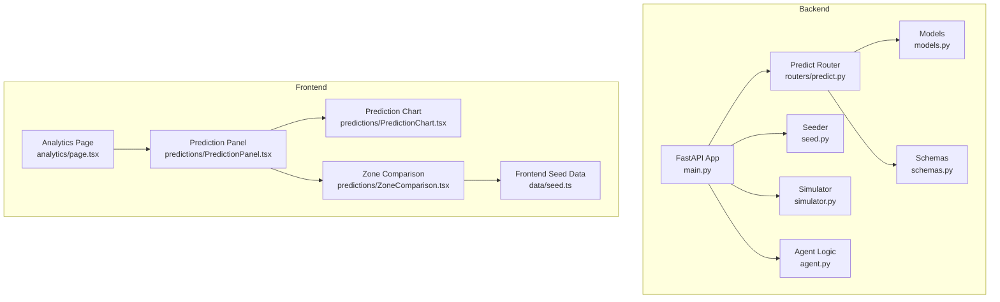
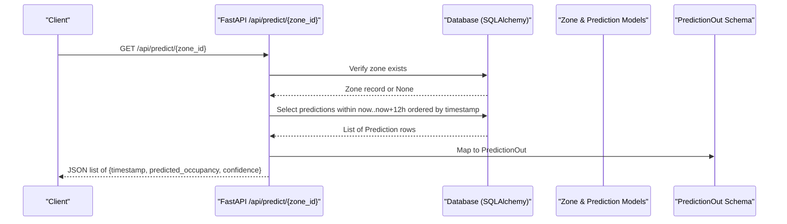
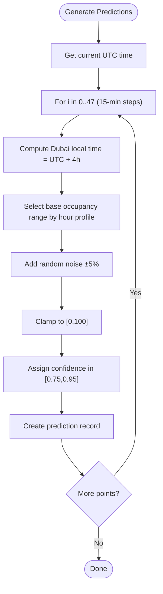
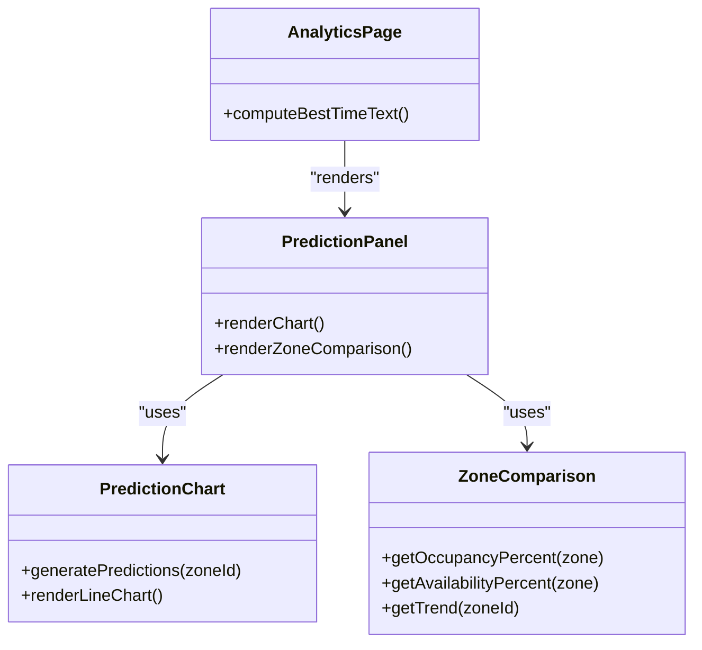
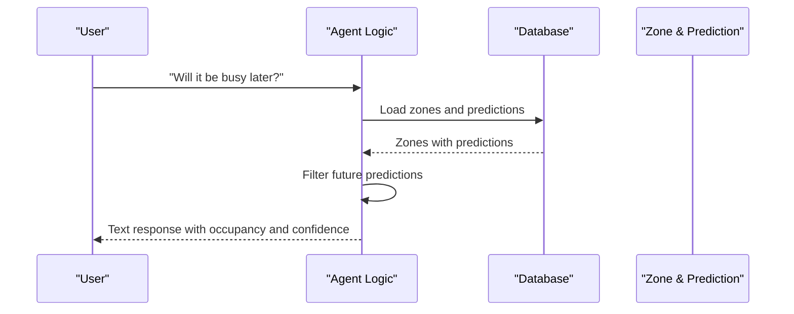
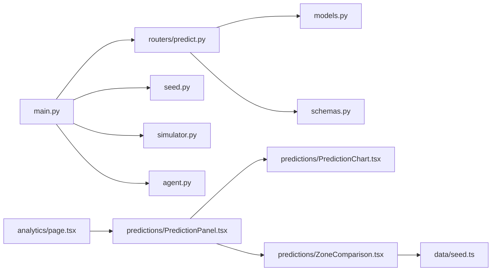

# Predictive Analytics Engine

<cite>
**Referenced Files in This Document**
- [backend/main.py](file://backend/main.py)
- [backend/routers/predict.py](file://backend/routers/predict.py)
- [backend/models.py](file://backend/models.py)
- [backend/schemas.py](file://backend/schemas.py)
- [backend/seed.py](file://backend/seed.py)
- [backend/simulator.py](file://backend/simulator.py)
- [backend/agent.py](file://backend/agent.py)
- [frontend/src/app/analytics/page.tsx](file://frontend/src/app/analytics/page.tsx)
- [frontend/src/components/predictions/PredictionPanel.tsx](file://frontend/src/components/predictions/PredictionPanel.tsx)
- [frontend/src/components/predictions/PredictionChart.tsx](file://frontend/src/components/predictions/PredictionChart.tsx)
- [frontend/src/components/predictions/ZoneComparison.tsx](file://frontend/src/components/predictions/ZoneComparison.tsx)
- [frontend/src/data/seed.ts](file://frontend/src/data/seed.ts)
</cite>

## Table of Contents
1. [Introduction](#introduction)
2. [Project Structure](#project-structure)
3. [Core Components](#core-components)
4. [Architecture Overview](#architecture-overview)
5. [Detailed Component Analysis](#detailed-component-analysis)
6. [Dependency Analysis](#dependency-analysis)
7. [Performance Considerations](#performance-considerations)
8. [Troubleshooting Guide](#troubleshooting-guide)
9. [Conclusion](#conclusion)
10. [Appendices](#appendices)

## Introduction
This document describes the Predictive Analytics Engine that provides 12-hour occupancy forecasts with confidence scoring and historical pattern analysis for parking zones. It explains how predictions are generated, stored, served via API, and visualized in the frontend. It also covers the confidence scoring system, forecast accuracy metrics, historical data aggregation, configuration options, performance optimization strategies, and caching approaches for frequently accessed predictions.

## Project Structure
The predictive analytics capability spans backend services (FastAPI), database models, seeding/simulation logic, and frontend visualization components:
- Backend API exposes a prediction endpoint returning 12 hours of 15-minute interval forecasts per zone.
- Database models define zones, spots, sensors, park events, and predictions.
- Seeding generates initial predictions based on time-of-day profiles.
- Simulator drives realistic spot status changes to reflect demand patterns.
- Frontend renders interactive charts and zone comparison tools.

**Diagram sources**
- [backend/main.py:1-64](file://backend/main.py#L1-L64)
- [backend/routers/predict.py:1-39](file://backend/routers/predict.py#L1-L39)
- [backend/models.py:1-89](file://backend/models.py#L1-L89)
- [backend/schemas.py:1-127](file://backend/schemas.py#L1-L127)
- [backend/seed.py:1-198](file://backend/seed.py#L1-L198)
- [backend/simulator.py:1-105](file://backend/simulator.py#L1-L105)
- [backend/agent.py:1-261](file://backend/agent.py#L1-L261)
- [frontend/src/app/analytics/page.tsx:1-87](file://frontend/src/app/analytics/page.tsx#L1-L87)
- [frontend/src/components/predictions/PredictionPanel.tsx:1-38](file://frontend/src/components/predictions/PredictionPanel.tsx#L1-L38)
- [frontend/src/components/predictions/PredictionChart.tsx:1-199](file://frontend/src/components/predictions/PredictionChart.tsx#L1-L199)
- [frontend/src/components/predictions/ZoneComparison.tsx:1-111](file://frontend/src/components/predictions/ZoneComparison.tsx#L1-L111)
- [frontend/src/data/seed.ts:1-138](file://frontend/src/data/seed.ts#L1-L138)

**Section sources**
- [backend/main.py:1-64](file://backend/main.py#L1-L64)
- [frontend/src/app/analytics/page.tsx:1-87](file://frontend/src/app/analytics/page.tsx#L1-L87)

## Core Components
- Prediction API Endpoint: Returns predicted occupancy for the next 12 hours at 15-minute intervals for a given zone.
- Prediction Model: Stores timestamped predictions with predicted occupancy and confidence values.
- Seeder: Generates baseline predictions using time-of-day profiles and random noise.
- Simulator: Adjusts spot statuses toward target occupancy ranges based on Dubai local time profiles.
- Agent: Provides natural language responses including prediction summaries and recommendations.
- Frontend Visualization: Renders 12-hour charts and compares zones by availability and trends.

Key responsibilities:
- Time-series generation and storage for predictions.
- Confidence scoring per time step.
- Historical pattern modeling via time-of-day profiles.
- Real-time simulation of spot states influencing future demand.
- Interactive UI for trend analysis and zone comparisons.

**Section sources**
- [backend/routers/predict.py:12-38](file://backend/routers/predict.py#L12-L38)
- [backend/models.py:65-76](file://backend/models.py#L65-L76)
- [backend/seed.py:85-123](file://backend/seed.py#L85-L123)
- [backend/simulator.py:12-34](file://backend/simulator.py#L12-L34)
- [backend/agent.py:146-193](file://backend/agent.py#L146-L193)
- [frontend/src/components/predictions/PredictionChart.tsx:19-92](file://frontend/src/components/predictions/PredictionChart.tsx#L19-L92)
- [frontend/src/components/predictions/ZoneComparison.tsx:7-28](file://frontend/src/components/predictions/ZoneComparison.tsx#L7-L28)

## Architecture Overview
The engine integrates data generation, persistence, serving, and visualization:

**Diagram sources**
- [backend/routers/predict.py:12-38](file://backend/routers/predict.py#L12-L38)
- [backend/models.py:65-76](file://backend/models.py#L65-L76)
- [backend/schemas.py:74-80](file://backend/schemas.py#L74-L80)

## Detailed Component Analysis

### Prediction Algorithm and Time-Series Processing
- Generation Strategy:
  - The seeder creates 48 points (12 hours × 4 intervals/hour) per zone.
  - Base occupancy is derived from time-of-day profiles aligned to Dubai local time (UTC+4).
  - Random noise is added to simulate variability; confidence is assigned per point.
- Time Handling:
  - Timestamps are UTC; local time adjustments are applied when computing base occupancy.
- Output:
  - Each prediction includes predicted_occupancy (percentage) and confidence (0–1).

**Diagram sources**
- [backend/seed.py:85-123](file://backend/seed.py#L85-L123)

**Section sources**
- [backend/seed.py:85-123](file://backend/seed.py#L85-L123)

### Machine Learning Model Integration
- Current Implementation:
  - No external ML model is integrated; predictions are generated deterministically using time-of-day profiles and stochastic noise.
- Extensibility:
  - The Prediction model schema supports storing model outputs and metadata.
  - A future integration could replace the seeder’s generator with an ML service while preserving the same API contract.

**Section sources**
- [backend/models.py:65-76](file://backend/models.py#L65-L76)
- [backend/schemas.py:74-80](file://backend/schemas.py#L74-L80)

### Confidence Scoring System
- Source:
  - Confidence is assigned during prediction generation.
- Range:
  - Values between approximately 0.75 and 0.95 per time step.
- Usage:
  - Returned in API responses and used by agent logic to inform user-facing recommendations.

**Section sources**
- [backend/seed.py:112-123](file://backend/seed.py#L112-L123)
- [backend/routers/predict.py:34-38](file://backend/routers/predict.py#L34-L38)
- [backend/agent.py:176-193](file://backend/agent.py#L176-L193)

### Forecast Accuracy Metrics
- Available Fields:
  - predicted_occupancy and confidence per timestamp.
- Recommended Metrics (for production):
  - Mean Absolute Error (MAE), Root Mean Squared Error (RMSE), and R-squared comparing predicted vs actual occupancy over historical windows.
  - Calibration curves to assess confidence reliability.
- Implementation Notes:
  - Requires storing actual occupancy series and aligning timestamps with predictions.
  - Can be computed offline or via scheduled jobs.

[No sources needed since this section provides general guidance]

### Historical Data Aggregation
- Spot Status Simulation:
  - The simulator adjusts spot statuses toward target occupancy ranges based on time-of-day profiles.
- Impact on Predictions:
  - While predictions are pre-generated, real-time spot updates can influence future re-generation or model inputs.
- Aggregation Points:
  - Zone-level free/occupied counts can be aggregated for dashboards and trend analysis.

**Section sources**
- [backend/simulator.py:24-88](file://backend/simulator.py#L24-L88)

### Visualization Components
- Prediction Chart:
  - Renders 12-hour timeline with actual and predicted lines.
  - Uses smoothed interpolation and seeded pseudo-randomness for consistent visuals.
- Zone Comparison:
  - Displays availability percentages, occupancy progress bars, and trend indicators per zone.
- Best Time Recommendation:
  - Analytics page computes best parking windows based on time-of-day heuristics.

**Diagram sources**
- [frontend/src/components/predictions/PredictionChart.tsx:56-92](file://frontend/src/components/predictions/PredictionChart.tsx#L56-L92)
- [frontend/src/components/predictions/ZoneComparison.tsx:7-28](file://frontend/src/components/predictions/ZoneComparison.tsx#L7-L28)
- [frontend/src/components/predictions/PredictionPanel.tsx:10-35](file://frontend/src/components/predictions/PredictionPanel.tsx#L10-L35)
- [frontend/src/app/analytics/page.tsx:8-21](file://frontend/src/app/analytics/page.tsx#L8-L21)

**Section sources**
- [frontend/src/components/predictions/PredictionChart.tsx:19-92](file://frontend/src/components/predictions/PredictionChart.tsx#L19-L92)
- [frontend/src/components/predictions/ZoneComparison.tsx:7-28](file://frontend/src/components/predictions/ZoneComparison.tsx#L7-L28)
- [frontend/src/components/predictions/PredictionPanel.tsx:10-35](file://frontend/src/components/predictions/PredictionPanel.tsx#L10-L35)
- [frontend/src/app/analytics/page.tsx:8-21](file://frontend/src/app/analytics/page.tsx#L8-L21)

### Natural Language Agent Integration
- Intent Detection:
  - Pattern matching identifies “predict” intent.
- Prediction Summary:
  - Retrieves nearest or first zone’s upcoming prediction and confidence.
- Recommendations:
  - Provides contextual advice based on predicted occupancy thresholds.

**Diagram sources**
- [backend/agent.py:24-39](file://backend/agent.py#L24-L39)
- [backend/agent.py:146-193](file://backend/agent.py#L146-L193)

**Section sources**
- [backend/agent.py:24-39](file://backend/agent.py#L24-L39)
- [backend/agent.py:146-193](file://backend/agent.py#L146-L193)

## Dependency Analysis
The prediction subsystem depends on FastAPI routing, SQLAlchemy ORM models, Pydantic schemas, and seeding/simulation utilities. Frontend components depend on Chart.js and seed data for visualization.

**Diagram sources**
- [backend/main.py:1-64](file://backend/main.py#L1-L64)
- [backend/routers/predict.py:1-39](file://backend/routers/predict.py#L1-L39)
- [backend/models.py:1-89](file://backend/models.py#L1-L89)
- [backend/schemas.py:1-127](file://backend/schemas.py#L1-L127)
- [backend/seed.py:1-198](file://backend/seed.py#L1-L198)
- [backend/simulator.py:1-105](file://backend/simulator.py#L1-L105)
- [backend/agent.py:1-261](file://backend/agent.py#L1-L261)
- [frontend/src/app/analytics/page.tsx:1-87](file://frontend/src/app/analytics/page.tsx#L1-L87)
- [frontend/src/components/predictions/PredictionPanel.tsx:1-38](file://frontend/src/components/predictions/PredictionPanel.tsx#L1-L38)
- [frontend/src/components/predictions/PredictionChart.tsx:1-199](file://frontend/src/components/predictions/PredictionChart.tsx#L1-L199)
- [frontend/src/components/predictions/ZoneComparison.tsx:1-111](file://frontend/src/components/predictions/ZoneComparison.tsx#L1-L111)
- [frontend/src/data/seed.ts:1-138](file://frontend/src/data/seed.ts#L1-L138)

**Section sources**
- [backend/main.py:1-64](file://backend/main.py#L1-L64)
- [frontend/src/app/analytics/page.tsx:1-87](file://frontend/src/app/analytics/page.tsx#L1-L87)

## Performance Considerations
- Database Query Optimization:
  - Indexes on Prediction.zone_id and Prediction.timestamp improve query performance for time-range filters.
  - Use pagination if serving large histories beyond 12 hours.
- Caching Strategies:
  - In-memory cache (e.g., LRU) keyed by zone_id and time window to reduce repeated DB reads.
  - HTTP caching headers for GET /api/predict/{zone_id} with appropriate TTLs (e.g., 5–15 minutes).
  - CDN or reverse proxy caching for static chart datasets if applicable.
- Computation Offloading:
  - Pre-generate predictions on schedule rather than on-demand to avoid latency spikes.
  - Batch write predictions to minimize transaction overhead.
- Frontend Rendering:
  - Memoize chart data generation to avoid recomputation on re-renders.
  - Limit visible data points and use efficient chart configurations.

[No sources needed since this section provides general guidance]

## Troubleshooting Guide
- Zone Not Found:
  - The prediction endpoint returns 404 if the zone does not exist.
- Missing Predictions:
  - Ensure the seeder has run and created predictions for the requested zone and time window.
- Timezone Mismatches:
  - Confirm timestamps are UTC and local time offsets are correctly applied when generating profiles.
- Simulator Errors:
  - Monitor background tasks and log exceptions from the simulator loop.

**Section sources**
- [backend/routers/predict.py:15-19](file://backend/routers/predict.py#L15-L19)
- [backend/seed.py:126-198](file://backend/seed.py#L126-L198)
- [backend/simulator.py:91-105](file://backend/simulator.py#L91-L105)

## Conclusion
The Predictive Analytics Engine delivers 12-hour occupancy forecasts with confidence scores using time-of-day profiles and stochastic noise. It integrates seamlessly with the FastAPI backend, stores predictions in the database, and serves them through a simple REST endpoint. The frontend provides interactive charts and zone comparisons to support decision-making. Future enhancements can include advanced ML models, robust accuracy metrics, and comprehensive caching for scalability.

[No sources needed since this section summarizes without analyzing specific files]

## Appendices

### Configuration Options
- Prediction Window:
  - Fixed to 12 hours with 15-minute intervals in the prediction endpoint.
- Algorithm Parameters:
  - Time-of-day profiles define base occupancy ranges per hour.
  - Noise amplitude and confidence bounds are configurable in the seeder.
- Data Retention Policies:
  - Implement periodic cleanup of old predictions and historical actuals to manage storage growth.
  - Define retention windows (e.g., keep last 90 days) and archive older records.

**Section sources**
- [backend/routers/predict.py:21-31](file://backend/routers/predict.py#L21-L31)
- [backend/seed.py:85-123](file://backend/seed.py#L85-L123)