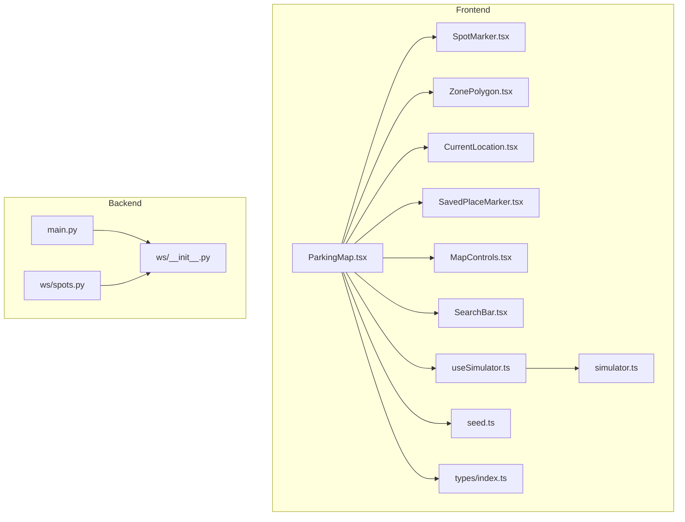
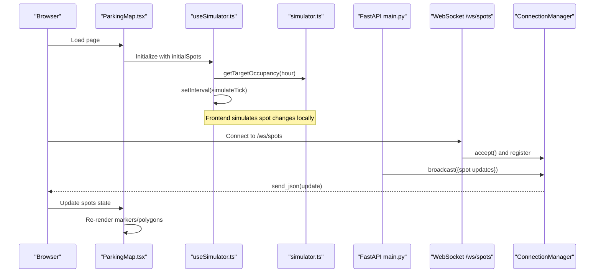
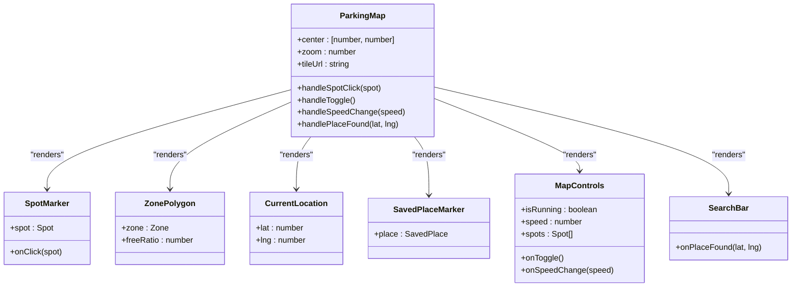
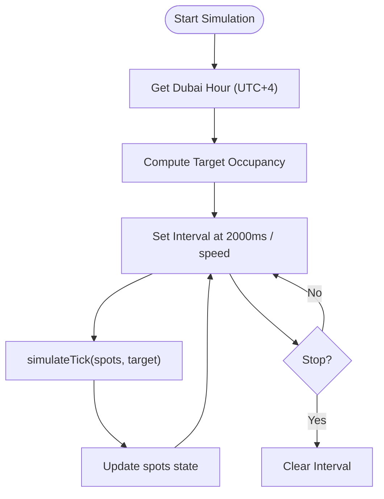
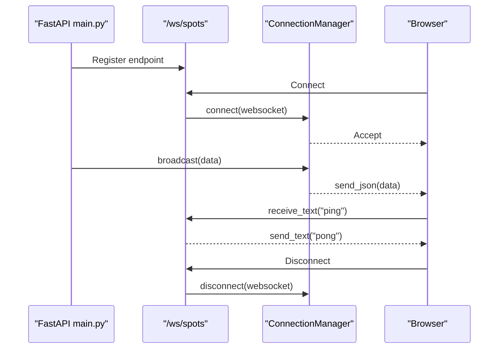
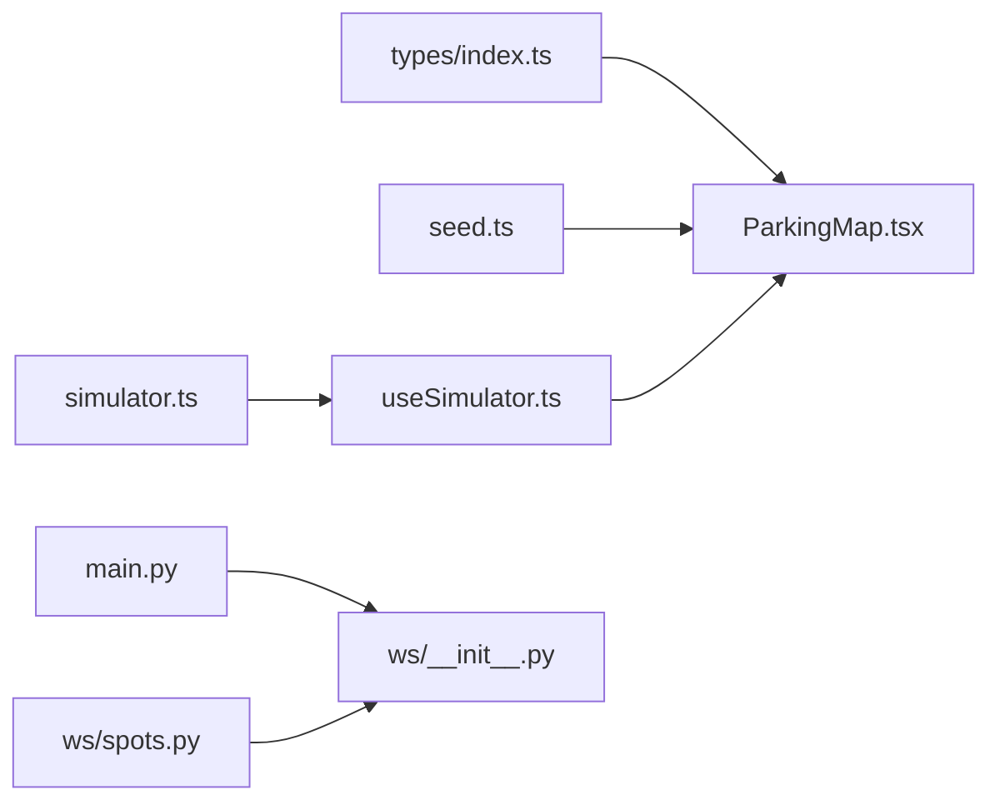

# Real-time Parking Map

<cite>
**Referenced Files in This Document**
- [ParkingMap.tsx](file://frontend/src/components/map/ParkingMap.tsx)
- [SpotMarker.tsx](file://frontend/src/components/map/SpotMarker.tsx)
- [ZonePolygon.tsx](file://frontend/src/components/map/ZonePolygon.tsx)
- [SearchBar.tsx](file://frontend/src/components/map/SearchBar.tsx)
- [CurrentLocation.tsx](file://frontend/src/components/map/CurrentLocation.tsx)
- [SavedPlaceMarker.tsx](file://frontend/src/components/map/SavedPlaceMarker.tsx)
- [MapControls.tsx](file://frontend/src/components/map/MapControls.tsx)
- [useSimulator.ts](file://frontend/src/hooks/useSimulator.ts)
- [simulator.ts](file://frontend/src/lib/simulator.ts)
- [seed.ts](file://frontend/src/data/seed.ts)
- [index.ts](file://frontend/src/types/index.ts)
- [__init__.py](file://backend/ws/__init__.py)
- [spots.py](file://backend/ws/spots.py)
- [main.py](file://backend/main.py)
</cite>

## Table of Contents
1. [Introduction](#introduction)
2. [Project Structure](#project-structure)
3. [Core Components](#core-components)
4. [Architecture Overview](#architecture-overview)
5. [Detailed Component Analysis](#detailed-component-analysis)
6. [Dependency Analysis](#dependency-analysis)
7. [Performance Considerations](#performance-considerations)
8. [Troubleshooting Guide](#troubleshooting-guide)
9. [Conclusion](#conclusion)
10. [Appendices](#appendices)

## Introduction
This document explains the Real-time Parking Map system built with Leaflet.js via React-Leaflet. It covers interactive map components, custom spot markers with status-based styling, zone polygon overlays, real-time updates via WebSocket, search and navigation integration, marker clustering considerations, zoom optimizations, responsive design, and configuration options for map providers and themes. The frontend is a Next.js application; the backend provides a FastAPI server with WebSocket broadcasting to simulate live parking spot changes.

## Project Structure
The map UI is implemented as a set of focused React components under the map feature folder. Data models and seed data are centralized, while simulation logic resides in hooks and library modules. The backend exposes a WebSocket endpoint that broadcasts spot updates to connected clients.

**Diagram sources**
- [ParkingMap.tsx:1-108](file://frontend/src/components/map/ParkingMap.tsx#L1-L108)
- [SpotMarker.tsx:1-45](file://frontend/src/components/map/SpotMarker.tsx#L1-L45)
- [ZonePolygon.tsx:1-38](file://frontend/src/components/map/ZonePolygon.tsx#L1-L38)
- [SearchBar.tsx:1-56](file://frontend/src/components/map/SearchBar.tsx#L1-L56)
- [CurrentLocation.tsx:1-41](file://frontend/src/components/map/CurrentLocation.tsx#L1-L41)
- [SavedPlaceMarker.tsx:1-42](file://frontend/src/components/map/SavedPlaceMarker.tsx#L1-L42)
- [MapControls.tsx:1-84](file://frontend/src/components/map/MapControls.tsx#L1-L84)
- [useSimulator.ts:1-62](file://frontend/src/hooks/useSimulator.ts#L1-L62)
- [simulator.ts:1-73](file://frontend/src/lib/simulator.ts#L1-L73)
- [seed.ts:1-138](file://frontend/src/data/seed.ts#L1-L138)
- [index.ts:1-75](file://frontend/src/types/index.ts#L1-L75)
- [main.py:1-64](file://backend/main.py#L1-L64)
- [__init__.py:1-49](file://backend/ws/__init__.py#L1-L49)
- [spots.py:1-4](file://backend/ws/spots.py#L1-L4)

**Section sources**
- [ParkingMap.tsx:1-108](file://frontend/src/components/map/ParkingMap.tsx#L1-L108)
- [main.py:1-64](file://backend/main.py#L1-L64)

## Core Components
- Interactive Map Container: Centralizes tile layer, zones, spots, current location, saved places, and overlays.
- Spot Markers: Circle markers styled by spot status (free, occupied, reserved, sensor_offline).
- Zone Polygons: GeoJSON polygons colored by availability ratio with tooltips.
- Search Bar: Local search over saved places with keyboard submission.
- Current Location Marker: Visual indicator with pulse ring and core dot.
- Saved Place Markers: Emoji-based markers with tooltips.
- Map Controls: Simulation toggle, speed control, and per-zone availability summary.
- Simulator Hook: Drives periodic state updates based on time-of-day occupancy profiles.
- Backend WebSocket: Broadcasts spot updates to all connected clients.

**Section sources**
- [ParkingMap.tsx:1-108](file://frontend/src/components/map/ParkingMap.tsx#L1-L108)
- [SpotMarker.tsx:1-45](file://frontend/src/components/map/SpotMarker.tsx#L1-L45)
- [ZonePolygon.tsx:1-38](file://frontend/src/components/map/ZonePolygon.tsx#L1-L38)
- [SearchBar.tsx:1-56](file://frontend/src/components/map/SearchBar.tsx#L1-L56)
- [CurrentLocation.tsx:1-41](file://frontend/src/components/map/CurrentLocation.tsx#L1-L41)
- [SavedPlaceMarker.tsx:1-42](file://frontend/src/components/map/SavedPlaceMarker.tsx#L1-L42)
- [MapControls.tsx:1-84](file://frontend/src/components/map/MapControls.tsx#L1-L84)
- [useSimulator.ts:1-62](file://frontend/src/hooks/useSimulator.ts#L1-L62)
- [simulator.ts:1-73](file://frontend/src/lib/simulator.ts#L1-L73)
- [__init__.py:1-49](file://backend/ws/__init__.py#L1-L49)
- [main.py:1-64](file://backend/main.py#L1-L64)

## Architecture Overview
The system composes a client-side map with simulated real-time updates. The backend maintains a connection manager and broadcasts spot updates through a WebSocket endpoint. The frontend renders tiles, zones, and markers, and can integrate with external navigation services.

**Diagram sources**
- [ParkingMap.tsx:1-108](file://frontend/src/components/map/ParkingMap.tsx#L1-L108)
- [useSimulator.ts:1-62](file://frontend/src/hooks/useSimulator.ts#L1-L62)
- [simulator.ts:1-73](file://frontend/src/lib/simulator.ts#L1-L73)
- [main.py:1-64](file://backend/main.py#L1-L64)
- [__init__.py:1-49](file://backend/ws/__init__.py#L1-L49)

## Detailed Component Analysis

### ParkingMap (Map Container)
Responsibilities:
- Configures center, zoom, and tile provider.
- Renders zone polygons, spot markers, current location, saved place markers, controls, and search bar.
- Handles place search results by flying the map to coordinates.
- Integrates simulator hook for dynamic spot updates.

Key behaviors:
- Tile URL and attribution configured for Carto dark basemap.
- Zoom control and attribution control disabled for a cleaner UI.
- Selected spot triggers a bottom sheet overlay.

**Section sources**
- [ParkingMap.tsx:1-108](file://frontend/src/components/map/ParkingMap.tsx#L1-L108)

#### Class Diagram: Map Components

**Diagram sources**
- [ParkingMap.tsx:1-108](file://frontend/src/components/map/ParkingMap.tsx#L1-L108)
- [SpotMarker.tsx:1-45](file://frontend/src/components/map/SpotMarker.tsx#L1-L45)
- [ZonePolygon.tsx:1-38](file://frontend/src/components/map/ZonePolygon.tsx#L1-L38)
- [CurrentLocation.tsx:1-41](file://frontend/src/components/map/CurrentLocation.tsx#L1-L41)
- [SavedPlaceMarker.tsx:1-42](file://frontend/src/components/map/SavedPlaceMarker.tsx#L1-L42)
- [MapControls.tsx:1-84](file://frontend/src/components/map/MapControls.tsx#L1-L84)
- [SearchBar.tsx:1-56](file://frontend/src/components/map/SearchBar.tsx#L1-L56)

### SpotMarker (Status-Based Styling)
- Uses a mapping from status to color, radius, and fill opacity.
- Displays a popup with spot ID and human-readable status.
- Click handler bubbles up to parent for selection.

**Section sources**
- [SpotMarker.tsx:1-45](file://frontend/src/components/map/SpotMarker.tsx#L1-L45)

### ZonePolygon (Availability Overlay)
- Computes busy vs free coloring based on free ratio threshold.
- Shows tooltip with zone name and free/total counts.
- Key includes busy/free suffix to force re-render when status changes.

**Section sources**
- [ZonePolygon.tsx:1-38](file://frontend/src/components/map/ZonePolygon.tsx#L1-L38)

### SearchBar (Local Place Search)
- Submits form to filter saved places by label, address, or custom name.
- Emits coordinates to parent for map navigation.
- Includes microphone icon placeholder for future voice input.

**Section sources**
- [SearchBar.tsx:1-56](file://frontend/src/components/map/SearchBar.tsx#L1-L56)

### CurrentLocation (User Indicator)
- Renders a pulsing outer ring and solid inner dot.
- Uses CSS animation class for pulse effect.

**Section sources**
- [CurrentLocation.tsx:1-41](file://frontend/src/components/map/CurrentLocation.tsx#L1-L41)

### SavedPlaceMarker (Emoji Icons)
- Creates div icons using emoji characters.
- Tooltip shows label and address.

**Section sources**
- [SavedPlaceMarker.tsx:1-42](file://frontend/src/components/map/SavedPlaceMarker.tsx#L1-L42)

### MapControls (Simulation and Stats)
- Toggle switch to start/stop simulation.
- Speed buttons (1x, 3x, 5x) update interval frequency.
- Per-zone availability panel computed from current spots.

**Section sources**
- [MapControls.tsx:1-84](file://frontend/src/components/map/MapControls.tsx#L1-L84)

### useSimulator Hook and Simulator Logic
- Maintains running state and interval reference.
- Calculates target occupancy based on Dubai local hour profile.
- Applies random flips to match target occupancy within bounds.

**Diagram sources**
- [useSimulator.ts:1-62](file://frontend/src/hooks/useSimulator.ts#L1-L62)
- [simulator.ts:1-73](file://frontend/src/lib/simulator.ts#L1-L73)

**Section sources**
- [useSimulator.ts:1-62](file://frontend/src/hooks/useSimulator.ts#L1-L62)
- [simulator.ts:1-73](file://frontend/src/lib/simulator.ts#L1-L73)

### Seed Data and Types
- Generates zones with GeoJSON polygons and spot distributions.
- Defines types for Spot, Zone, SavedPlace, Sensor, Prediction, ParkEvent, AgentResponse.

**Section sources**
- [seed.ts:1-138](file://frontend/src/data/seed.ts#L1-L138)
- [index.ts:1-75](file://frontend/src/types/index.ts#L1-L75)

### WebSocket Integration (Backend)
- ConnectionManager tracks active connections and broadcasts JSON messages.
- Endpoint accepts connections, handles ping/pong, and cleans up on disconnect.
- FastAPI app mounts the WebSocket route and runs background tasks.

**Diagram sources**
- [main.py:1-64](file://backend/main.py#L1-L64)
- [__init__.py:1-49](file://backend/ws/__init__.py#L1-L49)
- [spots.py:1-4](file://backend/ws/spots.py#L1-L4)

**Section sources**
- [main.py:1-64](file://backend/main.py#L1-L64)
- [__init__.py:1-49](file://backend/ws/__init__.py#L1-L49)
- [spots.py:1-4](file://backend/ws/spots.py#L1-L4)

## Dependency Analysis
- Frontend components depend on shared types and seed data.
- Simulator hook depends on simulator library for occupancy logic.
- Backend main imports routers and WebSocket manager; it wires the WebSocket route.

**Diagram sources**
- [index.ts:1-75](file://frontend/src/types/index.ts#L1-L75)
- [seed.ts:1-138](file://frontend/src/data/seed.ts#L1-L138)
- [ParkingMap.tsx:1-108](file://frontend/src/components/map/ParkingMap.tsx#L1-L108)
- [useSimulator.ts:1-62](file://frontend/src/hooks/useSimulator.ts#L1-L62)
- [simulator.ts:1-73](file://frontend/src/lib/simulator.ts#L1-L73)
- [main.py:1-64](file://backend/main.py#L1-L64)
- [__init__.py:1-49](file://backend/ws/__init__.py#L1-L49)
- [spots.py:1-4](file://backend/ws/spots.py#L1-L4)

**Section sources**
- [index.ts:1-75](file://frontend/src/types/index.ts#L1-L75)
- [seed.ts:1-138](file://frontend/src/data/seed.ts#L1-L138)
- [ParkingMap.tsx:1-108](file://frontend/src/components/map/ParkingMap.tsx#L1-L108)
- [useSimulator.ts:1-62](file://frontend/src/hooks/useSimulator.ts#L1-L62)
- [simulator.ts:1-73](file://frontend/src/lib/simulator.ts#L1-L73)
- [main.py:1-64](file://backend/main.py#L1-L64)
- [__init__.py:1-49](file://backend/ws/__init__.py#L1-L49)
- [spots.py:1-4](file://backend/ws/spots.py#L1-L4)

## Performance Considerations
- Marker Clustering: Not currently enabled. For large numbers of spots, consider adding a clustering plugin (e.g., react-leaflet-markercluster) to reduce DOM nodes and improve rendering performance at low zoom levels.
- Zoom Level Optimizations: At lower zoom levels, render fewer markers or aggregate into clusters; at higher zoom levels, show detailed markers and popups.
- GeoJSON Rendering: Keep polygon coordinates minimal and avoid excessive vertices to maintain smooth panning/zooming.
- State Updates: Throttle or batch WebSocket updates if integrating live streams; avoid unnecessary re-renders by memoizing derived values and using stable keys.
- Tile Provider: Carto dark tiles are efficient; ensure caching headers are respected by the browser.

[No sources needed since this section provides general guidance]

## Troubleshooting Guide
- WebSocket Connectivity:
  - Ensure the client connects to the correct endpoint path.
  - Verify CORS allows the frontend origin during development.
  - Ping/pong keepalive is handled; check for unexpected disconnects.
- Simulation Not Updating:
  - Confirm the simulator is started and speed is greater than zero.
  - Check that the interval is not cleared prematurely due to unmounts.
- Search Returns No Results:
  - Validate saved places data exists and query matches labels/addresses.
- Navigation Links:
  - External navigation uses Google Maps URLs; verify destination coordinates are valid.

**Section sources**
- [main.py:1-64](file://backend/main.py#L1-L64)
- [__init__.py:1-49](file://backend/ws/__init__.py#L1-L49)
- [useSimulator.ts:1-62](file://frontend/src/hooks/useSimulator.ts#L1-L62)
- [SearchBar.tsx:1-56](file://frontend/src/components/map/SearchBar.tsx#L1-L56)

## Conclusion
The Real-time Parking Map integrates a Leaflet-based interface with simulated live updates and optional WebSocket broadcasting. Status-driven markers, availability-colored zone overlays, and intuitive controls provide a clear view of parking conditions. The architecture supports extensibility for clustering, additional map providers, and richer search/navigation features.

[No sources needed since this section summarizes without analyzing specific files]

## Appendices

### Configuration Options

- Map Provider
  - Tile URL and attribution are configurable in the map container.
  - Example: Carto dark basemap URL and OpenStreetMap/CARTO attribution.

- Custom Themes
  - Colors for statuses and UI elements are defined in component-level mappings.
  - Tailwind utility classes are used for layout and typography.

- External Mapping Services
  - Navigation links open Google Maps directions with destination coordinates.
  - Apple Maps integration can be added by constructing an apple-maps:// URL scheme where supported.

- WebSocket Endpoint
  - Path: /ws/spots
  - Messages: JSON objects representing spot updates; ping/pong text messages for keepalive.

- Zoom and Responsiveness
  - Default zoom level and center coordinates are set in the map container.
  - Responsive layout uses full-width containers and absolute positioning for overlays.

**Section sources**
- [ParkingMap.tsx:1-108](file://frontend/src/components/map/ParkingMap.tsx#L1-L108)
- [SpotMarker.tsx:1-45](file://frontend/src/components/map/SpotMarker.tsx#L1-L45)
- [ZonePolygon.tsx:1-38](file://frontend/src/components/map/ZonePolygon.tsx#L1-L38)
- [SavedPlaceMarker.tsx:1-42](file://frontend/src/components/map/SavedPlaceMarker.tsx#L1-L42)
- [main.py:1-64](file://backend/main.py#L1-L64)