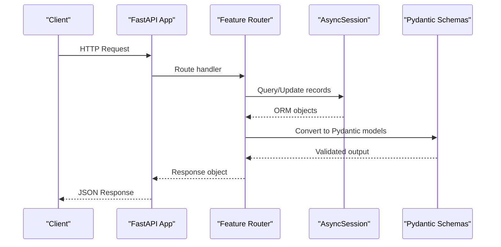
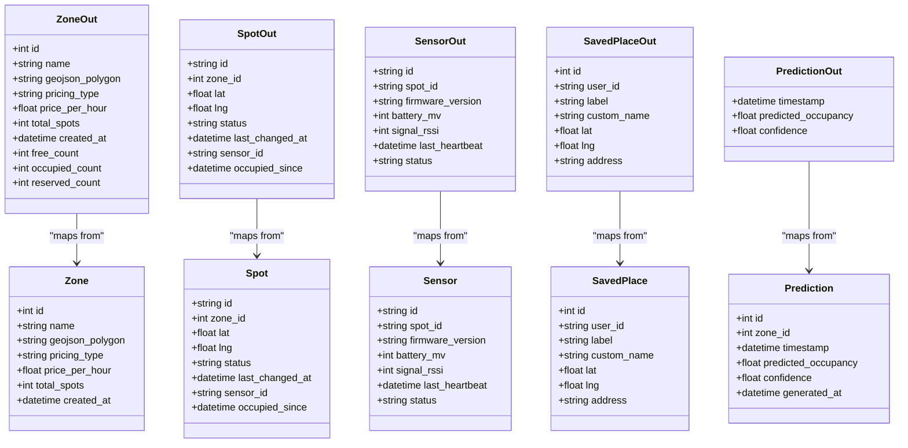

# API Schemas & Validation

<cite>
**Referenced Files in This Document**
- [main.py](file://backend/main.py)
- [schemas.py](file://backend/schemas.py)
- [models.py](file://backend/models.py)
- [database.py](file://backend/database.py)
- [routers/zones.py](file://backend/routers/zones.py)
- [routers/spots.py](file://backend/routers/spots.py)
- [routers/predict.py](file://backend/routers/predict.py)
- [routers/sensors.py](file://backend/routers/sensors.py)
- [routers/agent_router.py](file://backend/routers/agent_router.py)
- [routers/places.py](file://backend/routers/places.py)
- [agent.py](file://backend/agent.py)
</cite>

## Table of Contents
1. [Introduction](#introduction)
2. [Project Structure](#project-structure)
3. [Core Components](#core-components)
4. [Architecture Overview](#architecture-overview)
5. [Detailed Component Analysis](#detailed-component-analysis)
6. [Dependency Analysis](#dependency-analysis)
7. [Performance Considerations](#performance-considerations)
8. [Troubleshooting Guide](#troubleshooting-guide)
9. [Conclusion](#conclusion)
10. [Appendices](#appendices)

## Introduction
This document provides a comprehensive API schema and validation reference for the SmartPark AI backend. It focuses on Pydantic models used for request/response serialization, field constraints, and business logic validation across REST endpoints. It also documents error response formats, validation error handling, and outlines strategies for schema versioning and backward compatibility. Authentication and authorization are not implemented in the current codebase; this is noted where relevant.

## Project Structure
The backend is a FastAPI application with modular routers for zones, spots, predictions, sensors, agent interactions, and saved places. Pydantic schemas are centralized in a single module and reused across endpoints. Database models are defined using SQLAlchemy and mapped to JSON via Pydantic output models.

```mermaid
graph TB
subgraph "FastAPI App"
Main["main.py"]
Zones["routers/zones.py"]
Spots["routers/spots.py"]
Predict["routers/predict.py"]
Sensors["routers/sensors.py"]
Agent["routers/agent_router.py"]
Places["routers/places.py"]
end
subgraph "Schemas"
Schemas["schemas.py"]
end
subgraph "Models"
Models["models.py"]
DB["database.py"]
end
Main --> Zones
Main --> Spots
Main --> Predict
Main --> Sensors
Main --> Agent
Main --> Places
Zones --> Schemas
Spots --> Schemas
Predict --> Schemas
Sensors --> Schemas
Agent --> Schemas
Places --> Schemas
Schemas --> Models
Zones --> DB
Spots --> DB
Predict --> DB
Sensors --> DB
Places --> DB
```

**Diagram sources**
- [main.py:33-58](file://backend/main.py#L33-L58)
- [routers/zones.py:1-124](file://backend/routers/zones.py#L1-L124)
- [routers/spots.py:1-42](file://backend/routers/spots.py#L1-L42)
- [routers/predict.py:1-39](file://backend/routers/predict.py#L1-L39)
- [routers/sensors.py:1-28](file://backend/routers/sensors.py#L1-L28)
- [routers/agent_router.py:1-12](file://backend/routers/agent_router.py#L1-L12)
- [routers/places.py:1-49](file://backend/routers/places.py#L1-L49)
- [schemas.py:1-127](file://backend/schemas.py#L1-L127)
- [models.py:1-89](file://backend/models.py#L1-L89)
- [database.py:1-23](file://backend/database.py#L1-L23)

**Section sources**
- [main.py:33-58](file://backend/main.py#L33-L58)
- [schemas.py:1-127](file://backend/schemas.py#L1-L127)
- [models.py:1-89](file://backend/models.py#L1-L89)
- [database.py:1-23](file://backend/database.py#L1-L23)

## Core Components
This section summarizes all Pydantic schemas used by the API, their fields, types, and default behaviors.

- Zone-related schemas
  - SpotOut: Output model for spot details including id, zone_id, lat, lng, status, last_changed_at, sensor_id, occupied_since.
  - ZoneOut: Output model for zone summary including id, name, geojson_polygon, pricing_type, price_per_hour, total_spots, created_at, free_count, occupied_count, reserved_count.
  - ZoneDetailOut: Extends ZoneOut with a list of SpotOut.

- Sensor-related schemas
  - SensorOut: Output model for sensor telemetry including id, spot_id, firmware_version, battery_mv, signal_rssi, last_heartbeat, status.
  - SensorFleetSummary: Aggregated counts for total, online, offline, low_battery.

- Spot detail schema
  - SpotDetailOut: Extends SpotOut with an optional SensorOut.

- Prediction schemas
  - PredictionOut: Output model for prediction entries including timestamp, predicted_occupancy, confidence.

- Agent schemas
  - AgentTextRequest: Input model for text-based agent queries including text, optional lat, optional lng.
  - MapCard: Optional map card payload with zone_id, zone_name, lat, lng, free_spots, total_spots, price_per_hour, walking_minutes.
  - AgentTextResponse: Response model including text, reasoning_steps (list), and optional map_card.

- Places schemas
  - SavedPlaceCreate: Input model for creating a saved place including label, optional custom_name, lat, lng, optional address.
  - SavedPlaceOut: Output model for saved places including id, user_id, label, optional custom_name, lat, lng, optional address.

Notes on configuration:
- All output models set from_attributes=True to enable ORM-to-Pydantic conversion.
- No explicit Pydantic Field validators or constraints are present in the current schemas.

**Section sources**
- [schemas.py:7-127](file://backend/schemas.py#L7-L127)

## Architecture Overview
The API exposes REST endpoints grouped by feature area. Each endpoint uses Pydantic models for input/output validation and returns structured JSON responses. The application initializes the database, seeds data, and runs a background simulator that updates spot statuses and publishes WebSocket events.



**Diagram sources**
- [main.py:33-58](file://backend/main.py#L33-L58)
- [routers/zones.py:22-86](file://backend/routers/zones.py#L22-L86)
- [routers/spots.py:11-41](file://backend/routers/spots.py#L11-L41)
- [routers/predict.py:12-38](file://backend/routers/predict.py#L12-L38)
- [routers/sensors.py:11-27](file://backend/routers/sensors.py#L11-L27)
- [routers/agent_router.py:8-11](file://backend/routers/agent_router.py#L8-L11)
- [routers/places.py:11-49](file://backend/routers/places.py#L11-L49)

## Detailed Component Analysis

### Zones API
Endpoints:
- GET /api/zones/nearby?lat=&lng=&radius_m=
- GET /api/zones
- GET /api/zones/{zone_id}

Input/Output:
- Inputs: Query parameters lat, lng, radius_m (float).
- Outputs: List[ZoneOut] or ZoneDetailOut.

Validation rules:
- Query parameters are validated as floats by FastAPI.
- Business logic computes free/occupied/reserved counts based on Spot.status values.
- Distance calculation uses haversine formula within the router.

Error handling:
- Returns 404 when a requested zone does not exist.

Example payloads:
- Valid nearby query: lat=25.2048, lng=55.2708, radius_m=500
- Invalid nearby query: lat="abc", lng=55.2708 (type mismatch)
- Expected responses:
  - Successful list: array of ZoneOut objects
  - Not found: HTTPException with 404 and detail message

**Section sources**
- [routers/zones.py:22-86](file://backend/routers/zones.py#L22-L86)
- [routers/zones.py:89-124](file://backend/routers/zones.py#L89-L124)
- [schemas.py:21-42](file://backend/schemas.py#L21-L42)

### Spots API
Endpoints:
- GET /api/spots/{spot_id}

Input/Output:
- Inputs: Path parameter spot_id (string).
- Outputs: SpotDetailOut including optional SensorOut.

Validation rules:
- Path parameter type enforced as string.
- Sensor data included only if associated sensor exists.

Error handling:
- Returns 404 when a requested spot does not exist.

Example payloads:
- Valid request: GET /api/spots/SPOT001
- Invalid request: GET /api/spots/123 (if no such spot exists)
- Expected responses:
  - Successful detail: SpotDetailOut with optional sensor
  - Not found: HTTPException with 404 and detail message

**Section sources**
- [routers/spots.py:11-41](file://backend/routers/spots.py#L11-L41)
- [schemas.py:66-71](file://backend/schemas.py#L66-L71)
- [schemas.py:45-56](file://backend/schemas.py#L45-L56)

### Predictions API
Endpoints:
- GET /api/predict/{zone_id}

Input/Output:
- Inputs: Path parameter zone_id (integer).
- Outputs: List[PredictionOut] covering next 12 hours at 15-minute intervals.

Validation rules:
- Path parameter type enforced as integer.
- Filters predictions between now and now + 12 hours.

Error handling:
- Returns 404 when a requested zone does not exist.

Example payloads:
- Valid request: GET /api/predict/1
- Invalid request: GET /api/predict/abc (type mismatch)
- Expected responses:
  - Successful list: array of PredictionOut objects
  - Not found: HTTPException with 404 and detail message

**Section sources**
- [routers/predict.py:12-38](file://backend/routers/predict.py#L12-L38)
- [schemas.py:74-81](file://backend/schemas.py#L74-L81)

### Sensors API
Endpoints:
- GET /api/sensors

Input/Output:
- Inputs: None.
- Outputs: SensorFleetSummary with total, online, offline, low_battery counts.

Validation rules:
- Low battery threshold is determined by battery_mv < 3000.

Example payloads:
- Valid request: GET /api/sensors
- Expected response: SensorFleetSummary object

**Section sources**
- [routers/sensors.py:11-27](file://backend/routers/sensors.py#L11-L27)
- [schemas.py:58-64](file://backend/schemas.py#L58-L64)

### Agent API
Endpoints:
- POST /api/agent/text

Input/Output:
- Inputs: AgentTextRequest with text (required), optional lat, optional lng.
- Outputs: AgentTextResponse with text, reasoning_steps, optional map_card.

Validation rules:
- Text is required; coordinates are optional.
- Intent detection and processing occur in agent.py.

Business logic highlights:
- Intent classification based on keywords.
- Location resolution from saved places or provided coordinates.
- Ranking zones by composite score considering availability, proximity, and predicted future occupancy.
- MapCard generation for best zone recommendation.

Example payloads:
- Valid request: {"text": "Find parking near my work", "lat": 25.2048, "lng": 55.2708}
- Invalid request: {} (missing required text)
- Expected responses:
  - Successful: AgentTextResponse with reasoning steps and optional map_card
  - Missing location guidance: AgentTextResponse explaining need for location

**Section sources**
- [routers/agent_router.py:8-11](file://backend/routers/agent_router.py#L8-L11)
- [agent.py:246-261](file://backend/agent.py#L246-L261)
- [schemas.py:84-105](file://backend/schemas.py#L84-L105)

### Places API
Endpoints:
- GET /api/places
- POST /api/places
- DELETE /api/places/{place_id}

Input/Output:
- Inputs:
  - GET: None.
  - POST: SavedPlaceCreate with label (required), optional custom_name, lat, lng, optional address.
  - DELETE: Path parameter place_id (integer).
- Outputs:
  - GET: List[SavedPlaceOut].
  - POST: SavedPlaceOut.
  - DELETE: 204 No Content.

Validation rules:
- Label is required; coordinates are required for creation.
- Operations scoped to demo_user.

Error handling:
- Returns 404 when a requested place does not exist.

Example payloads:
- Valid create: {"label": "Home", "custom_name": "My Home", "lat": 25.2048, "lng": 55.2708, "address": "Dubai Internet City"}
- Invalid create: {"label": ""} (empty label)
- Expected responses:
  - Successful list: array of SavedPlaceOut objects
  - Successful create: SavedPlaceOut with generated id
  - Not found: HTTPException with 404 and detail message

**Section sources**
- [routers/places.py:11-49](file://backend/routers/places.py#L11-L49)
- [schemas.py:108-127](file://backend/schemas.py#L108-L127)

## Dependency Analysis
The following diagram shows how routers depend on schemas and models, and how schemas convert ORM objects to JSON.



**Diagram sources**
- [models.py:7-89](file://backend/models.py#L7-L89)
- [schemas.py:7-127](file://backend/schemas.py#L7-L127)

**Section sources**
- [models.py:7-89](file://backend/models.py#L7-L89)
- [schemas.py:7-127](file://backend/schemas.py#L7-L127)

## Performance Considerations
- Counting operations (free/occupied/reserved) are computed in-memory per zone listing; consider caching or database-level aggregation for large datasets.
- Haversine distance calculations are performed per zone; precomputing zone centroids can reduce repeated computations.
- Prediction queries filter by time range; ensure indexes on timestamps and zone_id for efficient retrieval.
- Sensor fleet summary iterates all sensors; consider materialized summaries or periodic aggregation jobs.

## Troubleshooting Guide
Common issues and resolutions:
- Type mismatches in query/path parameters: Ensure lat/lng are floats and ids are correct types.
- Missing resources: Endpoints return 404 with a detail message when entities are not found.
- Validation errors: FastAPI automatically validates inputs; malformed requests will result in 422 Unprocessable Entity responses with detailed field errors.

Error response format:
- 404 Not Found: {"detail": "Entity not found"}
- 422 Validation Error: {"detail": [{"loc": [...], "msg": "...", "type": "..."}]}

Authentication and authorization:
- Not implemented in the current codebase. All endpoints are publicly accessible. If adding auth, introduce middleware and dependency injection for token verification before route handlers.

**Section sources**
- [routers/zones.py:89-124](file://backend/routers/zones.py#L89-L124)
- [routers/spots.py:11-41](file://backend/routers/spots.py#L11-L41)
- [routers/predict.py:12-38](file://backend/routers/predict.py#L12-L38)
- [routers/places.py:38-49](file://backend/routers/places.py#L38-L49)

## Conclusion
The SmartPark AI backend provides a clear, schema-driven API surface using Pydantic models for robust request/response validation. While basic validation relies on FastAPI’s built-in mechanisms, additional field constraints and custom validators can be introduced to strengthen business logic enforcement. The current design supports extensibility for authentication, rate limiting, and advanced caching strategies.

## Appendices

### API Endpoints Summary
- Zones
  - GET /api/zones/nearby?lat=&lng=&radius_m=
  - GET /api/zones
  - GET /api/zones/{zone_id}
- Spots
  - GET /api/spots/{spot_id}
- Predictions
  - GET /api/predict/{zone_id}
- Sensors
  - GET /api/sensors
- Agent
  - POST /api/agent/text
- Places
  - GET /api/places
  - POST /api/places
  - DELETE /api/places/{place_id}

### Schema Versioning Strategy
- Use URL versioning (e.g., /api/v1/zones) to maintain backward compatibility while evolving schemas.
- Introduce new response fields as optional initially; deprecate old fields gradually.
- Maintain separate Pydantic models per version (e.g., ZoneOutV1, ZoneOutV2) to avoid breaking changes.
- Document migration paths in changelogs and provide client-side adapters for gradual rollout.

### Backward Compatibility Considerations
- Avoid removing required fields; mark them deprecated instead.
- Keep enum values stable; add new values without altering existing ones.
- Preserve response structure; nest new data under optional objects.

### Example Requests and Responses
- Zones nearby:
  - Request: GET /api/zones/nearby?lat=25.2048&lng=55.2708&radius_m=500
  - Response: Array of ZoneOut objects
- Spot detail:
  - Request: GET /api/spots/SPOT001
  - Response: SpotDetailOut with optional SensorOut
- Predictions:
  - Request: GET /api/predict/1
  - Response: Array of PredictionOut objects
- Sensors fleet:
  - Request: GET /api/sensors
  - Response: SensorFleetSummary object
- Agent text:
  - Request: POST /api/agent/text with {"text": "Find parking near my work", "lat": 25.2048, "lng": 55.2708}
  - Response: AgentTextResponse with reasoning_steps and optional map_card
- Places:
  - Request: POST /api/places with {"label": "Home", "custom_name": "My Home", "lat": 25.2048, "lng": 55.2708, "address": "Dubai Internet City"}
  - Response: SavedPlaceOut with generated id