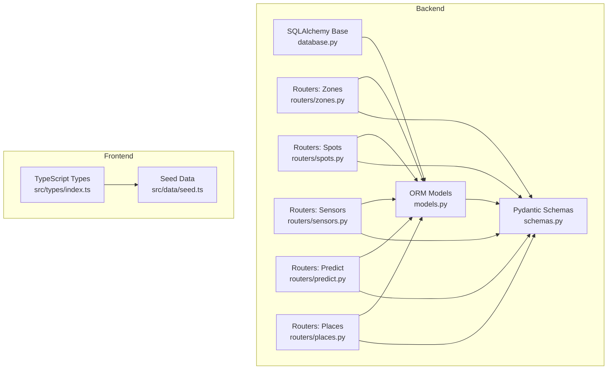
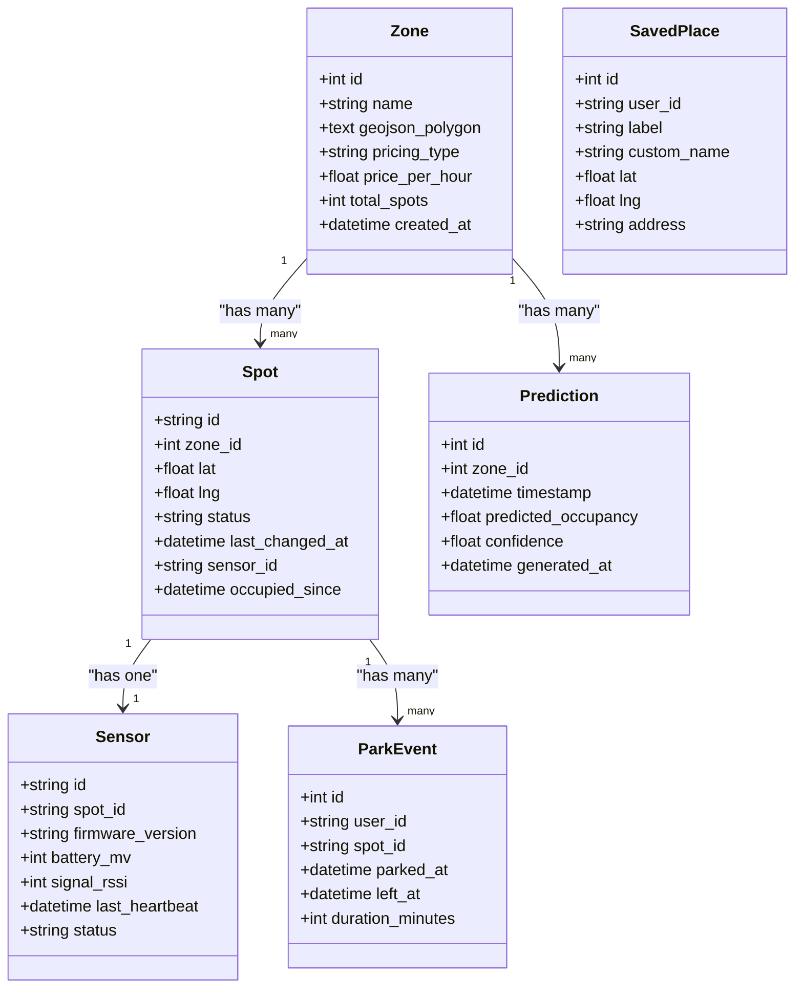
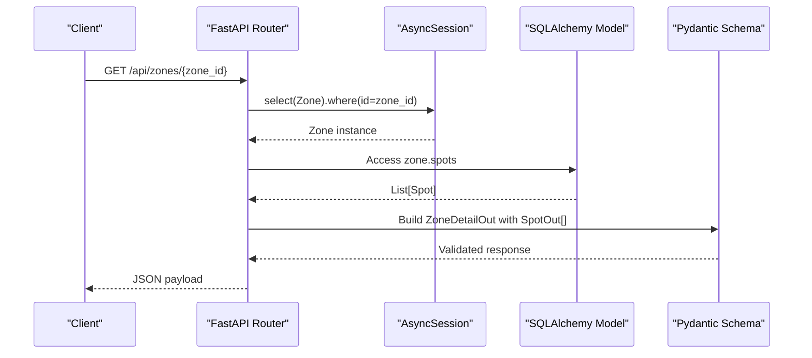
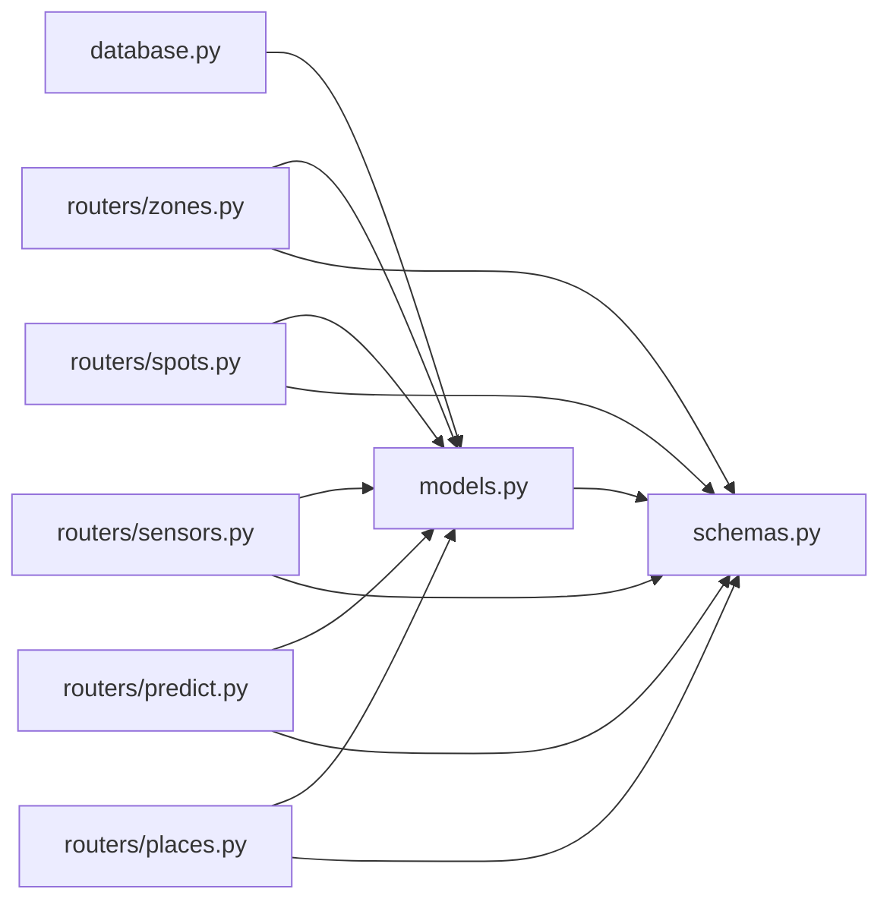
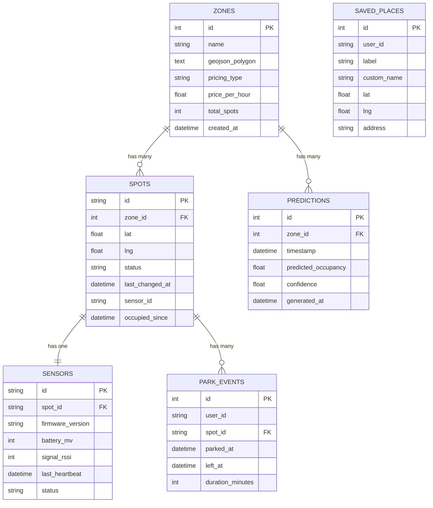

# Data Models & Schema

<cite>
**Referenced Files in This Document**
- [models.py](file://backend/models.py)
- [schemas.py](file://backend/schemas.py)
- [database.py](file://backend/database.py)
- [zones.py](file://backend/routers/zones.py)
- [spots.py](file://backend/routers/spots.py)
- [sensors.py](file://backend/routers/sensors.py)
- [predict.py](file://backend/routers/predict.py)
- [places.py](file://backend/routers/places.py)
- [seed.py](file://backend/seed.py)
- [index.ts](file://frontend/src/types/index.ts)
- [seed.ts](file://frontend/src/data/seed.ts)
</cite>

## Table of Contents
1. [Introduction](#introduction)
2. [Project Structure](#project-structure)
3. [Core Components](#core-components)
4. [Architecture Overview](#architecture-overview)
5. [Detailed Component Analysis](#detailed-component-analysis)
6. [Dependency Analysis](#dependency-analysis)
7. [Performance Considerations](#performance-considerations)
8. [Troubleshooting Guide](#troubleshooting-guide)
9. [Conclusion](#conclusion)
10. [Appendices](#appendices)

## Introduction
This document provides comprehensive data model documentation for SmartPark AI, covering the complete database schema, entity relationships, field definitions, and data types for Zone, Spot, Sensor, Prediction, ParkEvent, and Place entities. It also documents Pydantic schemas used for API request/response validation and serialization, TypeScript type definitions used in the frontend, data validation rules, business constraints, lifecycle management, sample data structures, migration strategies, versioning approaches, security considerations, privacy requirements, access control patterns, and performance optimization techniques including query optimization and caching strategies.

## Project Structure
The project is organized into backend (FastAPI + SQLAlchemy async) and frontend (Next.js + TypeScript). The core data models are defined in the backend using SQLAlchemy ORM, with Pydantic schemas for API I/O. The frontend defines TypeScript interfaces to ensure type safety when consuming APIs or working with local seed data.

**Diagram sources**
- [database.py:1-23](file://backend/database.py#L1-L23)
- [models.py:1-89](file://backend/models.py#L1-L89)
- [schemas.py:1-127](file://backend/schemas.py#L1-L127)
- [zones.py:1-124](file://backend/routers/zones.py#L1-L124)
- [spots.py:1-42](file://backend/routers/spots.py#L1-L42)
- [sensors.py:1-28](file://backend/routers/sensors.py#L1-L28)
- [predict.py:1-39](file://backend/routers/predict.py#L1-L39)
- [places.py:1-49](file://backend/routers/places.py#L1-L49)
- [index.ts:1-75](file://frontend/src/types/index.ts#L1-L75)
- [seed.ts:1-138](file://frontend/src/data/seed.ts#L1-L138)

**Section sources**
- [database.py:1-23](file://backend/database.py#L1-L23)
- [models.py:1-89](file://backend/models.py#L1-L89)
- [schemas.py:1-127](file://backend/schemas.py#L1-L127)
- [zones.py:1-124](file://backend/routers/zones.py#L1-L124)
- [spots.py:1-42](file://backend/routers/spots.py#L1-L42)
- [sensors.py:1-28](file://backend/routers/sensors.py#L1-L28)
- [predict.py:1-39](file://backend/routers/predict.py#L1-L39)
- [places.py:1-49](file://backend/routers/places.py#L1-L49)
- [index.ts:1-75](file://frontend/src/types/index.ts#L1-L75)
- [seed.ts:1-138](file://frontend/src/data/seed.ts#L1-L138)

## Core Components
This section summarizes the primary entities and their responsibilities:

- Zone: Represents a parking zone with pricing, geometry, and aggregate spot counts.
- Spot: A specific parking space within a zone, with location coordinates, status, and sensor linkage.
- Sensor: Device metadata associated with a spot, including health indicators.
- Prediction: Time-series occupancy predictions per zone.
- ParkEvent: Parking session events tied to spots and users.
- SavedPlace: User-saved locations (e.g., home/work/gym) for quick navigation.

Key relationships:
- Zone has many Spots and many Predictions.
- Spot belongs to one Zone and optionally links to one Sensor; Spot has many ParkEvents.
- Sensor belongs to one Spot.
- ParkEvent references a Spot and a user.
- SavedPlace is independent but scoped by user_id.

**Section sources**
- [models.py:7-89](file://backend/models.py#L7-L89)

## Architecture Overview
The system uses an asynchronous FastAPI backend with SQLAlchemy async engine and declarative base. Models define relational structure; routers implement REST endpoints that query models and serialize responses via Pydantic schemas. The frontend consumes these APIs and maintains its own TypeScript types for compile-time safety.

**Diagram sources**
- [models.py:7-89](file://backend/models.py#L7-L89)

## Detailed Component Analysis

### Database Schema and Relationships
- Tables and columns are defined via SQLAlchemy Column types. Primary keys are explicitly set; foreign keys enforce referential integrity between related entities.
- Default values and timestamps are provided where appropriate.
- Relationships are declared using SQLAlchemy relationship() with back_populates and lazy loading options.

Entity details:
- Zone
  - Primary key: id (integer, autoincrement)
  - Fields: name, geojson_polygon (JSON text), pricing_type, price_per_hour, total_spots, created_at
  - Relationships: spots (one-to-many), predictions (one-to-many)
- Spot
  - Primary key: id (string)
  - Foreign key: zone_id -> zones.id
  - Fields: lat, lng, status, last_changed_at, sensor_id, occupied_since
  - Relationships: zone (many-to-one), sensor (one-to-one optional), park_events (one-to-many)
- Sensor
  - Primary key: id (string)
  - Foreign key: spot_id -> spots.id
  - Fields: firmware_version, battery_mv, signal_rssi, last_heartbeat, status
  - Relationship: spot (many-to-one)
- Prediction
  - Primary key: id (integer, autoincrement)
  - Foreign key: zone_id -> zones.id
  - Fields: timestamp, predicted_occupancy, confidence, generated_at
  - Relationship: zone (many-to-one)
- ParkEvent
  - Primary key: id (integer, autoincrement)
  - Foreign key: spot_id -> spots.id
  - Fields: user_id, parked_at, left_at, duration_minutes
  - Relationship: spot (many-to-one)
- SavedPlace
  - Primary key: id (integer, autoincrement)
  - Fields: user_id, label, custom_name, lat, lng, address

Indexes and constraints:
- Explicit indexes are not defined in the current codebase.
- Foreign key constraints are enforced by the database through ForeignKey declarations.
- Unique constraints are not defined beyond primary keys.

Data integrity notes:
- Status fields use string enums implicitly (e.g., free, occupied, reserved, sensor_offline for Spot; online/offline/low_battery for Sensor).
- Timestamps default to UTC where specified.

**Section sources**
- [models.py:7-89](file://backend/models.py#L7-L89)

### Pydantic Schemas (API Validation and Serialization)
Schemas define input/output contracts for API endpoints and include computed fields for convenience.

- SpotOut: Serializes Spot fields for output.
- ZoneOut: Serializes Zone fields plus computed counts (free_count, occupied_count, reserved_count).
- ZoneDetailOut: Extends ZoneOut with nested list of SpotOut.
- SensorOut: Serializes Sensor fields.
- SensorFleetSummary: Aggregates fleet health metrics (total, online, offline, low_battery).
- SpotDetailOut: Extends SpotOut with optional SensorOut.
- PredictionOut: Serializes prediction records without internal IDs.
- AgentTextRequest/AgentTextResponse and MapCard: Used by agent-related endpoints.
- SavedPlaceCreate/SavedPlaceOut: Input and output for saved places.

Validation behavior:
- from_attributes = True enables ORM object serialization.
- Optional fields allow nullability as needed.
- Computed fields (e.g., counts) are populated by routers before response construction.

**Section sources**
- [schemas.py:1-127](file://backend/schemas.py#L1-L127)

### TypeScript Types (Frontend Type Safety)
Frontend types mirror backend concepts and provide strict typing for UI components and local seed data.

- SpotStatus: Enumerated statuses for spots.
- Zone: Includes geometry (GeoJSON.Polygon) and aggregated spot counts.
- Spot: Location, status, timestamps, and sensor linkage.
- Sensor: Health and device metadata.
- SavedPlace: User-saved locations with labels.
- Prediction: Time series occupancy predictions.
- ParkEvent: Parking sessions with optional completion fields.
- AgentResponse: Structured agent replies with optional map card.

These types ensure consistent shape across API calls and local simulation logic.

**Section sources**
- [index.ts:1-75](file://frontend/src/types/index.ts#L1-L75)

### API Endpoints and Data Flows
Endpoints demonstrate how models and schemas interact to serve data.

- Zones
  - GET /api/zones/nearby: Returns nearby zones based on haversine distance and computes spot counts.
  - GET /api/zones: Lists all zones with computed counts.
  - GET /api/zones/{zone_id}: Retrieves a zone with its spots.
- Spots
  - GET /api/spots/{spot_id}: Retrieves a spot with optional sensor details.
- Sensors
  - GET /api/sensors: Returns fleet summary aggregating sensor states.
- Predict
  - GET /api/predict/{zone_id}: Returns future predictions within a time window ordered by timestamp.
- Places
  - GET /api/places: Lists saved places for demo_user.
  - POST /api/places: Creates a new saved place.
  - DELETE /api/places/{place_id}: Deletes a saved place.

**Diagram sources**
- [zones.py:89-124](file://backend/routers/zones.py#L89-L124)
- [models.py:7-37](file://backend/models.py#L7-L37)
- [schemas.py:21-42](file://backend/schemas.py#L21-L42)

**Section sources**
- [zones.py:1-124](file://backend/routers/zones.py#L1-L124)
- [spots.py:1-42](file://backend/routers/spots.py#L1-L42)
- [sensors.py:1-28](file://backend/routers/sensors.py#L1-L28)
- [predict.py:1-39](file://backend/routers/predict.py#L1-L39)
- [places.py:1-49](file://backend/routers/places.py#L1-L49)

### Seed Data and Sample Structures
Seed scripts populate realistic demo data for development and testing.

- Backend seed creates zones with GeoJSON polygons, generates spots and sensors, inserts saved places, and produces 12-hour prediction series at 15-minute intervals.
- Frontend seed constructs local zones, spots, and saved places for UI demos.

Sample structures:
- Zone includes polygon geometry and pricing info.
- Spot includes coordinates, status, and timestamps.
- Sensor includes device health metrics.
- Prediction includes occupancy percentage and confidence over time.
- SavedPlace includes label and address.

**Section sources**
- [seed.py:1-198](file://backend/seed.py#L1-L198)
- [seed.ts:1-138](file://frontend/src/data/seed.ts#L1-L138)

## Dependency Analysis
The following diagram shows module-level dependencies among backend components and their relation to models and schemas.

**Diagram sources**
- [database.py:1-23](file://backend/database.py#L1-L23)
- [models.py:1-89](file://backend/models.py#L1-L89)
- [schemas.py:1-127](file://backend/schemas.py#L1-L127)
- [zones.py:1-124](file://backend/routers/zones.py#L1-L124)
- [spots.py:1-42](file://backend/routers/spots.py#L1-L42)
- [sensors.py:1-28](file://backend/routers/sensors.py#L1-L28)
- [predict.py:1-39](file://backend/routers/predict.py#L1-L39)
- [places.py:1-49](file://backend/routers/places.py#L1-L49)

**Section sources**
- [database.py:1-23](file://backend/database.py#L1-L23)
- [models.py:1-89](file://backend/models.py#L1-L89)
- [schemas.py:1-127](file://backend/schemas.py#L1-L127)
- [zones.py:1-124](file://backend/routers/zones.py#L1-L124)
- [spots.py:1-42](file://backend/routers/spots.py#L1-L42)
- [sensors.py:1-28](file://backend/routers/sensors.py#L1-L28)
- [predict.py:1-39](file://backend/routers/predict.py#L1-L39)
- [places.py:1-49](file://backend/routers/places.py#L1-L49)

## Performance Considerations
- Query Optimization
  - Use explicit selects and filters to avoid N+1 queries. For example, fetch only required fields and apply WHERE clauses early.
  - Add database indexes on frequently filtered columns such as zones.id, spots.zone_id, sensors.spot_id, predictions.zone_id, and timestamps for range queries.
  - Prefer server-side aggregation for counts rather than computing in Python loops when datasets grow large.
- Caching Strategies
  - Cache near-zone results and zone detail responses using an in-memory cache (e.g., Redis) keyed by coordinates and radius or zone_id.
  - Cache prediction windows per zone for short durations to reduce repeated computation or DB reads.
  - Cache sensor fleet summaries with TTL updates triggered by sensor heartbeat changes.
- Concurrency and Async
  - Leverage async sessions and non-blocking IO for high-throughput scenarios.
  - Tune connection pool sizes according to workload and database capacity.
- Geometry Queries
  - Offload spatial computations to the database if supported (e.g., PostGIS) to compute distances and containment efficiently.

[No sources needed since this section provides general guidance]

## Troubleshooting Guide
Common issues and resolutions:
- Missing Records
  - Ensure seeding script runs successfully to populate initial data. Check logs for “Database already seeded” messages indicating existing data.
- 404 Errors
  - Verify resource existence before retrieval; endpoints raise HTTPException when not found. Confirm IDs match persisted records.
- Sensor Health
  - Fleet summary thresholds (e.g., low battery) are computed server-side; adjust thresholds if needed and monitor last_heartbeat staleness.
- Prediction Gaps
  - Confirm prediction generation covers the requested time window and timezone offsets; verify ordering by timestamp.

Operational checks:
- Validate database connectivity and URL configuration.
- Inspect router responses against Pydantic schemas to catch serialization mismatches.

**Section sources**
- [seed.py:126-198](file://backend/seed.py#L126-L198)
- [zones.py:89-124](file://backend/routers/zones.py#L89-L124)
- [spots.py:11-42](file://backend/routers/spots.py#L11-L42)
- [sensors.py:11-28](file://backend/routers/sensors.py#L11-L28)
- [predict.py:12-39](file://backend/routers/predict.py#L12-L39)

## Conclusion
SmartPark AI’s data model centers around Zones, Spots, Sensors, Predictions, ParkEvents, and SavedPlaces, with clear relationships and well-defined Pydantic schemas for robust API contracts. The current implementation emphasizes simplicity and developer experience, with seed data facilitating rapid iteration. To scale, introduce explicit indexes, server-side aggregations, caching layers, and spatial query optimizations. Security and privacy should be addressed via authentication, authorization, and data minimization practices.

[No sources needed since this section summarizes without analyzing specific files]

## Appendices

### Entity Relationship Diagram

**Diagram sources**
- [models.py:7-89](file://backend/models.py#L7-L89)

### Data Lifecycle Management
- Creation
  - Zones and Spots are typically created during setup or provisioning; sensors are linked upon deployment.
  - Predictions are generated periodically and stored with timestamps.
  - ParkEvents are recorded on parking start and completion.
  - SavedPlaces are created by users via API.
- Updates
  - Spot status transitions update last_changed_at and occupied_since accordingly.
  - Sensor heartbeats refresh last_heartbeat and status.
- Deletion
  - SavedPlaces can be deleted by ID; consider cascading deletes for historical data retention policies.

**Section sources**
- [seed.py:126-198](file://backend/seed.py#L126-L198)
- [places.py:21-49](file://backend/routers/places.py#L21-L49)

### Migration Strategies and Versioning
- Current approach relies on automatic table creation via DeclarativeBase metadata.
- Recommended strategy:
  - Adopt a migration tool (e.g., Alembic) to manage schema evolution.
  - Version migrations alongside application releases.
  - Provide rollback paths for destructive changes.
  - Backward-compatible schema changes (additive fields) preferred.

[No sources needed since this section provides general guidance]

### Security, Privacy, and Access Control
- Authentication and Authorization
  - Implement JWT-based auth and role-based access control for admin vs. user operations.
- Data Minimization
  - Limit exposed fields in API responses; avoid returning sensitive identifiers unless necessary.
- Audit Logging
  - Log critical actions (create/delete places, state changes) with user context.
- Compliance
  - Ensure personal data handling meets regional regulations; anonymize or pseudonymize user_ids where feasible.

[No sources needed since this section provides general guidance]