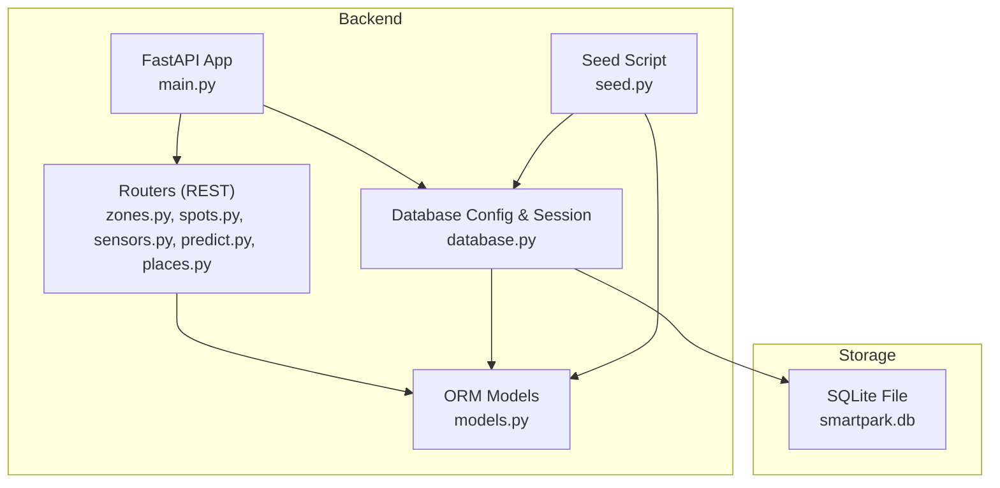
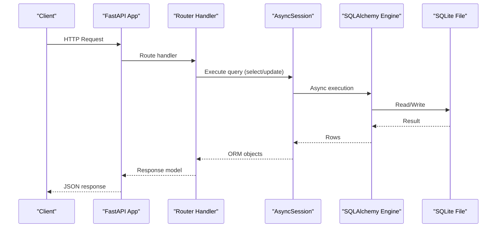
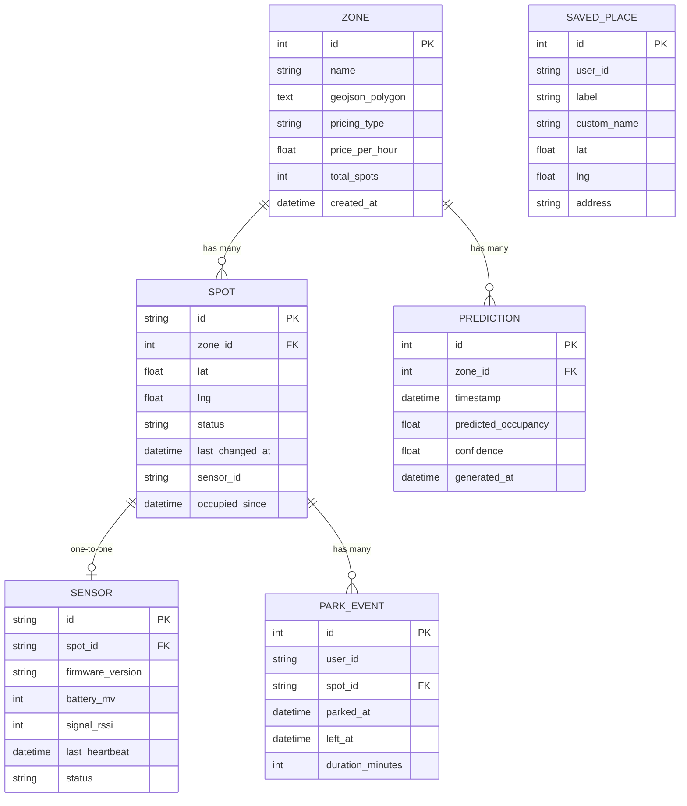
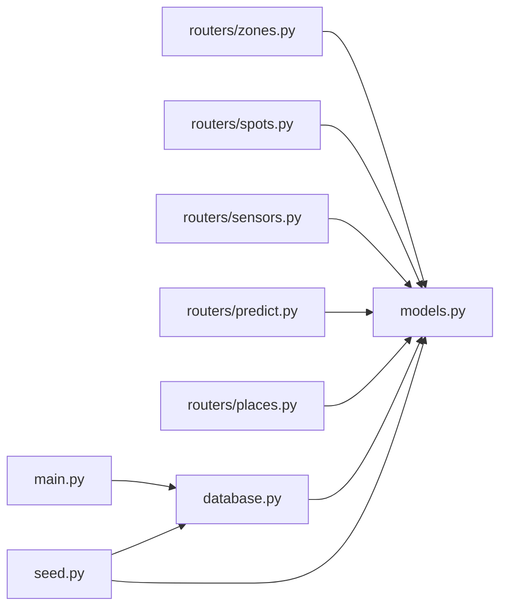

# Database Schema

<cite>
**Referenced Files in This Document**
- [models.py](file://backend/models.py)
- [database.py](file://backend/database.py)
- [schemas.py](file://backend/schemas.py)
- [seed.py](file://backend/seed.py)
- [zones.py](file://backend/routers/zones.py)
- [spots.py](file://backend/routers/spots.py)
- [sensors.py](file://backend/routers/sensors.py)
- [predict.py](file://backend/routers/predict.py)
- [places.py](file://backend/routers/places.py)
- [main.py](file://backend/main.py)
</cite>

## Table of Contents
1. [Introduction](#introduction)
2. [Project Structure](#project-structure)
3. [Core Components](#core-components)
4. [Architecture Overview](#architecture-overview)
5. [Detailed Component Analysis](#detailed-component-analysis)
6. [Dependency Analysis](#dependency-analysis)
7. [Performance Considerations](#performance-considerations)
8. [Troubleshooting Guide](#troubleshooting-guide)
9. [Conclusion](#conclusion)
10. [Appendices](#appendices)

## Introduction
This document describes the relational database schema for SmartPark AI, including all entities: Zone, Spot, Sensor, Prediction, ParkEvent, and SavedPlace. It details primary keys, foreign key relationships, data types, constraints, indexes, ORM model definitions, and their corresponding table structures. It also provides sample SQL queries for common operations, optimization strategies, migration patterns, versioning approaches, and backup/restore procedures.

## Project Structure
The database layer is implemented using SQLAlchemy with an async engine and declarative models. The application initializes the database on startup and seeds demo data. Routers expose REST endpoints that read from and write to these tables.

**Diagram sources**
- [main.py:13-31](file://backend/main.py#L13-L31)
- [database.py:1-23](file://backend/database.py#L1-L23)
- [models.py:1-89](file://backend/models.py#L1-L89)
- [zones.py:1-124](file://backend/routers/zones.py#L1-L124)
- [spots.py:1-42](file://backend/routers/spots.py#L1-L42)
- [sensors.py:1-28](file://backend/routers/sensors.py#L1-L28)
- [predict.py:1-39](file://backend/routers/predict.py#L1-L39)
- [places.py:1-49](file://backend/routers/places.py#L1-L49)
- [seed.py:1-198](file://backend/seed.py#L1-L198)

**Section sources**
- [main.py:13-31](file://backend/main.py#L13-L31)
- [database.py:1-23](file://backend/database.py#L1-L23)

## Core Components
The system defines six core entities as SQLAlchemy ORM models. Each entity maps to a table with specific columns, constraints, and relationships.

- Zone: Represents parking zones with pricing and geometry metadata.
- Spot: Represents individual parking spaces within a zone.
- Sensor: Represents IoT sensor attached to a spot.
- Prediction: Stores predicted occupancy per zone over time.
- ParkEvent: Records parking events per spot.
- SavedPlace: User-saved locations (e.g., home/work).

Key relationship summary:
- One-to-many: Zone -> Spot
- One-to-one: Spot <-> Sensor
- Many-to-one: Spot <- ParkEvent
- One-to-many: Zone -> Prediction
- Independent: SavedPlace (no FKs)

**Section sources**
- [models.py:7-89](file://backend/models.py#L7-L89)

## Architecture Overview
The database architecture uses an asynchronous SQLAlchemy engine configured via environment variables, defaulting to SQLite. On application startup, the database is initialized and seeded with demo data. Routers perform CRUD operations through async sessions.

**Diagram sources**
- [main.py:13-31](file://backend/main.py#L13-L31)
- [database.py:1-23](file://backend/database.py#L1-L23)
- [zones.py:22-59](file://backend/routers/zones.py#L22-L59)
- [spots.py:11-41](file://backend/routers/spots.py#L11-L41)
- [predict.py:12-38](file://backend/routers/predict.py#L12-L38)
- [places.py:11-48](file://backend/routers/places.py#L11-L48)

## Detailed Component Analysis

### Entity: Zone
- Table name: zones
- Primary key: id (Integer, autoincrement)
- Columns:
  - name: String(200), not null
  - geojson_polygon: Text, nullable
  - pricing_type: String(50), default "hourly"
  - price_per_hour: Float, default 4.0
  - total_spots: Integer, default 0
  - created_at: DateTime, default UTC now
- Relationships:
  - One-to-many to Spot
  - One-to-many to Prediction
- Indexes: None defined explicitly
- Constraints:
  - Not null on name
  - Defaults applied to pricing fields and timestamps

Common usage:
- Listing zones with computed counts
- Fetching a zone by ID with its spots

Sample SQL queries:
- List all zones:
  - SELECT id, name, pricing_type, price_per_hour, total_spots, created_at FROM zones;
- Get a single zone:
  - SELECT * FROM zones WHERE id = :zone_id;

Optimization notes:
- No explicit indexes; consider adding an index on created_at if querying by time ranges frequently.

**Section sources**
- [models.py:7-20](file://backend/models.py#L7-L20)
- [zones.py:62-86](file://backend/routers/zones.py#L62-L86)
- [zones.py:89-123](file://backend/routers/zones.py#L89-L123)

### Entity: Spot
- Table name: spots
- Primary key: id (String(20))
- Columns:
  - zone_id: Integer, not null, references zones.id
  - lat: Float, not null
  - lng: Float, not null
  - status: String(20), default "free"
  - last_changed_at: DateTime, default UTC now
  - sensor_id: String(50), nullable
  - occupied_since: DateTime, nullable
- Relationships:
  - Many-to-one to Zone
  - One-to-one to Sensor (uselist=False)
  - One-to-many to ParkEvent
- Indexes: None defined explicitly
- Constraints:
  - Foreign key to zones.id
  - Not null on zone_id, lat, lng
  - Status constrained by application logic to values like free, occupied, reserved, sensor_offline

Common usage:
- Fetching spot detail with sensor info
- Filtering by status or coordinates

Sample SQL queries:
- Get spot by ID:
  - SELECT * FROM spots WHERE id = :spot_id;
- Count free spots in a zone:
  - SELECT COUNT(*) FROM spots WHERE zone_id = :zone_id AND status = 'free';

Optimization notes:
- Consider composite index on (zone_id, status) for frequent filtering by zone and status.
- Consider spatial indexing on (lat, lng) if performing proximity queries at scale.

**Section sources**
- [models.py:22-37](file://backend/models.py#L22-L37)
- [spots.py:11-41](file://backend/routers/spots.py#L11-L41)

### Entity: Sensor
- Table name: sensors
- Primary key: id (String(50))
- Columns:
  - spot_id: String(20), not null, references spots.id
  - firmware_version: String(20), default "2.1.4"
  - battery_mv: Integer, default 3400
  - signal_rssi: Integer, default -55
  - last_heartbeat: DateTime, default UTC now
  - status: String(20), default "online"
- Relationships:
  - Many-to-one to Spot
- Indexes: None defined explicitly
- Constraints:
  - Foreign key to spots.id
  - Not null on spot_id

Common usage:
- Fleet health summary (total, online, offline, low_battery)

Sample SQL queries:
- Fleet summary:
  - SELECT COUNT(*) AS total, SUM(CASE WHEN status='online' THEN 1 ELSE 0 END) AS online, SUM(CASE WHEN status='offline' THEN 1 ELSE 0 END) AS offline, SUM(CASE WHEN battery_mv < 3000 THEN 1 ELSE 0 END) AS low_battery FROM sensors;

Optimization notes:
- Consider index on status and battery_mv for fleet summaries.

**Section sources**
- [models.py:39-51](file://backend/models.py#L39-L51)
- [sensors.py:11-27](file://backend/routers/sensors.py#L11-L27)

### Entity: Prediction
- Table name: predictions
- Primary key: id (Integer, autoincrement)
- Columns:
  - zone_id: Integer, not null, references zones.id
  - timestamp: DateTime, not null
  - predicted_occupancy: Float, not null
  - confidence: Float, default 0.85
  - generated_at: DateTime, default UTC now
- Relationships:
  - Many-to-one to Zone
- Indexes: None defined explicitly
- Constraints:
  - Foreign key to zones.id
  - Not null on zone_id, timestamp, predicted_occupancy

Common usage:
- Retrieving next 12 hours of predictions for a zone ordered by timestamp

Sample SQL queries:
- Next 12 hours predictions:
  - SELECT timestamp, predicted_occupancy, confidence FROM predictions WHERE zone_id = :zone_id AND timestamp >= :now AND timestamp <= :end_time ORDER BY timestamp;

Optimization notes:
- Add index on (zone_id, timestamp) for efficient range queries.

**Section sources**
- [models.py:65-76](file://backend/models.py#L65-L76)
- [predict.py:12-38](file://backend/routers/predict.py#L12-L38)

### Entity: ParkEvent
- Table name: park_events
- Primary key: id (Integer, autoincrement)
- Columns:
  - user_id: String(100), default "demo_user"
  - spot_id: String(20), not null, references spots.id
  - parked_at: DateTime, default UTC now
  - left_at: DateTime, nullable
  - duration_minutes: Integer, nullable
- Relationships:
  - Many-to-one to Spot
- Indexes: None defined explicitly
- Constraints:
  - Foreign key to spots.id
  - Not null on spot_id

Common usage:
- Tracking parking durations and event history per spot

Sample SQL queries:
- Recent events for a spot:
  - SELECT parked_at, left_at, duration_minutes FROM park_events WHERE spot_id = :spot_id ORDER BY parked_at DESC LIMIT :n;

Optimization notes:
- Consider index on (spot_id, parked_at) for recent event retrieval.

**Section sources**
- [models.py:78-89](file://backend/models.py#L78-L89)

### Entity: SavedPlace
- Table name: saved_places
- Primary key: id (Integer, autoincrement)
- Columns:
  - user_id: String(100), default "demo_user"
  - label: String(50), not null
  - custom_name: String(200), nullable
  - lat: Float, not null
  - lng: Float, not null
  - address: String(500), nullable
- Relationships:
  - None (independent entity)
- Indexes: None defined explicitly
- Constraints:
  - Not null on label, lat, lng

Common usage:
- Listing, creating, and deleting saved places for a user

Sample SQL queries:
- List places for user:
  - SELECT id, user_id, label, custom_name, lat, lng, address FROM saved_places WHERE user_id = :user_id;
- Create place:
  - INSERT INTO saved_places (user_id, label, custom_name, lat, lng, address) VALUES (:user_id, :label, :custom_name, :lat, :lng, :address);
- Delete place:
  - DELETE FROM saved_places WHERE id = :place_id AND user_id = :user_id;

Optimization notes:
- Consider index on user_id for multi-user scenarios.

**Section sources**
- [models.py:53-64](file://backend/models.py#L53-L64)
- [places.py:11-48](file://backend/routers/places.py#L11-L48)

### Relationship Diagram

**Diagram sources**
- [models.py:7-89](file://backend/models.py#L7-L89)

## Dependency Analysis
The following diagram shows how routers depend on models and database session management.

**Diagram sources**
- [zones.py:1-124](file://backend/routers/zones.py#L1-L124)
- [spots.py:1-42](file://backend/routers/spots.py#L1-L42)
- [sensors.py:1-28](file://backend/routers/sensors.py#L1-L28)
- [predict.py:1-39](file://backend/routers/predict.py#L1-L39)
- [places.py:1-49](file://backend/routers/places.py#L1-L49)
- [main.py:1-64](file://backend/main.py#L1-L64)
- [database.py:1-23](file://backend/database.py#L1-L23)
- [seed.py:1-198](file://backend/seed.py#L1-L198)

**Section sources**
- [main.py:49-58](file://backend/main.py#L49-L58)
- [database.py:15-23](file://backend/database.py#L15-L23)

## Performance Considerations
- Indexing strategy:
  - predictions(zone_id, timestamp): improves range queries for prediction timelines.
  - spots(zone_id, status): improves counting and filtering by zone and status.
  - sensors(status, battery_mv): improves fleet summary aggregation.
  - park_events(spot_id, parked_at): improves recent event retrieval.
- Query patterns:
  - Avoid N+1 queries by eager loading where possible (e.g., selectin relationships are used in models).
  - Use server-side aggregation when feasible (COUNT, SUM) instead of client-side loops.
- Data volume:
  - Predictions grow linearly with time; consider partitioning or archival strategies for long-term retention.
- Spatial queries:
  - For large datasets, consider spatial indexes on lat/lng and use spatial functions for proximity searches.

[No sources needed since this section provides general guidance]

## Troubleshooting Guide
- Initialization issues:
  - Ensure DATABASE_URL is set correctly; defaults to SQLite file smartpark.db.
  - Verify init_db() runs on startup and creates tables.
- Seeding conflicts:
  - seed_database() checks for existing zones before seeding; if data exists, it skips seeding.
- Common errors:
  - Missing foreign key references: ensure referenced rows exist before inserts.
  - Constraint violations: validate input against model constraints (not null, defaults).
- Debugging tips:
  - Enable echo=True in engine creation temporarily to log SQL statements.
  - Inspect session state and commit/refresh behavior after writes.

**Section sources**
- [database.py:5-17](file://backend/database.py#L5-L17)
- [seed.py:126-133](file://backend/seed.py#L126-L133)

## Conclusion
SmartPark AI’s database schema centers around zones, spots, sensors, predictions, park events, and saved places. The current implementation uses SQLAlchemy declarative models with no explicit indexes beyond primary keys. For production readiness, add targeted indexes, enforce stricter constraints, implement migrations, and establish backup/restore procedures. The provided sample queries and optimization notes can guide performance tuning and operational maintenance.

[No sources needed since this section summarizes without analyzing specific files]

## Appendices

### ORM Model Definitions and Table Structures
- All model definitions and column specifications are located in the models module.
- Database configuration and session management are in the database module.
- API schemas define output shapes and validation rules for responses.

**Section sources**
- [models.py:1-89](file://backend/models.py#L1-L89)
- [database.py:1-23](file://backend/database.py#L1-L23)
- [schemas.py:1-127](file://backend/schemas.py#L1-L127)

### Sample SQL Queries
- List zones:
  - SELECT id, name, pricing_type, price_per_hour, total_spots, created_at FROM zones;
- Get zone detail with spot counts:
  - SELECT z.*, COUNT(CASE WHEN s.status='free' THEN 1 END) AS free_count, COUNT(CASE WHEN s.status='occupied' THEN 1 END) AS occupied_count, COUNT(CASE WHEN s.status='reserved' THEN 1 END) AS reserved_count FROM zones z LEFT JOIN spots s ON z.id = s.zone_id WHERE z.id = :zone_id GROUP BY z.id;
- Get spot detail with sensor:
  - SELECT sp.*, se.* FROM spots sp LEFT JOIN sensors se ON sp.id = se.spot_id WHERE sp.id = :spot_id;
- Get predictions for next 12 hours:
  - SELECT timestamp, predicted_occupancy, confidence FROM predictions WHERE zone_id = :zone_id AND timestamp >= :now AND timestamp <= :end_time ORDER BY timestamp;
- Fleet summary:
  - SELECT COUNT(*) AS total, SUM(CASE WHEN status='online' THEN 1 ELSE 0 END) AS online, SUM(CASE WHEN status='offline' THEN 1 ELSE 0 END) AS offline, SUM(CASE WHEN battery_mv < 3000 THEN 1 ELSE 0 END) AS low_battery FROM sensors;
- Saved places CRUD:
  - SELECT id, user_id, label, custom_name, lat, lng, address FROM saved_places WHERE user_id = :user_id;
  - INSERT INTO saved_places (user_id, label, custom_name, lat, lng, address) VALUES (:user_id, :label, :custom_name, :lat, :lng, :address);
  - DELETE FROM saved_places WHERE id = :place_id AND user_id = :user_id;

[No sources needed since this section provides general guidance]

### Migration Patterns and Versioning
- Current approach:
  - Tables are created automatically on startup using Base.metadata.create_all.
  - No dedicated migration tooling (e.g., Alembic) is present in the repository.
- Recommended approach:
  - Introduce Alembic for versioned migrations.
  - Generate initial migration from existing models.
  - Apply migrations programmatically during startup or via CLI.
  - Maintain migration scripts under a dedicated directory and track changes in version control.

[No sources needed since this section provides general guidance]

### Backup and Restore Procedures
- SQLite-specific:
  - Stop the application to ensure consistent snapshots.
  - Copy the smartpark.db file to a secure location for backup.
  - To restore, replace the active smartpark.db with the backed-up file and restart the application.
- General recommendations:
  - Schedule regular backups.
  - Validate backups periodically.
  - Consider exporting to SQL dumps for portability and auditing.

[No sources needed since this section provides general guidance]