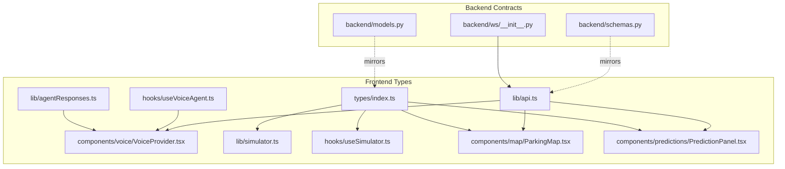
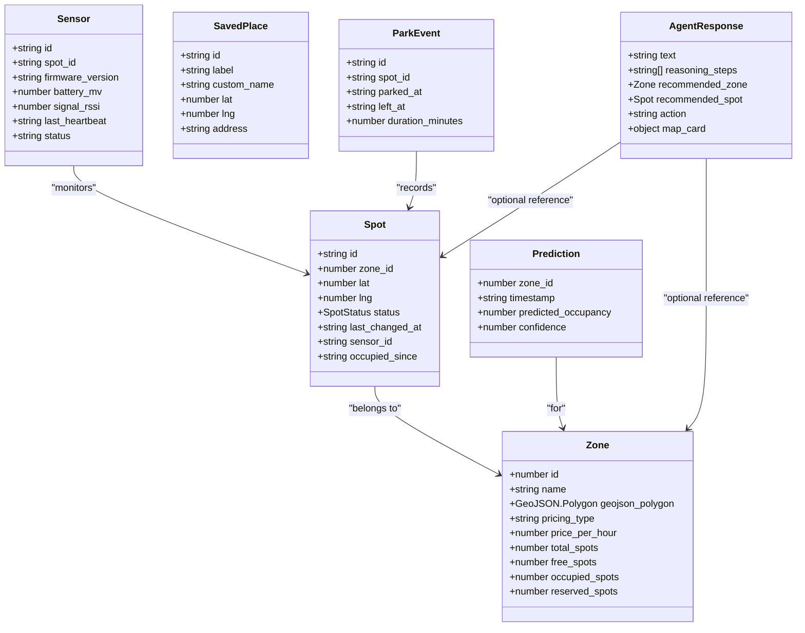
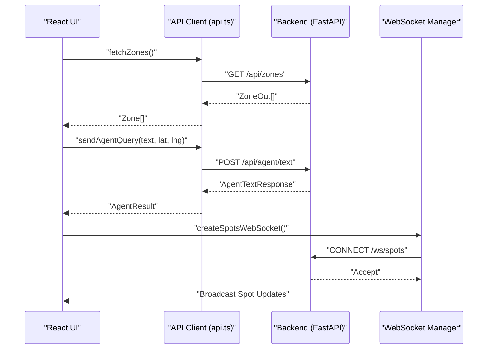
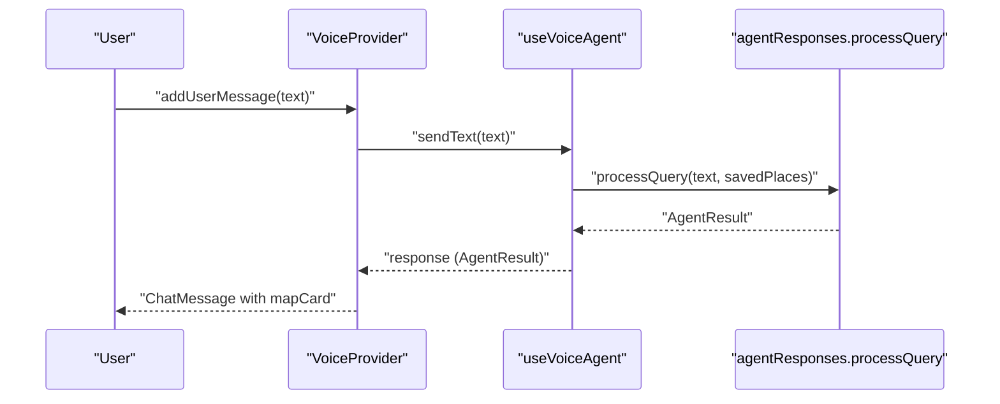
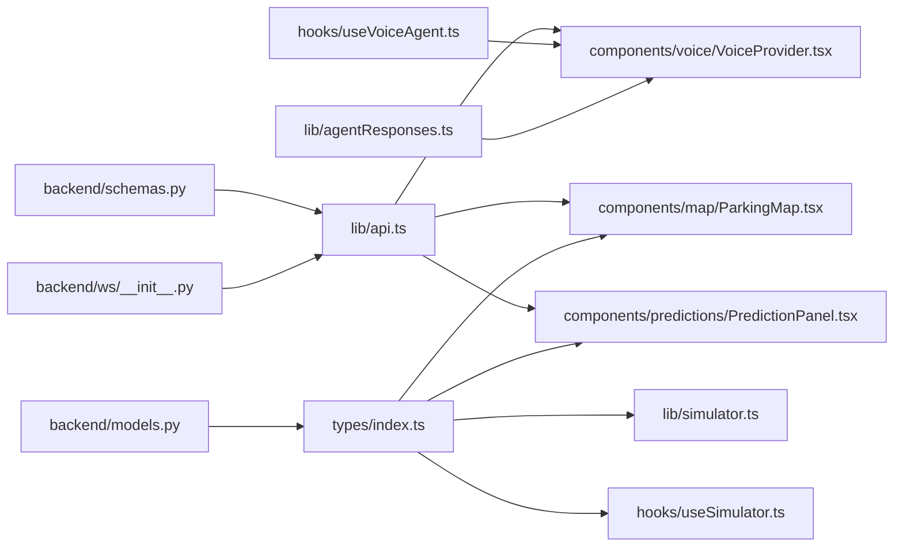

# Frontend Type Definitions

<cite>
**Referenced Files in This Document**
- [index.ts](file://frontend/src/types/index.ts)
- [api.ts](file://frontend/src/lib/api.ts)
- [simulator.ts](file://frontend/src/lib/simulator.ts)
- [useSimulator.ts](file://frontend/src/hooks/useSimulator.ts)
- [ParkingMap.tsx](file://frontend/src/components/map/ParkingMap.tsx)
- [PredictionPanel.tsx](file://frontend/src/components/predictions/PredictionPanel.tsx)
- [agentResponses.ts](file://frontend/src/lib/agentResponses.ts)
- [useVoiceAgent.ts](file://frontend/src/hooks/useVoiceAgent.ts)
- [VoiceProvider.tsx](file://frontend/src/components/voice/VoiceProvider.tsx)
- [models.py](file://backend/models.py)
- [schemas.py](file://backend/schemas.py)
- [ws/__init__.py](file://backend/ws/__init__.py)
</cite>

## Table of Contents
1. [Introduction](#introduction)
2. [Project Structure](#project-structure)
3. [Core Components](#core-components)
4. [Architecture Overview](#architecture-overview)
5. [Detailed Component Analysis](#detailed-component-analysis)
6. [Dependency Analysis](#dependency-analysis)
7. [Performance Considerations](#performance-considerations)
8. [Troubleshooting Guide](#troubleshooting-guide)
9. [Conclusion](#conclusion)
10. [Appendices](#appendices)

## Introduction
This document provides comprehensive TypeScript type definition documentation for the SmartPark AI frontend. It focuses on interfaces and types that model core domain entities, API payloads, real-time messages, and utility types used across components and hooks. The goal is to improve type safety, developer experience, and maintainability by clearly defining contracts between the frontend and backend, and by illustrating how these types are consumed in React components and hooks.

## Project Structure
The frontend organizes types and their usage as follows:
- Core domain types are centralized under a single module.
- API client functions define request/response shapes implicitly via fetch calls.
- Real-time WebSocket endpoints are defined on the backend; the frontend constructs URLs and uses native WebSocket APIs.
- Hooks encapsulate stateful logic and expose typed return values.
- Components consume types through props and local state.

**Diagram sources**
- [index.ts:1-75](file://frontend/src/types/index.ts#L1-L75)
- [api.ts:1-27](file://frontend/src/lib/api.ts#L1-L27)
- [simulator.ts:1-73](file://frontend/src/lib/simulator.ts#L1-L73)
- [useSimulator.ts:1-62](file://frontend/src/hooks/useSimulator.ts#L1-L62)
- [ParkingMap.tsx:1-108](file://frontend/src/components/map/ParkingMap.tsx#L1-L108)
- [PredictionPanel.tsx:1-38](file://frontend/src/components/predictions/PredictionPanel.tsx#L1-L38)
- [agentResponses.ts:1-131](file://frontend/src/lib/agentResponses.ts#L1-L131)
- [useVoiceAgent.ts:1-227](file://frontend/src/hooks/useVoiceAgent.ts#L1-L227)
- [VoiceProvider.tsx:1-110](file://frontend/src/components/voice/VoiceProvider.tsx#L1-L110)
- [models.py:1-89](file://backend/models.py#L1-L89)
- [schemas.py:1-127](file://backend/schemas.py#L1-L127)
- [ws/__init__.py:1-49](file://backend/ws/__init__.py#L1-L49)

**Section sources**
- [index.ts:1-75](file://frontend/src/types/index.ts#L1-L75)
- [api.ts:1-27](file://frontend/src/lib/api.ts#L1-L27)
- [simulator.ts:1-73](file://frontend/src/lib/simulator.ts#L1-L73)
- [useSimulator.ts:1-62](file://frontend/src/hooks/useSimulator.ts#L1-L62)
- [ParkingMap.tsx:1-108](file://frontend/src/components/map/ParkingMap.tsx#L1-L108)
- [PredictionPanel.tsx:1-38](file://frontend/src/components/predictions/PredictionPanel.tsx#L1-L38)
- [agentResponses.ts:1-131](file://frontend/src/lib/agentResponses.ts#L1-L131)
- [useVoiceAgent.ts:1-227](file://frontend/src/hooks/useVoiceAgent.ts#L1-L227)
- [VoiceProvider.tsx:1-110](file://frontend/src/components/voice/VoiceProvider.tsx#L1-L110)
- [models.py:1-89](file://backend/models.py#L1-L89)
- [schemas.py:1-127](file://backend/schemas.py#L1-L127)
- [ws/__init__.py:1-49](file://backend/ws/__init__.py#L1-L49)

## Core Components
This section documents the primary domain types and their relationships with backend models and schemas.

- SpotStatus: A discriminated union representing parking spot states.
- Zone: Represents a parking zone with pricing and occupancy counts.
- Spot: Represents an individual parking spot with coordinates and status.
- Sensor: Represents sensor telemetry linked to a spot.
- SavedPlace: Represents user-saved locations (home, work, gym, custom).
- Prediction: Represents predicted occupancy for a zone at a timestamp.
- ParkEvent: Represents a parking event lifecycle.
- AgentResponse: Represents agent responses including optional map card and recommended entities.

These types mirror backend Pydantic schemas and SQLAlchemy models, ensuring consistent contracts.

**Diagram sources**
- [index.ts:1-75](file://frontend/src/types/index.ts#L1-L75)
- [models.py:1-89](file://backend/models.py#L1-L89)
- [schemas.py:1-127](file://backend/schemas.py#L1-L127)

**Section sources**
- [index.ts:1-75](file://frontend/src/types/index.ts#L1-L75)
- [models.py:1-89](file://backend/models.py#L1-L89)
- [schemas.py:1-127](file://backend/schemas.py#L1-L127)

## Architecture Overview
The frontend consumes REST endpoints and WebSocket streams. Types ensure that requests and responses align with backend schemas.

**Diagram sources**
- [api.ts:1-27](file://frontend/src/lib/api.ts#L1-L27)
- [schemas.py:1-127](file://backend/schemas.py#L1-L127)
- [ws/__init__.py:1-49](file://backend/ws/__init__.py#L1-L49)

## Detailed Component Analysis

### Domain Types and Backend Alignment
- SpotStatus mirrors backend Spot.status values.
- Zone fields align with backend ZoneOut and ZoneDetailOut schemas.
- Spot fields align with backend SpotOut and SpotDetailOut schemas.
- Sensor fields align with backend SensorOut schema.
- Prediction fields align with backend PredictionOut schema.
- SavedPlace fields align with backend SavedPlaceOut schema.
- AgentResponse maps to backend AgentTextResponse and MapCard structures.

Type synchronization strategy:
- Keep frontend types aligned with backend Pydantic schemas.
- Use explicit string literal unions for enums (e.g., SpotStatus).
- Prefer optional fields where backend allows nulls.
- Maintain naming consistency (snake_case from backend to frontend).

**Section sources**
- [index.ts:1-75](file://frontend/src/types/index.ts#L1-L75)
- [schemas.py:1-127](file://backend/schemas.py#L1-L127)
- [models.py:1-89](file://backend/models.py#L1-L89)

### API Client Types and Usage
- fetchZones returns a JSON array of zones; consumers should cast or annotate results using Zone[].
- fetchPredictions(zoneId) returns prediction data; consumers should annotate as Prediction[].
- sendAgentQuery sends a payload matching backend AgentTextRequest and expects AgentTextResponse.
- createSpotsWebSocket constructs a WebSocket URL and returns a native WebSocket instance.

Recommendations:
- Add explicit return type annotations to API functions for stronger typing.
- Introduce helper functions to parse and validate responses into frontend types.

**Section sources**
- [api.ts:1-27](file://frontend/src/lib/api.ts#L1-L27)
- [schemas.py:1-127](file://backend/schemas.py#L1-L127)

### Simulator Types and Logic
- simulateTick takes an array of Spot and target occupancy ratio, returning updated Spot[].
- getTargetOccupancy computes a target based on time-of-day profiles.
- SpotStatus is used to determine transitions and update timestamps.

Complexity analysis:
- simulateTick iterates over spots once per tick; O(n) time complexity.
- Memory usage creates a shallow copy of the spots array; O(n) space.

Optimization opportunities:
- Batch updates to minimize re-renders.
- Avoid unnecessary object spreads when not changing fields.

**Section sources**
- [simulator.ts:1-73](file://frontend/src/lib/simulator.ts#L1-L73)
- [index.ts:1-75](file://frontend/src/types/index.ts#L1-L75)

### useSimulator Hook Types
- Exposes state: spots (Spot[]), isRunning (boolean), speed (number).
- Provides methods: start(), stop(), setSpeed(newSpeed), setSpots(updater).
- Uses setInterval to drive simulation ticks at configurable intervals.

Usage example path:
- ParkingMap consumes useSimulator to render dynamic spot markers and controls.

**Section sources**
- [useSimulator.ts:1-62](file://frontend/src/hooks/useSimulator.ts#L1-L62)
- [ParkingMap.tsx:1-108](file://frontend/src/components/map/ParkingMap.tsx#L1-L108)

### Voice Agent Types and Flow
- AgentResult defines the shape of agent responses including optional map card.
- useVoiceAgent exposes a typed interface UseVoiceAgentReturn with state machine VoiceState.
- VoiceProvider composes chat history and context, mapping AgentResult to ChatMessage.

Sequence diagram for voice flow:

**Diagram sources**
- [agentResponses.ts:1-131](file://frontend/src/lib/agentResponses.ts#L1-L131)
- [useVoiceAgent.ts:1-227](file://frontend/src/hooks/useVoiceAgent.ts#L1-L227)
- [VoiceProvider.tsx:1-110](file://frontend/src/components/voice/VoiceProvider.tsx#L1-L110)

**Section sources**
- [agentResponses.ts:1-131](file://frontend/src/lib/agentResponses.ts#L1-L131)
- [useVoiceAgent.ts:1-227](file://frontend/src/hooks/useVoiceAgent.ts#L1-L227)
- [VoiceProvider.tsx:1-110](file://frontend/src/components/voice/VoiceProvider.tsx#L1-L110)

### Prediction Panel Types
- PredictionPanelProps defines optional className prop.
- Consumers integrate PredictionChart and ZoneComparison components.
- Data consumption patterns should annotate chart inputs as arrays of Prediction.

**Section sources**
- [PredictionPanel.tsx:1-38](file://frontend/src/components/predictions/PredictionPanel.tsx#L1-L38)
- [index.ts:1-75](file://frontend/src/types/index.ts#L1-L75)

### WebSocket Message Types
- Backend ConnectionManager broadcasts arbitrary dict payloads; frontend should expect structured objects.
- Recommended message shape includes spot updates (e.g., SpotDelta) with id, new status, and timestamp.
- Ping/pong keepalive messages are supported by the backend endpoint.

Suggested frontend handling:
- Define a discriminated union for message types: { type: 'ping' }, { type: 'spot_update', payload: SpotDelta }.
- Implement type guards to safely handle each message variant.

**Section sources**
- [ws/__init__.py:1-49](file://backend/ws/__init__.py#L1-L49)
- [api.ts:1-27](file://frontend/src/lib/api.ts#L1-L27)

## Dependency Analysis
The following diagram shows key dependencies among types, hooks, components, and backend contracts.

**Diagram sources**
- [index.ts:1-75](file://frontend/src/types/index.ts#L1-L75)
- [simulator.ts:1-73](file://frontend/src/lib/simulator.ts#L1-L73)
- [useSimulator.ts:1-62](file://frontend/src/hooks/useSimulator.ts#L1-L62)
- [ParkingMap.tsx:1-108](file://frontend/src/components/map/ParkingMap.tsx#L1-L108)
- [PredictionPanel.tsx:1-38](file://frontend/src/components/predictions/PredictionPanel.tsx#L1-L38)
- [agentResponses.ts:1-131](file://frontend/src/lib/agentResponses.ts#L1-L131)
- [useVoiceAgent.ts:1-227](file://frontend/src/hooks/useVoiceAgent.ts#L1-L227)
- [VoiceProvider.tsx:1-110](file://frontend/src/components/voice/VoiceProvider.tsx#L1-L110)
- [api.ts:1-27](file://frontend/src/lib/api.ts#L1-L27)
- [ws/__init__.py:1-49](file://backend/ws/__init__.py#L1-L49)
- [schemas.py:1-127](file://backend/schemas.py#L1-L127)
- [models.py:1-89](file://backend/models.py#L1-L89)

**Section sources**
- [index.ts:1-75](file://frontend/src/types/index.ts#L1-L75)
- [api.ts:1-27](file://frontend/src/lib/api.ts#L1-L27)
- [simulator.ts:1-73](file://frontend/src/lib/simulator.ts#L1-L73)
- [useSimulator.ts:1-62](file://frontend/src/hooks/useSimulator.ts#L1-L62)
- [ParkingMap.tsx:1-108](file://frontend/src/components/map/ParkingMap.tsx#L1-L108)
- [PredictionPanel.tsx:1-38](file://frontend/src/components/predictions/PredictionPanel.tsx#L1-L38)
- [agentResponses.ts:1-131](file://frontend/src/lib/agentResponses.ts#L1-L131)
- [useVoiceAgent.ts:1-227](file://frontend/src/hooks/useVoiceAgent.ts#L1-L227)
- [VoiceProvider.tsx:1-110](file://frontend/src/components/voice/VoiceProvider.tsx#L1-L110)
- [ws/__init__.py:1-49](file://backend/ws/__init__.py#L1-L49)
- [schemas.py:1-127](file://backend/schemas.py#L1-L127)
- [models.py:1-89](file://backend/models.py#L1-L89)

## Performance Considerations
- Minimize re-renders by memoizing computed values and stable references for callbacks.
- Batch WebSocket updates to avoid frequent state mutations.
- Use efficient data structures for large datasets (e.g., indexed lookups by id).
- Debounce heavy computations like predictions or comparisons.

[No sources needed since this section provides general guidance]

## Troubleshooting Guide
Common issues and resolutions:
- Type mismatches between frontend and backend: Ensure frontend types reflect backend Pydantic schemas. Update both sides together during migrations.
- WebSocket connection failures: Verify environment variables for API base URL and protocol conversion to ws/wss. Handle ping/pong keepalives.
- Speech recognition errors: Check browser support and permissions; provide fallbacks for unsupported environments.
- Simulation drift: Validate target occupancy calculations and ensure timestamps are correctly updated.

**Section sources**
- [api.ts:1-27](file://frontend/src/lib/api.ts#L1-L27)
- [ws/__init__.py:1-49](file://backend/ws/__init__.py#L1-L49)
- [useVoiceAgent.ts:1-227](file://frontend/src/hooks/useVoiceAgent.ts#L1-L227)

## Conclusion
By centralizing domain types, aligning them with backend schemas, and explicitly typing API clients, hooks, and components, the SmartPark AI frontend achieves strong type safety and improved developer experience. Maintaining synchronization between frontend and backend contracts, adopting discriminated unions and type guards for real-time messages, and following performance best practices will further enhance reliability and scalability.

[No sources needed since this section summarizes without analyzing specific files]

## Appendices

### Type Usage Examples
- Components:
  - ParkingMap consumes Spot[] from useSimulator and renders SpotMarker components.
  - PredictionPanel integrates Prediction[] data into charts and comparisons.
- Hooks:
  - useSimulator manages Spot[] state and exposes control methods.
  - useVoiceAgent exposes UseVoiceAgentReturn with typed state and actions.
- API Clients:
  - api.ts functions call backend endpoints; annotate return types with corresponding frontend interfaces.

**Section sources**
- [ParkingMap.tsx:1-108](file://frontend/src/components/map/ParkingMap.tsx#L1-L108)
- [PredictionPanel.tsx:1-38](file://frontend/src/components/predictions/PredictionPanel.tsx#L1-L38)
- [useSimulator.ts:1-62](file://frontend/src/hooks/useSimulator.ts#L1-L62)
- [useVoiceAgent.ts:1-227](file://frontend/src/hooks/useVoiceAgent.ts#L1-L227)
- [api.ts:1-27](file://frontend/src/lib/api.ts#L1-L27)

### Development Workflow for Type Consistency
- Generate or maintain shared type definitions from backend schemas (e.g., using code generation tools).
- Enforce linting rules to prevent implicit any and require explicit return types.
- Write tests that assert response shapes against frontend types.
- Perform cross-team reviews when updating backend schemas to ensure frontend alignment.

[No sources needed since this section provides general guidance]