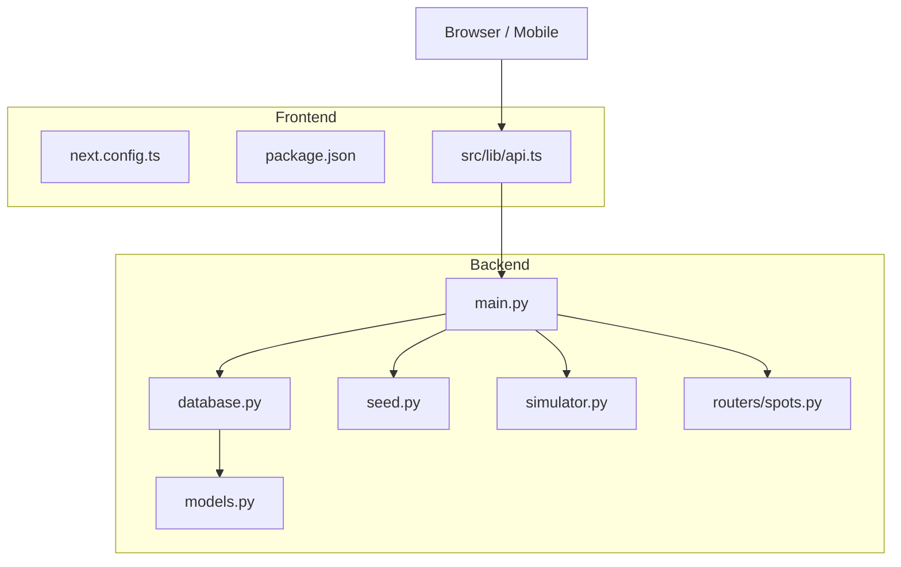
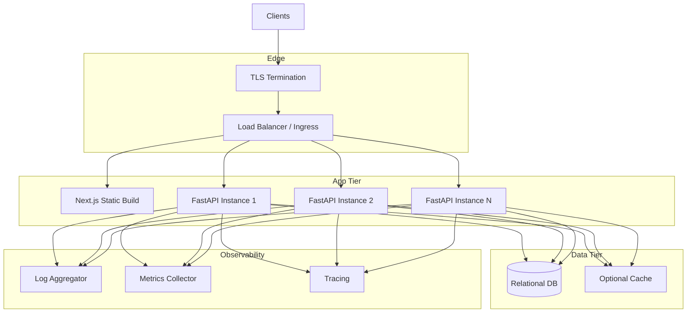
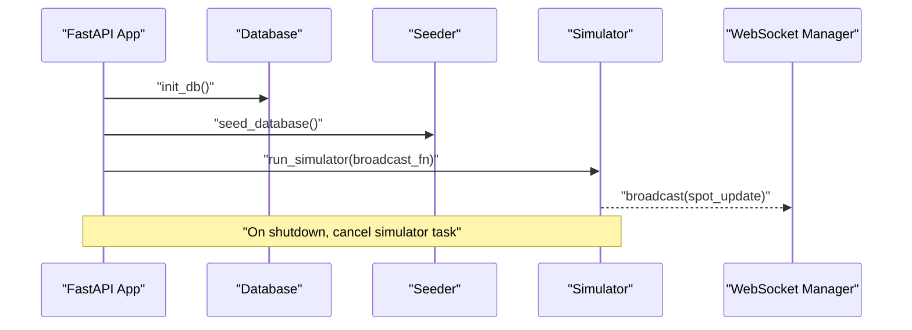
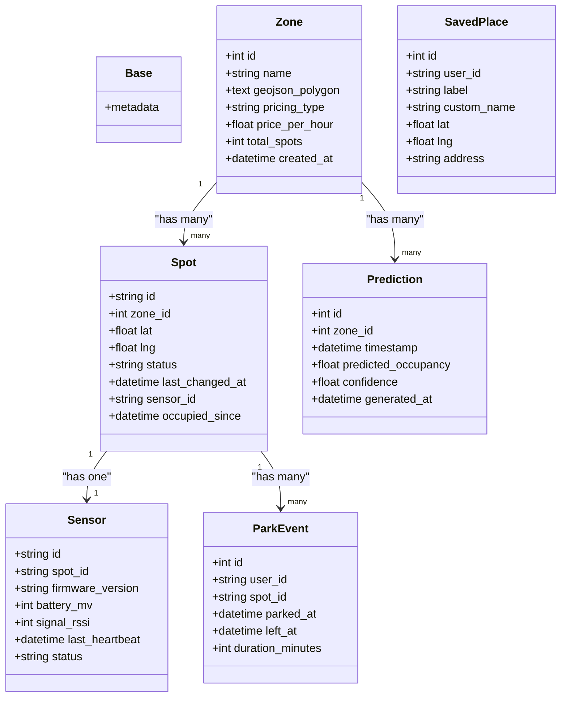
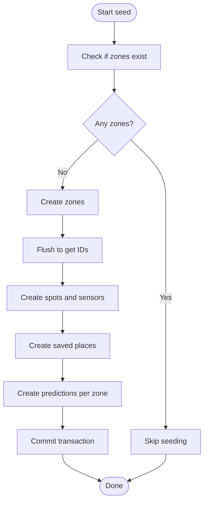
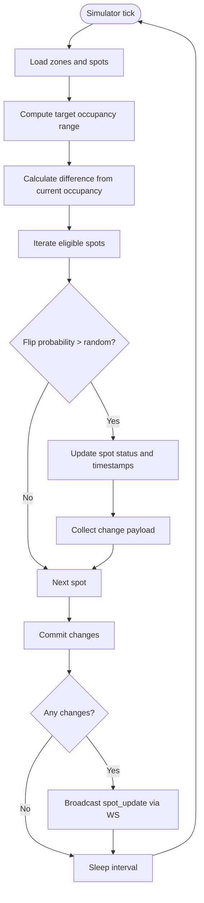
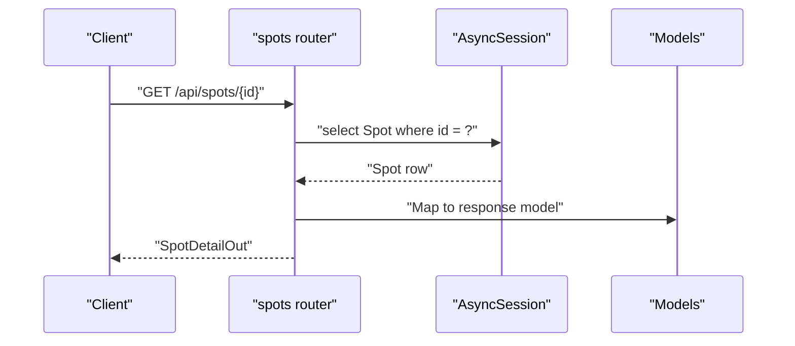
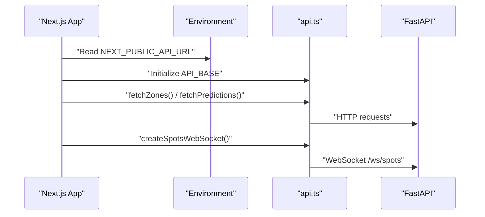
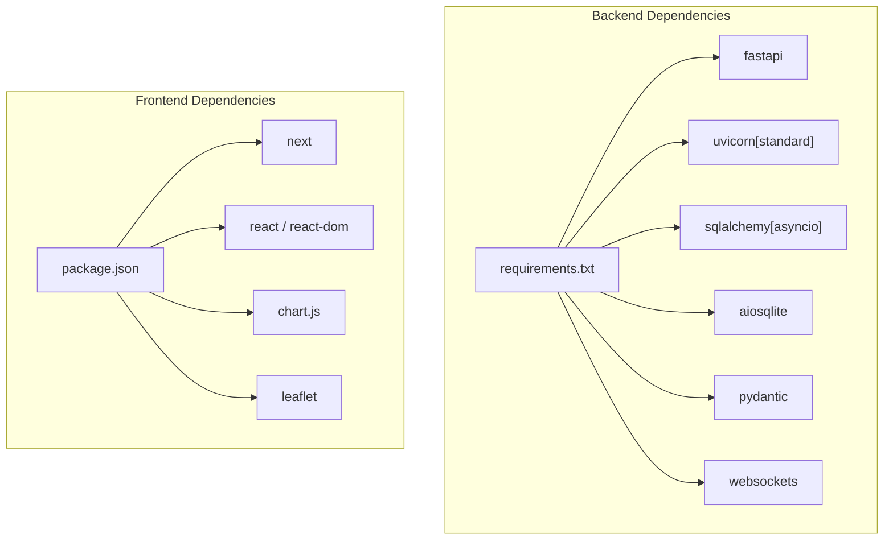

# Deployment Guide

<cite>
**Referenced Files in This Document**
- [README.md](file://README.md)
- [start.sh](file://start.sh)
- [backend/main.py](file://backend/main.py)
- [backend/database.py](file://backend/database.py)
- [backend/models.py](file://backend/models.py)
- [backend/seed.py](file://backend/seed.py)
- [backend/simulator.py](file://backend/simulator.py)
- [backend/routers/spots.py](file://backend/routers/spots.py)
- [backend/requirements.txt](file://backend/requirements.txt)
- [frontend/package.json](file://frontend/package.json)
- [frontend/next.config.ts](file://frontend/next.config.ts)
- [frontend/src/lib/api.ts](file://frontend/src/lib/api.ts)
</cite>

## Table of Contents
1. Introduction
2. Project Structure
3. Core Components
4. Architecture Overview
5. Detailed Component Analysis
6. Dependency Analysis
7. Performance Considerations
8. Troubleshooting Guide
9. Conclusion
10. Appendices

## Introduction
This guide provides production deployment strategies for SmartPark AI, covering containerization with Docker, environment configuration management, scaling considerations, build processes for the Next.js frontend and FastAPI backend, environment variables, secrets management, database migration strategies, backup and disaster recovery, monitoring and logging, performance tuning, load balancing, horizontal scaling patterns, CI/CD pipeline recommendations, automated testing integration, deployment automation scripts, security hardening, SSL/TLS configuration, and network security considerations.

The application consists of:
- A FastAPI backend providing REST APIs and WebSocket updates for real-time parking spot status.
- A Next.js frontend serving the user interface and consuming the backend APIs.

## Project Structure
SmartPark AI is organized into two primary services:
- Backend (FastAPI): API endpoints, database models, seeding, simulator, and WebSocket broadcasting.
- Frontend (Next.js): UI components, client-side data fetching, and WebSocket connection logic.

**Diagram sources**
- [backend/main.py:1-64](file://backend/main.py#L1-L64)
- [backend/database.py:1-23](file://backend/database.py#L1-L23)
- [backend/models.py:1-89](file://backend/models.py#L1-L89)
- [backend/seed.py:1-198](file://backend/seed.py#L1-L198)
- [backend/simulator.py:1-105](file://backend/simulator.py#L1-L105)
- [backend/routers/spots.py:1-41](file://backend/routers/spots.py#L1-L41)
- [frontend/next.config.ts:1-10](file://frontend/next.config.ts#L1-L10)
- [frontend/package.json:1-32](file://frontend/package.json#L1-L32)
- [frontend/src/lib/api.ts:1-27](file://frontend/src/lib/api.ts#L1-L27)

**Section sources**
- [README.md:1-47](file://README.md#L1-L47)
- [start.sh:1-26](file://start.sh#L1-L26)

## Core Components
- Application entrypoint and lifecycle:
  - The FastAPI app initializes the database, seeds demo data, and starts a background simulator that periodically updates spot statuses and broadcasts changes via WebSocket.
- Database layer:
  - Async SQLAlchemy engine and session factory are configured using an environment variable for the database URL; default is SQLite.
- Data models:
  - Entities include zones, spots, sensors, saved places, predictions, and park events.
- Seed data:
  - On first run, the seed script populates zones, spots, sensors, saved places, and prediction records if none exist.
- Simulator:
  - Runs every few seconds to adjust spot occupancy toward time-of-day targets and emits WebSocket updates when changes occur.
- API routes:
  - Example route shows how to fetch spot details including sensor information.
- Frontend configuration:
  - Next.js config enables strict mode; client-only libraries like Leaflet are handled by dynamic imports and 'use client' usage in components.
- Frontend API client:
  - Uses NEXT_PUBLIC_API_URL to determine backend base URL and constructs WebSocket URLs accordingly.

**Section sources**
- [backend/main.py:13-64](file://backend/main.py#L13-L64)
- [backend/database.py:1-23](file://backend/database.py#L1-L23)
- [backend/models.py:1-89](file://backend/models.py#L1-L89)
- [backend/seed.py:126-198](file://backend/seed.py#L126-L198)
- [backend/simulator.py:91-105](file://backend/simulator.py#L91-L105)
- [backend/routers/spots.py:1-41](file://backend/routers/spots.py#L1-L41)
- [frontend/next.config.ts:1-10](file://frontend/next.config.ts#L1-L10)
- [frontend/src/lib/api.ts:1-27](file://frontend/src/lib/api.ts#L1-L27)

## Architecture Overview
Production architecture typically includes:
- Reverse proxy or ingress controller handling TLS termination, routing, and load balancing.
- Multiple FastAPI instances behind a load balancer for horizontal scaling.
- Persistent relational database (PostgreSQL recommended) with backups and high availability.
- Static asset hosting for the Next.js build output.
- Optional caching layer (Redis) for hot data and rate limiting.
- Monitoring and logging stack (metrics, logs, traces).

[No sources needed since this diagram shows conceptual architecture]

## Detailed Component Analysis

### Backend Lifecycle and Initialization
- Startup sequence:
  - Initialize database schema.
  - Seed demo data if empty.
  - Start simulator background task.
- Shutdown sequence:
  - Cancel simulator task gracefully.

**Diagram sources**
- [backend/main.py:13-31](file://backend/main.py#L13-L31)
- [backend/database.py:15-18](file://backend/database.py#L15-L18)
- [backend/seed.py:126-198](file://backend/seed.py#L126-L198)
- [backend/simulator.py:91-105](file://backend/simulator.py#L91-L105)

**Section sources**
- [backend/main.py:13-31](file://backend/main.py#L13-L31)

### Database Configuration and Models
- Environment-driven database URL with SQLite default.
- Async engine and session factory setup.
- Declarative base class for ORM models.
- Key entities: Zone, Spot, Sensor, SavedPlace, Prediction, ParkEvent.

**Diagram sources**
- [backend/models.py:1-89](file://backend/models.py#L1-L89)

**Section sources**
- [backend/database.py:1-23](file://backend/database.py#L1-L23)
- [backend/models.py:1-89](file://backend/models.py#L1-L89)

### Seeding Process
- Idempotent seeding: checks if any zones exist before inserting.
- Generates zones, spots, sensors, saved places, and predictions.
- Produces deterministic structures with randomized initial states.

**Diagram sources**
- [backend/seed.py:126-198](file://backend/seed.py#L126-L198)

**Section sources**
- [backend/seed.py:1-198](file://backend/seed.py#L1-L198)

### Simulator Logic
- Computes target occupancy based on Dubai local time profiles.
- Adjusts spot statuses probabilistically toward target mid-point.
- Emits WebSocket updates for changed spots.

**Diagram sources**
- [backend/simulator.py:24-105](file://backend/simulator.py#L24-L105)

**Section sources**
- [backend/simulator.py:1-105](file://backend/simulator.py#L1-L105)

### API Endpoint Example
- GET /api/spots/{spot_id}:
  - Returns spot detail including associated sensor info.
  - Raises 404 if not found.

**Diagram sources**
- [backend/routers/spots.py:1-41](file://backend/routers/spots.py#L1-L41)

**Section sources**
- [backend/routers/spots.py:1-41](file://backend/routers/spots.py#L1-L41)

### Frontend Configuration and API Client
- NEXT_PUBLIC_API_URL controls backend endpoint.
- WebSocket URL derived by replacing http with ws.
- Next.js strict mode enabled; Leaflet used client-side only.

**Diagram sources**
- [frontend/src/lib/api.ts:1-27](file://frontend/src/lib/api.ts#L1-L27)
- [frontend/next.config.ts:1-10](file://frontend/next.config.ts#L1-L10)

**Section sources**
- [frontend/src/lib/api.ts:1-27](file://frontend/src/lib/api.ts#L1-L27)
- [frontend/next.config.ts:1-10](file://frontend/next.config.ts#L1-L10)

## Dependency Analysis
Key runtime dependencies:
- Backend: FastAPI, Uvicorn, SQLAlchemy async, aiosqlite, Pydantic, websockets.
- Frontend: Next.js, React, Chart.js, Leaflet.

**Diagram sources**
- [backend/requirements.txt:1-8](file://backend/requirements.txt#L1-L8)
- [frontend/package.json:1-32](file://frontend/package.json#L1-L32)

**Section sources**
- [backend/requirements.txt:1-8](file://backend/requirements.txt#L1-L8)
- [frontend/package.json:1-32](file://frontend/package.json#L1-L32)

## Performance Considerations
- Backend:
  - Use multiple Uvicorn workers behind a reverse proxy for concurrency.
  - Replace SQLite with PostgreSQL for production scalability and reliability.
  - Tune connection pool settings and enable query logging during development.
  - Cache frequently accessed data (e.g., zones, predictions) with Redis.
- Frontend:
  - Serve static assets via CDN.
  - Enable HTTP/2 and compression at the edge.
  - Minimize bundle size and leverage code splitting.
- Database:
  - Index foreign keys and frequently queried columns.
  - Partition large tables (e.g., predictions) by time ranges.
  - Configure WAL and checkpointing appropriately.
- Observability:
  - Add structured logging and metrics endpoints.
  - Integrate tracing across API calls and DB queries.

[No sources needed since this section provides general guidance]

## Troubleshooting Guide
Common issues and resolutions:
- CORS errors:
  - Ensure allowed origins match your domain in production.
- WebSocket connectivity:
  - Verify WSS support through the reverse proxy and correct path (/ws/spots).
- Database initialization:
  - Confirm DATABASE_URL points to a reachable database and permissions are set.
- Seeder behavior:
  - If data already exists, seeding will skip; re-seed by truncating relevant tables.
- Simulator errors:
  - Check logs for exceptions in the background task and ensure DB connectivity.

**Section sources**
- [backend/main.py:40-47](file://backend/main.py#L40-L47)
- [backend/database.py:5-8](file://backend/database.py#L5-L8)
- [backend/seed.py:126-134](file://backend/seed.py#L126-L134)
- [backend/simulator.py:102-104](file://backend/simulator.py#L102-L104)

## Conclusion
SmartPark AI can be deployed in production by containerizing both services, configuring environment variables securely, and running multiple backend instances behind a load balancer. Adopt a robust database strategy, implement comprehensive monitoring and logging, and follow security best practices for TLS and network isolation. With these measures, the system scales horizontally and remains observable and resilient.

[No sources needed since this section summarizes without analyzing specific files]

## Appendices

### Containerization Strategy
- Backend image:
  - Use a Python slim base image.
  - Install dependencies from requirements.txt.
  - Run Uvicorn with appropriate worker count and host/port.
- Frontend image:
  - Build Next.js static output.
  - Serve static files with a lightweight server (e.g., nginx or Caddy).
- Orchestration:
  - Use Kubernetes or Docker Compose for multi-container deployments.
  - Define health checks and readiness probes.

[No sources needed since this section provides general guidance]

### Environment Variables and Secrets Management
- Backend:
  - DATABASE_URL: Connection string for the database.
  - Additional secrets (e.g., API keys) should be injected via secure secret stores.
- Frontend:
  - NEXT_PUBLIC_API_URL: Base URL for backend APIs.
- Secrets management:
  - Use platform-native secret managers (e.g., Kubernetes Secrets, cloud provider secret stores).
  - Avoid committing secrets to version control.

**Section sources**
- [backend/database.py:5-8](file://backend/database.py#L5-L8)
- [frontend/src/lib/api.ts:1-2](file://frontend/src/lib/api.ts#L1-L2)

### Build Processes
- Backend:
  - Install dependencies from requirements.txt.
  - Run application with Uvicorn.
- Frontend:
  - Install dependencies from package.json.
  - Build static assets with Next.js.
  - Start static server for production.

**Section sources**
- [backend/requirements.txt:1-8](file://backend/requirements.txt#L1-L8)
- [frontend/package.json:1-32](file://frontend/package.json#L1-L32)

### Database Migration Strategies
- For SQLite:
  - Use Alembic or manual SQL migrations executed during startup or via a separate migration job.
- For PostgreSQL:
  - Use Alembic with async driver (e.g., asyncpg).
  - Apply migrations before starting the app.
  - Version migrations and roll back safely.

[No sources needed since this section provides general guidance]

### Backup Procedures and Disaster Recovery
- Backups:
  - Schedule regular logical backups (pg_dump for PostgreSQL).
  - Store backups offsite with encryption.
- Recovery:
  - Test restore procedures regularly.
  - Maintain runbooks for failover and data restoration.

[No sources needed since this section provides general guidance]

### Monitoring and Logging
- Logging:
  - Structured JSON logs for backend and frontend.
  - Centralized log aggregation.
- Metrics:
  - Expose Prometheus-compatible metrics.
  - Track request latency, error rates, and resource utilization.
- Tracing:
  - Distributed tracing across API calls and DB operations.

[No sources needed since this section provides general guidance]

### Load Balancing and Horizontal Scaling
- Reverse proxy:
  - Configure round-robin or least-connections policies.
  - Enable sticky sessions only if necessary (prefer stateless design).
- Auto-scaling:
  - Scale backend instances based on CPU/memory or custom metrics.
  - Ensure database connections scale appropriately.

[No sources needed since this section provides general guidance]

### CI/CD Pipeline Recommendations
- Stages:
  - Lint and type-check.
  - Unit and integration tests.
  - Build images and artifacts.
  - Deploy to staging with smoke tests.
  - Promote to production with approvals.
- Artifacts:
  - Cache dependencies to speed up builds.
  - Sign images and store in private registries.

[No sources needed since this section provides general guidance]

### Automated Testing Integration
- Backend:
  - Use pytest with async test clients.
  - Mock external services and use test databases.
- Frontend:
  - Use Jest and React Testing Library.
  - Mock API responses and WebSocket connections.

[No sources needed since this section provides general guidance]

### Deployment Automation Scripts
- Local development:
  - start.sh boots both backend and frontend for quick iteration.
- Production:
  - Use orchestration manifests (Kubernetes YAML) or Helm charts.
  - Implement blue/green or rolling updates.

**Section sources**
- [start.sh:1-26](file://start.sh#L1-L26)

### Security Hardening, SSL/TLS, and Network Security
- TLS:
  - Terminate TLS at the edge with managed certificates.
- CORS:
  - Restrict allowed origins to known domains.
- Authentication and Authorization:
  - Implement JWT or OAuth flows for protected endpoints.
- Network:
  - Isolate database in private subnets.
  - Use service meshes or network policies for inter-service communication.

**Section sources**
- [backend/main.py:40-47](file://backend/main.py#L40-L47)