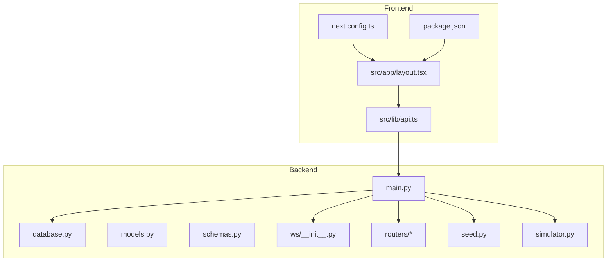
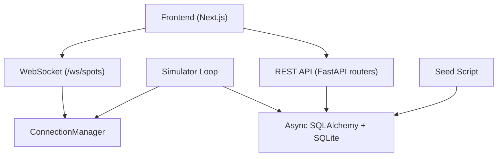
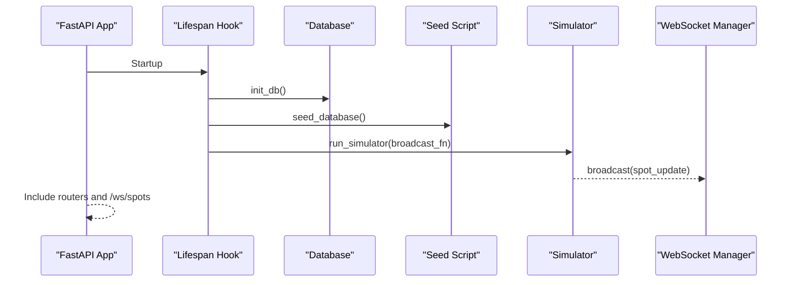
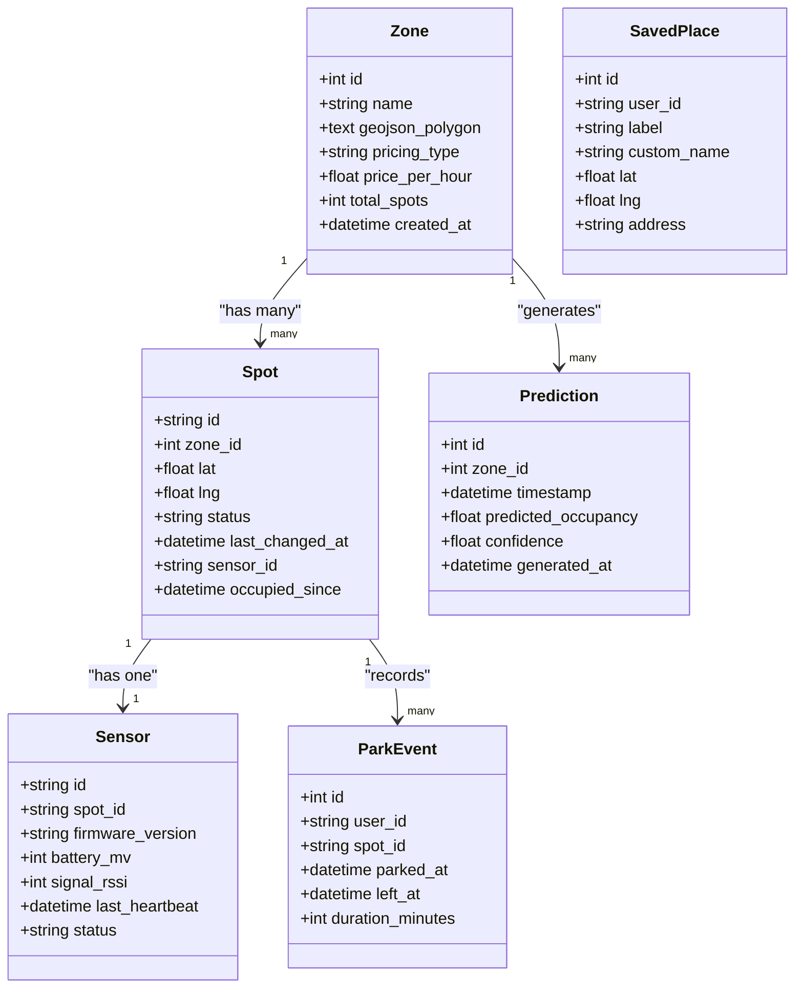
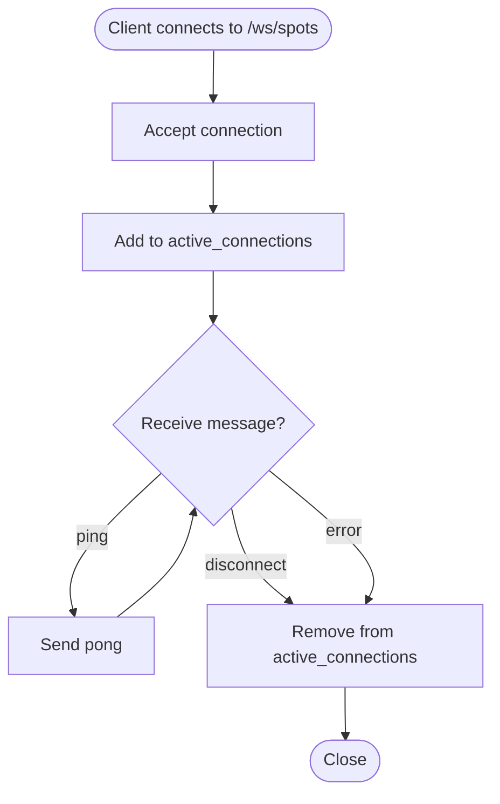
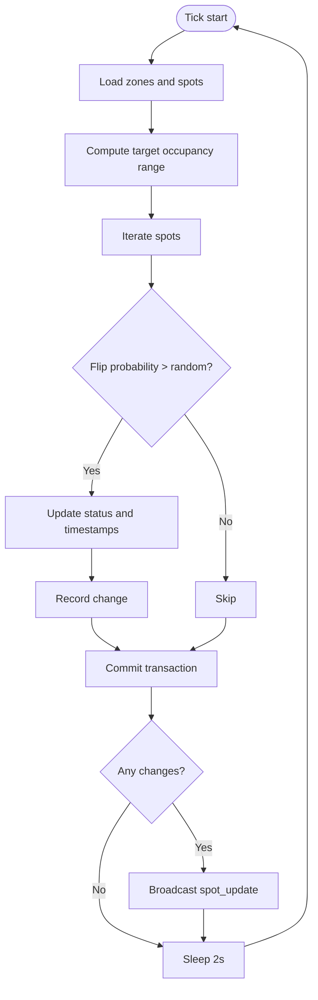
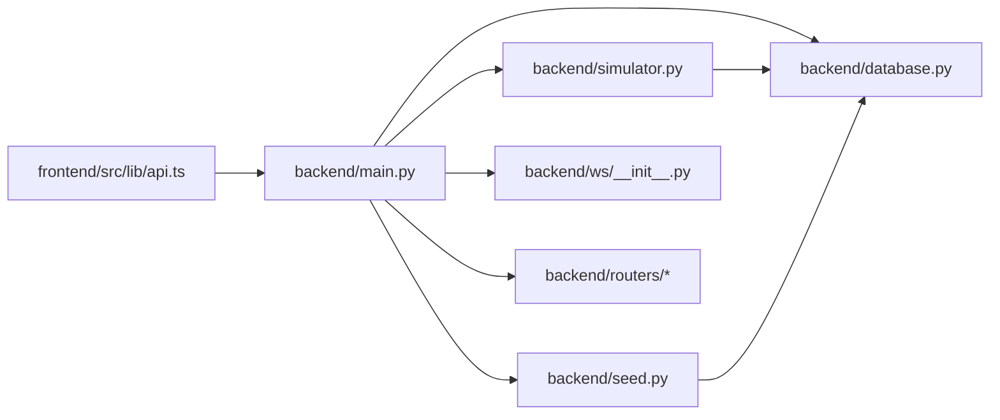

# Developer Guide

<cite>
**Referenced Files in This Document**
- [README.md](file://README.md)
- [start.sh](file://start.sh)
- [backend/main.py](file://backend/main.py)
- [backend/database.py](file://backend/database.py)
- [backend/models.py](file://backend/models.py)
- [backend/schemas.py](file://backend/schemas.py)
- [backend/seed.py](file://backend/seed.py)
- [backend/simulator.py](file://backend/simulator.py)
- [backend/ws/__init__.py](file://backend/ws/__init__.py)
- [backend/routers/__init__.py](file://backend/routers/__init__.py)
- [frontend/package.json](file://frontend/package.json)
- [frontend/src/app/layout.tsx](file://frontend/src/app/layout.tsx)
- [frontend/src/lib/api.ts](file://frontend/src/lib/api.ts)
- [frontend/next.config.ts](file://frontend/next.config.ts)
</cite>

## Table of Contents
1. Introduction
2. Project Structure
3. Core Components
4. Architecture Overview
5. Detailed Component Analysis
6. Dependency Analysis
7. Performance Considerations
8. Troubleshooting Guide
9. Conclusion
10. Appendices

## Introduction
This developer guide explains how to contribute and develop SmartPark AI. It covers code organization, file structure standards, naming conventions, development workflow, testing strategy, debugging and logging patterns, performance profiling, feature extension guidelines, backward compatibility practices, code review and CI expectations, and troubleshooting strategies for common issues.

SmartPark UAE is an AI-powered smart parking system with a FastAPI backend and a Next.js frontend. The backend provides REST APIs and real-time WebSocket updates for spot availability, while the frontend renders interactive maps, predictions, and an AI voice agent interface.

## Project Structure
The repository follows a clear separation between backend and frontend:

- Backend (FastAPI):
  - Application entrypoint and middleware configuration
  - Database initialization and session management
  - ORM models and Pydantic schemas
  - Routers for REST endpoints
  - WebSocket manager and endpoint
  - Seed script for demo data
  - Simulator for realistic spot occupancy changes

- Frontend (Next.js):
  - App Router pages and layout
  - Shared components organized by feature
  - API client utilities and WebSocket helpers
  - Configuration for strict React mode and client-only dependencies

**Diagram sources**
- [backend/main.py:1-64](file://backend/main.py#L1-L64)
- [backend/database.py:1-23](file://backend/database.py#L1-L23)
- [backend/models.py:1-89](file://backend/models.py#L1-L89)
- [backend/schemas.py:1-127](file://backend/schemas.py#L1-L127)
- [backend/ws/__init__.py:1-49](file://backend/ws/__init__.py#L1-L49)
- [backend/routers/__init__.py:1-2](file://backend/routers/__init__.py#L1-L2)
- [backend/seed.py:1-198](file://backend/seed.py#L1-L198)
- [backend/simulator.py:1-105](file://backend/simulator.py#L1-L105)
- [frontend/src/app/layout.tsx:1-26](file://frontend/src/app/layout.tsx#L1-L26)
- [frontend/src/lib/api.ts:1-27](file://frontend/src/lib/api.ts#L1-L27)
- [frontend/next.config.ts:1-10](file://frontend/next.config.ts#L1-L10)
- [frontend/package.json:1-32](file://frontend/package.json#L1-L32)

**Section sources**
- [README.md:1-47](file://README.md#L1-L47)
- [start.sh:1-26](file://start.sh#L1-L26)
- [backend/main.py:1-64](file://backend/main.py#L1-L64)
- [frontend/package.json:1-32](file://frontend/package.json#L1-L32)

## Core Components
- Application lifecycle and routing:
  - FastAPI app setup, CORS middleware, router inclusion, WebSocket registration, and lifespan hooks for database initialization, seeding, and simulator startup/shutdown.

- Data layer:
  - Async SQLAlchemy engine and session factory
  - Declarative base class and model definitions for zones, spots, sensors, saved places, predictions, and park events
  - Pydantic response schemas for consistent API payloads

- Real-time updates:
  - WebSocket connection manager with broadcast capability
  - Endpoint that accepts connections and handles ping/pong keepalive

- Simulation and seeding:
  - Seed script populates demo zones, spots, sensors, saved places, and predictions
  - Simulator adjusts spot statuses toward time-of-day targets and broadcasts changes via WebSocket

- Frontend integration:
  - Root layout and providers
  - API client functions for REST calls and WebSocket creation
  - Next.js configuration enabling strict React mode and client-only rendering for Leaflet

**Section sources**
- [backend/main.py:1-64](file://backend/main.py#L1-L64)
- [backend/database.py:1-23](file://backend/database.py#L1-L23)
- [backend/models.py:1-89](file://backend/models.py#L1-L89)
- [backend/schemas.py:1-127](file://backend/schemas.py#L1-L127)
- [backend/ws/__init__.py:1-49](file://backend/ws/__init__.py#L1-L49)
- [backend/seed.py:1-198](file://backend/seed.py#L1-L198)
- [backend/simulator.py:1-105](file://backend/simulator.py#L1-L105)
- [frontend/src/app/layout.tsx:1-26](file://frontend/src/app/layout.tsx#L1-L26)
- [frontend/src/lib/api.ts:1-27](file://frontend/src/lib/api.ts#L1-L27)
- [frontend/next.config.ts:1-10](file://frontend/next.config.ts#L1-L10)

## Architecture Overview
High-level architecture shows how the frontend interacts with the backend through REST and WebSocket channels, and how the backend orchestrates database operations, simulation, and real-time broadcasting.

**Diagram sources**
- [backend/main.py:1-64](file://backend/main.py#L1-L64)
- [backend/ws/__init__.py:1-49](file://backend/ws/__init__.py#L1-L49)
- [backend/simulator.py:1-105](file://backend/simulator.py#L1-L105)
- [backend/database.py:1-23](file://backend/database.py#L1-L23)
- [backend/seed.py:1-198](file://backend/seed.py#L1-L198)
- [frontend/src/lib/api.ts:1-27](file://frontend/src/lib/api.ts#L1-L27)

## Detailed Component Analysis

### Backend Application Lifecycle and Routing
- Lifespan hook initializes the database, seeds demo data, and starts the simulator as a background task; on shutdown it cancels the simulator gracefully.
- CORS middleware allows all origins for local development.
- Routers are included under /api paths; WebSocket endpoint is mounted at /ws/spots.

**Diagram sources**
- [backend/main.py:13-31](file://backend/main.py#L13-L31)
- [backend/database.py:15-18](file://backend/database.py#L15-L18)
- [backend/seed.py:126-198](file://backend/seed.py#L126-L198)
- [backend/simulator.py:91-105](file://backend/simulator.py#L91-L105)
- [backend/ws/__init__.py:36-49](file://backend/ws/__init__.py#L36-L49)

**Section sources**
- [backend/main.py:1-64](file://backend/main.py#L1-L64)

### Database Layer and Models
- Async engine and session factory configured with environment-based DATABASE_URL defaulting to SQLite.
- Declarative base used by all models.
- Models define relationships among zones, spots, sensors, saved places, predictions, and park events.

**Diagram sources**
- [backend/models.py:7-89](file://backend/models.py#L7-L89)

**Section sources**
- [backend/database.py:1-23](file://backend/database.py#L1-L23)
- [backend/models.py:1-89](file://backend/models.py#L1-L89)

### Schemas and API Contracts
- Pydantic schemas define output shapes for zones, spots, sensors, predictions, agent responses, and saved places.
- from_attributes enables serialization from SQLAlchemy objects.

Guidelines:
- Keep request/response schemas aligned with models but decoupled to allow evolution.
- Use optional fields for backward-compatible additions.
- Validate inputs explicitly in request schemas when needed.

**Section sources**
- [backend/schemas.py:1-127](file://backend/schemas.py#L1-L127)

### WebSocket Manager and Real-Time Updates
- ConnectionManager tracks active connections, supports broadcast, and cleans up disconnected clients.
- Endpoint accepts connections, handles ping/pong, and disconnects on errors.

**Diagram sources**
- [backend/ws/__init__.py:7-49](file://backend/ws/__init__.py#L7-L49)

**Section sources**
- [backend/ws/__init__.py:1-49](file://backend/ws/__init__.py#L1-L49)

### Simulator and Time-of-Day Profiles
- Simulator computes target occupancy based on Dubai time profiles and flips spot statuses probabilistically to converge toward targets.
- Changes are persisted and broadcast to connected clients.

**Diagram sources**
- [backend/simulator.py:24-105](file://backend/simulator.py#L24-L105)

**Section sources**
- [backend/simulator.py:1-105](file://backend/simulator.py#L1-L105)

### Seeding Demo Data
- Seed script creates zones with GeoJSON polygons, generates spot coordinates, assigns initial statuses, creates sensors, saved places, and prediction series per zone.

Best practices:
- Idempotent seeding: check if data exists before inserting.
- Use deterministic generation where possible for reproducibility.
- Separate concerns: keep seed logic distinct from runtime services.

**Section sources**
- [backend/seed.py:1-198](file://backend/seed.py#L1-L198)

### Frontend Integration and Client Utilities
- Root layout sets metadata and includes global providers and voice widget.
- API client centralizes base URL and exposes fetch wrappers for zones, predictions, agent queries, and WebSocket creation.
- Next.js config enforces strict React mode and notes client-only rendering for Leaflet.

Recommendations:
- Centralize error handling and retries in the API client.
- Use environment variables for API URLs across environments.
- Prefer typed responses using TypeScript interfaces.

**Section sources**
- [frontend/src/app/layout.tsx:1-26](file://frontend/src/app/layout.tsx#L1-L26)
- [frontend/src/lib/api.ts:1-27](file://frontend/src/lib/api.ts#L1-L27)
- [frontend/next.config.ts:1-10](file://frontend/next.config.ts#L1-L10)

## Dependency Analysis
Key dependency relationships:

- main.py depends on database, seed, simulator, ws, and routers.
- simulator depends on database and models.
- seed depends on database and models.
- ws module manages WebSocket connections independently of routers.
- Frontend api.ts depends on backend REST and WebSocket endpoints.

**Diagram sources**
- [backend/main.py:1-64](file://backend/main.py#L1-L64)
- [backend/database.py:1-23](file://backend/database.py#L1-L23)
- [backend/seed.py:1-198](file://backend/seed.py#L1-L198)
- [backend/simulator.py:1-105](file://backend/simulator.py#L1-L105)
- [backend/ws/__init__.py:1-49](file://backend/ws/__init__.py#L1-L49)
- [frontend/src/lib/api.ts:1-27](file://frontend/src/lib/api.ts#L1-L27)

**Section sources**
- [backend/main.py:1-64](file://backend/main.py#L1-L64)
- [frontend/src/lib/api.ts:1-27](file://frontend/src/lib/api.ts#L1-L27)

## Performance Considerations
- Database:
  - Use async sessions and avoid N+1 queries by leveraging eager loading where necessary.
  - Index frequently queried columns (e.g., zone_id, status).
  - Monitor SQLite WAL mode and page size for write-heavy workloads.

- Simulator:
  - Batch updates and minimize transactions per tick.
  - Tune sleep interval and flip probabilities to balance realism and load.

- WebSocket:
  - Implement backpressure and rate-limiting if scaling to many clients.
  - Clean up stale connections promptly.

- Frontend:
  - Defer heavy libraries like Leaflet to client-side only.
  - Cache API responses where appropriate and debounce frequent updates.

[No sources needed since this section provides general guidance]

## Troubleshooting Guide
Common issues and resolutions:

- Environment and startup:
  - Ensure both backend and frontend are running on expected ports.
  - Verify DATABASE_URL or default SQLite path is writable.
  - Confirm npm and Python dependencies are installed.

- Database seeding:
  - If data does not appear, re-run the seed script manually after clearing the database.
  - Check logs for duplicate seeding guards.

- WebSocket connectivity:
  - Confirm the frontend constructs the correct ws URL from the API base.
  - Inspect browser console for connection errors and ensure CORS allows WebSocket upgrades.

- Simulator behavior:
  - Adjust time-of-day profiles if simulating different regions or scenarios.
  - Log simulator exceptions to diagnose persistence failures.

- Frontend build/runtime:
  - Ensure client-only imports for Leaflet and other DOM-dependent libraries.
  - Validate NEXT_PUBLIC_API_URL points to the running backend.

**Section sources**
- [start.sh:1-26](file://start.sh#L1-L26)
- [backend/database.py:1-23](file://backend/database.py#L1-L23)
- [backend/seed.py:126-198](file://backend/seed.py#L126-L198)
- [backend/simulator.py:91-105](file://backend/simulator.py#L91-L105)
- [frontend/src/lib/api.ts:1-27](file://frontend/src/lib/api.ts#L1-L27)
- [frontend/next.config.ts:1-10](file://frontend/next.config.ts#L1-L10)

## Conclusion
SmartPark AI follows a clean separation between backend and frontend with well-defined modules for data, APIs, real-time updates, and simulation. By adhering to the conventions and guidelines outlined here—especially around schema design, WebSocket management, and client-only rendering—you can extend functionality safely and maintain high quality. Use the troubleshooting steps to resolve common issues quickly and leverage the performance tips to scale effectively.

[No sources needed since this section summarizes without analyzing specific files]

## Appendices

### Development Workflow Guidelines
- Branching:
  - Use feature branches named feature/<short-description>.
  - Create bugfix branches named bugfix/<issue-id>-<short-description>.
  - Keep main stable and protected; merge via pull requests.

- Commit messages:
  - Follow conventional commits: type(scope): description.
  - Types include feat, fix, docs, style, refactor, test, chore.
  - Keep descriptions imperative and concise.

- Pull requests:
  - Link related issues and provide context.
  - Include screenshots or short videos for UI changes.
  - Ensure tests pass and lint checks succeed before requesting review.

[No sources needed since this section provides general guidance]

### Testing Strategy
- Unit tests:
  - Backend: Test Pydantic schemas, utility functions, and isolated service logic.
  - Frontend: Test component rendering and hooks with lightweight mocks.

- Integration tests:
  - Backend: Spin up test server with in-memory SQLite; validate endpoints and WebSocket flows.
  - Frontend: Test API client wrappers and WebSocket event handling.

- End-to-end tests:
  - Use Playwright or Cypress to simulate user flows across map interactions, predictions, and agent queries.

[No sources needed since this section provides general guidance]

### Debugging Techniques and Logging Patterns
- Backend:
  - Enable SQL echo during development to inspect queries.
  - Print or log simulator errors and WebSocket broadcast failures.

- Frontend:
  - Use browser devtools network tab to inspect REST and WebSocket frames.
  - Add temporary console logs in API client for request/response tracing.

[No sources needed since this section provides general guidance]

### Performance Profiling Tools
- Backend:
  - Use uvicorn access logs and application metrics to identify slow endpoints.
  - Profile critical paths with cProfile or similar tools.

- Frontend:
  - Use React DevTools profiler and Chrome Performance tab to analyze render costs.

[No sources needed since this section provides general guidance]

### Adding New Features and Extending Functionality
- Backend:
  - Define new models in models.py and corresponding schemas in schemas.py.
  - Add routes under routers/ and mount them in main.py.
  - Update seed data if needed and document API changes.

- Frontend:
  - Create feature-specific components under src/components/<feature>.
  - Extend API client in src/lib/api.ts and add hooks or contexts as needed.
  - Update pages under src/app/<feature>/page.tsx.

- Backward compatibility:
  - Introduce optional fields in schemas rather than removing required ones.
  - Version APIs when breaking changes are necessary.

[No sources needed since this section provides general guidance]

### Code Review and Quality Assurance
- Checklist:
  - Adheres to naming and file structure conventions.
  - Includes relevant tests and documentation updates.
  - No unused imports or dead code.
  - Error handling and edge cases covered.

- Continuous integration:
  - Run linters, type checks, and tests on each PR.
  - Block merges on failing checks.

[No sources needed since this section provides general guidance]

### Extension Points and Customization Patterns
- Plugin-like extensions:
  - Abstract simulator profiles and strategies behind interfaces to swap behaviors.
  - Provide middleware hooks in main.py for cross-cutting concerns.

- Customization:
  - Externalize configuration via environment variables (e.g., DATABASE_URL, API_BASE).
  - Allow frontend themes and locales through configuration files.

[No sources needed since this section provides general guidance]