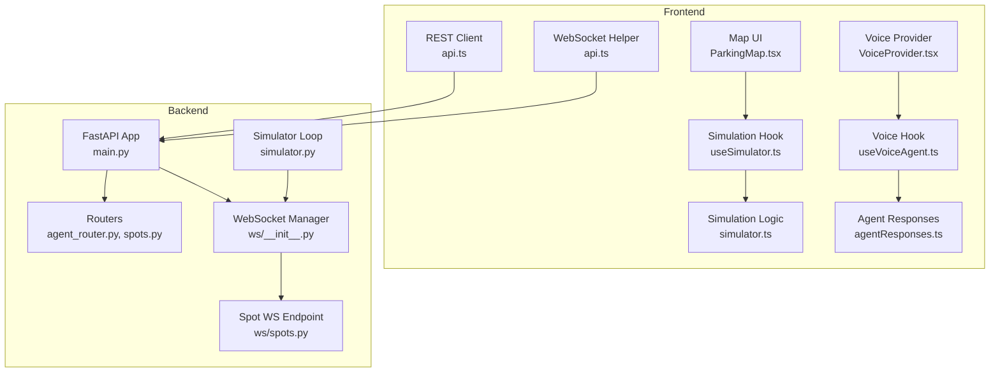
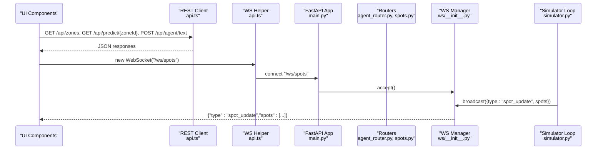
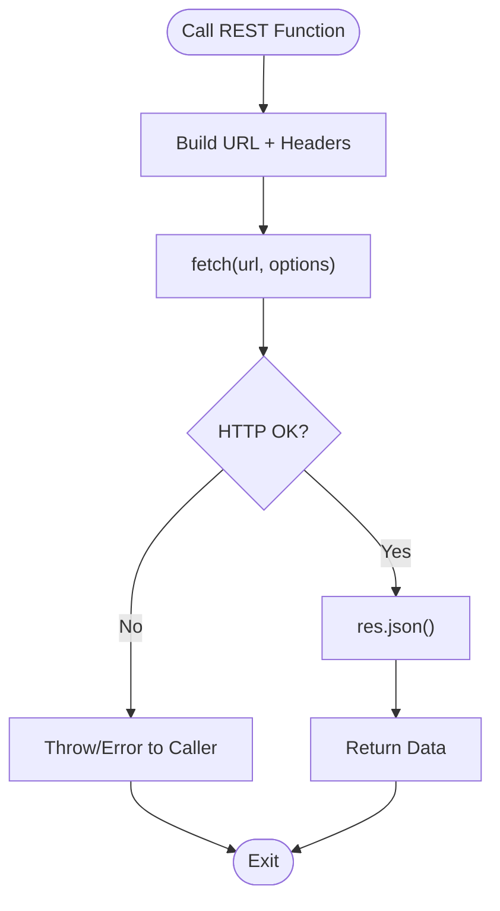
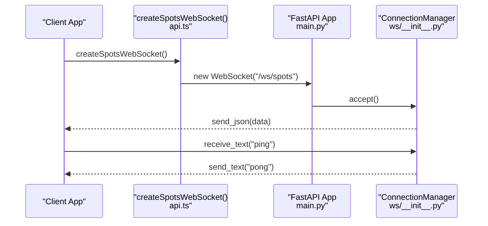
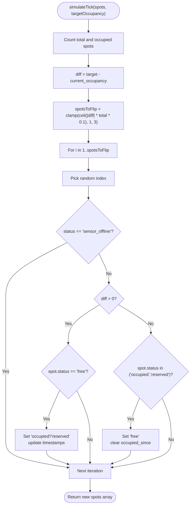
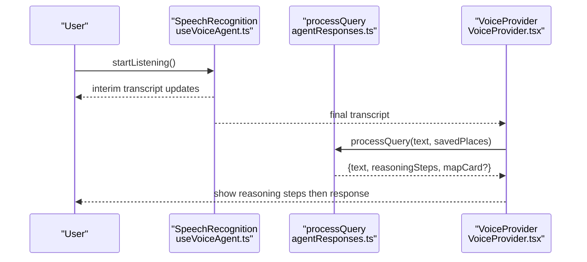
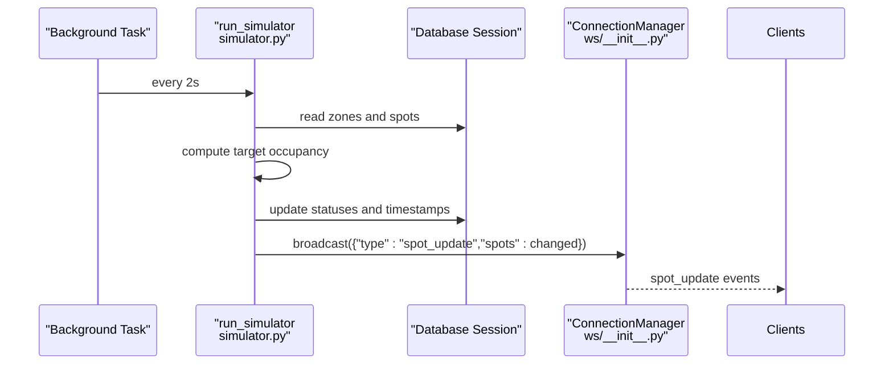
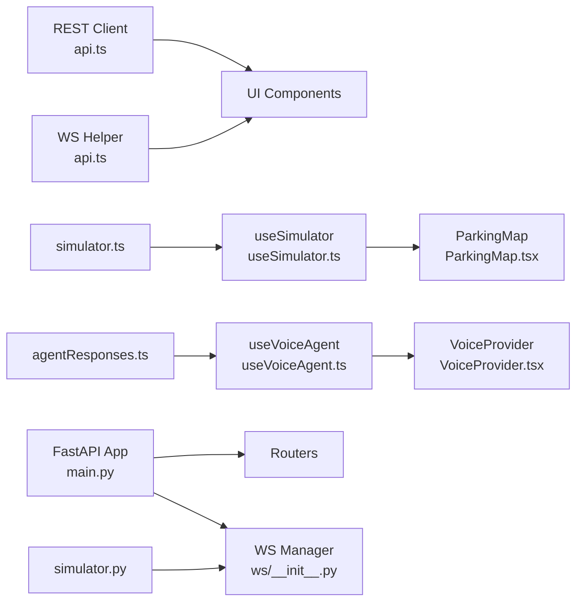

# API Integration Layer

<cite>
**Referenced Files in This Document**
- [api.ts](file://frontend/src/lib/api.ts)
- [simulator.ts](file://frontend/src/lib/simulator.ts)
- [useSimulator.ts](file://frontend/src/hooks/useSimulator.ts)
- [agentResponses.ts](file://frontend/src/lib/agentResponses.ts)
- [useVoiceAgent.ts](file://frontend/src/hooks/useVoiceAgent.ts)
- [VoiceProvider.tsx](file://frontend/src/components/voice/VoiceProvider.tsx)
- [ParkingMap.tsx](file://frontend/src/components/map/ParkingMap.tsx)
- [__init__.py](file://backend/ws/__init__.py)
- [spots.py](file://backend/ws/spots.py)
- [main.py](file://backend/main.py)
- [simulator.py](file://backend/simulator.py)
- [agent_router.py](file://backend/routers/agent_router.py)
- [spots.py](file://backend/routers/spots.py)
- [index.ts](file://frontend/src/types/index.ts)
</cite>

## Table of Contents
1. [Introduction](#introduction)
2. [Project Structure](#project-structure)
3. [Core Components](#core-components)
4. [Architecture Overview](#architecture-overview)
5. [Detailed Component Analysis](#detailed-component-analysis)
6. [Dependency Analysis](#dependency-analysis)
7. [Performance Considerations](#performance-considerations)
8. [Troubleshooting Guide](#troubleshooting-guide)
9. [Conclusion](#conclusion)
10. [Appendices](#appendices)

## Introduction
This document explains the API integration layer architecture for SmartPark AI, focusing on:
- REST client abstraction and request/response handling
- Error management and retry strategies
- WebSocket client for real-time spot updates and connection management
- Simulation layer for development mode with realistic behavior patterns
- Agent response system for voice interactions and contextual query processing
- Authentication handling, request interceptors, and response caching strategies
- Testing approaches and mocking strategies for development

The goal is to provide a clear, progressive understanding from high-level architecture down to code-level flows, with diagrams and concrete examples mapped to actual source files.

## Project Structure
SmartPark AI consists of a FastAPI backend and a Next.js frontend. The API integration layer spans both sides:
- Frontend REST client utilities and WebSocket helpers
- Backend routers exposing REST endpoints and WebSocket endpoint
- Real-time simulation loop broadcasting spot changes via WebSocket
- Voice agent logic (local mock responses) and UI orchestration



**Diagram sources**
- [api.ts:1-27](file://frontend/src/lib/api.ts#L1-L27)
- [useSimulator.ts:1-62](file://frontend/src/hooks/useSimulator.ts#L1-L62)
- [simulator.ts:1-73](file://frontend/src/lib/simulator.ts#L1-L73)
- [agentResponses.ts:1-131](file://frontend/src/lib/agentResponses.ts#L1-L131)
- [useVoiceAgent.ts:1-227](file://frontend/src/hooks/useVoiceAgent.ts#L1-L227)
- [VoiceProvider.tsx:1-110](file://frontend/src/components/voice/VoiceProvider.tsx#L1-L110)
- [ParkingMap.tsx:1-108](file://frontend/src/components/map/ParkingMap.tsx#L1-L108)
- [main.py:1-64](file://backend/main.py#L1-L64)
- [agent_router.py:1-12](file://backend/routers/agent_router.py#L1-L12)
- [spots.py:1-42](file://backend/routers/spots.py#L1-L42)
- [__init__.py:1-49](file://backend/ws/__init__.py#L1-L49)
- [spots.py:1-4](file://backend/ws/spots.py#L1-L4)
- [simulator.py:1-105](file://backend/simulator.py#L1-L105)

**Section sources**
- [api.ts:1-27](file://frontend/src/lib/api.ts#L1-L27)
- [main.py:1-64](file://backend/main.py#L1-L64)
- [__init__.py:1-49](file://backend/ws/__init__.py#L1-L49)
- [simulator.py:1-105](file://backend/simulator.py#L1-L105)

## Core Components
- REST client abstraction: Centralized base URL and typed fetch wrappers for zones, predictions, and agent text queries.
- WebSocket helper: Factory function to create WebSocket connections for real-time spot updates.
- Simulation layer: Time-of-day occupancy profiles and tick-based state transitions for realistic demo behavior.
- Voice agent system: Local query processing with reasoning steps and optional map card data; UI orchestration via provider and hook.
- Backend routers: REST endpoints for agent text and spot details; WebSocket endpoint for spot updates.
- Simulator loop: Background task that periodically adjusts spot statuses and broadcasts changes.

**Section sources**
- [api.ts:1-27](file://frontend/src/lib/api.ts#L1-L27)
- [simulator.ts:1-73](file://frontend/src/lib/simulator.ts#L1-L73)
- [useSimulator.ts:1-62](file://frontend/src/hooks/useSimulator.ts#L1-L62)
- [agentResponses.ts:1-131](file://frontend/src/lib/agentResponses.ts#L1-L131)
- [useVoiceAgent.ts:1-227](file://frontend/src/hooks/useVoiceAgent.ts#L1-L227)
- [VoiceProvider.tsx:1-110](file://frontend/src/components/voice/VoiceProvider.tsx#L1-L110)
- [agent_router.py:1-12](file://backend/routers/agent_router.py#L1-L12)
- [spots.py:1-42](file://backend/routers/spots.py#L1-L42)
- [__init__.py:1-49](file://backend/ws/__init__.py#L1-L49)
- [simulator.py:1-105](file://backend/simulator.py#L1-L105)

## Architecture Overview
The integration layer connects UI components to backend services through REST and WebSocket channels. The simulator drives realistic spot changes and pushes updates to connected clients.



**Diagram sources**
- [api.ts:1-27](file://frontend/src/lib/api.ts#L1-L27)
- [main.py:1-64](file://backend/main.py#L1-L64)
- [agent_router.py:1-12](file://backend/routers/agent_router.py#L1-L12)
- [spots.py:1-42](file://backend/routers/spots.py#L1-L42)
- [__init__.py:1-49](file://backend/ws/__init__.py#L1-L49)
- [simulator.py:1-105](file://backend/simulator.py#L1-L105)

## Detailed Component Analysis

### REST Client Abstraction
Responsibilities:
- Base URL configuration via environment variable or default localhost
- Typed functions for fetching zones, predictions, and sending agent text queries
- Consistent JSON parsing and error propagation to callers

Key behaviors:
- Uses native fetch with Content-Type headers for POST requests
- Returns parsed JSON directly; callers should handle errors and loading states

Example call paths:
- Zones: GET /api/zones
- Predictions: GET /api/predict/{zoneId}
- Agent text: POST /api/agent/text with body {text, lat, lng}

Error handling strategy:
- Propagate HTTP errors to callers; implement try/catch at component level
- For robustness, add retry logic with exponential backoff for transient failures
- Add request interceptors to attach auth tokens and normalize payloads

Caching strategy:
- Cache GET responses using an in-memory cache keyed by URL and parameters
- Implement stale-while-revalidate pattern for predictions and zones
- Invalidate cache on mutations or periodic TTL refresh

Authentication handling:
- Attach Authorization header with bearer token if available
- Refresh tokens automatically before expiration
- Handle 401/403 by redirecting to login or prompting re-authentication



**Diagram sources**
- [api.ts:1-27](file://frontend/src/lib/api.ts#L1-L27)

**Section sources**
- [api.ts:1-27](file://frontend/src/lib/api.ts#L1-L27)

### WebSocket Client for Real-Time Spot Updates
Responsibilities:
- Create WebSocket connections to /ws/spots
- Manage connection lifecycle and message routing
- Support ping/pong keepalive

Connection management:
- Construct ws:// URL from API_BASE
- Accept messages and route by type field (e.g., "spot_update")
- Reconnect on disconnect with exponential backoff

Message routing:
- Update local spot state upon receiving spot_update events
- Debounce rapid updates to avoid excessive re-renders



**Diagram sources**
- [api.ts:1-27](file://frontend/src/lib/api.ts#L1-L27)
- [main.py:1-64](file://backend/main.py#L1-L64)
- [__init__.py:1-49](file://backend/ws/__init__.py#L1-L49)

**Section sources**
- [api.ts:1-27](file://frontend/src/lib/api.ts#L1-L27)
- [__init__.py:1-49](file://backend/ws/__init__.py#L1-L49)

### Simulation Layer (Development Mode)
Responsibilities:
- Generate realistic spot status changes based on time-of-day occupancy profiles
- Provide a hook to start/stop simulation and control speed

Time-of-day profiles:
- Night, morning rush, mid-morning, lunch, afternoon, evening rush, evening
- Target occupancy ranges per period drive probability of flipping spot statuses

Tick algorithm:
- Compute current vs target occupancy
- Determine number of spots to flip proportional to difference
- Skip sensor_offline spots; prefer occupied/reserved transitions
- Update timestamps and occupancy_since fields



**Diagram sources**
- [simulator.ts:1-73](file://frontend/src/lib/simulator.ts#L1-L73)

Hook behavior:
- useSimulator manages interval timing, restarts on speed change, and cleans up on unmount
- Dubai time offset applied to compute target occupancy

**Section sources**
- [simulator.ts:1-73](file://frontend/src/lib/simulator.ts#L1-L73)
- [useSimulator.ts:1-62](file://frontend/src/hooks/useSimulator.ts#L1-L62)

### Agent Response System (Voice Interactions)
Responsibilities:
- Process user queries into structured results with reasoning steps and optional map card data
- Integrate with speech recognition and chat UI

Query processing:
- Keyword-based matching for parking near work, generic parking, peak info, zone comparison, prediction, navigation
- Returns text, reasoningSteps, and optional mapCard with zone availability and walking distance

Voice orchestration:
- useVoiceAgent wraps SpeechRecognition, handles interim/final transcripts, and shows reasoning steps progressively
- VoiceProvider maintains overlay/chat state and appends assistant messages when responses arrive



**Diagram sources**
- [useVoiceAgent.ts:1-227](file://frontend/src/hooks/useVoiceAgent.ts#L1-L227)
- [agentResponses.ts:1-131](file://frontend/src/lib/agentResponses.ts#L1-L131)
- [VoiceProvider.tsx:1-110](file://frontend/src/components/voice/VoiceProvider.tsx#L1-L110)

**Section sources**
- [agentResponses.ts:1-131](file://frontend/src/lib/agentResponses.ts#L1-L131)
- [useVoiceAgent.ts:1-227](file://frontend/src/hooks/useVoiceAgent.ts#L1-L227)
- [VoiceProvider.tsx:1-110](file://frontend/src/components/voice/VoiceProvider.tsx#L1-L110)

### Backend Routers and WebSocket Endpoint
REST endpoints:
- Agent text: POST /api/agent/text processes input via agent logic
- Spot detail: GET /api/spots/{spot_id} returns spot with sensor data

WebSocket endpoint:
- /ws/spots accepts connections and supports ping/pong
- ConnectionManager tracks active connections and broadcasts messages

```mermaid
classDiagram
class ConnectionManager {
+active_connections List[WebSocket]
+connect(websocket) void
+disconnect(websocket) void
+broadcast(data) void
}
class WebSocketEndpoint {
+websocket_endpoint(websocket) async
}
class AgentRouter {
+POST /api/agent/text
}
class SpotsRouter {
+GET /api/spots/{spot_id}
}
WebSocketEndpoint --> ConnectionManager : "uses"
AgentRouter --> FastAPI : "registered"
SpotsRouter --> FastAPI : "registered"
```

**Diagram sources**
- [__init__.py:1-49](file://backend/ws/__init__.py#L1-L49)
- [agent_router.py:1-12](file://backend/routers/agent_router.py#L1-L12)
- [spots.py:1-42](file://backend/routers/spots.py#L1-L42)

**Section sources**
- [agent_router.py:1-12](file://backend/routers/agent_router.py#L1-L12)
- [spots.py:1-42](file://backend/routers/spots.py#L1-L42)
- [__init__.py:1-49](file://backend/ws/__init__.py#L1-L49)

### Simulator Loop (Backend)
Responsibilities:
- Periodically adjust spot statuses toward target occupancy derived from Dubai time
- Persist changes and broadcast updates to all connected WebSocket clients

Behavior:
- Computes target range based on time-of-day profiles
- Flips free↔occupied probabilistically, skipping reserved and sensor_offline
- Emits spot_update events with changed spots



**Diagram sources**
- [simulator.py:1-105](file://backend/simulator.py#L1-L105)
- [__init__.py:1-49](file://backend/ws/__init__.py#L1-L49)

**Section sources**
- [simulator.py:1-105](file://backend/simulator.py#L1-L105)

### Concrete Examples and Usage Patterns
- Fetch zones: Call the zones endpoint and render zone polygons with free ratios.
- Fetch predictions: Request predictions per zone and display charts.
- Send agent query: POST text with location coordinates; display reasoning steps and optional map card.
- WebSocket updates: Connect to /ws/spots and apply spot_update events to local state.

Loading states management:
- Show skeleton loaders while fetching REST data
- Indicate listening/processing/responding states in voice UI
- Use optimistic updates for spot changes with rollback on error

**Section sources**
- [api.ts:1-27](file://frontend/src/lib/api.ts#L1-L27)
- [useVoiceAgent.ts:1-227](file://frontend/src/hooks/useVoiceAgent.ts#L1-L227)
- [ParkingMap.tsx:1-108](file://frontend/src/components/map/ParkingMap.tsx#L1-L108)

## Dependency Analysis
Component relationships and coupling:
- REST client depends on environment configuration and fetch; loosely coupled to UI components
- WebSocket helper depends on API_BASE and browser WebSocket API
- Simulation hook depends on simulator logic and React hooks; decoupled from network layer
- Voice agent depends on local query processor and Web Speech API; UI provider orchestrates state
- Backend routers depend on database sessions and schemas; WebSocket manager is independent

Potential circular dependencies:
- None observed between modules; clear separation of concerns

External dependencies:
- FastAPI, SQLAlchemy, asyncio for backend
- React, Leaflet, Web Speech API for frontend

Interface contracts:
- REST endpoints return typed JSON structures
- WebSocket messages include type discriminator and payload
- Types defined centrally for consistency



**Diagram sources**
- [api.ts:1-27](file://frontend/src/lib/api.ts#L1-L27)
- [useSimulator.ts:1-62](file://frontend/src/hooks/useSimulator.ts#L1-L62)
- [simulator.ts:1-73](file://frontend/src/lib/simulator.ts#L1-L73)
- [useVoiceAgent.ts:1-227](file://frontend/src/hooks/useVoiceAgent.ts#L1-L227)
- [VoiceProvider.tsx:1-110](file://frontend/src/components/voice/VoiceProvider.tsx#L1-L110)
- [agentResponses.ts:1-131](file://frontend/src/lib/agentResponses.ts#L1-L131)
- [main.py:1-64](file://backend/main.py#L1-L64)
- [__init__.py:1-49](file://backend/ws/__init__.py#L1-L49)
- [simulator.py:1-105](file://backend/simulator.py#L1-L105)

**Section sources**
- [index.ts:1-75](file://frontend/src/types/index.ts#L1-L75)

## Performance Considerations
- Batch WebSocket updates: Coalesce multiple spot_update events to reduce UI churn
- Debounce/throttle spot changes in the UI layer
- Use memoization for computed values like free ratios and zone colors
- Avoid unnecessary re-renders by splitting components and using stable references
- Prefer server-side pagination for large datasets (zones, spots)
- Cache frequent reads (zones, predictions) with short TTLs

## Troubleshooting Guide
Common issues and resolutions:
- WebSocket connection failures: Check CORS settings and ensure /ws/spots is registered; verify API_BASE protocol conversion to ws://
- Missing spot updates: Confirm simulator loop is running and broadcasting; inspect ConnectionManager active connections
- Voice recognition not supported: Detect feature availability and fallback to text input
- Agent query not processed: Validate keyword patterns and ensure saved places are provided
- REST errors: Log HTTP status and response details; implement retries for transient errors

**Section sources**
- [__init__.py:1-49](file://backend/ws/__init__.py#L1-L49)
- [main.py:1-64](file://backend/main.py#L1-L64)
- [useVoiceAgent.ts:1-227](file://frontend/src/hooks/useVoiceAgent.ts#L1-L227)

## Conclusion
The API integration layer provides a cohesive foundation for SmartPark AI’s real-time features, REST interactions, and voice-driven UX. By centralizing client abstractions, managing WebSocket lifecycles, simulating realistic behavior, and structuring agent responses, the system balances developer ergonomics with production readiness. Extending authentication, interceptors, and caching will further harden the integration for deployment.

## Appendices

### Testing Approaches and Mocking Strategies
- Unit tests for REST client: Mock fetch responses and assert JSON parsing and error handling
- WebSocket tests: Mock ConnectionManager and simulate broadcast events; verify client routing and state updates
- Simulation tests: Assert tick outcomes against expected occupancy targets and transition rules
- Voice agent tests: Validate query classification and reasoning step generation; test UI state transitions
- Integration tests: Spin up FastAPI test client, seed data, and exercise routers and WebSocket endpoint
- Development mocks: Use simulator hook and local agent responses to decouple UI from backend during development

**Section sources**
- [simulator.ts:1-73](file://frontend/src/lib/simulator.ts#L1-L73)
- [useSimulator.ts:1-62](file://frontend/src/hooks/useSimulator.ts#L1-L62)
- [agentResponses.ts:1-131](file://frontend/src/lib/agentResponses.ts#L1-L131)
- [__init__.py:1-49](file://backend/ws/__init__.py#L1-L49)
- [agent_router.py:1-12](file://backend/routers/agent_router.py#L1-L12)