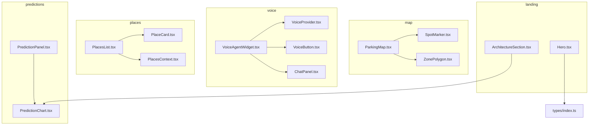
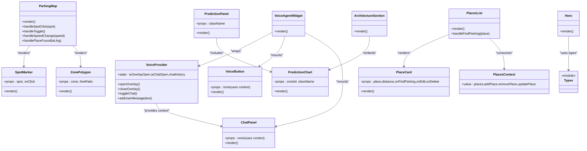
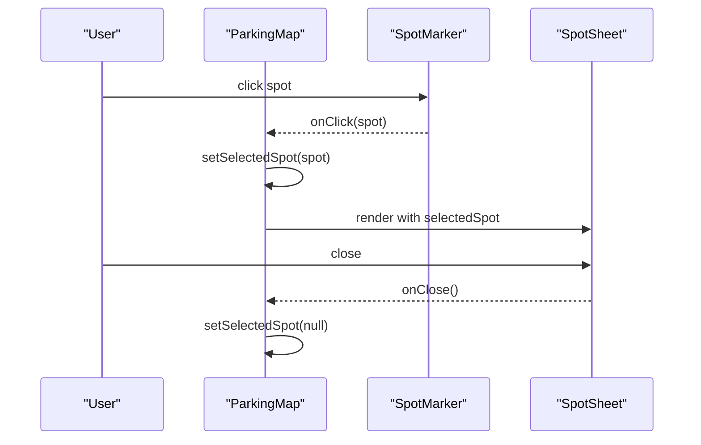
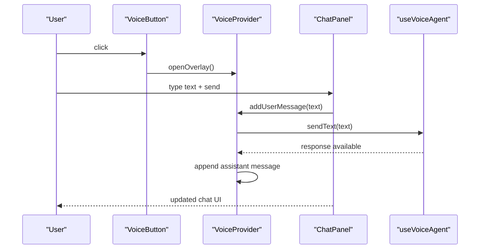
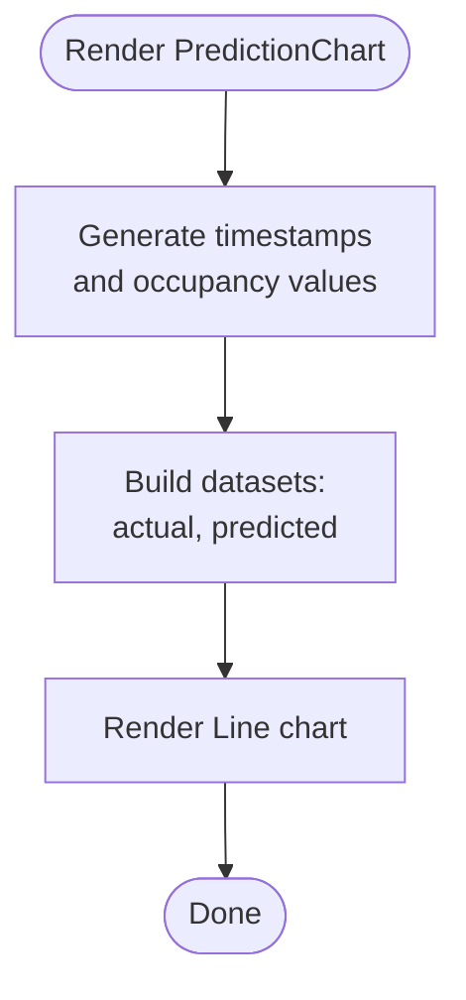
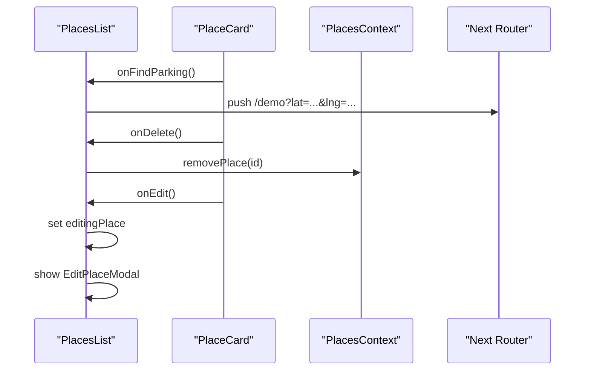
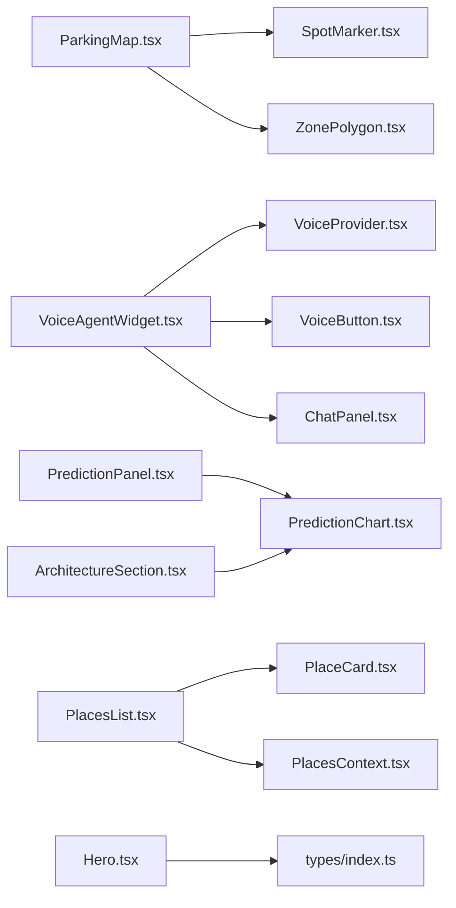

# Component Library

<cite>
**Referenced Files in This Document**
- [ParkingMap.tsx](file://frontend/src/components/map/ParkingMap.tsx)
- [SpotMarker.tsx](file://frontend/src/components/map/SpotMarker.tsx)
- [ZonePolygon.tsx](file://frontend/src/components/map/ZonePolygon.tsx)
- [VoiceAgentWidget.tsx](file://frontend/src/components/voice/VoiceAgentWidget.tsx)
- [ChatPanel.tsx](file://frontend/src/components/voice/ChatPanel.tsx)
- [VoiceButton.tsx](file://frontend/src/components/voice/VoiceButton.tsx)
- [VoiceProvider.tsx](file://frontend/src/components/voice/VoiceProvider.tsx)
- [PredictionPanel.tsx](file://frontend/src/components/predictions/PredictionPanel.tsx)
- [PredictionChart.tsx](file://frontend/src/components/predictions/PredictionChart.tsx)
- [PlacesList.tsx](file://frontend/src/components/places/PlacesList.tsx)
- [PlaceCard.tsx](file://frontend/src/components/places/PlaceCard.tsx)
- [PlacesContext.tsx](file://frontend/src/components/places/PlacesContext.tsx)
- [Hero.tsx](file://frontend/src/components/landing/Hero.tsx)
- [ArchitectureSection.tsx](file://frontend/src/components/landing/ArchitectureSection.tsx)
- [index.ts](file://frontend/src/types/index.ts)
</cite>

## Table of Contents
1. [Introduction](#introduction)
2. [Project Structure](#project-structure)
3. [Core Components](#core-components)
4. [Architecture Overview](#architecture-overview)
5. [Detailed Component Analysis](#detailed-component-analysis)
6. [Dependency Analysis](#dependency-analysis)
7. [Performance Considerations](#performance-considerations)
8. [Troubleshooting Guide](#troubleshooting-guide)
9. [Conclusion](#conclusion)
10. [Appendices](#appendices)

## Introduction
This document explains the SmartPark AI component library organization and architecture across map visualization, voice interface, prediction analytics, place management, and landing page components. It covers component hierarchy, composition patterns, prop interfaces, event handling, parent-child relationships, data flow, state lifting strategies, reusability guidelines, naming conventions, and folder organization principles. Concrete examples reference actual source files to demonstrate usage and customization options.

## Project Structure
The frontend organizes components by feature under src/components with subfolders for each domain:
- map: interactive map and overlays
- voice: conversational UI and agent integration
- predictions: forecasting charts and panels
- places: saved locations and CRUD flows
- landing: marketing pages and sections

**Diagram sources**
- [ParkingMap.tsx:1-108](file://frontend/src/components/map/ParkingMap.tsx#L1-L108)
- [SpotMarker.tsx:1-45](file://frontend/src/components/map/SpotMarker.tsx#L1-L45)
- [ZonePolygon.tsx:1-38](file://frontend/src/components/map/ZonePolygon.tsx#L1-L38)
- [VoiceAgentWidget.tsx:1-22](file://frontend/src/components/voice/VoiceAgentWidget.tsx#L1-L22)
- [VoiceProvider.tsx:1-110](file://frontend/src/components/voice/VoiceProvider.tsx#L1-L110)
- [VoiceButton.tsx:1-43](file://frontend/src/components/voice/VoiceButton.tsx#L1-L43)
- [ChatPanel.tsx:1-164](file://frontend/src/components/voice/ChatPanel.tsx#L1-L164)
- [PredictionPanel.tsx:1-38](file://frontend/src/components/predictions/PredictionPanel.tsx#L1-L38)
- [PredictionChart.tsx:1-199](file://frontend/src/components/predictions/PredictionChart.tsx#L1-L199)
- [PlacesList.tsx:1-97](file://frontend/src/components/places/PlacesList.tsx#L1-L97)
- [PlaceCard.tsx:1-86](file://frontend/src/components/places/PlaceCard.tsx#L1-L86)
- [PlacesContext.tsx:1-77](file://frontend/src/components/places/PlacesContext.tsx#L1-L77)
- [Hero.tsx:1-94](file://frontend/src/components/landing/Hero.tsx#L1-L94)
- [ArchitectureSection.tsx:1-57](file://frontend/src/components/landing/ArchitectureSection.tsx#L1-L57)
- [index.ts:1-75](file://frontend/src/types/index.ts#L1-L75)

**Section sources**
- [ParkingMap.tsx:1-108](file://frontend/src/components/map/ParkingMap.tsx#L1-L108)
- [VoiceAgentWidget.tsx:1-22](file://frontend/src/components/voice/VoiceAgentWidget.tsx#L1-L22)
- [PredictionPanel.tsx:1-38](file://frontend/src/components/predictions/PredictionPanel.tsx#L1-L38)
- [PlacesList.tsx:1-97](file://frontend/src/components/places/PlacesList.tsx#L1-L97)
- [Hero.tsx:1-94](file://frontend/src/components/landing/Hero.tsx#L1-L94)
- [ArchitectureSection.tsx:1-57](file://frontend/src/components/landing/ArchitectureSection.tsx#L1-L57)

## Core Components
This section summarizes key components, their responsibilities, props, events, and composition patterns.

- Map Visualization
  - ParkingMap: orchestrates map rendering, simulation controls, search, and selection state; composes ZonePolygon, SpotMarker, and other overlays.
  - SpotMarker: renders a clickable circle marker per spot; emits click events with spot data.
  - ZonePolygon: renders GeoJSON polygons with tooltips and dynamic coloring based on free ratio.

- Voice Interface
  - VoiceAgentWidget: top-level drop-in widget that provides context via VoiceProvider and mounts VoiceButton, VoiceOverlay, and ChatPanel.
  - VoiceProvider: central state for overlay/chat visibility, chat history, and delegates to useVoiceAgent hook; exposes addUserMessage and toggleChat.
  - VoiceButton: floating trigger to open the overlay; hidden when overlay is open.
  - ChatPanel: message list, input, suggestion chips, and auto-scroll; consumes VoiceProvider context.

- Prediction Analytics
  - PredictionPanel: layout wrapper with header and zone comparison; includes PredictionChart.
  - PredictionChart: generates time-series occupancy data and renders a line chart; accepts optional zoneId and className.

- Place Management
  - PlacesList: manages add/edit/delete modals, computes distances, navigates to demo with coordinates, and uses PlacesContext.
  - PlaceCard: displays place info, icon mapping, and action buttons; receives callbacks for actions.
  - PlacesContext: React context providing CRUD operations and localStorage persistence.

- Landing Page
  - Hero: hero section with stats and navigation links; uses scroll reveal hook.
  - ArchitectureSection: system architecture overview and embedded PredictionChart.

**Section sources**
- [ParkingMap.tsx:1-108](file://frontend/src/components/map/ParkingMap.tsx#L1-L108)
- [SpotMarker.tsx:1-45](file://frontend/src/components/map/SpotMarker.tsx#L1-L45)
- [ZonePolygon.tsx:1-38](file://frontend/src/components/map/ZonePolygon.tsx#L1-L38)
- [VoiceAgentWidget.tsx:1-22](file://frontend/src/components/voice/VoiceAgentWidget.tsx#L1-L22)
- [VoiceProvider.tsx:1-110](file://frontend/src/components/voice/VoiceProvider.tsx#L1-L110)
- [VoiceButton.tsx:1-43](file://frontend/src/components/voice/VoiceButton.tsx#L1-L43)
- [ChatPanel.tsx:1-164](file://frontend/src/components/voice/ChatPanel.tsx#L1-L164)
- [PredictionPanel.tsx:1-38](file://frontend/src/components/predictions/PredictionPanel.tsx#L1-L38)
- [PredictionChart.tsx:1-199](file://frontend/src/components/predictions/PredictionChart.tsx#L1-L199)
- [PlacesList.tsx:1-97](file://frontend/src/components/places/PlacesList.tsx#L1-L97)
- [PlaceCard.tsx:1-86](file://frontend/src/components/places/PlaceCard.tsx#L1-L86)
- [PlacesContext.tsx:1-77](file://frontend/src/components/places/PlacesContext.tsx#L1-L77)
- [Hero.tsx:1-94](file://frontend/src/components/landing/Hero.tsx#L1-L94)
- [ArchitectureSection.tsx:1-57](file://frontend/src/components/landing/ArchitectureSection.tsx#L1-L57)

## Architecture Overview
High-level interactions between major components and shared types.

**Diagram sources**
- [ParkingMap.tsx:1-108](file://frontend/src/components/map/ParkingMap.tsx#L1-L108)
- [SpotMarker.tsx:1-45](file://frontend/src/components/map/SpotMarker.tsx#L1-L45)
- [ZonePolygon.tsx:1-38](file://frontend/src/components/map/ZonePolygon.tsx#L1-L38)
- [VoiceAgentWidget.tsx:1-22](file://frontend/src/components/voice/VoiceAgentWidget.tsx#L1-L22)
- [VoiceProvider.tsx:1-110](file://frontend/src/components/voice/VoiceProvider.tsx#L1-L110)
- [VoiceButton.tsx:1-43](file://frontend/src/components/voice/VoiceButton.tsx#L1-L43)
- [ChatPanel.tsx:1-164](file://frontend/src/components/voice/ChatPanel.tsx#L1-L164)
- [PredictionPanel.tsx:1-38](file://frontend/src/components/predictions/PredictionPanel.tsx#L1-L38)
- [PredictionChart.tsx:1-199](file://frontend/src/components/predictions/PredictionChart.tsx#L1-L199)
- [PlacesList.tsx:1-97](file://frontend/src/components/places/PlacesList.tsx#L1-L97)
- [PlaceCard.tsx:1-86](file://frontend/src/components/places/PlaceCard.tsx#L1-L86)
- [PlacesContext.tsx:1-77](file://frontend/src/components/places/PlacesContext.tsx#L1-L77)
- [Hero.tsx:1-94](file://frontend/src/components/landing/Hero.tsx#L1-L94)
- [ArchitectureSection.tsx:1-57](file://frontend/src/components/landing/ArchitectureSection.tsx#L1-L57)
- [index.ts:1-75](file://frontend/src/types/index.ts#L1-L75)

## Detailed Component Analysis

### Map Visualization Components
- Composition pattern
  - ParkingMap composes SpotMarker and ZonePolygon, passing derived data such as free ratios and click handlers.
  - Parent-child relationship: ParkingMap holds selectedSpot and speed state; children are stateless or minimal-state presentational components.
- Prop interfaces
  - SpotMarkerProps: spot, onClick
  - ZonePolygonProps: zone, freeRatio
- Event handling
  - Click on SpotMarker triggers handleSpotClick in ParkingMap to set selectedSpot.
  - SearchBar and MapControls emit callbacks handled by ParkingMap to flyTo location and control simulation.
- Data flow
  - Simulation state from useSimulator drives spots; ParkingMap filters spots per zone to compute freeRatio for ZonePolygon.
- State lifting
  - Selection and simulation control are lifted to ParkingMap; child markers receive callbacks rather than managing selection themselves.

**Diagram sources**
- [ParkingMap.tsx:27-107](file://frontend/src/components/map/ParkingMap.tsx#L27-L107)
- [SpotMarker.tsx:18-44](file://frontend/src/components/map/SpotMarker.tsx#L18-L44)

**Section sources**
- [ParkingMap.tsx:1-108](file://frontend/src/components/map/ParkingMap.tsx#L1-L108)
- [SpotMarker.tsx:1-45](file://frontend/src/components/map/SpotMarker.tsx#L1-L45)
- [ZonePolygon.tsx:1-38](file://frontend/src/components/map/ZonePolygon.tsx#L1-L38)

### Voice Interface Components
- Composition pattern
  - VoiceAgentWidget wraps application with VoiceProvider and mounts VoiceButton and ChatPanel.
  - VoiceProvider centralizes overlay/chat visibility and chat history, delegating to useVoiceAgent hook for processing.
- Prop interfaces
  - VoiceButton: no props (context-driven).
  - ChatPanel: no props (context-driven).
  - VoiceProvider: children only.
- Event handling
  - VoiceButton opens overlay via openOverlay.
  - ChatPanel sends messages via addUserMessage; listens to voiceAgent.response to append assistant messages.
- Data flow
  - Chat history stored in VoiceProvider; user messages added synchronously, assistant messages appended after response arrives.
- State lifting
  - Overlay and chat visibility plus chat history are lifted into VoiceProvider; leaf components consume via context.

**Diagram sources**
- [VoiceAgentWidget.tsx:1-22](file://frontend/src/components/voice/VoiceAgentWidget.tsx#L1-L22)
- [VoiceProvider.tsx:39-109](file://frontend/src/components/voice/VoiceProvider.tsx#L39-L109)
- [VoiceButton.tsx:1-43](file://frontend/src/components/voice/VoiceButton.tsx#L1-L43)
- [ChatPanel.tsx:1-164](file://frontend/src/components/voice/ChatPanel.tsx#L1-L164)

**Section sources**
- [VoiceAgentWidget.tsx:1-22](file://frontend/src/components/voice/VoiceAgentWidget.tsx#L1-L22)
- [VoiceProvider.tsx:1-110](file://frontend/src/components/voice/VoiceProvider.tsx#L1-L110)
- [VoiceButton.tsx:1-43](file://frontend/src/components/voice/VoiceButton.tsx#L1-L43)
- [ChatPanel.tsx:1-164](file://frontend/src/components/voice/ChatPanel.tsx#L1-L164)

### Prediction Analytics Components
- Composition pattern
  - PredictionPanel composes PredictionChart and a zone comparison section.
  - ArchitectureSection embeds PredictionChart for landing page visualization.
- Prop interfaces
  - PredictionPanelProps: className
  - PredictionChartProps: zoneId, className
- Processing logic
  - PredictionChart generates 48 points over 12 hours using smoothed occupancy functions; renders actual vs predicted series.
- Data flow
  - Chart data computed via useMemo keyed by zoneId; options configure styling and tooltips.

**Diagram sources**
- [PredictionChart.tsx:56-130](file://frontend/src/components/predictions/PredictionChart.tsx#L56-L130)
- [PredictionChart.tsx:132-198](file://frontend/src/components/predictions/PredictionChart.tsx#L132-L198)

**Section sources**
- [PredictionPanel.tsx:1-38](file://frontend/src/components/predictions/PredictionPanel.tsx#L1-L38)
- [PredictionChart.tsx:1-199](file://frontend/src/components/predictions/PredictionChart.tsx#L1-L199)
- [ArchitectureSection.tsx:1-57](file://frontend/src/components/landing/ArchitectureSection.tsx#L1-L57)

### Place Management Components
- Composition pattern
  - PlacesList renders PlaceCard items and manages modal states for add/edit; integrates with PlacesContext for persistence.
- Prop interfaces
  - PlaceCardProps: place, distance?, onFindParking, onEdit, onDelete
- Event handling
  - PlaceCard actions invoke callbacks provided by PlacesList.
  - PlacesList navigates to demo route with coordinates upon “Find Parking”.
- Data flow and state lifting
  - PlacesContext lifts places array and CRUD operations; PlacesList subscribes via usePlaces and dispatches mutations.
  - LocalStorage hydration ensures persistence across sessions.

**Diagram sources**
- [PlacesList.tsx:34-96](file://frontend/src/components/places/PlacesList.tsx#L34-L96)
- [PlaceCard.tsx:27-85](file://frontend/src/components/places/PlaceCard.tsx#L27-L85)
- [PlacesContext.tsx:18-76](file://frontend/src/components/places/PlacesContext.tsx#L18-L76)

**Section sources**
- [PlacesList.tsx:1-97](file://frontend/src/components/places/PlacesList.tsx#L1-L97)
- [PlaceCard.tsx:1-86](file://frontend/src/components/places/PlaceCard.tsx#L1-L86)
- [PlacesContext.tsx:1-77](file://frontend/src/components/places/PlacesContext.tsx#L1-L77)

### Landing Page Components
- Composition pattern
  - Hero presents value proposition and CTAs; ArchitectureSection outlines system nodes and embeds PredictionChart.
- Usage and customization
  - Both leverage a scroll reveal hook for entrance animations.
  - ArchitectureSection can be linked from Hero’s anchor link.

**Section sources**
- [Hero.tsx:1-94](file://frontend/src/components/landing/Hero.tsx#L1-L94)
- [ArchitectureSection.tsx:1-57](file://frontend/src/components/landing/ArchitectureSection.tsx#L1-L57)

## Dependency Analysis
Key dependencies and coupling:
- Map components depend on Leaflet via react-leaflet and seed data for zones/spots/saved places.
- Voice components depend on VoiceProvider context and useVoiceAgent hook; ChatPanel depends on SuggestionChips and MapCard.
- Predictions depend on Chart.js and react-chartjs-2.
- Places components depend on Next router and PlacesContext for persistence.
- Landing components depend on hooks and PredictionChart.

**Diagram sources**
- [ParkingMap.tsx:1-108](file://frontend/src/components/map/ParkingMap.tsx#L1-L108)
- [SpotMarker.tsx:1-45](file://frontend/src/components/map/SpotMarker.tsx#L1-L45)
- [ZonePolygon.tsx:1-38](file://frontend/src/components/map/ZonePolygon.tsx#L1-L38)
- [VoiceAgentWidget.tsx:1-22](file://frontend/src/components/voice/VoiceAgentWidget.tsx#L1-L22)
- [VoiceProvider.tsx:1-110](file://frontend/src/components/voice/VoiceProvider.tsx#L1-L110)
- [VoiceButton.tsx:1-43](file://frontend/src/components/voice/VoiceButton.tsx#L1-L43)
- [ChatPanel.tsx:1-164](file://frontend/src/components/voice/ChatPanel.tsx#L1-L164)
- [PredictionPanel.tsx:1-38](file://frontend/src/components/predictions/PredictionPanel.tsx#L1-L38)
- [PredictionChart.tsx:1-199](file://frontend/src/components/predictions/PredictionChart.tsx#L1-L199)
- [PlacesList.tsx:1-97](file://frontend/src/components/places/PlacesList.tsx#L1-L97)
- [PlaceCard.tsx:1-86](file://frontend/src/components/places/PlaceCard.tsx#L1-L86)
- [PlacesContext.tsx:1-77](file://frontend/src/components/places/PlacesContext.tsx#L1-L77)
- [Hero.tsx:1-94](file://frontend/src/components/landing/Hero.tsx#L1-L94)
- [ArchitectureSection.tsx:1-57](file://frontend/src/components/landing/ArchitectureSection.tsx#L1-L57)
- [index.ts:1-75](file://frontend/src/types/index.ts#L1-L75)

**Section sources**
- [ParkingMap.tsx:1-108](file://frontend/src/components/map/ParkingMap.tsx#L1-L108)
- [VoiceAgentWidget.tsx:1-22](file://frontend/src/components/voice/VoiceAgentWidget.tsx#L1-L22)
- [PredictionPanel.tsx:1-38](file://frontend/src/components/predictions/PredictionPanel.tsx#L1-L38)
- [PlacesList.tsx:1-97](file://frontend/src/components/places/PlacesList.tsx#L1-L97)
- [Hero.tsx:1-94](file://frontend/src/components/landing/Hero.tsx#L1-L94)
- [ArchitectureSection.tsx:1-57](file://frontend/src/components/landing/ArchitectureSection.tsx#L1-L57)
- [index.ts:1-75](file://frontend/src/types/index.ts#L1-L75)

## Performance Considerations
- Memoization: PredictionChart uses memoized data generation keyed by zoneId to avoid recomputation.
- Rendering efficiency: Map markers and polygons are rendered directly from arrays; consider virtualization if dataset grows significantly.
- Context updates: VoiceProvider adds messages incrementally; polling interval should be tuned to balance responsiveness and overhead.
- Chart performance: Chart.js options disable point radius for smooth lines; keep datasets limited to maintain interactivity.

[No sources needed since this section provides general guidance]

## Troubleshooting Guide
- Missing Providers
  - Using usePlaces outside PlacesProvider throws an error; ensure PlacesProvider wraps the tree.
  - Using useVoiceContext outside VoiceProvider throws an error; ensure VoiceAgentWidget or VoiceProvider wraps the tree.
- LocalStorage availability
  - PlacesContext gracefully falls back to seed data if localStorage is unavailable; verify storage permissions in restricted environments.
- Map interactions
  - If mapRef is null during place search, flyTo will not execute; ensure ref is attached before calling navigation methods.
- Chart rendering
  - Ensure Chart.js modules are registered before rendering PredictionChart; registration occurs at module load.

**Section sources**
- [PlacesContext.tsx:70-76](file://frontend/src/components/places/PlacesContext.tsx#L70-L76)
- [VoiceProvider.tsx:27-33](file://frontend/src/components/voice/VoiceProvider.tsx#L27-L33)
- [ParkingMap.tsx:50-54](file://frontend/src/components/map/ParkingMap.tsx#L50-L54)
- [PredictionChart.tsx:17](file://frontend/src/components/predictions/PredictionChart.tsx#L17)

## Conclusion
The SmartPark AI component library follows a clear feature-based organization with well-defined composition patterns. Parent components manage state and lift concerns where necessary, while child components remain focused on presentation and localized interactions. Shared contexts (PlacesContext, VoiceProvider) centralize cross-cutting concerns like persistence and conversation state. The design supports reusability through explicit prop interfaces and callback-driven event handling, enabling consistent customization across map, voice, predictions, places, and landing features.

[No sources needed since this section summarizes without analyzing specific files]

## Appendices

### Naming Conventions and Folder Organization Principles
- File names: PascalCase for component files (e.g., ParkingMap.tsx), kebab-case for utility hooks/styles if applicable.
- Folder structure: Group by feature (map, voice, predictions, places, landing); colocate related components and small utilities within folders.
- Exports: Default export for primary components; named exports for providers/hooks used by consumers.
- Props: Define TypeScript interfaces co-located with components; prefer explicit prop types and optional flags for customization.

[No sources needed since this section provides general guidance]