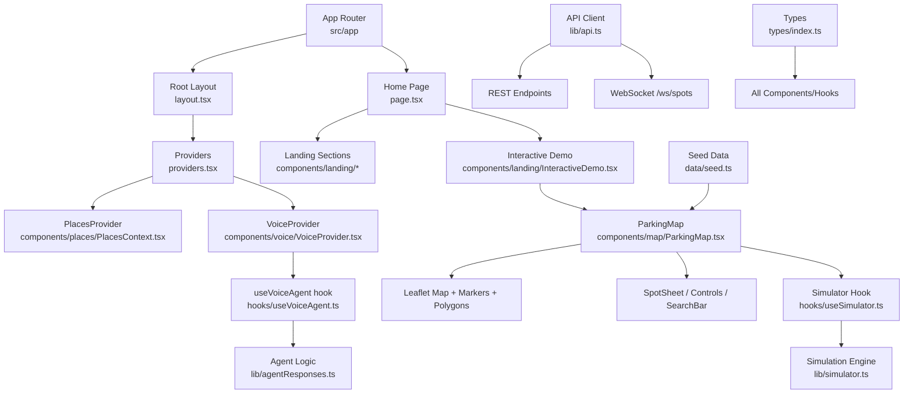
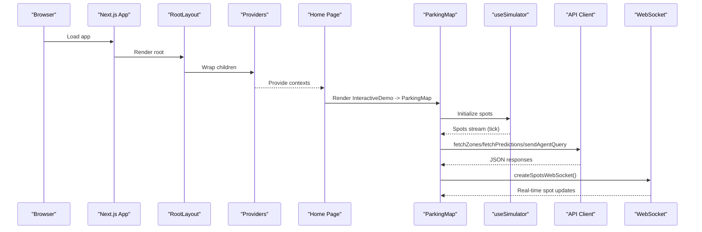
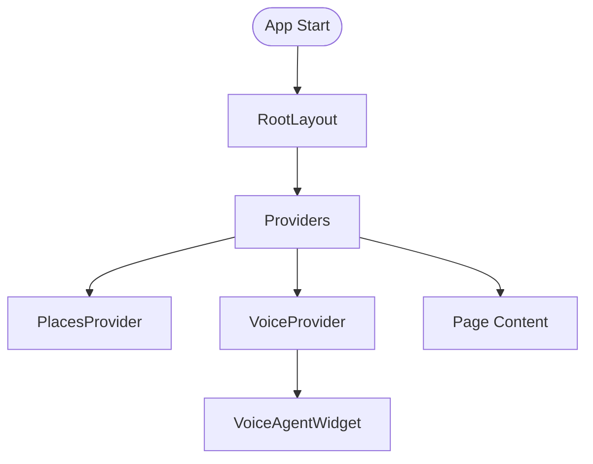
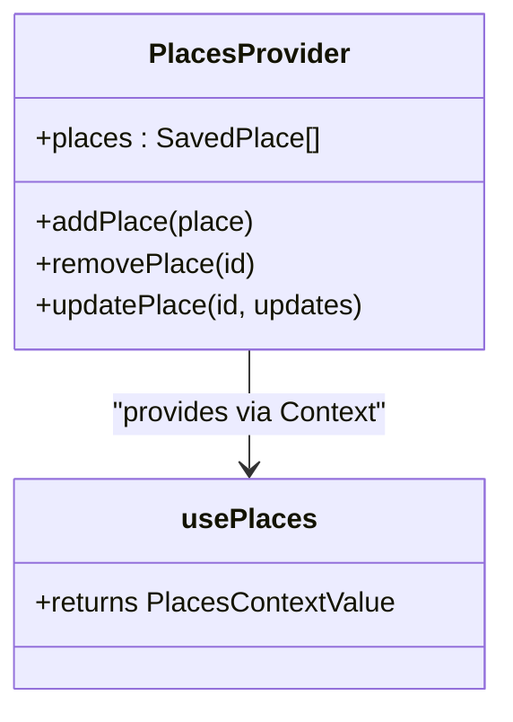
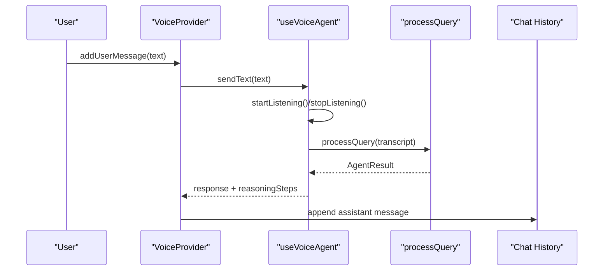
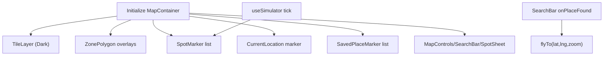
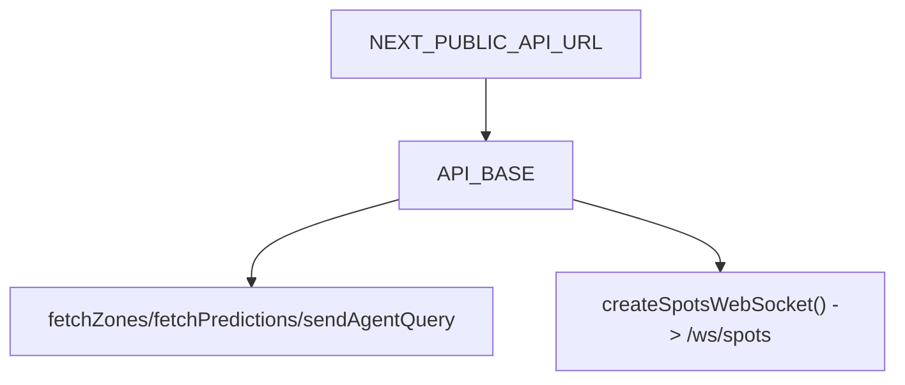
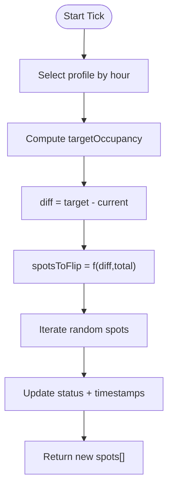
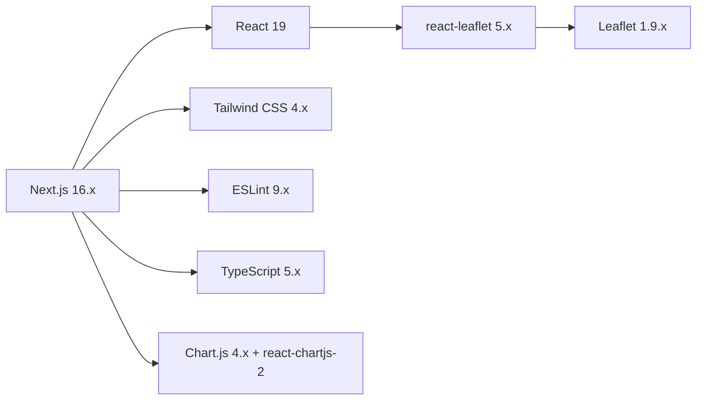

# Frontend Architecture

<cite>
**Referenced Files in This Document**
- [package.json](file://frontend/package.json)
- [next.config.ts](file://frontend/next.config.ts)
- [layout.tsx](file://frontend/src/app/layout.tsx)
- [page.tsx](file://frontend/src/app/page.tsx)
- [providers.tsx](file://frontend/src/app/providers.tsx)
- [PlacesContext.tsx](file://frontend/src/components/places/PlacesContext.tsx)
- [VoiceProvider.tsx](file://frontend/src/components/voice/VoiceProvider.tsx)
- [useVoiceAgent.ts](file://frontend/src/hooks/useVoiceAgent.ts)
- [api.ts](file://frontend/src/lib/api.ts)
- [ParkingMap.tsx](file://frontend/src/components/map/ParkingMap.tsx)
- [seed.ts](file://frontend/src/data/seed.ts)
- [simulator.ts](file://frontend/src/lib/simulator.ts)
- [index.ts (types)](file://frontend/src/types/index.ts)
</cite>

## Table of Contents
1. Introduction
2. Project Structure
3. Core Components
4. Architecture Overview
5. Detailed Component Analysis
6. Dependency Analysis
7. Performance Considerations
8. Troubleshooting Guide
9. Conclusion

## Introduction
This document describes the SmartPark AI frontend architecture built with Next.js 15, React 19, TypeScript, and Tailwind CSS. It explains page routing, layout composition, global providers for state management, component hierarchy (map visualization, voice interface, prediction charts, landing page), state patterns using React Context and custom hooks with local storage integration, API client abstraction for REST and WebSocket, Leaflet map integration with markers and polygons, responsive design, accessibility considerations, performance strategies, and reusability guidelines.

## Project Structure
The application follows a feature-oriented structure under src:
- app/: Next.js App Router pages and root layout
- components/: Feature-based folders for landing, map, places, predictions, and voice
- hooks/: Custom hooks for agent and simulator logic
- lib/: Shared utilities including API client and simulation helpers
- data/: Seed data for zones, spots, and saved places
- types/: Shared TypeScript types

**Diagram sources**
- [layout.tsx:1-26](file://frontend/src/app/layout.tsx#L1-L26)
- [page.tsx:1-34](file://frontend/src/app/page.tsx#L1-L34)
- [providers.tsx:1-15](file://frontend/src/app/providers.tsx#L1-L15)
- [PlacesContext.tsx:1-77](file://frontend/src/components/places/PlacesContext.tsx#L1-L77)
- [VoiceProvider.tsx:1-110](file://frontend/src/components/voice/VoiceProvider.tsx#L1-L110)
- [useVoiceAgent.ts:1-227](file://frontend/src/hooks/useVoiceAgent.ts#L1-L227)
- [ParkingMap.tsx:1-108](file://frontend/src/components/map/ParkingMap.tsx#L1-L108)
- [simulator.ts:1-73](file://frontend/src/lib/simulator.ts#L1-L73)
- [api.ts:1-27](file://frontend/src/lib/api.ts#L1-L27)
- [seed.ts:1-138](file://frontend/src/data/seed.ts#L1-L138)
- [index.ts (types):1-75](file://frontend/src/types/index.ts#L1-L75)

**Section sources**
- [layout.tsx:1-26](file://frontend/src/app/layout.tsx#L1-L26)
- [page.tsx:1-34](file://frontend/src/app/page.tsx#L1-L34)
- [providers.tsx:1-15](file://frontend/src/app/providers.tsx#L1-L15)
- [package.json:1-32](file://frontend/package.json#L1-L32)
- [next.config.ts:1-10](file://frontend/next.config.ts#L1-L10)

## Core Components
- Root layout and metadata: Defines global HTML/body classes, injects Providers, and mounts the VoiceAgentWidget globally.
- Global providers: Nest PlacesProvider and VoiceProvider to share state across the app.
- Landing page: Composes Navbar, Hero, ProblemSection, InteractiveDemo, AgentSection, HardwareSection, ArchitectureSection, TechStackSection, Footer.
- Map container: ParkingMap orchestrates Leaflet map, zone polygons, spot markers, current location, saved place markers, controls, search bar, and bottom sheet.
- Voice system: VoiceProvider exposes overlay/chat UI state and delegates speech processing to useVoiceAgent; chat history is managed locally within the provider.
- Places context: Provides CRUD operations for saved places with localStorage persistence and hydration guard.
- API client: Centralized fetch wrappers for REST endpoints and a factory for WebSocket connections.
- Simulation engine: Time-of-day occupancy profiles drive spot status transitions used by the map demo.

**Section sources**
- [layout.tsx:1-26](file://frontend/src/app/layout.tsx#L1-L26)
- [providers.tsx:1-15](file://frontend/src/app/providers.tsx#L1-L15)
- [page.tsx:1-34](file://frontend/src/app/page.tsx#L1-L34)
- [ParkingMap.tsx:1-108](file://frontend/src/components/map/ParkingMap.tsx#L1-L108)
- [VoiceProvider.tsx:1-110](file://frontend/src/components/voice/VoiceProvider.tsx#L1-L110)
- [useVoiceAgent.ts:1-227](file://frontend/src/hooks/useVoiceAgent.ts#L1-L227)
- [PlacesContext.tsx:1-77](file://frontend/src/components/places/PlacesContext.tsx#L1-L77)
- [api.ts:1-27](file://frontend/src/lib/api.ts#L1-L27)
- [simulator.ts:1-73](file://frontend/src/lib/simulator.ts#L1-L73)

## Architecture Overview
High-level runtime flow:
- Next.js bootstraps the root layout, which renders Providers and the global VoiceAgentWidget.
- The Home page composes landing sections; the InteractiveDemo embeds the ParkingMap.
- ParkingMap initializes Leaflet via react-leaflet, renders TileLayer, ZonePolygon overlays, SpotMarker instances, CurrentLocation marker, SavedPlaceMarker entries, and interactive controls.
- State flows from Providers into components; PlacesProvider persists to localStorage; VoiceProvider manages chat and integrates with useVoiceAgent.
- External integrations: REST calls through api.ts and optional WebSocket updates for real-time spot changes.

**Diagram sources**
- [layout.tsx:1-26](file://frontend/src/app/layout.tsx#L1-L26)
- [providers.tsx:1-15](file://frontend/src/app/providers.tsx#L1-L15)
- [page.tsx:1-34](file://frontend/src/app/page.tsx#L1-L34)
- [ParkingMap.tsx:1-108](file://frontend/src/components/map/ParkingMap.tsx#L1-L108)
- [api.ts:1-27](file://frontend/src/lib/api.ts#L1-L27)

## Detailed Component Analysis

### Root Layout and Providers
- Root layout sets global styles and metadata, wraps content with Providers, and mounts the VoiceAgentWidget at the body level.
- Providers nests PlacesProvider and VoiceProvider to supply shared state to all descendant components.

**Diagram sources**
- [layout.tsx:1-26](file://frontend/src/app/layout.tsx#L1-L26)
- [providers.tsx:1-15](file://frontend/src/app/providers.tsx#L1-L15)

**Section sources**
- [layout.tsx:1-26](file://frontend/src/app/layout.tsx#L1-L26)
- [providers.tsx:1-15](file://frontend/src/app/providers.tsx#L1-L15)

### Places Provider (Saved Places)
- Exposes places list and mutations (add, remove, update).
- Hydrates from localStorage on mount and persists changes after hydration to avoid SSR mismatch.
- Throws if used outside PlacesProvider.

**Diagram sources**
- [PlacesContext.tsx:1-77](file://frontend/src/components/places/PlacesContext.tsx#L1-L77)

**Section sources**
- [PlacesContext.tsx:1-77](file://frontend/src/components/places/PlacesContext.tsx#L1-L77)

### Voice System (Provider + Hook)
- VoiceProvider maintains overlay/chat visibility, chat history, and delegates speech processing to useVoiceAgent.
- useVoiceAgent encapsulates browser SpeechRecognition lifecycle, transcript handling, reasoning steps animation, and text input processing.

**Diagram sources**
- [VoiceProvider.tsx:1-110](file://frontend/src/components/voice/VoiceProvider.tsx#L1-L110)
- [useVoiceAgent.ts:1-227](file://frontend/src/hooks/useVoiceAgent.ts#L1-L227)

**Section sources**
- [VoiceProvider.tsx:1-110](file://frontend/src/components/voice/VoiceProvider.tsx#L1-L110)
- [useVoiceAgent.ts:1-227](file://frontend/src/hooks/useVoiceAgent.ts#L1-L227)

### Map Visualization (Leaflet Integration)
- ParkingMap initializes a dark-themed Leaflet map, renders zone polygons colored by free ratio, spot markers, current location, saved place markers, and control panels.
- Uses useSimulator to drive spot state changes over time and supports fly-to navigation based on search results.

**Diagram sources**
- [ParkingMap.tsx:1-108](file://frontend/src/components/map/ParkingMap.tsx#L1-L108)
- [seed.ts:1-138](file://frontend/src/data/seed.ts#L1-L138)

**Section sources**
- [ParkingMap.tsx:1-108](file://frontend/src/components/map/ParkingMap.tsx#L1-L108)
- [seed.ts:1-138](file://frontend/src/data/seed.ts#L1-L138)

### Prediction Charts and Landing Elements
- Landing page composes multiple sections including InteractiveDemo and PredictionChart components.
- Prediction charts visualize predicted occupancy per zone using charting libraries configured in dependencies.

**Section sources**
- [page.tsx:1-34](file://frontend/src/app/page.tsx#L1-L34)
- [package.json:1-32](file://frontend/package.json#L1-L32)

### API Client Abstraction (REST + WebSocket)
- Centralizes base URL configuration and provides functions for fetching zones, predictions, and sending agent queries.
- Factory function creates WebSocket connection for real-time spot updates.

**Diagram sources**
- [api.ts:1-27](file://frontend/src/lib/api.ts#L1-L27)

**Section sources**
- [api.ts:1-27](file://frontend/src/lib/api.ts#L1-L27)

### Simulation Engine
- Occupancy targets vary by time-of-day profiles.
- simulateTick computes how many spots to flip to meet target occupancy and returns updated spot arrays.

**Diagram sources**
- [simulator.ts:1-73](file://frontend/src/lib/simulator.ts#L1-L73)

**Section sources**
- [simulator.ts:1-73](file://frontend/src/lib/simulator.ts#L1-L73)

### Types and Seed Data
- Shared types define Spot, Zone, Sensor, SavedPlace, Prediction, ParkEvent, and AgentResponse structures.
- Seed data generates zones with GeoJSON polygons and synthetic spots with realistic distributions.

**Section sources**
- [index.ts (types):1-75](file://frontend/src/types/index.ts#L1-L75)
- [seed.ts:1-138](file://frontend/src/data/seed.ts#L1-L138)

## Dependency Analysis
Key runtime dependencies include Next.js, React 19, react-leaflet, Leaflet, Chart.js, and Tailwind CSS v4. The build config enables strict mode and documents that Leaflet must render client-side.

**Diagram sources**
- [package.json:1-32](file://frontend/package.json#L1-L32)
- [next.config.ts:1-10](file://frontend/next.config.ts#L1-L10)

**Section sources**
- [package.json:1-32](file://frontend/package.json#L1-L32)
- [next.config.ts:1-10](file://frontend/next.config.ts#L1-L10)

## Performance Considerations
- Client-only rendering for Leaflet: Ensure map-related components are marked client-side and dynamically imported where appropriate to avoid SSR issues.
- Memoization: Use memoization for expensive computations (e.g., filtering spots per zone) and stable callbacks for event handlers to minimize re-renders.
- Virtualization: For large lists of spots or messages, consider virtualized lists to reduce DOM size.
- Debounce inputs: Debounce search and slider interactions to limit frequent state updates.
- Efficient updates: Batch state updates and prefer immutable updates to avoid unnecessary re-renders.
- Asset optimization: Leverage Next.js image optimization and code splitting for heavy components like charts and maps.
- Network efficiency: Cache REST responses when appropriate and coalesce WebSocket messages to reduce UI churn.

[No sources needed since this section provides general guidance]

## Troubleshooting Guide
- Speech recognition not supported: The voice hook detects browser support and surfaces an error state if unavailable.
- LocalStorage errors: PlacesProvider guards against localStorage unavailability during hydration and persistence.
- WebSocket connectivity: Verify NEXT_PUBLIC_API_URL scheme conversion to ws/wss and ensure backend endpoint availability.
- Map rendering issues: Confirm client-only execution for Leaflet imports and that map container has non-zero dimensions.

**Section sources**
- [useVoiceAgent.ts:1-227](file://frontend/src/hooks/useVoiceAgent.ts#L1-L227)
- [PlacesContext.tsx:1-77](file://frontend/src/components/places/PlacesContext.tsx#L1-L77)
- [api.ts:1-27](file://frontend/src/lib/api.ts#L1-L27)
- [next.config.ts:1-10](file://frontend/next.config.ts#L1-L10)

## Conclusion
SmartPark AI’s frontend combines a modern Next.js App Router setup with React 19, TypeScript, and Tailwind CSS. It uses a clear provider pattern for global state, a robust voice interface powered by Web Speech APIs, and a rich Leaflet-based map with real-time simulation. The API client abstracts REST and WebSocket communication, while seed data and simulation enable a compelling interactive demo. Following the provided patterns ensures maintainability, scalability, and strong user experience across devices.