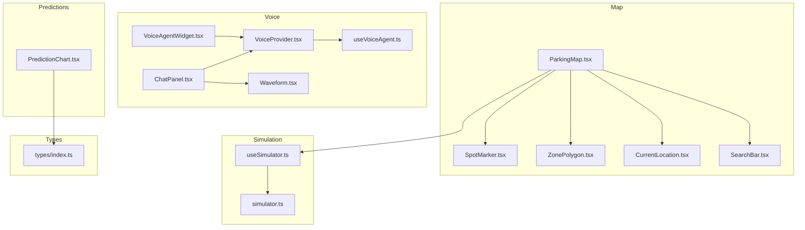
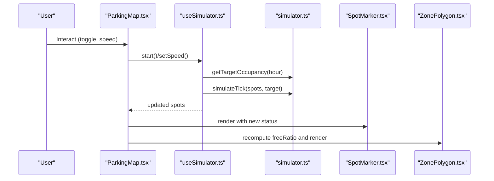
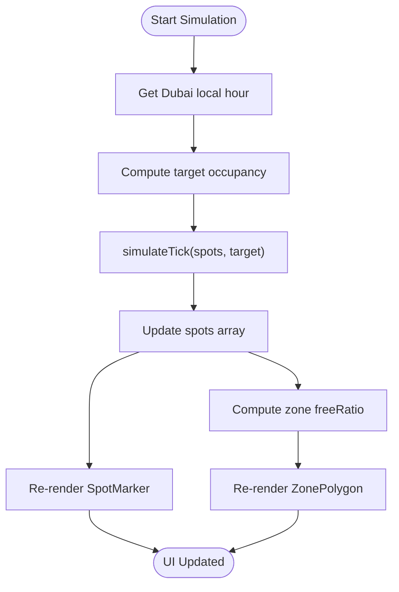
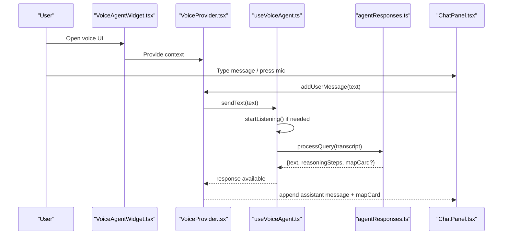
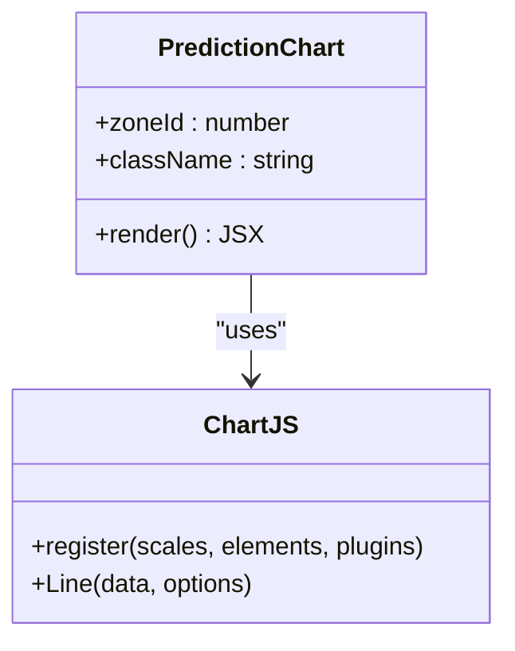
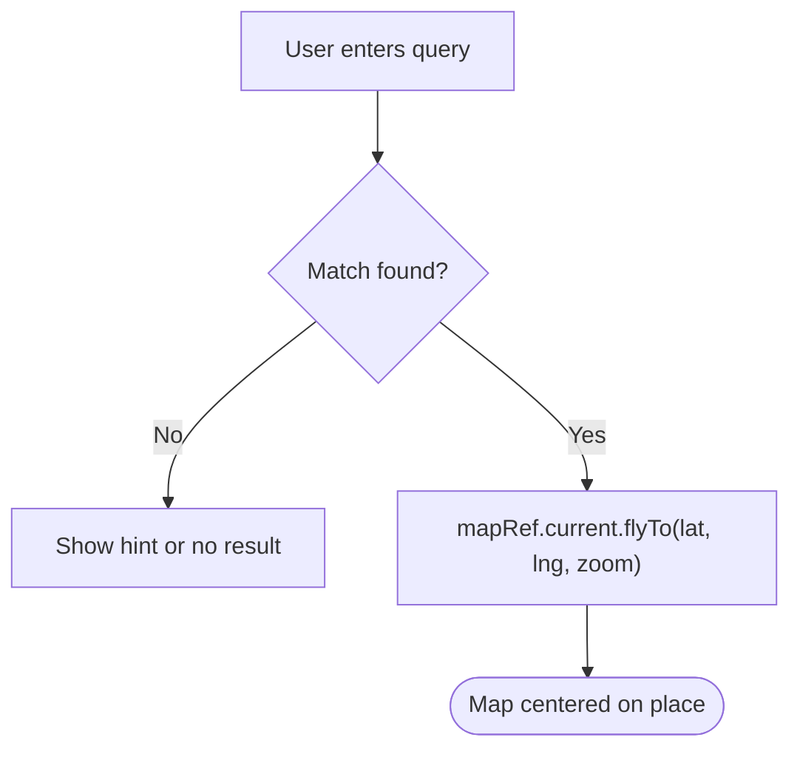
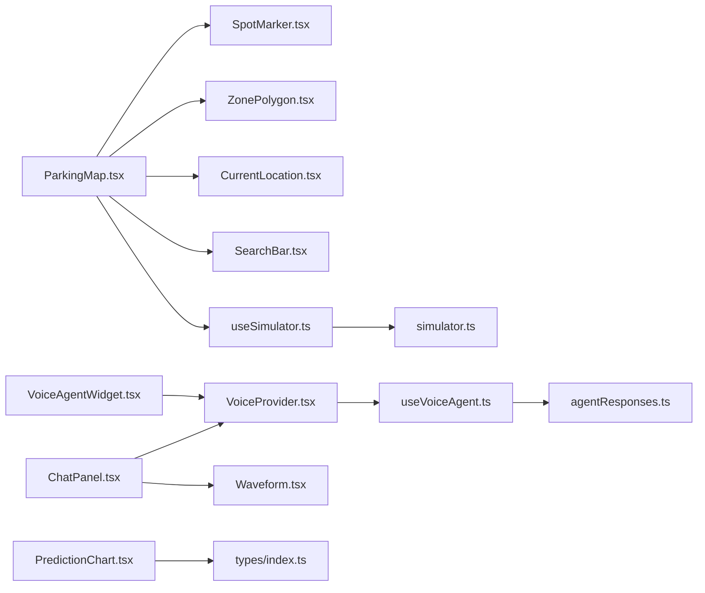

# Interactive Features

<cite>
**Referenced Files in This Document**
- [ParkingMap.tsx](file://frontend/src/components/map/ParkingMap.tsx)
- [SpotMarker.tsx](file://frontend/src/components/map/SpotMarker.tsx)
- [ZonePolygon.tsx](file://frontend/src/components/map/ZonePolygon.tsx)
- [CurrentLocation.tsx](file://frontend/src/components/map/CurrentLocation.tsx)
- [SearchBar.tsx](file://frontend/src/components/map/SearchBar.tsx)
- [useSimulator.ts](file://frontend/src/hooks/useSimulator.ts)
- [simulator.ts](file://frontend/src/lib/simulator.ts)
- [PredictionChart.tsx](file://frontend/src/components/predictions/PredictionChart.tsx)
- [VoiceAgentWidget.tsx](file://frontend/src/components/voice/VoiceAgentWidget.tsx)
- [VoiceProvider.tsx](file://frontend/src/components/voice/VoiceProvider.tsx)
- [ChatPanel.tsx](file://frontend/src/components/voice/ChatPanel.tsx)
- [Waveform.tsx](file://frontend/src/components/voice/Waveform.tsx)
- [useVoiceAgent.ts](file://frontend/src/hooks/useVoiceAgent.ts)
- [agentResponses.ts](file://frontend/src/lib/agentResponses.ts)
- [index.ts](file://frontend/src/types/index.ts)
</cite>

## Table of Contents
1. Introduction
2. Project Structure
3. Core Components
4. Architecture Overview
5. Detailed Component Analysis
6. Dependency Analysis
7. Performance Considerations
8. Troubleshooting Guide
9. Conclusion

## Introduction
This document explains SmartPark AI’s interactive features with a focus on real-time user experiences. It covers:
- Leaflet map integration with custom markers, polygon overlays, and real-time updates
- Voice assistant interface including speech recognition, audio waveform visualization, chat panel, and conversation management
- Predictive analytics visualization using Chart.js with interactive charts and data filtering
- Search and navigation features with geolocation, autocomplete, and route planning
- Responsive design patterns for mobile and desktop
- Performance optimization for real-time updates, memory management for large datasets, and accessibility compliance

## Project Structure
The interactive features are implemented primarily in the frontend under src/components and src/hooks, with supporting logic in src/lib and shared types in src/types. Key areas:
- Map: components under src/components/map
- Voice: components under src/components/voice and hook under src/hooks
- Predictions: chart component under src/components/predictions
- Simulation: hook under src/hooks and simulation logic under src/lib
- Types: shared interfaces under src/types

**Diagram sources**
- [ParkingMap.tsx](file://frontend/src/components/map/ParkingMap.tsx)
- [SpotMarker.tsx](file://frontend/src/components/map/SpotMarker.tsx)
- [ZonePolygon.tsx](file://frontend/src/components/map/ZonePolygon.tsx)
- [CurrentLocation.tsx](file://frontend/src/components/map/CurrentLocation.tsx)
- [SearchBar.tsx](file://frontend/src/components/map/SearchBar.tsx)
- [useSimulator.ts](file://frontend/src/hooks/useSimulator.ts)
- [simulator.ts](file://frontend/src/lib/simulator.ts)
- [VoiceAgentWidget.tsx](file://frontend/src/components/voice/VoiceAgentWidget.tsx)
- [VoiceProvider.tsx](file://frontend/src/components/voice/VoiceProvider.tsx)
- [ChatPanel.tsx](file://frontend/src/components/voice/ChatPanel.tsx)
- [Waveform.tsx](file://frontend/src/components/voice/Waveform.tsx)
- [useVoiceAgent.ts](file://frontend/src/hooks/useVoiceAgent.ts)
- [PredictionChart.tsx](file://frontend/src/components/predictions/PredictionChart.tsx)
- [index.ts](file://frontend/src/types/index.ts)

**Section sources**
- [ParkingMap.tsx](file://frontend/src/components/map/ParkingMap.tsx)
- [useSimulator.ts](file://frontend/src/hooks/useSimulator.ts)
- [simulator.ts](file://frontend/src/lib/simulator.ts)
- [VoiceAgentWidget.tsx](file://frontend/src/components/voice/VoiceAgentWidget.tsx)
- [VoiceProvider.tsx](file://frontend/src/components/voice/VoiceProvider.tsx)
- [ChatPanel.tsx](file://frontend/src/components/voice/ChatPanel.tsx)
- [Waveform.tsx](file://frontend/src/components/voice/Waveform.tsx)
- [useVoiceAgent.ts](file://frontend/src/hooks/useVoiceAgent.ts)
- [PredictionChart.tsx](file://frontend/src/components/predictions/PredictionChart.tsx)
- [index.ts](file://frontend/src/types/index.ts)

## Core Components
- ParkingMap orchestrates the Leaflet map, tiles, zone polygons, spot markers, current location marker, saved place markers, search bar, and controls. It integrates a simulator to update spot statuses in real time.
- SpotMarker renders status-aware circle markers with popups and click handlers.
- ZonePolygon renders GeoJSON polygons with tooltips reflecting availability.
- CurrentLocation renders a pulsing indicator for the user’s position.
- SearchBar provides text-based search over saved places and triggers map navigation.
- useSimulator drives periodic updates based on time-of-day occupancy profiles.
- PredictionChart visualizes actual vs predicted occupancy using Chart.js with responsive options and tooltips.
- VoiceAgentWidget composes the voice UI (button, overlay, chat).
- VoiceProvider manages overlay/chat visibility, chat history, and bridges the agent hook into context.
- ChatPanel displays messages, suggestions, and optional map cards; it sends user input to the agent.
- Waveform shows animated bars during listening state.
- useVoiceAgent implements Web Speech API integration, transcript handling, reasoning steps animation, and error states.
- agentResponses contains rule-based query processing returning structured results with reasoning steps and optional map card data.
- Shared types define Spot, Zone, SavedPlace, and related structures used across components.

**Section sources**
- [ParkingMap.tsx](file://frontend/src/components/map/ParkingMap.tsx)
- [SpotMarker.tsx](file://frontend/src/components/map/SpotMarker.tsx)
- [ZonePolygon.tsx](file://frontend/src/components/map/ZonePolygon.tsx)
- [CurrentLocation.tsx](file://frontend/src/components/map/CurrentLocation.tsx)
- [SearchBar.tsx](file://frontend/src/components/map/SearchBar.tsx)
- [useSimulator.ts](file://frontend/src/hooks/useSimulator.ts)
- [simulator.ts](file://frontend/src/lib/simulator.ts)
- [PredictionChart.tsx](file://frontend/src/components/predictions/PredictionChart.tsx)
- [VoiceAgentWidget.tsx](file://frontend/src/components/voice/VoiceAgentWidget.tsx)
- [VoiceProvider.tsx](file://frontend/src/components/voice/VoiceProvider.tsx)
- [ChatPanel.tsx](file://frontend/src/components/voice/ChatPanel.tsx)
- [Waveform.tsx](file://frontend/src/components/voice/Waveform.tsx)
- [useVoiceAgent.ts](file://frontend/src/hooks/useVoiceAgent.ts)
- [agentResponses.ts](file://frontend/src/lib/agentResponses.ts)
- [index.ts](file://frontend/src/types/index.ts)

## Architecture Overview
The system combines three primary interactive subsystems:
- Real-time map with simulated sensor data
- Voice-driven conversational assistant with chat UI
- Predictive analytics visualization

**Diagram sources**
- [ParkingMap.tsx](file://frontend/src/components/map/ParkingMap.tsx)
- [useSimulator.ts](file://frontend/src/hooks/useSimulator.ts)
- [simulator.ts](file://frontend/src/lib/simulator.ts)
- [SpotMarker.tsx](file://frontend/src/components/map/SpotMarker.tsx)
- [ZonePolygon.tsx](file://frontend/src/components/map/ZonePolygon.tsx)

## Detailed Component Analysis

### Leaflet Map Integration
- Custom markers: Status-aware CircleMarker rendering with color-coded fills and opacities per spot status. Click events open popups or trigger selection.
- Polygon overlays: GeoJSON polygons colored by availability ratio with sticky tooltips showing free/total counts.
- Real-time updates: useSimulator periodically calls simulateTick to adjust spot statuses based on time-of-day targets. The map re-renders markers and recalculates zone ratios.
- Current location: A pulsing ring plus core dot indicates user position.
- Search and navigation: SearchBar filters saved places and instructs the map to fly to coordinates.

**Diagram sources**
- [useSimulator.ts](file://frontend/src/hooks/useSimulator.ts)
- [simulator.ts](file://frontend/src/lib/simulator.ts)
- [SpotMarker.tsx](file://frontend/src/components/map/SpotMarker.tsx)
- [ZonePolygon.tsx](file://frontend/src/components/map/ZonePolygon.tsx)

**Section sources**
- [ParkingMap.tsx](file://frontend/src/components/map/ParkingMap.tsx)
- [SpotMarker.tsx](file://frontend/src/components/map/SpotMarker.tsx)
- [ZonePolygon.tsx](file://frontend/src/components/map/ZonePolygon.tsx)
- [CurrentLocation.tsx](file://frontend/src/components/map/CurrentLocation.tsx)
- [SearchBar.tsx](file://frontend/src/components/map/SearchBar.tsx)
- [useSimulator.ts](file://frontend/src/hooks/useSimulator.ts)
- [simulator.ts](file://frontend/src/lib/simulator.ts)

### Voice Assistant Interface
- Composition: VoiceAgentWidget wires together VoiceProvider, VoiceButton, VoiceOverlay, and ChatPanel.
- Provider and Context: VoiceProvider exposes overlay/chat toggles, chat history, and methods to add user messages. It polls for assistant responses and appends them with optional map cards.
- Speech Recognition: useVoiceAgent initializes Web Speech API, handles interim/final transcripts, errors, and transitions between idle/listening/processing/responding/error states.
- Reasoning Steps: Animated step reveal improves transparency of decision-making before showing final response.
- Chat Panel: Displays user and assistant messages, timestamps, suggestion chips, typing indicators, and optional map cards.
- Waveform: Visual feedback during listening with animated bars.

**Diagram sources**
- [VoiceAgentWidget.tsx](file://frontend/src/components/voice/VoiceAgentWidget.tsx)
- [VoiceProvider.tsx](file://frontend/src/components/voice/VoiceProvider.tsx)
- [useVoiceAgent.ts](file://frontend/src/hooks/useVoiceAgent.ts)
- [agentResponses.ts](file://frontend/src/lib/agentResponses.ts)
- [ChatPanel.tsx](file://frontend/src/components/voice/ChatPanel.tsx)

**Section sources**
- [VoiceAgentWidget.tsx](file://frontend/src/components/voice/VoiceAgentWidget.tsx)
- [VoiceProvider.tsx](file://frontend/src/components/voice/VoiceProvider.tsx)
- [ChatPanel.tsx](file://frontend/src/components/voice/ChatPanel.tsx)
- [Waveform.tsx](file://frontend/src/components/voice/Waveform.tsx)
- [useVoiceAgent.ts](file://frontend/src/hooks/useVoiceAgent.ts)
- [agentResponses.ts](file://frontend/src/lib/agentResponses.ts)

### Predictive Analytics Visualization
- Data generation: Generates 48 points (15-minute intervals over 12 hours) with smoothed occupancy curves and seeded noise for consistency.
- Chart configuration: Uses Chart.js Line with two datasets (actual and predicted), tooltips, legend, and responsive scales.
- Filtering: The component accepts a zoneId prop to vary predictions; additional filtering can be layered via parent state controlling which zones are displayed.

**Diagram sources**
- [PredictionChart.tsx](file://frontend/src/components/predictions/PredictionChart.tsx)

**Section sources**
- [PredictionChart.tsx](file://frontend/src/components/predictions/PredictionChart.tsx)

### Search and Navigation
- SearchBar performs client-side matching against saved places and invokes a callback to navigate the map to the selected location.
- Navigation is achieved by calling map.flyTo with a target zoom level.
- Geolocation: The current location marker demonstrates positioning; future enhancements can integrate browser geolocation APIs.

**Diagram sources**
- [SearchBar.tsx](file://frontend/src/components/map/SearchBar.tsx)
- [ParkingMap.tsx](file://frontend/src/components/map/ParkingMap.tsx)

**Section sources**
- [SearchBar.tsx](file://frontend/src/components/map/SearchBar.tsx)
- [ParkingMap.tsx](file://frontend/src/components/map/ParkingMap.tsx)

### Responsive Design Patterns
- Mobile-first layout: Chat panel uses full-screen overlay on small screens and slides in from the right on larger screens.
- Flexible containers: Map container uses full width and height classes to fill its parent.
- Adaptive typography and spacing: Tailwind utility classes ensure readability and touch-friendly targets.

[No sources needed since this section doesn't analyze specific files]

## Dependency Analysis
Key relationships among interactive modules:

**Diagram sources**
- [ParkingMap.tsx](file://frontend/src/components/map/ParkingMap.tsx)
- [SpotMarker.tsx](file://frontend/src/components/map/SpotMarker.tsx)
- [ZonePolygon.tsx](file://frontend/src/components/map/ZonePolygon.tsx)
- [CurrentLocation.tsx](file://frontend/src/components/map/CurrentLocation.tsx)
- [SearchBar.tsx](file://frontend/src/components/map/SearchBar.tsx)
- [useSimulator.ts](file://frontend/src/hooks/useSimulator.ts)
- [simulator.ts](file://frontend/src/lib/simulator.ts)
- [VoiceAgentWidget.tsx](file://frontend/src/components/voice/VoiceAgentWidget.tsx)
- [VoiceProvider.tsx](file://frontend/src/components/voice/VoiceProvider.tsx)
- [ChatPanel.tsx](file://frontend/src/components/voice/ChatPanel.tsx)
- [Waveform.tsx](file://frontend/src/components/voice/Waveform.tsx)
- [useVoiceAgent.ts](file://frontend/src/hooks/useVoiceAgent.ts)
- [agentResponses.ts](file://frontend/src/lib/agentResponses.ts)
- [PredictionChart.tsx](file://frontend/src/components/predictions/PredictionChart.tsx)
- [index.ts](file://frontend/src/types/index.ts)

**Section sources**
- [ParkingMap.tsx](file://frontend/src/components/map/ParkingMap.tsx)
- [useSimulator.ts](file://frontend/src/hooks/useSimulator.ts)
- [simulator.ts](file://frontend/src/lib/simulator.ts)
- [VoiceAgentWidget.tsx](file://frontend/src/components/voice/VoiceAgentWidget.tsx)
- [VoiceProvider.tsx](file://frontend/src/components/voice/VoiceProvider.tsx)
- [ChatPanel.tsx](file://frontend/src/components/voice/ChatPanel.tsx)
- [Waveform.tsx](file://frontend/src/components/voice/Waveform.tsx)
- [useVoiceAgent.ts](file://frontend/src/hooks/useVoiceAgent.ts)
- [agentResponses.ts](file://frontend/src/lib/agentResponses.ts)
- [PredictionChart.tsx](file://frontend/src/components/predictions/PredictionChart.tsx)
- [index.ts](file://frontend/src/types/index.ts)

## Performance Considerations
- Real-time updates:
  - Throttle interval frequency based on device capability; consider requestAnimationFrame for smoother animations.
  - Batch DOM updates by minimizing re-renders; leverage React.memo for static markers where appropriate.
- Memory management:
  - Clear intervals and timers on unmount and when speed changes to prevent leaks.
  - Avoid creating heavy objects inside tight loops; reuse computed values with useMemo where possible.
- Chart performance:
  - Limit dataset size for smooth interactions; paginate or downsample for long histories.
  - Use Chart.js options like interaction mode and tick limits to reduce repaint costs.
- Accessibility:
  - Ensure all interactive elements have proper labels and keyboard support.
  - Provide aria-live regions for dynamic content such as chat messages and status changes.
- Network and data:
  - For live WebSocket updates, implement backpressure and deduplication to avoid overwhelming the UI.

[No sources needed since this section provides general guidance]

## Troubleshooting Guide
- Speech recognition not supported:
  - Symptom: Error state shown immediately after starting listening.
  - Cause: Browser lacks Web Speech API.
  - Action: Use a supported browser or fall back to text input.
- No speech detected:
  - Symptom: Listening ends without processing.
  - Cause: Microphone permission denied or quiet environment.
  - Action: Prompt user to allow microphone access and try again.
- Map does not fly to location:
  - Symptom: Search returns a match but map stays put.
  - Cause: Missing map reference or invalid coordinates.
  - Action: Verify map ref initialization and coordinate validity.
- Predictions look inconsistent:
  - Symptom: Chart jumps unexpectedly.
  - Cause: Randomness in data generation.
  - Action: Use seeded randomness and smooth interpolation; limit visible range.
- Overlay or chat not closing:
  - Symptom: UI remains open after close action.
  - Cause: State not reset or event handler not invoked.
  - Action: Ensure provider resets state and clears timers on close.

**Section sources**
- [useVoiceAgent.ts](file://frontend/src/hooks/useVoiceAgent.ts)
- [VoiceProvider.tsx](file://frontend/src/components/voice/VoiceProvider.tsx)
- [ChatPanel.tsx](file://frontend/src/components/voice/ChatPanel.tsx)
- [SearchBar.tsx](file://frontend/src/components/map/SearchBar.tsx)
- [PredictionChart.tsx](file://frontend/src/components/predictions/PredictionChart.tsx)

## Conclusion
SmartPark AI’s interactive features combine a real-time Leaflet map, a voice-driven assistant, and predictive analytics into a cohesive experience. The modular architecture separates concerns across components, hooks, and libraries, enabling maintainability and scalability. With careful attention to performance, memory management, and accessibility, these features deliver responsive and inclusive interactions across devices.