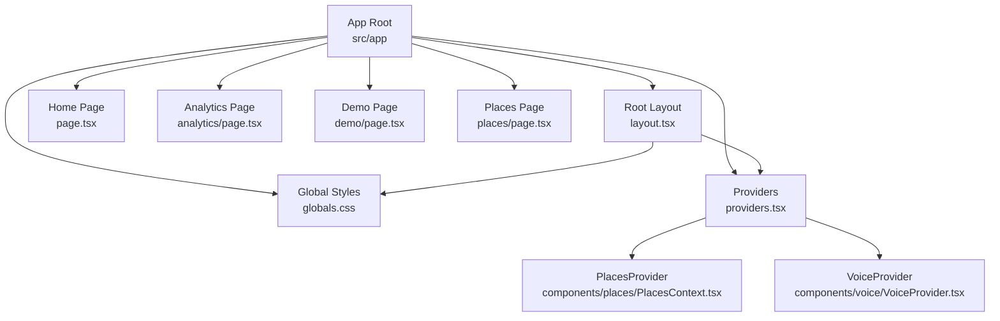
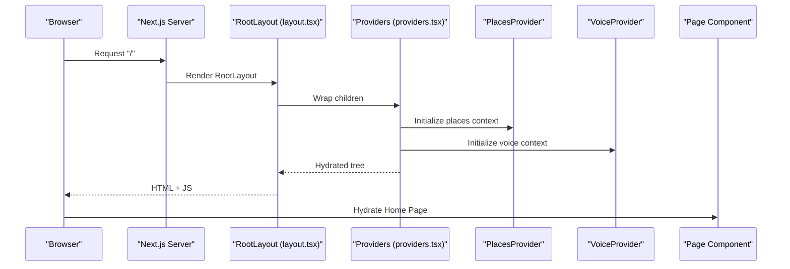
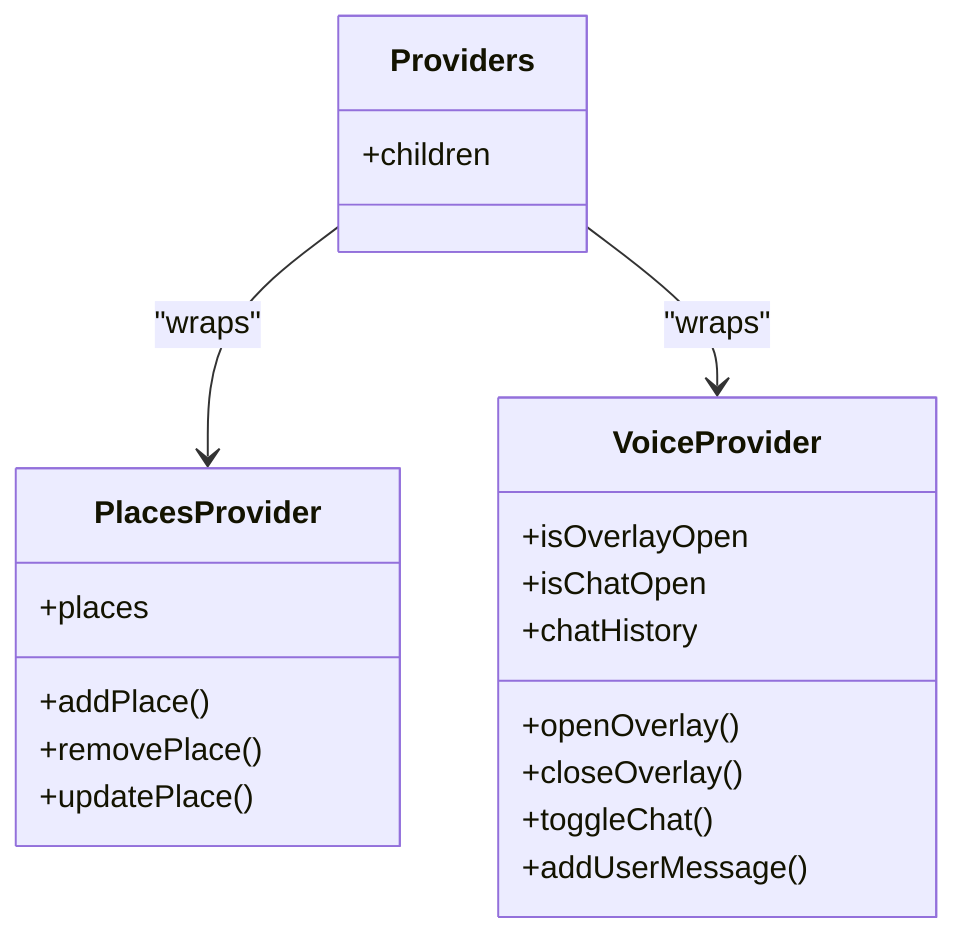
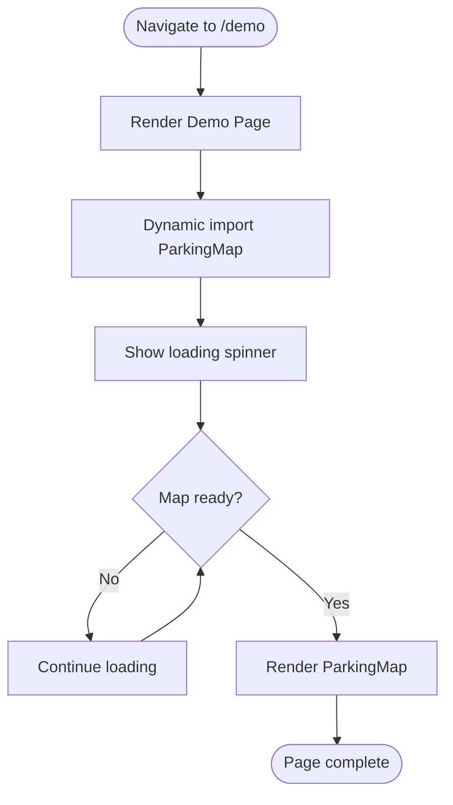
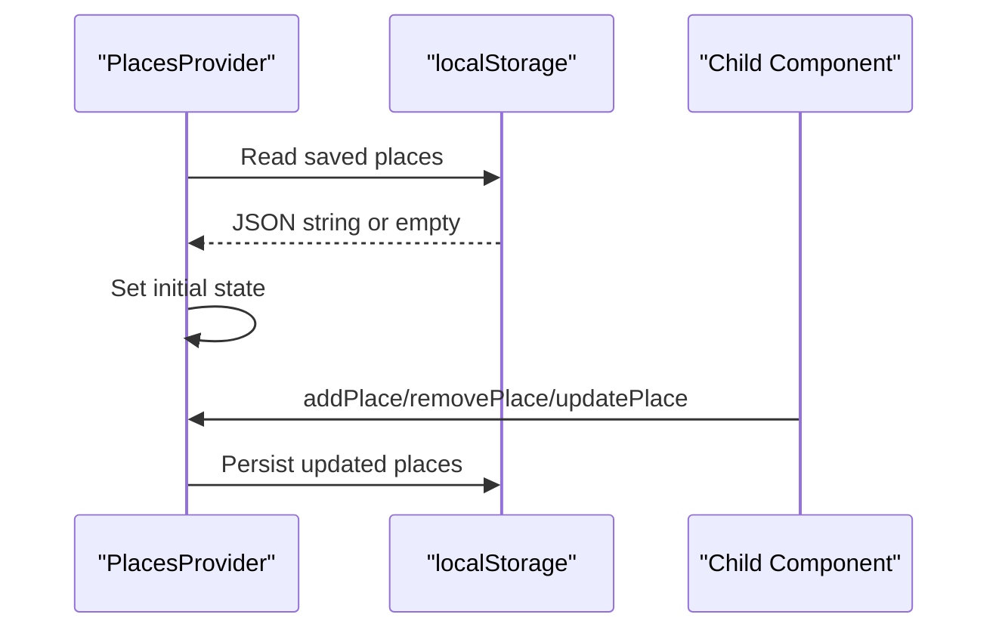
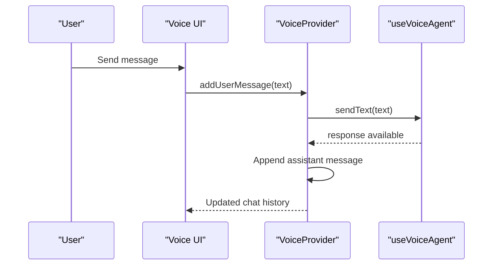
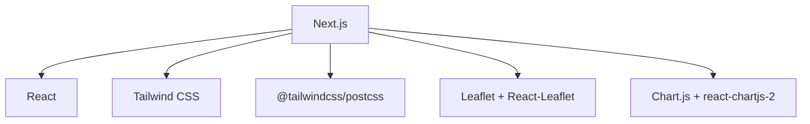

# Next.js Application Structure

<cite>
**Referenced Files in This Document**
- [layout.tsx](file://frontend/src/app/layout.tsx)
- [providers.tsx](file://frontend/src/app/providers.tsx)
- [page.tsx](file://frontend/src/app/page.tsx)
- [analytics/page.tsx](file://frontend/src/app/analytics/page.tsx)
- [demo/page.tsx](file://frontend/src/app/demo/page.tsx)
- [places/page.tsx](file://frontend/src/app/places/page.tsx)
- [globals.css](file://frontend/src/app/globals.css)
- [next.config.ts](file://frontend/next.config.ts)
- [postcss.config.mjs](file://frontend/postcss.config.mjs)
- [package.json](file://frontend/package.json)
- [tsconfig.json](file://frontend/tsconfig.json)
- [PlacesContext.tsx](file://frontend/src/components/places/PlacesContext.tsx)
- [VoiceProvider.tsx](file://frontend/src/components/voice/VoiceProvider.tsx)
</cite>

## Table of Contents
1. [Introduction](#introduction)
2. [Project Structure](#project-structure)
3. [Core Components](#core-components)
4. [Architecture Overview](#architecture-overview)
5. [Detailed Component Analysis](#detailed-component-analysis)
6. [Dependency Analysis](#dependency-analysis)
7. [Performance Considerations](#performance-considerations)
8. [Troubleshooting Guide](#troubleshooting-guide)
9. [Conclusion](#conclusion)
10. [Appendices](#appendices)

## Introduction
This document explains the SmartPark AI frontend built with Next.js App Router. It covers app router configuration, metadata management, global layout composition, Providers pattern for context and state initialization, page routing conventions (including dynamic routes), Tailwind CSS setup and custom theme variables, HTML structure, SEO and accessibility considerations, examples for adding pages and layouts, and performance optimizations such as code splitting and image optimization.

## Project Structure
The application follows the Next.js App Router conventions:
- Root layout and metadata are defined at the app root.
- Global styles and Tailwind are configured via a single CSS file imported by the root layout.
- Client-only providers wrap the application to initialize shared state.
- Pages are implemented as files under src/app, enabling file-based routing.

**Diagram sources**
- [layout.tsx:1-26](file://frontend/src/app/layout.tsx#L1-L26)
- [providers.tsx:1-15](file://frontend/src/app/providers.tsx#L1-L15)
- [page.tsx:1-34](file://frontend/src/app/page.tsx#L1-L34)
- [analytics/page.tsx:1-87](file://frontend/src/app/analytics/page.tsx#L1-L87)
- [demo/page.tsx:1-37](file://frontend/src/app/demo/page.tsx#L1-L37)
- [places/page.tsx:1-33](file://frontend/src/app/places/page.tsx#L1-L33)
- [globals.css:1-62](file://frontend/src/app/globals.css#L1-L62)
- [PlacesContext.tsx:1-77](file://frontend/src/components/places/PlacesContext.tsx#L1-L77)
- [VoiceProvider.tsx:1-110](file://frontend/src/components/voice/VoiceProvider.tsx#L1-L110)

**Section sources**
- [layout.tsx:1-26](file://frontend/src/app/layout.tsx#L1-L26)
- [providers.tsx:1-15](file://frontend/src/app/providers.tsx#L1-L15)
- [page.tsx:1-34](file://frontend/src/app/page.tsx#L1-L34)
- [analytics/page.tsx:1-87](file://frontend/src/app/analytics/page.tsx#L1-L87)
- [demo/page.tsx:1-37](file://frontend/src/app/demo/page.tsx#L1-L37)
- [places/page.tsx:1-33](file://frontend/src/app/places/page.tsx#L1-L33)
- [globals.css:1-62](file://frontend/src/app/globals.css#L1-L62)

## Core Components
- Root layout defines the HTML shell, language, base classes, imports global CSS, and wraps children with Providers. It also sets site-wide metadata for title and description.
- Providers composes multiple client-side contexts: PlacesProvider for saved places and VoiceProvider for voice/chat agent UI and logic.
- Pages implement feature-specific views using file-based routing. The home page composes landing sections; analytics shows predictions and zone stats; demo renders an interactive map; places manages user-saved locations.

Key responsibilities:
- Metadata and SEO: centralized in the root layout.
- Global styling: Tailwind + custom theme variables in globals.css.
- State orchestration: Providers layer initializes and exposes shared contexts.
- Routing: each page file maps to a URL path.

**Section sources**
- [layout.tsx:1-26](file://frontend/src/app/layout.tsx#L1-L26)
- [providers.tsx:1-15](file://frontend/src/app/providers.tsx#L1-L15)
- [page.tsx:1-34](file://frontend/src/app/page.tsx#L1-L34)
- [analytics/page.tsx:1-87](file://frontend/src/app/analytics/page.tsx#L1-L87)
- [demo/page.tsx:1-37](file://frontend/src/app/demo/page.tsx#L1-L37)
- [places/page.tsx:1-33](file://frontend/src/app/places/page.tsx#L1-L33)

## Architecture Overview
High-level architecture of the App Router entry points and provider chain:

**Diagram sources**
- [layout.tsx:1-26](file://frontend/src/app/layout.tsx#L1-L26)
- [providers.tsx:1-15](file://frontend/src/app/providers.tsx#L1-L15)
- [page.tsx:1-34](file://frontend/src/app/page.tsx#L1-L34)

## Detailed Component Analysis

### App Router Configuration and Metadata
- The root layout exports metadata for the entire site, including title and description.
- The HTML element sets language and applies utility classes for full-height layout and antialiasing.
- The body applies theme tokens and font families from Tailwind and CSS variables.

Practical implications:
- Centralized metadata ensures consistent SEO across all pages unless overridden per route.
- Language attribute supports accessibility tools and search engines.

**Section sources**
- [layout.tsx:1-26](file://frontend/src/app/layout.tsx#L1-L26)

### Global Layout Composition and Providers Pattern
- Providers composes two client contexts:
  - PlacesProvider: manages saved places with localStorage persistence and CRUD operations.
  - VoiceProvider: manages voice agent state, overlay visibility, chat history, and integrates with the voice hook.
- The root layout wraps all pages with Providers, ensuring contexts are available globally.

**Diagram sources**
- [providers.tsx:1-15](file://frontend/src/app/providers.tsx#L1-L15)
- [PlacesContext.tsx:1-77](file://frontend/src/components/places/PlacesContext.tsx#L1-L77)
- [VoiceProvider.tsx:1-110](file://frontend/src/components/voice/VoiceProvider.tsx#L1-L110)

**Section sources**
- [providers.tsx:1-15](file://frontend/src/app/providers.tsx#L1-L15)
- [PlacesContext.tsx:1-77](file://frontend/src/components/places/PlacesContext.tsx#L1-L77)
- [VoiceProvider.tsx:1-110](file://frontend/src/components/voice/VoiceProvider.tsx#L1-L110)

### Page Routing System and File-Based Conventions
- File-to-route mapping:
  - src/app/page.tsx → /
  - src/app/analytics/page.tsx → /analytics
  - src/app/demo/page.tsx → /demo
  - src/app/places/page.tsx → /places
- Dynamic routes can be added by creating folders with square brackets, e.g., src/app/places/[id]/page.tsx would map to /places/:id.

Examples:
- Adding a new static page: create src/app/about/page.tsx to expose /about.
- Adding a dynamic route: create src/app/places/[id]/page.tsx and access params.id inside the component.

**Section sources**
- [page.tsx:1-34](file://frontend/src/app/page.tsx#L1-L34)
- [analytics/page.tsx:1-87](file://frontend/src/app/analytics/page.tsx#L1-L87)
- [demo/page.tsx:1-37](file://frontend/src/app/demo/page.tsx#L1-L37)
- [places/page.tsx:1-33](file://frontend/src/app/places/page.tsx#L1-L33)

### Global CSS and Tailwind Setup
- Tailwind is imported via PostCSS plugin and included in the root CSS.
- Custom theme variables are declared inline for colors and fonts, exposing design tokens to Tailwind utilities.
- Base styles set background and text color using CSS variables.

Tailwind integration:
- PostCSS config registers the Tailwind plugin.
- Package dependencies include Tailwind v4 and its PostCSS integration.

**Section sources**
- [globals.css:1-62](file://frontend/src/app/globals.css#L1-L62)
- [postcss.config.mjs:1-8](file://frontend/postcss.config.mjs#L1-8)
- [package.json:1-32](file://frontend/package.json#L1-32)

### HTML Document Structure, SEO, and Accessibility
- HTML lang is set to English for better accessibility and SEO.
- Body uses full height and flex column to ensure proper layout behavior.
- Theme tokens and font families are applied consistently.
- Site-wide metadata includes title and description for search engines.

Accessibility tips:
- Maintain semantic elements within pages.
- Ensure sufficient color contrast using provided tokens.
- Use keyboard navigation and focus management in interactive components.

**Section sources**
- [layout.tsx:1-26](file://frontend/src/app/layout.tsx#L1-L26)
- [globals.css:1-62](file://frontend/src/app/globals.css#L1-L62)

### Code Splitting and Client-Side Rendering Patterns
- The demo page dynamically imports the map component with SSR disabled and provides a loading indicator.
- This reduces initial bundle size and defers heavy dependencies until needed.

**Diagram sources**
- [demo/page.tsx:1-37](file://frontend/src/app/demo/page.tsx#L1-L37)

**Section sources**
- [demo/page.tsx:1-37](file://frontend/src/app/demo/page.tsx#L1-L37)

### Context Management and Data Persistence
- PlacesProvider initializes state from seed data and hydrates from localStorage on mount.
- Changes persist back to localStorage after hydration completes.
- Exposes add, remove, and update operations for saved places.

**Diagram sources**
- [PlacesContext.tsx:1-77](file://frontend/src/components/places/PlacesContext.tsx#L1-L77)

**Section sources**
- [PlacesContext.tsx:1-77](file://frontend/src/components/places/PlacesContext.tsx#L1-L77)

### Voice Agent Integration
- VoiceProvider wraps useVoiceAgent hook and manages overlay and chat UI state.
- Adds messages to chat history and triggers agent responses when users send text.

**Diagram sources**
- [VoiceProvider.tsx:1-110](file://frontend/src/components/voice/VoiceProvider.tsx#L1-L110)

**Section sources**
- [VoiceProvider.tsx:1-110](file://frontend/src/components/voice/VoiceProvider.tsx#L1-L110)

## Dependency Analysis
External dependencies relevant to the frontend architecture:
- Next.js App Router and React runtime.
- Tailwind CSS and PostCSS integration for styling.
- Leaflet and React-Leaflet for interactive maps (client-side only).
- Chart.js and react-chartjs-2 for charts.

**Diagram sources**
- [package.json:1-32](file://frontend/package.json#L1-32)
- [postcss.config.mjs:1-8](file://frontend/postcss.config.mjs#L1-8)

**Section sources**
- [package.json:1-32](file://frontend/package.json#L1-32)
- [postcss.config.mjs:1-8](file://frontend/postcss.config.mjs#L1-8)

## Performance Considerations
- Code splitting: Use dynamic imports for heavy components like maps to reduce initial payload and improve Time to Interactive.
- Client-only rendering: Mark components that rely on browser APIs with 'use client' and avoid server-side execution.
- Image optimization: Prefer Next.js Image component for automatic optimization, resizing, and lazy loading.
- Fonts: Preload critical fonts and consider font-display strategies to improve perceived performance.
- Tree-shaking: Keep dependencies modular and avoid importing large libraries at the top level when not needed.

[No sources needed since this section provides general guidance]

## Troubleshooting Guide
Common issues and resolutions:
- Hydration mismatches: Ensure client-only code runs inside 'use client' components and avoid accessing window/document during SSR.
- LocalStorage errors: Guard against unavailable storage and fallback to seed data gracefully.
- Map loading failures: Provide clear loading states and handle async readiness before rendering map components.
- Tailwind variables not applied: Verify Tailwind import and @theme block presence in globals.css and correct PostCSS configuration.

**Section sources**
- [next.config.ts:1-10](file://frontend/next.config.ts#L1-L10)
- [PlacesContext.tsx:1-77](file://frontend/src/components/places/PlacesContext.tsx#L1-L77)
- [demo/page.tsx:1-37](file://frontend/src/app/demo/page.tsx#L1-L37)
- [globals.css:1-62](file://frontend/src/app/globals.css#L1-L62)
- [postcss.config.mjs:1-8](file://frontend/postcss.config.mjs#L1-8)

## Conclusion
SmartPark AI’s frontend leverages Next.js App Router for structured routing, centralized metadata, and a clean provider-based architecture for global state. Tailwind CSS with custom theme variables ensures consistent styling, while dynamic imports and client-only patterns optimize performance. Following the patterns outlined here will help you add pages, configure layouts, manage global styles, and maintain a scalable, accessible, and performant application.

[No sources needed since this section summarizes without analyzing specific files]

## Appendices

### How to Add a New Page
- Create a new file under src/app with a page.tsx export.
- Optionally define route-specific metadata if different from the root.
- Use existing Providers if your page needs shared contexts.

**Section sources**
- [page.tsx:1-34](file://frontend/src/app/page.tsx#L1-L34)
- [providers.tsx:1-15](file://frontend/src/app/providers.tsx#L1-L15)

### How to Configure a Layout
- Place a layout.tsx in any folder under src/app to scope layout and metadata to that route segment.
- Compose child layouts and pages naturally through nesting.

**Section sources**
- [layout.tsx:1-26](file://frontend/src/app/layout.tsx#L1-L26)

### Managing Global Styles
- Extend Tailwind theme variables in globals.css under the @theme inline block.
- Import Tailwind in the same file and apply base styles to body.

**Section sources**
- [globals.css:1-62](file://frontend/src/app/globals.css#L1-L62)
- [postcss.config.mjs:1-8](file://frontend/postcss.config.mjs#L1-8)

### TypeScript Path Aliases
- The project configures @/* to resolve to ./src/*, enabling clean imports throughout the codebase.

**Section sources**
- [tsconfig.json:1-35](file://frontend/tsconfig.json#L1-35)