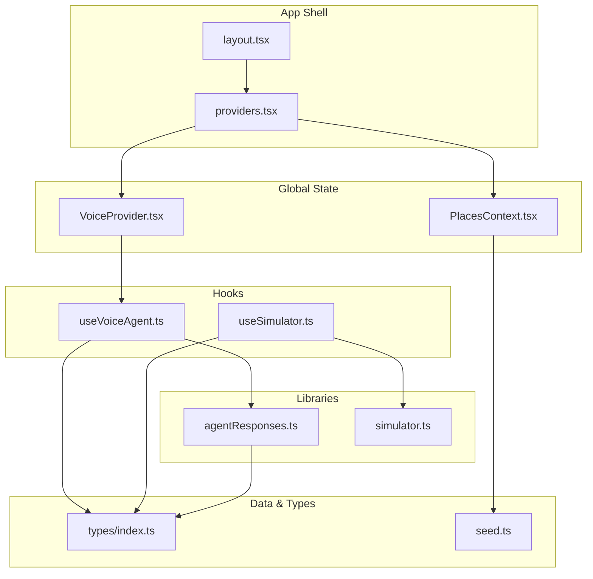
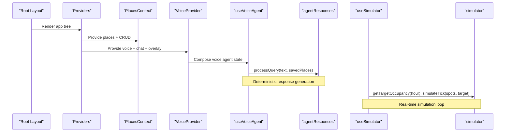
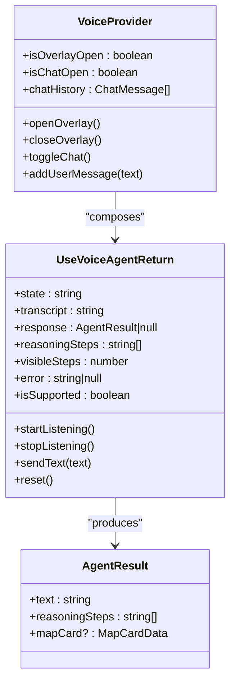
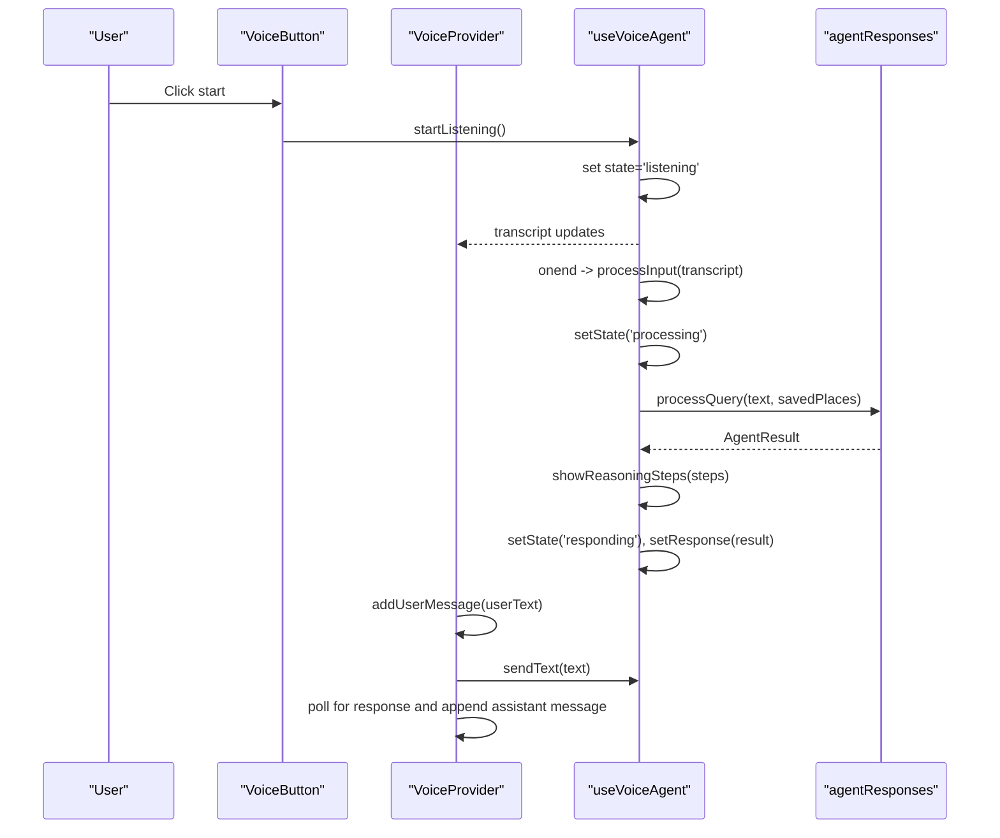
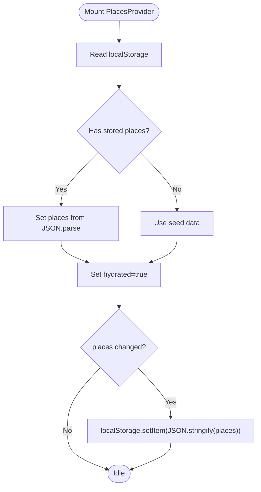
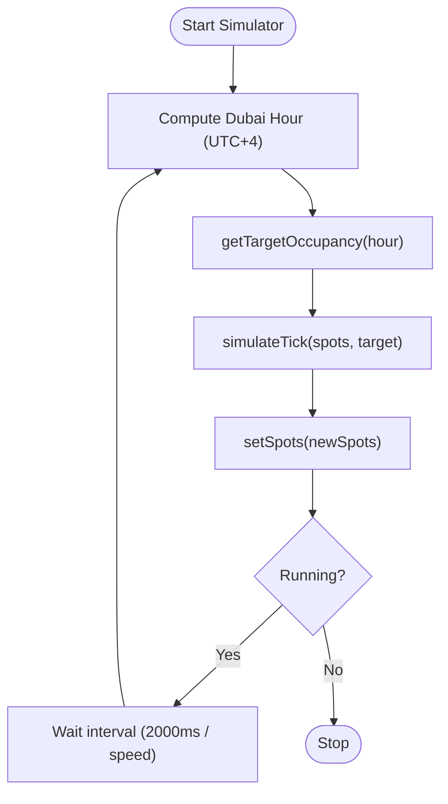
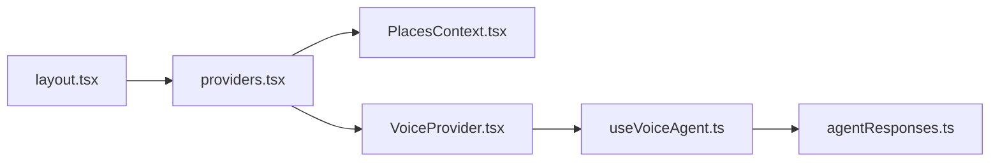
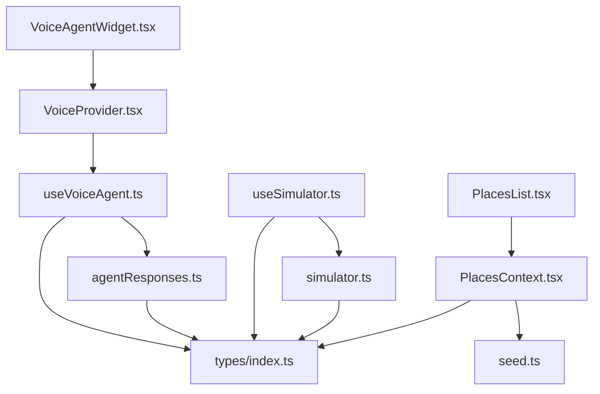

# State Management

<cite>
**Referenced Files in This Document**
- [layout.tsx](file://frontend/src/app/layout.tsx)
- [providers.tsx](file://frontend/src/app/providers.tsx)
- [VoiceProvider.tsx](file://frontend/src/components/voice/VoiceProvider.tsx)
- [useVoiceAgent.ts](file://frontend/src/hooks/useVoiceAgent.ts)
- [agentResponses.ts](file://frontend/src/lib/agentResponses.ts)
- [PlacesContext.tsx](file://frontend/src/components/places/PlacesContext.tsx)
- [useSimulator.ts](file://frontend/src/hooks/useSimulator.ts)
- [simulator.ts](file://frontend/src/lib/simulator.ts)
- [types/index.ts](file://frontend/src/types/index.ts)
- [seed.ts](file://frontend/src/data/seed.ts)
- [VoiceAgentWidget.tsx](file://frontend/src/components/voice/VoiceAgentWidget.tsx)
- [PlacesList.tsx](file://frontend/src/components/places/PlacesList.tsx)
</cite>

## Table of Contents
1. [Introduction](#introduction)
2. [Project Structure](#project-structure)
3. [Core Components](#core-components)
4. [Architecture Overview](#architecture-overview)
5. [Detailed Component Analysis](#detailed-component-analysis)
6. [Dependency Analysis](#dependency-analysis)
7. [Performance Considerations](#performance-considerations)
8. [Troubleshooting Guide](#troubleshooting-guide)
9. [Conclusion](#conclusion)

## Introduction
This document explains the SmartPark AI state management architecture with a focus on:
- Multi-layered approach using React Context for global state (VoiceProvider, PlacesContext)
- Custom hooks for local component logic and side effects (useVoiceAgent, useSimulator)
- Local storage for persistence (saved places)
- Provider pattern implementation for voice agent state, place management context, and real-time simulation state
- Hook composition patterns, dependency injection, and state synchronization strategies
- Practical examples of creating custom hooks, managing async state, and handling side effects
- Separation of concerns between different state layers and when to use each approach
- Performance considerations including memoization, selective updates, and memory management

## Project Structure
The frontend organizes state-related code across providers, hooks, libraries, types, and seed data:
- Providers at app level wrap the application tree with global contexts
- Hooks encapsulate complex logic and side effects
- Libraries implement domain-specific algorithms (agent responses, simulator)
- Types define shared contracts
- Seed data initializes default state

**Diagram sources**
- [layout.tsx:12-25](file://frontend/src/app/layout.tsx#L12-L25)
- [providers.tsx:6-14](file://frontend/src/app/providers.tsx#L6-L14)
- [VoiceProvider.tsx:39-109](file://frontend/src/components/voice/VoiceProvider.tsx#L39-L109)
- [PlacesContext.tsx:18-68](file://frontend/src/components/places/PlacesContext.tsx#L18-L68)
- [useVoiceAgent.ts:32-226](file://frontend/src/hooks/useVoiceAgent.ts#L32-L226)
- [useSimulator.ts:7-61](file://frontend/src/hooks/useSimulator.ts#L7-L61)
- [agentResponses.ts:17-130](file://frontend/src/lib/agentResponses.ts#L17-L130)
- [simulator.ts:14-72](file://frontend/src/lib/simulator.ts#L14-L72)
- [types/index.ts:1-75](file://frontend/src/types/index.ts#L1-L75)
- [seed.ts:114-137](file://frontend/src/data/seed.ts#L114-L137)

**Section sources**
- [layout.tsx:12-25](file://frontend/src/app/layout.tsx#L12-L25)
- [providers.tsx:6-14](file://frontend/src/app/providers.tsx#L6-L14)

## Core Components
- VoiceProvider: Wraps voice agent state and UI visibility; exposes chat history and overlay controls. It composes useVoiceAgent and augments it with chat and overlay state.
- PlacesContext: Provides CRUD operations for saved places and persists them to localStorage with hydration from storage.
- useVoiceAgent: Encapsulates speech recognition lifecycle, text input processing, reasoning steps animation, and response state.
- useSimulator: Manages real-time spot occupancy simulation driven by time-of-day targets and speed control.

Key responsibilities:
- Global vs local separation: Providers expose cross-cutting state; hooks encapsulate component-scoped or feature-scoped logic.
- Persistence: PlacesContext handles localStorage read/write with safe fallbacks.
- Side effects: Speech recognition timers, intervals, and cleanup are managed within hooks.

**Section sources**
- [VoiceProvider.tsx:25-109](file://frontend/src/components/voice/VoiceProvider.tsx#L25-L109)
- [PlacesContext.tsx:14-76](file://frontend/src/components/places/PlacesContext.tsx#L14-L76)
- [useVoiceAgent.ts:32-226](file://frontend/src/hooks/useVoiceAgent.ts#L32-L226)
- [useSimulator.ts:7-61](file://frontend/src/hooks/useSimulator.ts#L7-L61)

## Architecture Overview
The system uses layered state management:
- App-level providers compose multiple contexts
- Feature providers encapsulate domain state and behavior
- Hooks provide reusable logic and side effects
- Libraries implement pure functions for deterministic transformations
- Types ensure consistent contracts across layers

**Diagram sources**
- [layout.tsx:12-25](file://frontend/src/app/layout.tsx#L12-L25)
- [providers.tsx:6-14](file://frontend/src/app/providers.tsx#L6-L14)
- [PlacesContext.tsx:18-68](file://frontend/src/components/places/PlacesContext.tsx#L18-L68)
- [VoiceProvider.tsx:39-109](file://frontend/src/components/voice/VoiceProvider.tsx#L39-L109)
- [useVoiceAgent.ts:78-94](file://frontend/src/hooks/useVoiceAgent.ts#L78-L94)
- [agentResponses.ts:17-130](file://frontend/src/lib/agentResponses.ts#L17-L130)
- [useSimulator.ts:21-32](file://frontend/src/hooks/useSimulator.ts#L21-L32)
- [simulator.ts:14-72](file://frontend/src/lib/simulator.ts#L14-L72)

## Detailed Component Analysis

### VoiceProvider and useVoiceAgent Composition
VoiceProvider composes useVoiceAgent and adds:
- Overlay and chat panel visibility
- Chat history with user and assistant messages
- Safety timeouts and polling for assistant responses

useVoiceAgent manages:
- Browser speech recognition support detection
- Start/stop listening lifecycle
- Transcript accumulation and finalization
- Processing pipeline that shows reasoning steps then sets response
- Reset and cleanup of timers and recognition instances

**Diagram sources**
- [VoiceProvider.tsx:15-23](file://frontend/src/components/voice/VoiceProvider.tsx#L15-L23)
- [useVoiceAgent.ts:18-30](file://frontend/src/hooks/useVoiceAgent.ts#L18-L30)
- [agentResponses.ts:11-15](file://frontend/src/lib/agentResponses.ts#L11-L15)

**Section sources**
- [VoiceProvider.tsx:39-109](file://frontend/src/components/voice/VoiceProvider.tsx#L39-L109)
- [useVoiceAgent.ts:32-226](file://frontend/src/hooks/useVoiceAgent.ts#L32-L226)
- [agentResponses.ts:17-130](file://frontend/src/lib/agentResponses.ts#L17-L130)

#### Voice Input Flow

**Diagram sources**
- [useVoiceAgent.ts:96-178](file://frontend/src/hooks/useVoiceAgent.ts#L96-L178)
- [useVoiceAgent.ts:78-94](file://frontend/src/hooks/useVoiceAgent.ts#L78-L94)
- [agentResponses.ts:17-130](file://frontend/src/lib/agentResponses.ts#L17-L130)
- [VoiceProvider.tsx:59-91](file://frontend/src/components/voice/VoiceProvider.tsx#L59-L91)

### PlacesContext and Local Storage Persistence
PlacesContext provides:
- Initial seed data from seed.ts
- Hydration from localStorage on mount
- Persisting changes to localStorage after hydration
- CRUD operations: addPlace, removePlace, updatePlace

**Diagram sources**
- [PlacesContext.tsx:18-43](file://frontend/src/components/places/PlacesContext.tsx#L18-L43)
- [seed.ts:114-137](file://frontend/src/data/seed.ts#L114-L137)

**Section sources**
- [PlacesContext.tsx:18-76](file://frontend/src/components/places/PlacesContext.tsx#L18-L76)
- [seed.ts:114-137](file://frontend/src/data/seed.ts#L114-L137)

### useSimulator and Real-Time Simulation
useSimulator drives periodic updates to spot states based on time-of-day occupancy profiles:
- Computes Dubai local hour (UTC+4)
- Determines target occupancy via simulator.getTargetOccupancy
- Applies simulateTick to mutate spots toward target
- Supports dynamic speed changes and interval restarts

**Diagram sources**
- [useSimulator.ts:21-32](file://frontend/src/hooks/useSimulator.ts#L21-L32)
- [simulator.ts:14-72](file://frontend/src/lib/simulator.ts#L14-L72)

**Section sources**
- [useSimulator.ts:7-61](file://frontend/src/hooks/useSimulator.ts#L7-L61)
- [simulator.ts:14-72](file://frontend/src/lib/simulator.ts#L14-L72)

### Provider Composition and Dependency Injection
At the app root, Providers composes both contexts:
- PlacesProvider wraps VoiceProvider
- VoiceAgentWidget can also wrap its own VoiceProvider for isolated usage

**Diagram sources**
- [layout.tsx:12-25](file://frontend/src/app/layout.tsx#L12-L25)
- [providers.tsx:6-14](file://frontend/src/app/providers.tsx#L6-L14)
- [VoiceAgentWidget.tsx:13-21](file://frontend/src/components/voice/VoiceAgentWidget.tsx#L13-L21)

**Section sources**
- [layout.tsx:12-25](file://frontend/src/app/layout.tsx#L12-L25)
- [providers.tsx:6-14](file://frontend/src/app/providers.tsx#L6-L14)
- [VoiceAgentWidget.tsx:13-21](file://frontend/src/components/voice/VoiceAgentWidget.tsx#L13-L21)

### Hook Composition Patterns and State Synchronization
- Composition: VoiceProvider composes useVoiceAgent and augments it with UI state and chat history.
- Synchronization:
  - PlacesContext synchronizes in-memory state with localStorage via useEffect watchers.
  - useSimulator synchronizes UI state with computed targets and tick mutations.
  - VoiceProvider polls for assistant responses and appends to chat history.

Practical examples:
- Creating custom hooks: useVoiceAgent encapsulates speech recognition and processing; useSimulator encapsulates interval-based simulation.
- Managing async state: useVoiceAgent transitions through idle/listening/processing/responding/error states and manages timers.
- Handling side effects: cleanup of intervals and recognition instances is performed in effect return functions.

**Section sources**
- [VoiceProvider.tsx:39-109](file://frontend/src/components/voice/VoiceProvider.tsx#L39-L109)
- [useVoiceAgent.ts:203-211](file://frontend/src/hooks/useVoiceAgent.ts#L203-L211)
- [useSimulator.ts:39-58](file://frontend/src/hooks/useSimulator.ts#L39-L58)
- [PlacesContext.tsx:35-43](file://frontend/src/components/places/PlacesContext.tsx#L35-L43)

### Separation of Concerns and When to Use Each Approach
- Use React Context for global state that must be accessed across many components (e.g., places list, voice widget).
- Use custom hooks for feature-specific logic and side effects (e.g., speech recognition, simulation loops).
- Use local storage for persistent user preferences or entities (e.g., saved places).
- Keep pure transformation logic in libraries (e.g., agentResponses, simulator) to maintain determinism and testability.

Guidelines:
- Prefer hooks for encapsulating asynchronous flows and resource lifecycles.
- Use providers to expose minimal APIs to consumers while hiding internal complexity.
- Avoid deep nesting of providers; keep provider boundaries clear and cohesive.

[No sources needed since this section provides general guidance]

## Dependency Analysis
The following diagram maps key dependencies among state-related modules:

**Diagram sources**
- [VoiceProvider.tsx:39-109](file://frontend/src/components/voice/VoiceProvider.tsx#L39-L109)
- [useVoiceAgent.ts:32-226](file://frontend/src/hooks/useVoiceAgent.ts#L32-L226)
- [agentResponses.ts:17-130](file://frontend/src/lib/agentResponses.ts#L17-L130)
- [PlacesContext.tsx:18-76](file://frontend/src/components/places/PlacesContext.tsx#L18-L76)
- [useSimulator.ts:7-61](file://frontend/src/hooks/useSimulator.ts#L7-L61)
- [simulator.ts:14-72](file://frontend/src/lib/simulator.ts#L14-L72)
- [types/index.ts:1-75](file://frontend/src/types/index.ts#L1-L75)
- [seed.ts:114-137](file://frontend/src/data/seed.ts#L114-L137)
- [PlacesList.tsx:34-96](file://frontend/src/components/places/PlacesList.tsx#L34-L96)
- [VoiceAgentWidget.tsx:13-21](file://frontend/src/components/voice/VoiceAgentWidget.tsx#L13-L21)

**Section sources**
- [VoiceProvider.tsx:39-109](file://frontend/src/components/voice/VoiceProvider.tsx#L39-L109)
- [useVoiceAgent.ts:32-226](file://frontend/src/hooks/useVoiceAgent.ts#L32-L226)
- [PlacesContext.tsx:18-76](file://frontend/src/components/places/PlacesContext.tsx#L18-L76)
- [useSimulator.ts:7-61](file://frontend/src/hooks/useSimulator.ts#L7-L61)

## Performance Considerations
- Memoization:
  - VoiceProvider uses useCallback for open/close/toggle/addUserMessage to avoid unnecessary re-renders.
  - useVoiceAgent uses useCallback for critical handlers like startListening, stopListening, sendText, reset, and showReasoningSteps.
  - useSimulator uses useCallback for start, stop, setSpeed to stabilize interval dependencies.
- Selective Updates:
  - Consumers should subscribe only to necessary fields from contexts/hooks to minimize re-renders.
  - For large lists (e.g., places), consider memoizing derived values and stable keys.
- Memory Management:
  - Clear intervals and timers in cleanup functions to prevent leaks (useVoiceAgent, useSimulator).
  - Stop speech recognition on unmount/reset to release resources.
- Deterministic Transformations:
  - Keep heavy computations in pure library functions (agentResponses, simulator) to enable caching and testing.
- Hydration Strategy:
  - PlacesContext hydrates once and then persists changes; guard writes until hydration completes to avoid double-persistence.

[No sources needed since this section provides general guidance]

## Troubleshooting Guide
Common issues and resolutions:
- Speech recognition not supported:
  - The hook checks browser support and sets error state accordingly. Ensure HTTPS and modern browsers.
- No speech detected:
  - The hook resets to idle on no-speech errors; prompt users to retry.
- Response not appended to chat:
  - VoiceProvider polls for response; verify timeout and polling logic. Ensure sendText is called and response becomes available.
- LocalStorage unavailable:
  - PlacesContext catches exceptions and falls back to seed data; check environment permissions.
- Simulation not updating:
  - Verify isRunning and currentSpeed; ensure interval is restarted when speed changes.

**Section sources**
- [useVoiceAgent.ts:147-165](file://frontend/src/hooks/useVoiceAgent.ts#L147-L165)
- [useVoiceAgent.ts:203-211](file://frontend/src/hooks/useVoiceAgent.ts#L203-L211)
- [VoiceProvider.tsx:73-88](file://frontend/src/components/voice/VoiceProvider.tsx#L73-L88)
- [PlacesContext.tsx:23-43](file://frontend/src/components/places/PlacesContext.tsx#L23-L43)
- [useSimulator.ts:39-58](file://frontend/src/hooks/useSimulator.ts#L39-L58)

## Conclusion
SmartPark AI’s state management leverages a layered architecture:
- Providers deliver global state and UI orchestration
- Hooks encapsulate complex logic and side effects
- Libraries implement deterministic transformations
- Local storage ensures persistence for user data

This design promotes clarity, testability, and performance. By adhering to separation of concerns, careful memoization, and robust cleanup, the system remains scalable and maintainable.