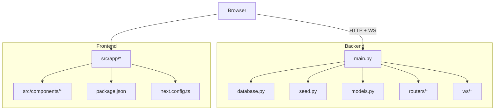
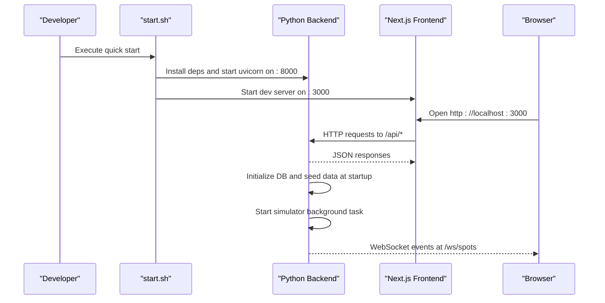
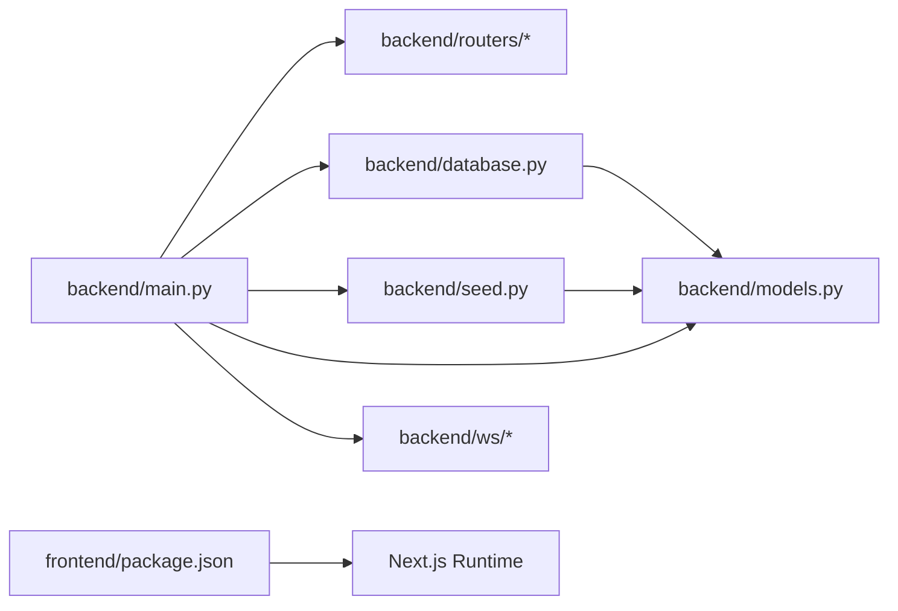

# Getting Started

<cite>
**Referenced Files in This Document**
- [README.md](file://README.md)
- [start.sh](file://start.sh)
- [backend/requirements.txt](file://backend/requirements.txt)
- [backend/main.py](file://backend/main.py)
- [backend/database.py](file://backend/database.py)
- [backend/seed.py](file://backend/seed.py)
- [backend/models.py](file://backend/models.py)
- [frontend/package.json](file://frontend/package.json)
- [frontend/next.config.ts](file://frontend/next.config.ts)
</cite>

## Table of Contents
1. Introduction
2. Project Structure
3. Core Components
4. Architecture Overview
5. Detailed Component Analysis
6. Dependency Analysis
7. Performance Considerations
8. Troubleshooting Guide
9. Conclusion

## Introduction
SmartPark AI is an AI-powered smart parking solution for Dubai Internet City, providing real-time spot availability, predictive occupancy, and intelligent navigation. The application consists of a FastAPI backend with SQLite and WebSockets, and a Next.js frontend with React and Leaflet maps.

This guide helps you get SmartPark AI running quickly using the automated script or by setting up each component manually. It covers prerequisites, installation steps, environment configuration, database seeding, server startup, verification, and troubleshooting.

## Project Structure
The repository is organized into two main parts:
- Backend (FastAPI): API endpoints, WebSocket support, database initialization, data seeding, and background simulation.
- Frontend (Next.js): Interactive UI for map visualization, predictions, and agent interactions.

**Diagram sources**
- [backend/main.py:1-64](file://backend/main.py#L1-L64)
- [backend/database.py:1-23](file://backend/database.py#L1-L23)
- [backend/seed.py:1-198](file://backend/seed.py#L1-L198)
- [backend/models.py:1-89](file://backend/models.py#L1-L89)
- [frontend/package.json:1-32](file://frontend/package.json#L1-L32)
- [frontend/next.config.ts:1-10](file://frontend/next.config.ts#L1-L10)

**Section sources**
- [README.md:1-47](file://README.md#L1-L47)

## Core Components
- Backend entrypoint and lifecycle: Initializes the database, seeds demo data, starts a simulator task, registers routers, and exposes a WebSocket endpoint.
- Database layer: Async SQLAlchemy engine and session factory; default SQLite file-based database via environment variable.
- Data models: Zones, Spots, Sensors, Saved Places, Predictions, and Park Events.
- Seeding script: Populates zones, spots, sensors, saved places, and prediction records if the database is empty.
- Frontend: Next.js app with React components, charts, and Leaflet maps; development server runs on port 3000.

Key URLs after setup:
- Frontend: http://localhost:3000
- Backend API: http://localhost:8000
- Interactive API docs: http://localhost:8000/docs

**Section sources**
- [backend/main.py:13-64](file://backend/main.py#L13-L64)
- [backend/database.py:1-23](file://backend/database.py#L1-L23)
- [backend/models.py:7-89](file://backend/models.py#L7-L89)
- [backend/seed.py:126-198](file://backend/seed.py#L126-L198)
- [frontend/package.json:1-32](file://frontend/package.json#L1-L32)
- [README.md:33-40](file://README.md#L33-L40)

## Architecture Overview
The system follows a simple client-server architecture with real-time updates over WebSockets.

**Diagram sources**
- [start.sh:1-26](file://start.sh#L1-L26)
- [backend/main.py:13-64](file://backend/main.py#L13-L64)
- [backend/database.py:15-18](file://backend/database.py#L15-L18)
- [backend/seed.py:126-198](file://backend/seed.py#L126-L198)

## Detailed Component Analysis

### Quick Start (Automated)
Use the provided script to install dependencies and run both services in one step.

Steps:
- Make the script executable and run it from the repository root.
- The script installs backend dependencies, starts the backend on port 8000, and starts the frontend dev server on port 3000.
- Access the frontend, backend API, and interactive API documentation at the listed URLs.

Notes:
- The script uses pip to install backend requirements and npm to run the frontend dev server.
- If ports are already in use, stop the conflicting processes or adjust ports before running.

**Section sources**
- [README.md:5-12](file://README.md#L5-L12)
- [start.sh:1-26](file://start.sh#L1-L26)
- [README.md:33-40](file://README.md#L33-L40)

### Manual Setup

#### Prerequisites
- Python 3.x with pip available
- Node.js compatible with Next.js 16 (recommended v18+ or v20+)
- npm installed (or yarn/pnpm/bun)
- A terminal with bash-like shell for the quick start script

Verification:
- Confirm Python and pip versions.
- Confirm Node.js and npm versions.

[No sources needed since this section provides general guidance]

#### Backend Setup
1. Create and activate a virtual environment (recommended).
2. Install backend dependencies from requirements.
3. Seed the database to populate demo data.
4. Start the FastAPI server with Uvicorn on port 8000.

Details:
- The backend initializes the database and seeds data during startup if not already present.
- The default database is a local SQLite file unless DATABASE_URL is set.

Commands:
- Create virtual environment and install dependencies.
- Seed the database.
- Start the server.

Access:
- Backend API: http://localhost:8000
- Interactive API docs: http://localhost:8000/docs

**Section sources**
- [backend/requirements.txt:1-8](file://backend/requirements.txt#L1-L8)
- [backend/database.py:5-8](file://backend/database.py#L5-L8)
- [backend/main.py:13-22](file://backend/main.py#L13-L22)
- [backend/seed.py:126-198](file://backend/seed.py#L126-L198)
- [README.md:14-23](file://README.md#L14-L23)

#### Frontend Setup
1. Navigate to the frontend directory.
2. Install dependencies using npm.
3. Start the development server.

Details:
- The frontend runs on port 3000 by default.
- Leaflet usage requires client-side rendering; the project config enables strict mode and relies on dynamic imports where necessary.

Commands:
- Install dependencies.
- Run the development server.

Access:
- Frontend: http://localhost:3000

**Section sources**
- [frontend/package.json:1-32](file://frontend/package.json#L1-L32)
- [frontend/next.config.ts:1-10](file://frontend/next.config.ts#L1-L10)
- [README.md:25-31](file://README.md#L25-L31)

### Environment Configuration
- Backend database URL: Configurable via DATABASE_URL; defaults to a local SQLite file if not set.
- CORS: Enabled for all origins in development for convenience.
- Frontend: No special proxy configuration is required for local development; the frontend calls the backend on localhost:8000.

**Section sources**
- [backend/database.py:5-8](file://backend/database.py#L5-L8)
- [backend/main.py:40-47](file://backend/main.py#L40-L47)

### Verification Steps
After starting both services:
- Open http://localhost:3000 to verify the frontend loads.
- Open http://localhost:8000 to verify the backend responds.
- Open http://localhost:8000/docs to view interactive API documentation.
- Interact with the map and features to confirm basic functionality.

**Section sources**
- [README.md:33-40](file://README.md#L33-L40)

## Dependency Analysis
The following diagram shows key runtime dependencies between core modules.

**Diagram sources**
- [backend/main.py:1-64](file://backend/main.py#L1-L64)
- [backend/database.py:1-23](file://backend/database.py#L1-L23)
- [backend/seed.py:1-198](file://backend/seed.py#L1-L198)
- [backend/models.py:1-89](file://backend/models.py#L1-L89)
- [frontend/package.json:1-32](file://frontend/package.json#L1-L32)

**Section sources**
- [backend/requirements.txt:1-8](file://backend/requirements.txt#L1-L8)
- [frontend/package.json:1-32](file://frontend/package.json#L1-L32)

## Performance Considerations
- Use a virtual environment for Python to avoid conflicts and speed up dependency resolution.
- Keep the SQLite database on a fast disk for responsive queries during development.
- For production, consider replacing SQLite with a robust database and tuning Uvicorn workers accordingly.
- Avoid unnecessary re-seeding; the seed logic skips when data exists.

[No sources needed since this section provides general guidance]

## Troubleshooting Guide
Common issues and resolutions:
- Port conflicts:
  - If port 8000 or 3000 is already in use, stop the conflicting process or change the port in the startup commands.
- Python dependency errors:
  - Ensure pip is available and your virtual environment is activated. Reinstall dependencies if needed.
- Node.js version mismatch:
  - Use a Node.js version compatible with Next.js 16 (v18+ or v20+ recommended). Upgrade or switch versions if installation fails.
- Database not seeded:
  - Run the seed command once to populate demo data. Subsequent startups will skip seeding automatically.
- Frontend cannot reach backend:
  - Verify the backend is running on http://localhost:8000 and that CORS is enabled in development.

Verification checklist:
- Backend responds at http://localhost:8000.
- API docs load at http://localhost:8000/docs.
- Frontend loads at http://localhost:3000 and can fetch data from the backend.

**Section sources**
- [start.sh:1-26](file://start.sh#L1-L26)
- [backend/main.py:40-47](file://backend/main.py#L40-L47)
- [backend/seed.py:126-198](file://backend/seed.py#L126-L198)
- [README.md:33-40](file://README.md#L33-L40)

## Conclusion
You can launch SmartPark AI quickly with the automated script or set up each component manually. The backend initializes the database, seeds demo data, and serves APIs and WebSocket updates. The frontend provides an interactive experience on port 3000. Follow the troubleshooting tips if you encounter common setup issues, and verify functionality using the provided URLs.

[No sources needed since this section summarizes without analyzing specific files]