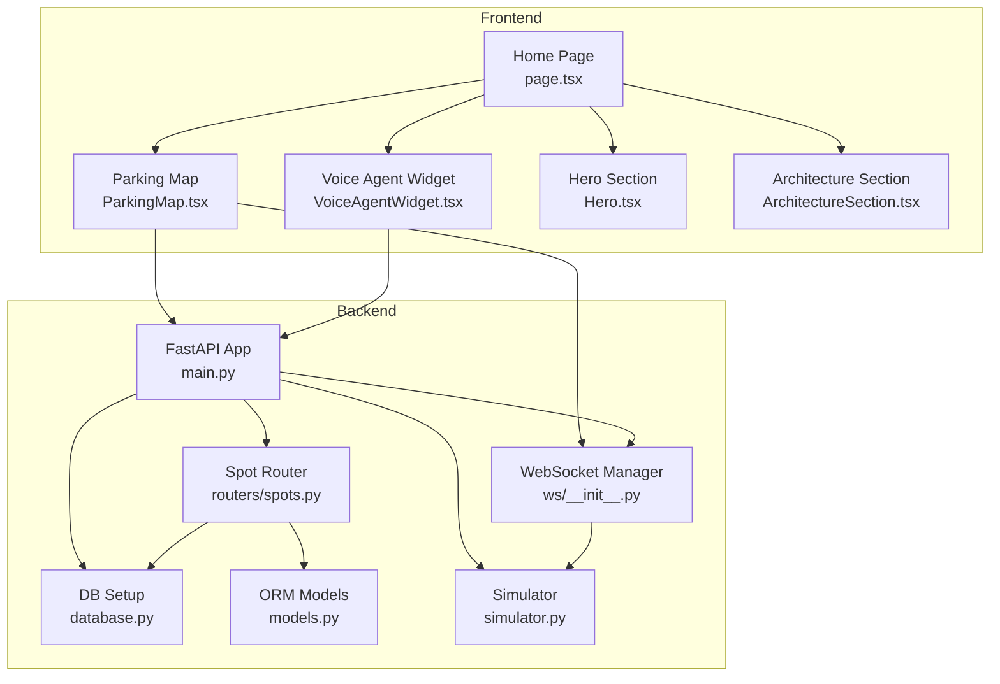
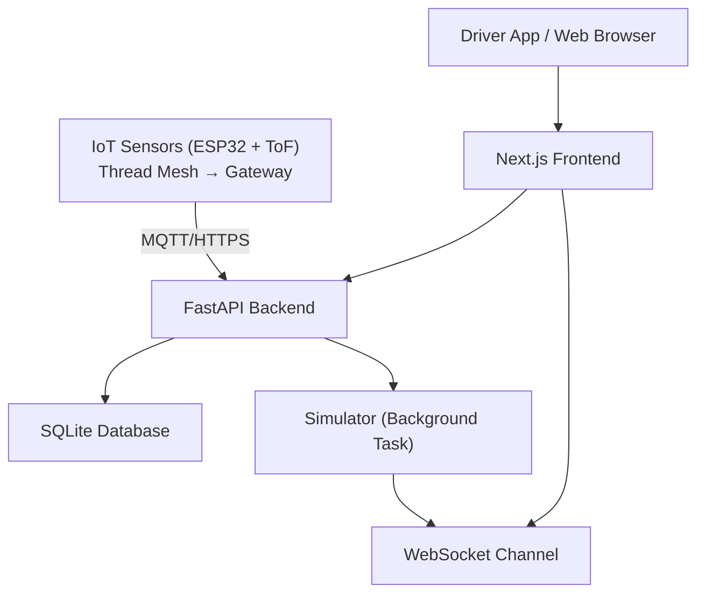
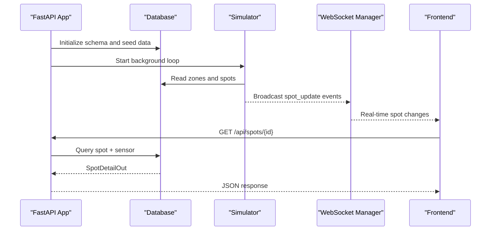
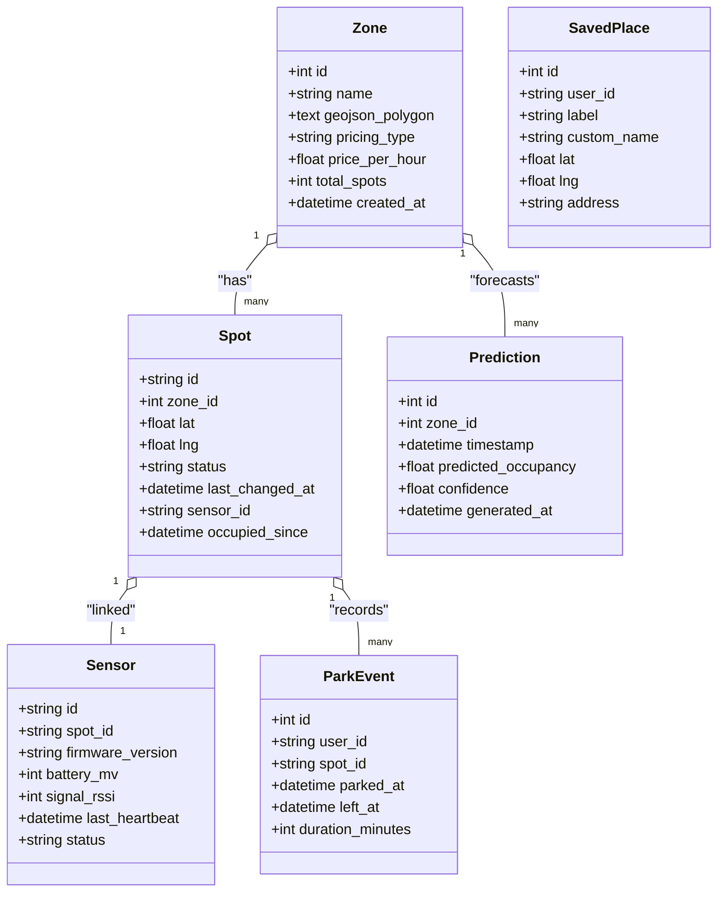
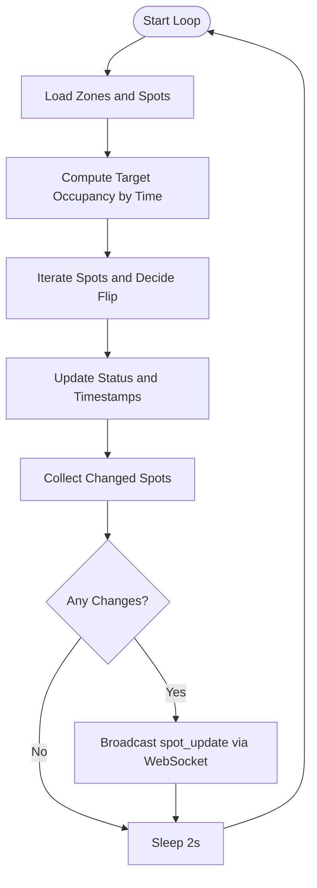
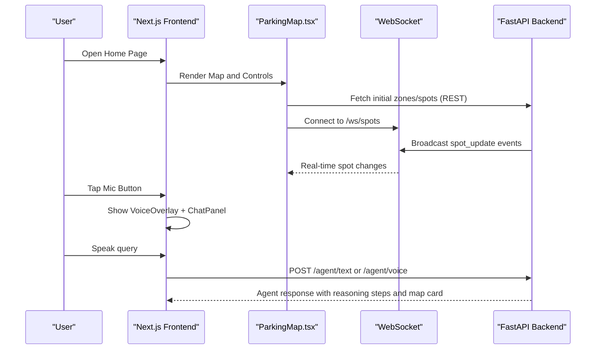
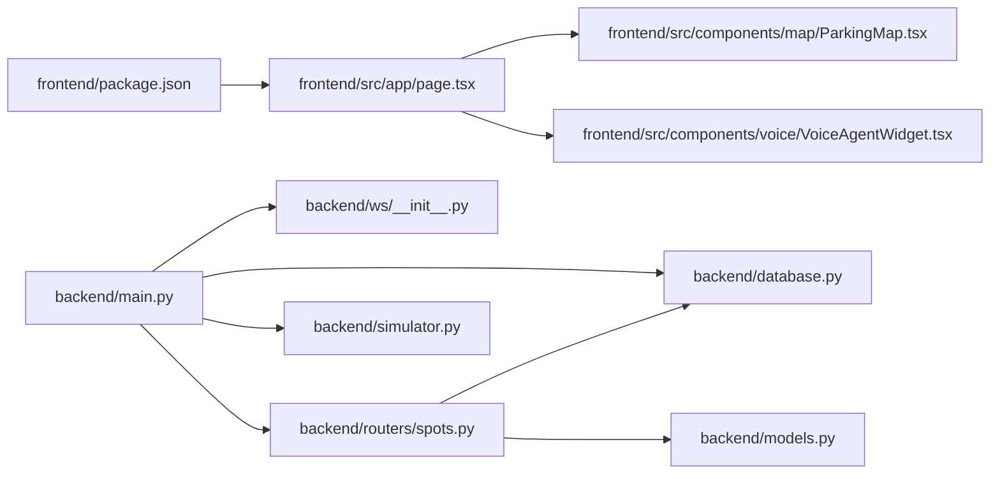

# Project Overview

<cite>
**Referenced Files in This Document**
- [README.md](file://README.md)
- [smartpark-handoff.md](file://smartpark-handoff.md)
- [backend/main.py](file://backend/main.py)
- [backend/database.py](file://backend/database.py)
- [backend/models.py](file://backend/models.py)
- [backend/schemas.py](file://backend/schemas.py)
- [backend/routers/spots.py](file://backend/routers/spots.py)
- [backend/ws/__init__.py](file://backend/ws/__init__.py)
- [backend/simulator.py](file://backend/simulator.py)
- [frontend/package.json](file://frontend/package.json)
- [frontend/src/app/page.tsx](file://frontend/src/app/page.tsx)
- [frontend/src/components/landing/Hero.tsx](file://frontend/src/components/landing/Hero.tsx)
- [frontend/src/components/landing/ArchitectureSection.tsx](file://frontend/src/components/landing/ArchitectureSection.tsx)
- [frontend/src/components/map/ParkingMap.tsx](file://frontend/src/components/map/ParkingMap.tsx)
- [frontend/src/components/voice/VoiceAgentWidget.tsx](file://frontend/src/components/voice/VoiceAgentWidget.tsx)
</cite>

## Table of Contents
1. Introduction
2. Project Structure
3. Core Components
4. Architecture Overview
5. Detailed Component Analysis
6. Dependency Analysis
7. Performance Considerations
8. Troubleshooting Guide
9. Conclusion

## Introduction
SmartPark AI is an AI-powered smart parking solution for the UAE, focused on Dubai Internet City. It combines real-time IoT sensor data with predictive analytics and a voice assistant to deliver:
- Real-time spot availability tracking
- Predictive occupancy forecasting
- Intelligent navigation to the best free spots
- Solar-powered IoT sensor integration

The system bridges the gap between zone-level information and individual spot visibility, enabling drivers to find and navigate to specific free parking bays quickly and efficiently.

## Project Structure
The project is organized into two primary layers:
- Frontend (Next.js): Marketing/demo site, interactive map, voice agent UI, and prediction visualizations
- Backend (FastAPI): REST APIs, WebSocket broadcasting, database models, and a simulator that drives realistic spot updates

**Diagram sources**
- [frontend/src/app/page.tsx:1-34](file://frontend/src/app/page.tsx#L1-L34)
- [frontend/src/components/map/ParkingMap.tsx:1-108](file://frontend/src/components/map/ParkingMap.tsx#L1-L108)
- [frontend/src/components/voice/VoiceAgentWidget.tsx:1-22](file://frontend/src/components/voice/VoiceAgentWidget.tsx#L1-L22)
- [frontend/src/components/landing/Hero.tsx:1-94](file://frontend/src/components/landing/Hero.tsx#L1-L94)
- [frontend/src/components/landing/ArchitectureSection.tsx:1-57](file://frontend/src/components/landing/ArchitectureSection.tsx#L1-L57)
- [backend/main.py:1-64](file://backend/main.py#L1-L64)
- [backend/ws/__init__.py:1-49](file://backend/ws/__init__.py#L1-L49)
- [backend/routers/spots.py:1-42](file://backend/routers/spots.py#L1-L42)
- [backend/database.py:1-23](file://backend/database.py#L1-L23)
- [backend/models.py:1-89](file://backend/models.py#L1-L89)
- [backend/simulator.py:1-105](file://backend/simulator.py#L1-L105)

**Section sources**
- [README.md:1-47](file://README.md#L1-L47)
- [frontend/package.json:1-32](file://frontend/package.json#L1-L32)
- [frontend/src/app/page.tsx:1-34](file://frontend/src/app/page.tsx#L1-L34)

## Core Components
- FastAPI application lifecycle initializes the database, seeds data, and starts the background simulator that periodically updates spot statuses and broadcasts changes via WebSocket.
- WebSocket manager maintains active connections and broadcasts real-time spot updates to all clients.
- Spot router exposes endpoints to retrieve spot details including associated sensor telemetry.
- Database layer uses async SQLAlchemy with SQLite for local development and demo.
- ORM models define entities such as Zone, Spot, Sensor, SavedPlace, Prediction, and ParkEvent.
- Simulator implements time-of-day occupancy profiles for Dubai and probabilistically transitions spot states, emitting updates through the WebSocket channel.
- Frontend pages render the landing experience, interactive map, and voice agent widget; the map integrates Leaflet markers and polygons for zones and spots.

Key capabilities demonstrated:
- Real-time spot availability tracking via WebSocket
- Predictive occupancy forecasting (data model and charting components)
- Intelligent navigation (map-based selection and external maps integration)
- Solar-powered IoT sensor integration (hardware concept and sensor entity modeling)

**Section sources**
- [backend/main.py:1-64](file://backend/main.py#L1-L64)
- [backend/ws/__init__.py:1-49](file://backend/ws/__init__.py#L1-L49)
- [backend/routers/spots.py:1-42](file://backend/routers/spots.py#L1-L42)
- [backend/database.py:1-23](file://backend/database.py#L1-L23)
- [backend/models.py:1-89](file://backend/models.py#L1-L89)
- [backend/simulator.py:1-105](file://backend/simulator.py#L1-L105)
- [frontend/src/components/map/ParkingMap.tsx:1-108](file://frontend/src/components/map/ParkingMap.tsx#L1-L108)
- [frontend/src/components/voice/VoiceAgentWidget.tsx:1-22](file://frontend/src/components/voice/VoiceAgentWidget.tsx#L1-L22)

## Architecture Overview
High-level architecture connects frontend, backend, database, and IoT devices:
- Frontend (Next.js) renders the marketing site, interactive map, and voice agent UI
- Backend (FastAPI) provides REST endpoints and WebSocket streaming
- Database (SQLite) persists zones, spots, sensors, predictions, and user places
- IoT devices (ESP32-C6 + VL53L1X ToF sensors) report presence over a Thread mesh to a gateway and cloud platform (conceptual)

**Diagram sources**
- [backend/main.py:1-64](file://backend/main.py#L1-L64)
- [backend/ws/__init__.py:1-49](file://backend/ws/__init__.py#L1-L49)
- [backend/database.py:1-23](file://backend/database.py#L1-L23)
- [backend/simulator.py:1-105](file://backend/simulator.py#L1-L105)
- [smartpark-handoff.md:252-312](file://smartpark-handoff.md#L252-L312)

## Detailed Component Analysis

### Backend Application Lifecycle and Routers
- The FastAPI app sets up CORS, includes routers for zones, spots, predictions, agents, places, and sensors, and mounts the WebSocket endpoint.
- On startup, it initializes the database, seeds data, and launches the simulator as a background task.
- The root endpoint returns service status and version.

**Diagram sources**
- [backend/main.py:1-64](file://backend/main.py#L1-L64)
- [backend/simulator.py:1-105](file://backend/simulator.py#L1-L105)
- [backend/ws/__init__.py:1-49](file://backend/ws/__init__.py#L1-L49)
- [backend/routers/spots.py:1-42](file://backend/routers/spots.py#L1-L42)
- [backend/database.py:1-23](file://backend/database.py#L1-L23)

**Section sources**
- [backend/main.py:1-64](file://backend/main.py#L1-L64)
- [backend/routers/spots.py:1-42](file://backend/routers/spots.py#L1-L42)

### Data Model and Schemas
- Entities include Zone, Spot, Sensor, SavedPlace, Prediction, and ParkEvent.
- Pydantic schemas define output structures for API responses, including spot detail with optional sensor info and agent-related payloads.

**Diagram sources**
- [backend/models.py:1-89](file://backend/models.py#L1-L89)
- [backend/schemas.py:1-127](file://backend/schemas.py#L1-L127)

**Section sources**
- [backend/models.py:1-89](file://backend/models.py#L1-L89)
- [backend/schemas.py:1-127](file://backend/schemas.py#L1-L127)

### Real-Time Updates and Simulation
- The simulator computes target occupancy based on Dubai time-of-day profiles and probabilistically flips spot states toward the target.
- Changed spots are collected and broadcast via WebSocket to connected clients.
- The WebSocket manager accepts connections, handles pings, and removes disconnected clients.

**Diagram sources**
- [backend/simulator.py:1-105](file://backend/simulator.py#L1-L105)
- [backend/ws/__init__.py:1-49](file://backend/ws/__init__.py#L1-L49)

**Section sources**
- [backend/simulator.py:1-105](file://backend/simulator.py#L1-L105)
- [backend/ws/__init__.py:1-49](file://backend/ws/__init__.py#L1-L49)

### Frontend Experience and Voice Assistant
- The home page composes sections including Hero, Problem, Interactive Demo, Agent, Hardware, Architecture, Tech Stack, and Footer.
- The interactive map centers on Dubai Internet City, renders zone polygons and spot markers, and supports simulation controls.
- The voice agent widget provides a floating mic button, overlay, and chat panel for conversational queries.

**Diagram sources**
- [frontend/src/app/page.tsx:1-34](file://frontend/src/app/page.tsx#L1-L34)
- [frontend/src/components/map/ParkingMap.tsx:1-108](file://frontend/src/components/map/ParkingMap.tsx#L1-L108)
- [frontend/src/components/voice/VoiceAgentWidget.tsx:1-22](file://frontend/src/components/voice/VoiceAgentWidget.tsx#L1-L22)
- [backend/main.py:1-64](file://backend/main.py#L1-L64)

**Section sources**
- [frontend/src/app/page.tsx:1-34](file://frontend/src/app/page.tsx#L1-L34)
- [frontend/src/components/landing/Hero.tsx:1-94](file://frontend/src/components/landing/Hero.tsx#L1-L94)
- [frontend/src/components/landing/ArchitectureSection.tsx:1-57](file://frontend/src/components/landing/ArchitectureSection.tsx#L1-L57)
- [frontend/src/components/map/ParkingMap.tsx:1-108](file://frontend/src/components/map/ParkingMap.tsx#L1-L108)
- [frontend/src/components/voice/VoiceAgentWidget.tsx:1-22](file://frontend/src/components/voice/VoiceAgentWidget.tsx#L1-L22)

## Dependency Analysis
- Frontend dependencies include Next.js, React, Leaflet, Chart.js, and Tailwind CSS.
- Backend depends on FastAPI, SQLAlchemy async engine, and asyncio for background tasks.
- The main application wires routers, WebSocket endpoint, and lifespan hooks together.

**Diagram sources**
- [frontend/package.json:1-32](file://frontend/package.json#L1-L32)
- [frontend/src/app/page.tsx:1-34](file://frontend/src/app/page.tsx#L1-L34)
- [frontend/src/components/map/ParkingMap.tsx:1-108](file://frontend/src/components/map/ParkingMap.tsx#L1-L108)
- [frontend/src/components/voice/VoiceAgentWidget.tsx:1-22](file://frontend/src/components/voice/VoiceAgentWidget.tsx#L1-L22)
- [backend/main.py:1-64](file://backend/main.py#L1-L64)
- [backend/ws/__init__.py:1-49](file://backend/ws/__init__.py#L1-L49)
- [backend/routers/spots.py:1-42](file://backend/routers/spots.py#L1-L42)
- [backend/database.py:1-23](file://backend/database.py#L1-L23)
- [backend/models.py:1-89](file://backend/models.py#L1-L89)
- [backend/simulator.py:1-105](file://backend/simulator.py#L1-L105)

**Section sources**
- [frontend/package.json:1-32](file://frontend/package.json#L1-L32)
- [backend/main.py:1-64](file://backend/main.py#L1-L64)

## Performance Considerations
- Use efficient queries and eager loading patterns for related entities to reduce N+1 issues when retrieving zones and spots.
- Keep WebSocket messages lightweight and batched to minimize client-side churn during high-frequency updates.
- For production, consider replacing SQLite with a scalable relational database and using Redis pub/sub for horizontal scaling of WebSocket fan-out.
- Optimize map rendering by limiting visible markers at higher zoom levels and leveraging clustering where appropriate.

[No sources needed since this section provides general guidance]

## Troubleshooting Guide
- If WebSocket connections drop unexpectedly, ensure the manager cleans up disconnected clients and that the frontend reconnects on errors.
- Verify CORS settings allow the frontend origin during development.
- Confirm the simulator is running and broadcasting updates; check logs for exceptions in the background task.
- Validate database initialization and seeding on startup; ensure tables exist before API calls.

**Section sources**
- [backend/main.py:1-64](file://backend/main.py#L1-L64)
- [backend/ws/__init__.py:1-49](file://backend/ws/__init__.py#L1-L49)
- [backend/simulator.py:1-105](file://backend/simulator.py#L1-L105)
- [backend/database.py:1-23](file://backend/database.py#L1-L23)

## Conclusion
SmartPark AI delivers a comprehensive, AI-driven parking solution tailored for Dubai Internet City. By integrating real-time IoT sensor data, predictive analytics, and a voice assistant, it transforms urban parking from guesswork into precise, actionable intelligence. The modular architecture—Next.js frontend, FastAPI backend, SQLite database, and WebSocket communication—enables rapid iteration and clear paths to scale for city-wide deployment.

[No sources needed since this section summarizes without analyzing specific files]