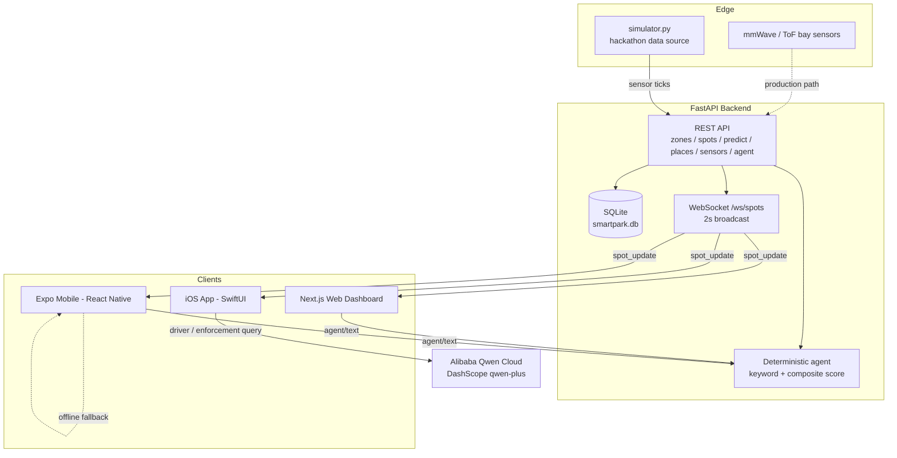

# SpotSense — Architecture

## Overview

Finding a parking spot in dense cities is slow, wasteful, and hard to police.
Drivers circle the block looking for a free bay, and authorities run blind ANPR
camera-car sweeps to catch unpaid vehicles. Existing zone-level parking
apps in Dubai tell you which *zone* exists and let you pay, but never tell you
which *specific bay* is free — or which parked car is in violation.

**SpotSense** closes that gap. It is an IoT + agentic-AI smart-parking platform
for Dubai that combines **edge sensor data** (one sensor per painted bay) with
**Qwen Cloud reasoning** to deliver two things:

- **Navigation** — real-time, bay-level availability so a driver goes straight to
  a free spot instead of circling.
- **Enforcement** — automatic detection of occupied-but-unpaid bays so patrol
  officers drive straight to a flagged vehicle instead of sweeping blindly.

Every paid bay is a painted rectangle on the asphalt: one bay = one sensor. No
cameras, no computer vision. A sensor detects presence and reports status; the
backend fuses that with payment records and an AI agent reasons over the live
picture for drivers and enforcement officers.

## System Architecture

**Notes on the diagram**

- The backend and the web dashboard use a **deterministic reasoning engine**
  (keyword intent + a composite ranking score) so the demo always works with no
  API key. The iOS app calls **Qwen Cloud** directly for live LLM reasoning.
- The Expo mobile app consumes the backend, and if the backend is unreachable it
  falls back to an **on-device simulator + local agent** using the same scoring
  logic (badge shows "OFFLINE DEMO"), so the demo never breaks.

## Data Flow

**Live availability (sensor → clients)**

1. A sensor tick (real hardware, or `backend/simulator.py` for the hackathon)
   changes a bay's status.
2. The FastAPI backend persists the change in SQLite and updates in-memory state.
3. The WebSocket endpoint `/ws/spots` broadcasts a `spot_update` message every
   ~2 seconds to all connected clients.
4. The web dashboard, iOS app, and mobile app update their map markers in
   real time.

**Agent query**

- **iOS app** → sends the driver/enforcement query straight to **Qwen Cloud
  (DashScope, `qwen-plus`)** and renders the model's answer + reasoning steps.
- **Web + backend** → route the query through the backend's **deterministic
  engine** (`POST /api/agent/text`), which resolves saved places, searches nearby
  zones, pulls predictions, and ranks candidates. It returns the same response
  shape (`text`, `reasoning_steps`, `map_card`) so the client contract is stable.

**Contract reference (do not break)**

- `POST /api/agent/text` → `{ text, reasoning_steps[], map_card? { zone_id, zone_name, lat, lng, free_spots, total_spots, price_per_hour, walking_minutes } }`
- `WS /ws/spots` broadcast → `{ type: "spot_update", spots: [{ id, status, last_changed_at }] }`

## Tech Stack

| Layer | Technology |
|---|---|
| Frontend (web) | Next.js 16, React 19, TypeScript, Tailwind CSS, Leaflet |
| Backend | FastAPI (Python), SQLite (aiosqlite / SQLAlchemy async), WebSockets |
| Mobile | Expo (React Native), Apple Maps, live WebSocket, TTS |
| iOS (native) | SwiftUI (iOS 17+), Driver + Enforcement modes |
| Cloud / AI | Alibaba **Qwen Cloud** via **DashScope** (`qwen-plus`) |

## Qwen Cloud + Alibaba Cloud Integration

The real, working Qwen Cloud call lives in the native iOS app:

**`ios/SmartPark/SmartPark/Services/QwenAgentService.swift`** — this is the
**Proof of Alibaba Cloud Deployment / Qwen Cloud usage** code file.

- Endpoint: `https://dashscope-intl.aliyuncs.com/compatible-mode/v1`
  (OpenAI-compatible chat completions).
- Model: `qwen-plus`.
- Two modes: `sendDriverQuery(...)` (find/compare parking) and
  `sendEnforcementQuery(...)` (nearby violations, patrol routing, fine status),
  each with a purpose-built system prompt and live zone/violation context.
- The API key is read from `ios/SmartPark/Secrets.xcconfig` (git-ignored) and
  sent as a `Bearer` token — never hardcoded.

## Prototype Note

For the hackathon, bay sensor data is **SIMULATED** via
[`backend/simulator.py`](backend/simulator.py). It runs as a background task on
backend startup and uses a realistic Dubai time-of-day occupancy profile
(morning rush fills up, midday dip, evening rush, quiet nights) with
probabilistic per-bay transitions on a ~2-second tick.

The **production path** replaces the simulator with physical bay sensors —
**LD2410 mmWave presence sensors + ESP32-S3** MCUs (low power, self-healing mesh,
weatherproof enclosure) — feeding the same backend ingestion and WebSocket
broadcast, so no client changes are required to go from simulated to real data.

## Roadmap

- **Real sensors** — deploy LD2410 + ESP32-S3 bay units and a per-block gateway;
  swap the simulator for live MQTT/HTTPS ingestion.
- **Backend Qwen tool-calling upgrade** — move the backend/web deterministic
  engine to a Qwen `qwen-plus` tool-calling loop (tools: `resolve_saved_place`,
  `search_zones_nearby`, `get_zone_predictions`, `rank_zones`) while keeping the
  deterministic path as an offline fallback and preserving the response contract.
- **Enforcement loop** — violation model + mock operator/RTA payment records +
  fine-confirmation webhook to demonstrate the closed enforcement loop.
- **Alibaba Cloud hosting** — production deployment on Alibaba Cloud
  (ECS for compute, RDS for the database, OSS for assets/firmware binaries).
